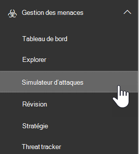

# Simulateur d’attaque dans la protection avancée contre les menaces

**Résumé** Si vous êtes un administrateur général ou un administrateur de la sécurité et que votre organisation a Office 365 Advanced Threat Protection Plan 2, qui inclut des [fonctionnalités d’enquête et de réponse aux menaces](office-365-ti.md), vous pouvez utiliser un simulateur d’attaque pour exécuter des scénarios d’attaque réaliste dans votre organisation. Cela peut vous aider à identifier les utilisateurs vulnérables avant qu’une véritable attaque n’ait un impact sur votre chiffre d’affaires. Lisez cet article pour en savoir plus.

## Ce qu'il faut savoir avant de commencer

- Pour ouvrir le centre de sécurité & conformité, accédez <https://protection.office.com/>à. Le simulateur d’attaque est disponible dans le **simulateur d’attaques** **Threat Management** \> .

  

- Pour plus d’informations sur la disponibilité d’un simulateur d’attaque sur différents abonnements Microsoft 365, consultez la rubrique [Description du service protection avancée contre les menaces d’Office 365](https://docs.microsoft.com/office365/servicedescriptions/office-365-advanced-threat-protection-service-description).

- Vous devez être membre des groupes de rôles **gestion** de l’organisation ou **administrateur de sécurité** . Pour plus d’informations sur les groupes de rôles dans le centre de sécurité & conformité, consultez [la rubrique autorisations dans le centre de sécurité & conformité](permissions-in-the-security-and-compliance-center.md).

- Votre compte doit être configuré pour l’authentification multifacteur (MFA) pour créer et gérer des campagnes dans un simulateur d’attaque. Pour obtenir des instructions, consultez la rubrique [set up Multi-Factor Authentication](https://docs.microsoft.com/office365/admin/security-and-compliance/set-up-multi-factor-authentication).

Pour qu’une attaque réussisse, assurez-vous que le compte que vous utilisez pour exécuter des attaques simulées utilise l’authentification multifacteur. En outre, vous devez être administrateur général ou administrateur de sécurité. (Pour en savoir plus sur les rôles et les autorisations, consultez [la rubrique autorisations dans le centre de sécurité & conformité](permissions-in-the-security-and-compliance-center.md)).

- Les campagnes de hameçonnage recueillent et traitent les événements pendant 30 jours. Les données de la campagne historique seront disponibles pendant 90 jours après le lancement de la campagne.

- Il n’existe pas d’applet de commande PowerShell correspondante pour un simulateur d’attaque.

## Campagnes de phishing pour le Spear

Le *hameçonnage* est un terme générique pour les attaques par courrier électronique qui tentent de voler des informations sensibles dans les messages semblant provenir d’expéditeurs légitimes ou approuvés. Le *Spear Phishing* est une attaque de hameçonnage ciblée qui utilise un contenu très ciblé et personnalisé qui est spécifiquement adapté aux destinataires ciblés (en général, après la reconnaissance des destinataires par l’agresseur).

- Vous êtes un administrateur général ou un administrateur de sécurité

Dans un simulateur d’attaque, deux types différents de campagnes de Spear Phishing sont disponibles :

- L' [authentification multifacteur/l’accès conditionnel](https://docs.microsoft.com/office365/admin/security-and-compliance/set-up-multi-factor-authentication) est activé, pour au moins le compte administrateur général et les administrateurs de sécurité qui utiliseront un simulateur d’attaque. (Idéalement, l’accès à plusieurs facteurs/accès conditionnel est activé pour tous les utilisateurs de votre organisation.)

  - Page par défaut qui explique qu’il s’agissait d’un simple test et fournit des conseils pour la reconnaissance des messages de hameçonnage.

    

  - Une page personnalisée (URL) que vous spécifiez.

- **Spear Phishing (pièce jointe)**: l’attaque tente de convaincre les destinataires d’ouvrir une pièce jointe. docx ou. pdf dans le message. La pièce jointe contient le même contenu que le lien de hameçonnage par défaut, mais la première phrase\<commence par\>« nom complet, vous voyez ce message en tant que message électronique récent que vous avez ouvert... ».

> [!NOTE]
> Actuellement, les campagnes de phishing de Spear dans un simulateur d’attaque n’expirent pas.

### Créer une campagne de phishing pour le Spear

Une partie importante de toute campagne de hameçonnage est l’apparence du message électronique envoyé aux destinataires ciblés. Pour créer et configurer le message électronique, vous disposez des options suivantes :

- **Utilisez un modèle de courrier intégré**: les deux modèles prédéfinis sont disponibles : **prix des cadeaux** et **mise à jour**de la paie. Vous pouvez personnaliser davantage certaines, toutes ou aucune des propriétés de messagerie à partir du modèle lors de la création et du lancement de la campagne.

- **Créer un modèle de courrier réutilisable**: après avoir créé et enregistré le modèle de courrier, vous pouvez le réutiliser dans les futures campagnes de hameçonnage. Vous pouvez personnaliser davantage certaines, toutes ou aucune des propriétés de messagerie à partir du modèle lors de la création et du lancement de la campagne.

- **Créer le message électronique dans l’Assistant**: vous pouvez créer le message électronique directement dans l’Assistant lors de la création et du lancement de la campagne de hameçonnage du Spear.

#### Étape 1 (facultatif) : créer un modèle de courrier électronique personnalisé

Si vous envisagez d’utiliser l’un des modèles intégrés ou de créer le message électronique directement dans l’Assistant, vous pouvez ignorer cette étape.

1. Dans le centre de sécurité & conformité, accédez à **Threat Management** \> **Attack Simulator**.

2. Sur la page **simuler les attaques** , dans les sections **Spear Phishing (Credentials Harvest)** ou **Spear Phishing (pièce jointe)** , cliquez sur informations sur les **attaques**.

   La création du modèle n’a pas d’importance. Les options disponibles dans le modèle sont les mêmes pour les deux types d’attaques par hameçonnage.

3. Dans la page **Détails** de l’attaque qui s’ouvre, dans la section **modèles d’hameçonnage** , dans la zone créer des **modèles** , cliquez sur **nouveau modèle**.

4. L’Assistant **configurer le modèle d’hameçonnage** démarre dans une nouvelle fenêtre mobile. À l’étape de **démarrage** , entrez un nom complet unique pour le modèle, puis cliquez sur **suivant**.

5. Dans l’étape **configurer les détails du courrier** , configurez les paramètres suivants :

   - **From (Name)**: nom complet utilisé pour l’expéditeur du message.

   - **De (courrier électronique)**: adresse de messagerie de l’expéditeur.

   - **URL du serveur de connexion d’hameçonnage**: cliquez sur le menu déroulant et sélectionnez l’une des URL disponibles dans la liste. Il s’agit de l’URL sur laquelle les utilisateurs seront tentés de cliquer. Les possibilités suivantes s'offrent à vous :

     - <http://portal.docdeliveryapp.com>
     - <http://portal.docdeliveryapp.net>
     - <http://portal.docstoreinternal.com>
     - <http://portal.docstoreinternal.net>
     - <http://portal.hardwarecheck.net>
     - <http://portal.hrsupportint.com>
     - <http://portal.payrolltooling.com>
     - <http://portal.payrolltooling.net>
     - <http://portal.prizegiveaway.net>
     - <http://portal.prizesforall.com>
     - <http://portal.salarytoolint.com>
     - <http://portal.salarytoolint.net>

     > [!NOTE]
     > <ul><li>Toutes les URL sont intentionnellement http, et non HTTPS.</li><li>Un service de réputation d’URL peut identifier une ou plusieurs de ces URL comme non sécurisées. Vérifiez la disponibilité de l’URL dans vos navigateurs Web pris en charge avant d’utiliser l’URL d’une campagne de hameçonnage.</li></ul>

   - **URL de la page d’accueil personnalisée**: entrez une page d’accueil facultative où les utilisateurs sont pris s’ils cliquent sur le lien d’hameçonnage et entrez leurs informations d’identification. Ce lien remplace la page d’accueil par défaut. Par exemple, si vous avez une formation interne à la sensibilisation, vous pouvez spécifier cette URL ici.

   - **Catégorie**: actuellement, ce paramètre n’est pas utilisé (tout ce que vous entrez n’est pas pris en compte).

   - **Subject**: champ **Subject** du message électronique.

   Lorsque vous avez terminé, cliquez sur **Suivant**.

6. Dans l’étape **composer un courrier électronique** , créez le corps du message électronique. Vous pouvez utiliser l’onglet **messagerie** (éditeur HTML enrichi) ou l’onglet **source** (code HTML brut).

   La mise en forme HTML peut être simple ou complexe, comme vous en avez besoin. Vous pouvez insérer des images et du texte pour améliorer la convivialité du message dans le client de messagerie du destinataire.

   - `${username}`insère le nom du destinataire.

   - `${loginserverurl}`insère la valeur de l' **URL du serveur de connexion de hameçonnage** à partir de l’étape précédente.

   Lorsque vous avez terminé, cliquez sur **Suivant**.

7. Dans l’étape **confirmer** , cliquez sur **Terminer**.

#### Étape 2 : créer et lancer la campagne de hameçonnage de la sonde

1. Dans le centre de sécurité & conformité, accédez à **Threat Management** \> **Attack Simulator**.

2. Sur la page **simuler des attaques** , effectuez l’une des sélections suivantes en fonction du type de campagne que vous souhaitez créer :

   - Dans la section **Spear Phishing (informations d’identification)** , cliquez sur **lancer une attaque** ou **sur attaquer les** **Détails** \> de l’attaque.

   - Dans la **section Spear Phishing (pièce jointe)** , cliquez sur **lancer une attaque** ou \> sur attaques pour **lancer** **une attaque.**

3. L’Assistant **configurer une attaque de hameçonnage** démarre dans une nouvelle fenêtre mobile. Dans l’étape de **démarrage** , effectuez l’une des opérations suivantes :

   - Dans la zone **nom** , entrez un nom complet unique pour la campagne. Ne cliquez pas sur **utiliser le modèle**, car vous allez créer le message électronique plus tard dans l’Assistant.

   - Cliquez sur **utiliser le modèle** et sélectionnez un modèle de courrier intégré ou personnalisé. Une fois que vous avez sélectionné le modèle, la zone **nom** est automatiquement remplie en fonction du modèle, mais vous pouvez modifier le nom.

   

   Lorsque vous avez terminé, cliquez sur **Suivant**.

4. Dans l’étape **destinataires cibles** , effectuez l’une des opérations suivantes :

   - Cliquez sur **carnet d’adresses** pour sélectionner les destinataires (utilisateurs ou groupes) de la campagne. Chaque destinataire ciblé doit disposer d’une boîte aux lettres Exchange Online. Si vous cliquez sur **Filtrer** et **appliquer** sans entrer de critère de recherche, tous les destinataires sont renvoyés et ajoutés à la campagne.

   - Cliquez sur **Importer** , puis sur **importation de fichiers** pour importer un fichier de valeurs séparées par des virgules (CSV) ou séparé par une ligne d’adresses de messagerie. Chaque ligne doit contenir l’adresse de messagerie du destinataire.

   Lorsque vous avez terminé, cliquez sur **Suivant**.

5. Dans l’étape **configurer les détails du courrier** , configurez les paramètres suivants :

   Si vous avez sélectionné un modèle dans l’étape de **démarrage** , la plupart de ces valeurs sont déjà configurées, mais vous pouvez les modifier.

   - **From (Name)**: nom complet utilisé pour l’expéditeur du message.

   - **De (courrier électronique)**: adresse de messagerie de l’expéditeur. Vous pouvez entrer une adresse de messagerie réelle ou fictive à partir du domaine de messagerie de votre organisation, ou vous pouvez entrer une adresse de messagerie externe réelle ou fictive. Une adresse de messagerie d’expéditeur valide de votre organisation est en fait résolue dans le client de messagerie du destinataire.

   - **URL du serveur de connexion d’hameçonnage**: cliquez sur le menu déroulant et sélectionnez l’une des URL disponibles dans la liste. Il s’agit de l’URL sur laquelle les utilisateurs seront tentés de cliquer. Les possibilités suivantes s'offrent à vous :

     - <http://portal.docdeliveryapp.com>
     - <http://portal.docdeliveryapp.net>
     - <http://portal.docstoreinternal.com>
     - <http://portal.docstoreinternal.net>
     - <http://portal.hardwarecheck.net>
     - <http://portal.hrsupportint.com>
     - <http://portal.payrolltooling.com>
     - <http://portal.payrolltooling.net>
     - <http://portal.prizegiveaway.net>
     - <http://portal.prizesforall.com>
     - <http://portal.salarytoolint.com>
     - <http://portal.salarytoolint.net>

     > [!NOTE]
     > <ul><li>Toutes les URL sont intentionnellement http, et non HTTPS.</li><li>Un service de réputation d’URL peut identifier une ou plusieurs de ces URL comme non sécurisées. Vérifiez la disponibilité de l’URL dans vos navigateurs Web pris en charge avant d’utiliser l’URL d’une campagne de hameçonnage.</li><li>Vous devez sélectionner une URL. Pour les campagnes de <b>hameçonnage (de pièces jointes)</b> , vous pouvez supprimer le lien du corps du message à l’étape suivante (dans le cas contraire, le message contiendra un lien <b>et</b> une pièce jointe).</li></ul>

   - **Type de pièce jointe**: ce paramètre est disponible uniquement dans les campagnes de **hameçonnage (de pièces jointes)** . Cliquez sur le menu déroulant et sélectionnez **. DOCX** ou **. PDF** à partir de la liste.

   - **Nom de la pièce jointe**: ce paramètre est disponible uniquement dans les campagnes de **hameçonnage (de pièces jointes)** . Entrez un nom de fichier pour la pièce jointe. docx ou. pdf.

   - **URL de la page d’accueil personnalisée**: entrez une page d’accueil facultative où les utilisateurs sont pris s’ils cliquent sur le lien d’hameçonnage et entrez leurs informations d’identification. Ce lien remplace la page d’accueil par défaut. Par exemple, si vous avez une formation interne à la sensibilisation, vous pouvez spécifier cette URL ici.

   - **Subject**: champ **Subject** du message électronique.

   Lorsque vous avez terminé, cliquez sur **Suivant**.

6. Dans l’étape **composer un courrier électronique** , créez le corps du message électronique. Si vous avez sélectionné un modèle dans l’étape de **démarrage** , le corps du message est déjà configuré, mais vous pouvez le personnaliser. Vous pouvez utiliser l’onglet **messagerie** (éditeur HTML enrichi) ou l’onglet **source** (code HTML brut).

   La mise en forme HTML peut être simple ou complexe, comme vous en avez besoin. Vous pouvez insérer des images et du texte pour améliorer la convivialité du message dans le client de messagerie du destinataire.

   - `${username}`insère le nom du destinataire.

   - `${loginserverurl}`insère la valeur de l' **URL du serveur de connexion de hameçonnage** .

   Pour les campagnes de **hameçonnage (de pièces jointes)** , vous devez supprimer le lien du corps du message (dans le cas contraire, le message contient à la fois un lien **et** une pièce jointe, et les clics de liens ne sont pas suivis dans une campagne de pièces jointes).

   

   Lorsque vous avez terminé, cliquez sur **Suivant**.

7. Dans l’étape **confirmer** , cliquez sur **Terminer** pour lancer la campagne. Le message de hameçonnage est remis aux destinataires ciblés.

## Campagnes d’attaque par mot de passe

Une *attaque par mot de passe* tente de deviner les mots de passe des comptes d’utilisateur d’une organisation, généralement après que l’agresseur a identifié un ou plusieurs comptes d’utilisateurs valides.

Dans un simulateur d’attaque, deux types différents de campagnes d’attaque de mot de passe sont disponibles pour vous permettre de tester la complexité des mots de passe des utilisateurs :

- **Mot de passe en force (attaque de dictionnaire)**: une attaque en *force ou une* attaque de *dictionnaire* utilise un fichier dictionnaire volumineux de mots de passe sur un compte d’utilisateur en espérant que l’un d’entre eux fonctionnera (de nombreux mots de passe par rapport à un compte). Le verrouillage de mot de passe incorrect permet de dissuader les attaques de mot de passe en force.

  Pour l’attaque de dictionnaire, vous pouvez spécifier un ou plusieurs mots de passe à essayer (entrés manuellement ou dans un fichier téléchargé) et vous pouvez spécifier un ou plusieurs utilisateurs.

- **Attaque par pulvérisation de mot de passe**: une attaque par *pulvérisation de mot de passe* utilise le même mot de passe soigneusement considéré avec une liste de comptes d’utilisateurs (un mot de passe par rapport à de nombreux comptes). Les attaques par pulvérisation de mot de passe sont plus difficiles à détecter que les attaques de mot de passe en force (la probabilité de réussite augmente lorsqu’un agresseur tente un mot de passe entre des dizaines ou des centaines de comptes sans risque de faire passer le verrouillage incorrect du mot de passe de l’utilisateur).

  Pour l’attaque par pulvérisation par mot de passe, vous ne pouvez spécifier qu’un seul mot de passe à essayer et vous pouvez spécifier un ou plusieurs utilisateurs.

> [!NOTE]
> Les attaques de mot de passe dans le simulateur de test du nom d’utilisateur et du mot de passe des demandes d’authentification de base à un point de terminaison fonctionnent également avec d’autres méthodes d’authentification (AD FS, synchronisation de hachage de mot de passe, direct, PingFederate, etc.). Pour les utilisateurs pour lesquels l’authentification multifacteur (MFA) est activée, même si l’attaque par mot de passe essaie son mot de passe réel, la tentative s’inscrit toujours comme un échec (en d’autres termes, les utilisateurs MFA n’apparaissent jamais dans le nombre de **tentatives réussies** de la campagne). Il s’agit du résultat attendu. MFA est une méthode principale pour vous protéger contre les attaques par mot de passe.

### Créer et lancer une campagne d’attaque par mot de passe

1. Dans le centre de sécurité & conformité, accédez à **Threat Management** \> **Attack Simulator**.

2. Sur la page **simuler des attaques** , effectuez l’une des sélections suivantes en fonction du type de campagne que vous souhaitez créer :

   - Dans la **section mot de passe en force (attaque de dictionnaire)** , cliquez sur **lancer une attaque** ou sur attaque des **Détails** \> de l' **attaque.**

   - dans la section **attaque par pulvérisation par mot de passe** , cliquez sur lancer une **attaque** **ou sur** \> attaques pour **lancer**une attaque.

3. L’Assistant Configuration d’une **attaque de mot de passe** démarre dans une nouvelle fenêtre mobile. À l’étape de **démarrage** , entrez un nom complet unique pour la campagne, puis cliquez sur **suivant**.

4. Dans l’étape **utilisateurs cibles** , effectuez l’une des opérations suivantes :

   - Cliquez sur **carnet d’adresses** pour sélectionner les destinataires (utilisateurs ou groupes) de la campagne. Chaque destinataire ciblé doit disposer d’une boîte aux lettres Exchange Online. Si vous cliquez sur **Filtrer** et **appliquer** sans entrer de critère de recherche, tous les destinataires sont renvoyés et ajoutés à la campagne.

   - Cliquez sur **Importer** , puis sur **importation de fichiers** pour importer un fichier de valeurs séparées par des virgules (CSV) ou séparé par une ligne d’adresses de messagerie. Chaque ligne doit contenir l’adresse de messagerie du destinataire.

   Lorsque vous avez terminé, cliquez sur **Suivant**.

5. Dans l’étape **choisir les paramètres d’attaque** , choisissez ce qu’il faut faire en fonction du type de campagne :

   - **Mot de passe en force (attaque de dictionnaire)**: effectuez l’une des opérations suivantes :

     - **Entrez les mots de passe manuellement**: dans la zone **Appuyez sur entrée pour ajouter un mot de passe** , tapez un mot de passe, puis appuyez sur entrée. Répétez cette étape autant de fois que nécessaire.

     - **Charger les mots de passe à partir d’un fichier de dictionnaire**: cliquez sur **Télécharger** pour importer un fichier texte existant qui contient un mot de passe sur chaque ligne et une dernière ligne vide. La taille du fichier texte doit être inférieure ou égale à 10 Mo et ne peut pas contenir plus de 30000 mots de passe.

   - **Attaque par pulvérisation de mot de passe**: dans **le champ mot de passe à utiliser dans la zone attaque** , entrez un mot de passe.

   Lorsque vous avez terminé, cliquez sur **Suivant**.

6. Dans l’étape **confirmer** , cliquez sur **Terminer** pour lancer la campagne. Les mots de passe que vous avez spécifiés sont testés sur les utilisateurs que vous avez spécifiés.

## Afficher les résultats de la campagne

Une fois que vous avez lancé une campagne, vous pouvez vérifier la progression et les résultats sur la page principale **attaques par simulation** .

Les campagnes actives affichent une barre d’État, une valeur de pourcentage terminé et le nombre de (utilisateurs terminés) de (nombre total d’utilisateurs). Cliquez sur le bouton **Actualiser** pour mettre à jour la progression de toutes les campagnes actives. Vous pouvez également cliquer sur **Terminer** pour arrêter une campagne active.

Une fois la campagne terminée, l’État devient **attaque terminée**. Vous pouvez afficher les résultats de la campagne en effectuant l’une des actions suivantes :

- Sur la page principale **attaques de simulation** , cliquez sur Afficher le **rapport** sous le nom de la campagne.

- Sur la page principale **attaques de simulation** , cliquez sur informations sur les **attaques** dans la section correspondant au type d’attaque. Sur la page Détails de l' **attaque** qui s’ouvre, sélectionnez la campagne dans la section **historique des attaques** .

L’une des actions précédentes vous permet d’accéder à une page intitulée **informations d’attaque**. Les informations qui sont disponibles sur cette page pour chaque type de campagne sont décrites dans les sections suivantes.

### Résultats de la campagne de Spear Phishing (informations d’identification)

Les informations suivantes sont disponibles dans la page Détails de l' **attaque** de chaque campagne :

- Durée (date/heure de début et date/heure de fin) de la campagne.

- **Nombre total d’utilisateurs ciblés**

- **Tentatives réussies**: nombre d’utilisateurs ayant cliqué sur le lien **et** entré leurs informations d’identification (*n’importe quel* nom d’utilisateur et mot de passe).

- **Taux de réussite global**: pourcentage calculé en / **nombre total d’utilisateurs ciblés**par des **tentatives réussies**.

- Le **plus rapide**est de cliquer sur le lien après avoir lancé la campagne.

- **Moyenne : cliquez sur**le nombre de fois que tout le monde a pris le temps de cliquer sur le lien, divisé par le nombre d’utilisateurs ayant cliqué sur le lien.

- **Cliquez sur taux de réussite**: pourcentage calculé par (nombre d’utilisateurs ayant cliqué sur le lien)/ **nombre total d’utilisateurs ciblés**.

- **Informations d’identification les plus rapides**: combien de temps a duré le premier utilisateur pour entrer ses informations d’identification après avoir lancé la campagne.

- **Moyenne des informations d’identification**: somme du temps nécessaire à l’utilisateur pour entrer ses informations d’identification divisée par le nombre d’utilisateurs qui ont entré leurs informations d’identification.

- **Taux de réussite des informations d’identification**: pourcentage calculé par (nombre d’utilisateurs qui ont entré leurs informations d’identification)/ **nombre total d’utilisateurs ciblés**.

- Graphique à barres qui affiche le **lien sur lequel l’utilisateur a cliqué** et les numéros **d’identification fournis** par jour.

- Graphique circulaire qui affiche le **lien sur lequel l’utilisateur a cliqué**, les **informations d’identification fournies**et **aucun** pourcentage de la campagne.

- La section **utilisateurs compromis** répertorie les détails des utilisateurs qui ont cliqué sur le lien :

  - Adresse de messagerie de l'utilisateur

  - Date/heure à laquelle l’utilisateur a cliqué sur le lien.

  - Adresse IP du client.

  - Détails sur la version de l’utilisateur de Windows et du navigateur Web.

  Vous pouvez cliquer sur **Exporter** pour exporter les résultats dans un fichier CSV.

### Résultats de la campagne de hameçonnage (pièce jointe)

Les informations suivantes sont disponibles dans la page Détails de l' **attaque** de chaque campagne :

- Durée (date/heure de début et date/heure de fin) de la campagne.

- **Nombre total d’utilisateurs ciblés**

- **Tentatives réussies**: nombre d’utilisateurs qui ont ouvert ou téléchargé la pièce jointe et qui l’a ouverte (l’aperçu n’est pas compté).

- **Taux de réussite global**: pourcentage calculé en / **nombre total d’utilisateurs ciblés**par des **tentatives réussies**.

- **Durée maximale d’ouverture des pièces jointes**: durée de l’ouverture de la pièce jointe par le premier utilisateur après le lancement de la campagne.

- **Durée moyenne d’ouverture des pièces jointes : durée**totale de l’ouverture de la pièce jointe, divisée par le nombre d’utilisateurs ayant ouvert la pièce jointe.

- **Taux de réussite d’ouverture des pièces jointes**: pourcentage calculé par (nombre d’utilisateurs ayant ouvert la pièce jointe)/ **nombre total d’utilisateurs ciblés**.

### Résultats de la campagne de mot de passe en force (attaque de dictionnaire)

Les informations suivantes sont disponibles dans la page Détails de l' **attaque** de chaque campagne :

- Durée (date/heure de début et date/heure de fin) de la campagne.

- **Nombre total d’utilisateurs ciblés**

- **Tentatives réussies**: nombre d’utilisateurs pour lesquels l’un des mots de passe spécifiés a été trouvé.

- **Taux de réussite global**: pourcentage calculé en / **nombre total d’utilisateurs ciblés**par des **tentatives réussies**.

- La section **utilisateurs compromis** répertorie les adresses de messagerie des utilisateurs concernés. Vous pouvez cliquer sur **Exporter** pour exporter les résultats dans un fichier CSV.

### Résultats de la campagne d’attaque par pulvérisation

Les informations suivantes sont disponibles dans la page Détails de l' **attaque** de chaque campagne :

- Durée (date/heure de début et date/heure de fin) de la campagne.

- **Nombre total d’utilisateurs ciblés**

- **Tentatives réussies**: nombre d’utilisateurs qui ont été identifiés comme utilisant le mot de passe spécifié.

- **Taux de réussite global**: pourcentage calculé en / **nombre total d’utilisateurs ciblés**par des **tentatives réussies**.
