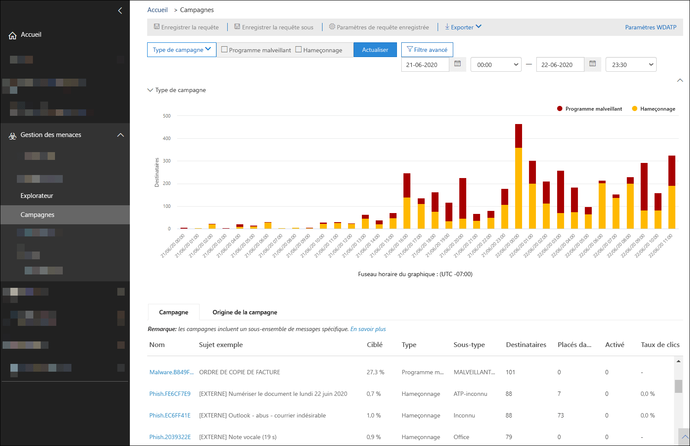
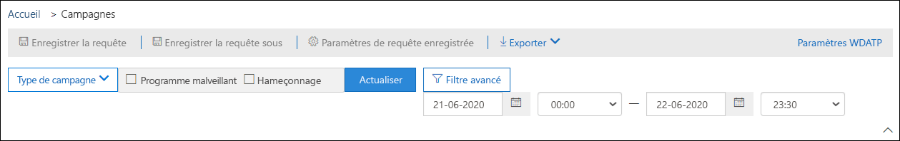
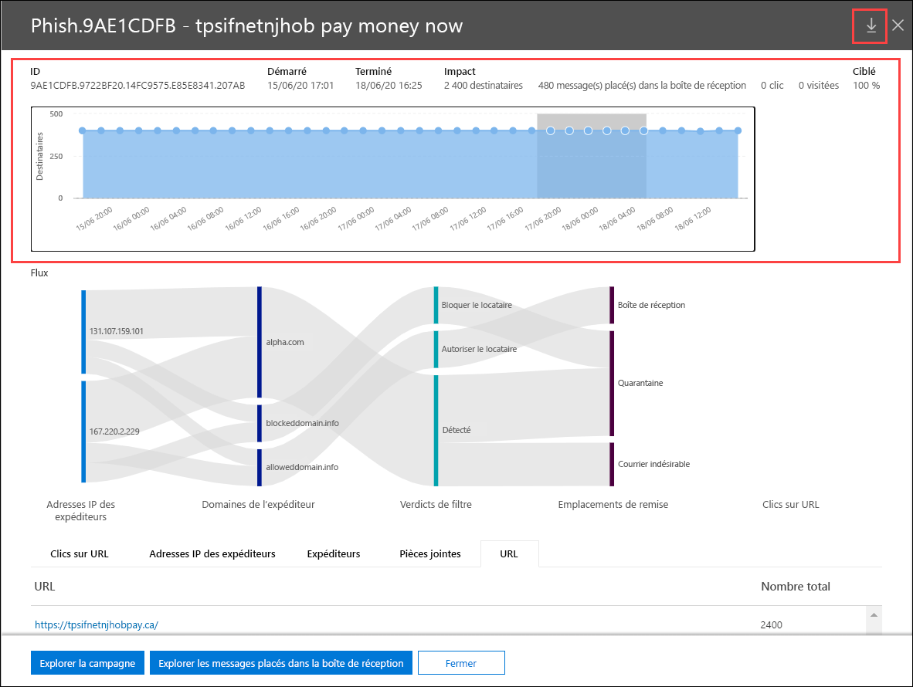
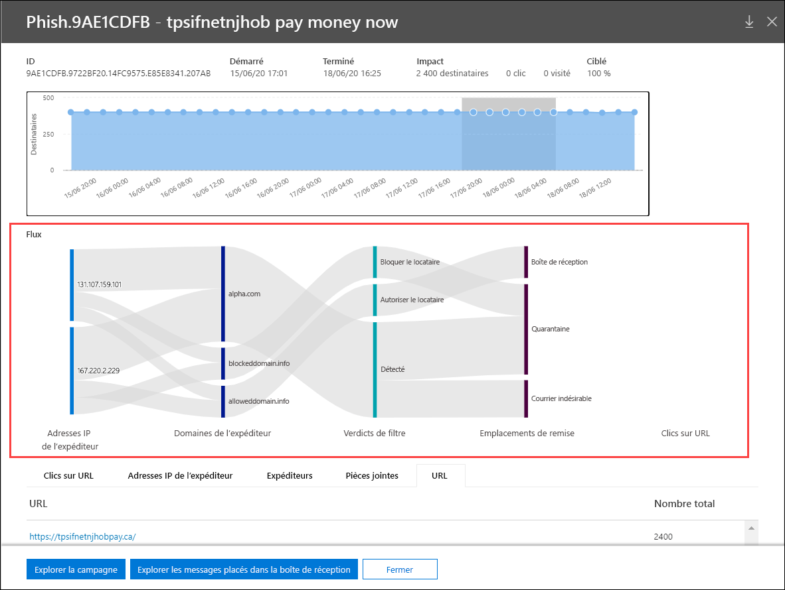

# Affichages de campagne dans la protection avancée contre les menaces

Les vues de campagne sont une fonctionnalité de la protection avancée contre les menaces (ATP) dans le centre de sécurité & conformité qui identifie et catégorise les attaques par hameçonnage dans le service. Campaign Views permet d’effectuer les opérations suivantes :

- Examiner et répondre efficacement aux attaques par hameçonnage.

- Mieux comprendre l’étendue de l’attaque.

- Afficher la valeur pour les décideurs.

Campaign Views vous permet de voir la présentation d’une attaque plus rapidement et plus complètement que n’importe quel autre utilisateur.

## Qu’est-ce qu’une campagne ?

Une campagne est une attaque par e-mail coordonné contre une ou plusieurs organisations. Les attaques par courrier électronique qui volent les informations d’identification et les données d’entreprise sont un secteur important et lucratif. À mesure que les technologies augmentent pour empêcher les attaques, les agresseurs modifient leurs méthodes afin de garantir une réussite continue.

Microsoft exploite les grandes quantités de données anti-hameçonnage, de blocage du courrier indésirable et anti-programme malveillant dans l’ensemble du service afin d’identifier les campagnes. Nous analysons et classifions les informations d’attaque en fonction de plusieurs facteurs. Par exemple :

- **Source**de l’attaque : les adresses IP source et les domaines de messagerie de l’expéditeur.

- **Propriétés des messages d’attaque**: le contenu, le style et la tonalité des messages.

- **Destinataires d’attaques** : domaines de destinataires, fonctions de tâche de destinataire (administrateurs, cadres, etc.), types d’entreprise (grand, petit, public, privé, etc.) et industries.

- **Charge utile d’attaque**: liens malveillants, pièces jointes ou autres charges utiles dans les messages.

Une campagne peut être à courte durée de vie ou peut s’étendre sur plusieurs jours, semaines ou mois avec des périodes actives et inactives. Une campagne peut être lancée par rapport à votre organisation, ou votre organisation peut faire partie d’une campagne plus importante sur plusieurs sociétés.

## Vue de campagne du centre de sécurité & conformité

Les vues de campagne sont disponibles dans le [Centre de sécurité & conformité](https://protection.office.com) aux **Threat management** \> **campagnes**gestion des menaces ou directement sur le <https://protection.office.com/campaigns> .

Vous pouvez également accéder aux vues de campagne à partir de :

- **Gestion** \> des menaces **Explorateur** \> **Affichage** \> **Campagnes marketing**

- **Gestion** \> des menaces **Explorateur** \> **Affichage** \> **Tous les messages électroniques** \> Onglet **campagne**

- **Gestion** \> des menaces **Explorateur** \> **Affichage** \> **Hameçonnage** \> Onglet **campagne**

- **Gestion** \> des menaces **Explorateur** \> **Affichage** \> **Programmes malveillants** \> Onglet **campagne**

Pour accéder aux vues de campagne, vous devez être membre des groupes de rôles gestion de l' **organisation**, administrateur de la **sécurité**ou **lecteur de sécurité** dans le centre de sécurité & Compliance Center. Pour en savoir plus, consultez [Autorisations dans le Centre de sécurité et de conformité](permissions-in-the-security-and-compliance-center.md).

## Vue d’ensemble des campagnes

La page vue d’ensemble affiche des informations sur toutes les campagnes.

Sous l’onglet **campagne** par défaut, la zone **type de campagne** affiche un graphique à barres qui indique le nombre de destinataires par jour. Par défaut, le graphique affiche les données de **hameçonnage** et de **programmes malveillants** .

> [!TIP]
> Si vous ne voyez pas de données de campagne, essayez de modifier la plage de dates ou les [filtres](#filters-and-settings).

Le reste de la page vue d’ensemble affiche les informations suivantes dans l’onglet **campagne** :

- **Nom**

- **Exemple d’objet** : la ligne d’objet de l’un des messages de la campagne. Notez que tous les messages de la campagne n’auront pas nécessairement le même objet.

- **Ciblé**: pourcentage tel que calculé par : (nombre de destinataires de campagne dans votre organisation)/(nombre total de destinataires dans la campagne pour toutes les organisations du service). Cette valeur indique le degré auquel la campagne est spécifiquement dirigée au sein de votre organisation (valeur la plus élevée) par rapport aux autres organisations du service (une valeur inférieure).

- **Type**: cette valeur est **hameçonnage** ou **programme malveillant**.

- **Sous-type**: cette valeur contient davantage de détails sur la campagne. Par exemple :

  - **Hameçonnage**: le cas échéant, la marque qui est en hameçonnage par cette campagne. Par exemple,,,, `Microsoft` `365` `Unknown` `Outlook` ou `DocuSign` .

  - **Programme malveillant**: par exemple, `HTML/PHISH` ou `HTML/<MalwareFamilyName>` .

Le cas échéant, la marque en cours d’hameçonnage par cette campagne. Lorsque la détection est pilotée par la technologie ATP, le préfixe **ATP** est ajouté à la valeur de sous-type.

- **Destinataires** : nombre d’utilisateurs qui ont été ciblés par cette campagne.

- **Boîte de réception**: nombre d’utilisateurs ayant reçu des messages de cette campagne dans leur boîte de réception (non remis dans leur dossier courrier indésirable).

- **Clic**: nombre d’utilisateurs sur lesquels l’utilisateur a cliqué sur l’URL ou pour ouvrir la pièce jointe dans le message de hameçonnage.

- **Cliquez sur taux**: pourcentage tel que calculé par « boîte de réception sur laquelle l'**utilisateur a cliqué**  /  **Inboxed**». Cette valeur est un indicateur de l’efficacité de la campagne et indique si les destinataires ont pu identifier le message en tant qu’hameçonnage et éviter de cliquer sur l’URL de la charge utile.

  Notez que cette valeur n’est pas utilisée dans les campagnes de programmes malveillants.

- **Consulté**le nombre d’utilisateurs qui l’ont fait par le biais du site Web de charge utile. S’il y a des valeurs de **clic** , mais que les liens fiables bloquent l’accès au site Web, cette valeur est égale à zéro.

L’onglet origine de la **campagne** affiche les sources de messages sur une carte du monde.

### Filtres et paramètres

En haut de la page vues de la campagne, il existe plusieurs paramètres de filtre et de requête qui vous permettent de trouver et d’isoler des campagnes spécifiques.

Le filtrage le plus élémentaire que vous pouvez faire est la date/l’heure de début et la date/heure de fin.

Pour filtrer davantage l’affichage, vous pouvez effectuer une seule propriété avec plusieurs valeurs de filtrage en cliquant sur le bouton **type de campagne** , en sélectionnant l’option **Actualiser**.

Les propriétés de la campagne disponibles sont décrites dans la liste suivante :

- De base

  - **Type de campagne**: sélectionnez **programme malveillant** ou **hameçonnage**. L’effacement des sélections a le même résultat que la sélection des deux.
  - **Nom de la campagne**
  - **Sous-type de campagne**
  - **Expéditeur**
  - **Destinataires**
  - **Domaine de l’expéditeur**
  - **Subject**
  - **Nom de fichier des pièces jointes**
  - **Famille de programmes malveillants**
  - **Action de remise**
  - **Technologie de détection**
  - **Tags**
  - **Substitutions système**

- Avancé

  - **ID de message Internet**: disponible dans le champ d’en-tête **message-ID** de l’en-tête du message. Un exemple de valeur est `<08f1e0f6806a47b4ac103961109ae6ef@server.domain>` (Notez les chevrons).
  
  - **ID de message réseau**: valeur Guid disponible dans le champ d’en-tête **X-MS-Exchange-Organization-Network-message-ID** de l’en-tête du message.
  
  - **IP de l’expéditeur**
  
  - **Attachment SHA256**: pour trouver la valeur de hachage SHA256 d’un fichier dans Windows, exécutez la commande suivante dans une invite de commandes : `certutil.exe -hashfile "<Path>\<Filename>" SHA256` .
  
  - **ID de cluster**
  
  - **ID de stratégie d’alerte**

- URL

  - **Domaine d’URL**
  - **Domaine et chemin d’accès de l’URL**
  - **URL**
  - **Chemin d’URL**
  - **Cliquez sur verdict**

Pour un filtrage plus avancé, incluant le filtrage par plusieurs propriétés, vous pouvez cliquer sur le bouton **filtre avancé** pour créer une requête. Les mêmes propriétés de campagne sont disponibles, mais avec les améliorations suivantes :

- Vous pouvez cliquer sur **Ajouter une condition** pour sélectionner plusieurs conditions.
- Vous pouvez choisir l' **And** opérateur and **ou or entre** les conditions.
- Vous pouvez sélectionner l’élément de **groupe** de conditions au bas de la liste conditions pour créer des conditions composées complexes.

Lorsque vous avez terminé, cliquez sur le bouton **requête** .

Une fois que vous avez créé un filtre de base ou avancé, vous pouvez l’enregistrer à l’aide de la **requête enregistrer** la requête ou **enregistrer la requête sous**. Par la suite, lorsque vous revenez à vues de la campagne, vous pouvez charger un filtre enregistré en cliquant sur paramètres de la **requête enregistrée**.

Pour exporter le graphique ou la liste des campagnes, cliquez sur **Exporter** , puis sélectionnez **Exporter les données du graphique** ou exporter la liste des **campagnes**.

Si vous disposez d’un abonnement Microsoft Defender ATP, vous pouvez cliquer sur **WDATP** pour connecter ou déconnecter les informations de campagne avec Microsoft Defender ATP. Pour plus d’informations, reportez-vous à la rubrique [intégrer Office 365 ATP avec Microsoft Defender ATP](https://docs.microsoft.com/microsoft-365/security/office-365-security/integrate-office-365-ti-with-wdatp).

## Détails de la campagne

Lorsque vous cliquez sur le nom d’une campagne, les détails de la campagne s’affichent dans un menu volant.

### Informations sur la campagne

En haut de la vue Détails de la campagne, les informations de campagne suivantes sont disponibles :

- **ID**: identificateur unique de la campagne.

- **Démarré** et **terminé**: date de début et date de fin de la campagne. Notez que ces dates peuvent s’étendre davantage que vos dates de filtrage sélectionnées sur la page de vue d’ensemble.

- **Impact**: cette section contient les données suivantes pour le filtre de plage de dates que vous avez sélectionné (ou que vous sélectionnez dans la chronologie) :
  
  - Nombre total de destinataires.
  - Nombre de messages qui ont reçu la boîte de réception (c’est-à-dire remis dans la boîte de réception, et non dans le dossier courrier indésirable).
  - Le nombre d’utilisateurs sur lesquels l’utilisateur a cliqué dans le message de hameçonnage.
  - Howe nombre d’utilisateurs visitaient l’URL.

- **Ciblé**: pourcentage tel que calculé par : (nombre de destinataires de campagne dans votre organisation)/(nombre total de destinataires dans la campagne pour toutes les organisations du service). Notez que cette valeur est calculée sur toute la durée de vie de la campagne et ne modifie pas les dates de filtrage.

- Chronologie interactive de l’activité de campagne : la chronologie affiche l’activité sur toute la durée de vie de la campagne. Par défaut, la zone ombrée inclut le filtre de plage de dates que vous avez sélectionné dans la vue d’ensemble. Vous pouvez cliquer et faire glisser pour sélectionner un point de départ et un point de terminaison spécifiques, ce <u>qui modifiera les données affichées dans la zone d' **impact** , et sur le reste de la page, comme décrit dans les sections suivantes</u>.

Dans la barre de titre, vous pouvez cliquer sur le bouton Télécharger la campagne en **écriture**  les détails de la campagne dans un document Word (par défaut, nommé CampaignReport.docx). Notez que ce document contient des détails sur toute la durée de vie de la campagne (pas seulement sur les dates de filtrage sélectionnées).

### Flux de la campagne

Au milieu de la vue Détails de la campagne, des informations importantes sur la campagne sont présentées dans la section **flux** , dans un diagramme de flux horizontal (appelé diagramme _Sankey_ ). Ces détails vous aideront à comprendre les éléments de la campagne et l’impact potentiel au sein de votre organisation.

> [!TIP]
> Les informations affichées dans le diagramme de **flux** sont contrôlées par la plage de dates grisée dans la chronologie, comme décrit dans la section précédente.

Si vous pointez sur une bande horizontale dans le diagramme, vous pouvez voir le nombre de messages associés (par exemple, les messages d’une adresse IP source particulière, les messages provenant de l’adresse IP source en utilisant le domaine d’expéditeur spécifié, etc.).

Le diagramme contient les informations suivantes :

- **Adresses IP de l’expéditeur**

- **Domaines de l’expéditeur**

- Valeurs de **verdict du filtre**: ces valeurs sont liées aux verdicts de hameçonnage et de filtrage du courrier indésirable disponibles, comme décrit dans [les en-têtes de message anti-courrier indésirable](anti-spam-message-headers.md). Les valeurs disponibles sont décrites dans le tableau suivant :

  ****

  |Valeur|Verdict du filtre de courrier indésirable|Description|
  |---|---|---|
  |**Autorisé**|`SFV:SKN`    `SFV:SKI`|Le message a été marqué comme n’étant pas un courrier indésirable et/ou a ignoré le filtrage avant d’être évalué par le filtrage du courrier indésirable (par exemple, par une règle de flux de messagerie, également appelée règle de transport).  Le message a ignoré le filtrage du courrier indésirable pour d’autres raisons (par exemple, l’expéditeur et le destinataire semblent être dans la même organisation).|
  |**Bloqué**|`SFV:SKS`|Le message a été marqué comme courrier indésirable avant d’être évalué par le filtrage du courrier indésirable (par exemple, par une règle de flux de messagerie).|
  |**Détecté**|`SFV:SPM`|Le message a été marqué comme courrier indésirable par le filtrage du courrier indésirable.|
  |**Non détecté**|`SFV:NSPM`|Le message a été marqué comme non courrier indésirable par le filtrage du courrier indésirable.|
  |**A**|`SFV:SKQ`|Le message a ignoré le filtrage du courrier indésirable, car il a été mis en quarantaine.|
  |**Autoriser le client**\*|`SFV:SKA`|Le message a ignoré le filtrage du courrier indésirable en raison des paramètres de stratégie de blocage du courrier indésirable (par exemple, l’expéditeur se trouvait dans la liste des expéditeurs autorisés ou le domaine autorisé).|
  |**Bloc de locataire**\*\*|`SFV:SKA`|Le message a été bloqué par le filtrage du courrier indésirable en raison des paramètres de stratégie de blocage du courrier indésirable (par exemple, l’expéditeur se trouvait dans la liste des expéditeurs autorisés ou le domaine autorisé).|
  |**Autorisation de l’utilisateur**\*|`SFV:SFE`|Le message a ignoré le filtrage du courrier indésirable, car l’expéditeur se trouvait dans la liste des expéditeurs approuvés d’un utilisateur dans Outlook.|
  |**Bloc utilisateur**\*\*|`SFV:BLK`|Le message a été bloqué par le filtrage du courrier indésirable, car l’expéditeur se trouvait dans la liste des expéditeurs bloqués d’un utilisateur dans Outlook.|
  |**ZAP**|s/o|La [purge automatique à zéro heure (ZAP)](zero-hour-auto-purge.md) a effectué une action sur le message remis en fonction de vos paramètres de stratégie anti-courrier indésirable (déplacés vers le dossier courrier indésirable ou mis en quarantaine).|
  |

  \* Examinez vos stratégies de blocage du courrier indésirable, car le message autorisé aurait probablement été bloqué par le service.

  \*\* Examinez vos stratégies de blocage du courrier indésirable, car ces messages doivent être mis en quarantaine et non remis.

- **Emplacements de remise**: vous souhaiterez peut-être examiner les messages qui ont été remis aux destinataires (soit dans la boîte de réception, soit dans le dossier courrier indésirable), même si les utilisateurs n'ont pas cliqué sur l'URL de la charge utile dans le message. Vous pouvez également supprimer les messages mis en quarantaine en quarantaine. Pour plus d’informations, consultez la rubrique [messages électroniques mis en quarantaine dans EOP](quarantine-email-messages.md).

  - **Dossier supprimé**
  - **Raccroché**
  - **External**: le destinataire est situé dans votre organisation de messagerie locale dans les environnements hybrides.
  - **Échec**
  - **Renvoyé**
  - **Boîte de réception**
  - **Dossier Courrier indésirable**
  - **Mise en quarantaine**
  - **Unknown**

- **Clics sur l’URL**: ces éléments sont décrits dans la section suivante.

> [!NOTE]
> Dans toutes les couches contenant plus de 10 éléments, les 10 premiers éléments sont affichés, tandis que les autres sont regroupés dans les **autres**.

#### Clics d’URL

Lorsqu’un message d’hameçonnage est remis à un destinataire (dans la boîte de réception ou dans le dossier courrier indésirable), il y a toujours un risque que l’utilisateur clique sur l’URL de la charge utile. Le fait de ne pas cliquer sur l’URL dans un message remis est une petite mesure de succès, mais vous devez déterminer pourquoi le message de hameçonnage a été remis à sa boîte aux lettres.

Si un utilisateur a cliqué sur l’URL de la charge utile dans le message d’hameçonnage, les actions sont affichées dans la zone de **clics sur l’URL** du diagramme dans la vue Détails de la campagne.

- **Autorisé**

- **BlockPage**: le destinataire a cliqué sur l’URL de charge utile, mais son accès au site Web malveillant a été bloqué par les stratégies de [liens fiables ATP](atp-safe-links.md) de votre organisation.

- **BlockPageOverride**: le destinataire a cliqué sur l’URL de charge utile dans le message, les liens fiables ATP ont essayé de les arrêter, mais ils ont été autorisés à remplacer le bloc. Vous devez examiner vos [stratégies de liens fiables](set-up-atp-safe-links-policies.md) pour savoir pourquoi les utilisateurs sont autorisés à remplacer le verdict des liens fiables et continuer à accéder au site Web malveillant.

- **PendingDetonationPage**: les pièces jointes de protection avancée contre les menaces sont en cours d’ouverture de l’URL de charge utile dans un environnement d’ordinateur virtuel et de l’affichage de ce qui se passe.

- **PendingDetonationPageOverride**: le destinataire a été autorisé à remplacer le processus de détonation de charge utile et à ouvrir l’URL sans attendre les résultats.

### Onglets

Les onglets de la vue Détails de la campagne vous permettent d’approfondir la campagne.

> [!TIP]
> Les informations affichées dans les onglets sont contrôlées par la plage de dates grisée dans le scénario, comme décrit dans la section [informations sur la campagne](#campaign-information) .

- **Clics**sur l’URL : si les utilisateurs ne cliquent pas sur l’URL de la charge utile dans le message d’hameçonnage, cette section est vide. Si un utilisateur a pu cliquer sur l’URL, les valeurs suivantes sont remplies :

  - **Utilisateur**\*
  - **URL**\*
  - **Cliquez sur heure**
  - **Cliquez sur verdict**

- **Adresses IP de l’expéditeur**

  - **IP de l’expéditeur**\*
  - **Nombre total**
  - **Boîte de réception**
  - **Pas de boîte de réception**
  - **SPF transmis**: l’expéditeur a été authentifié par [Sender Policy Framework (SPF)](how-office-365-uses-spf-to-prevent-spoofing.md). Un expéditeur qui ne passe pas la validation SPF indique que l’expéditeur n’est pas authentifié, ou que le message usurpe l’identité d’un expéditeur légitime.

- **Expéditeurs**

  - **Expéditeur**: il s’agit de l’adresse de l’expéditeur réelle dans la commande SMTP Mail from, qui n’est pas nécessairement l’adresse de messagerie de l’expéditeur que les utilisateurs voient dans leurs clients de messagerie.
  - **Nombre total**
  - **Boîte de réception**
  - **Pas de boîte de réception**
  - **DKIM transmis**: l’expéditeur a été authentifié par des [clés de domaine identifiées par des clés de domaine (DKIM)](support-for-validation-of-dkim-signed-messages.md). Un expéditeur qui ne passe pas la validation DKIM indique que l’expéditeur n’est pas authentifié, ou que le message usurpe l’identité d’un expéditeur légitime.
  - **DMARC réussi**: l’expéditeur a été authentifié par [l’authentification de message basée sur un domaine, la création de rapports et la conformité (DMARC)](use-dmarc-to-validate-email.md). Un expéditeur qui ne réussit pas la validation DMARC indique que l’expéditeur n’est pas authentifié ou que le message usurpe l’identité d’un expéditeur légitime.

- **Attachments**

  - **Filename**
  - **SHA256**
  - **Famille de programmes malveillants**
  - **Nombre total**

- **URL**

  - **URL**\*
  - **Nombre total**

\* Le fait de cliquer sur cette valeur ouvre un nouveau menu mobile qui contient plus de détails sur l’élément spécifié (utilisateur, URL, etc.) au-dessus de la vue Détails de la campagne. Pour revenir à la vue Détails de la campagne, cliquez sur **Terminé** dans la nouvelle fenêtre mobile.

### Boutons

Les boutons de la vue Détails de la campagne vous permettent d’utiliser le Power Explorer pour approfondir l’examen de la campagne.

- **Explorer la campagne**: ouvre un nouvel onglet de recherche de l’Explorateur de menaces à l’aide de la valeur **ID de campagne** comme filtre de recherche.

- **Explorer les messages**de la boîte de réception : ouvre un nouvel onglet de recherche de l’Explorateur de menaces à l’aide de l' **ID de campagne** et de l' **emplacement de remise : boîte de réception** comme filtre de recherche.
