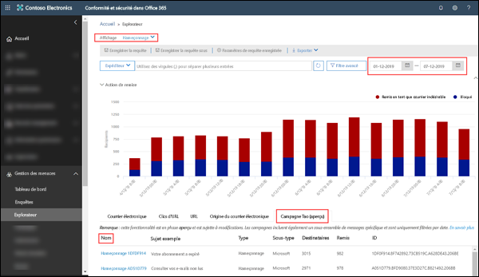
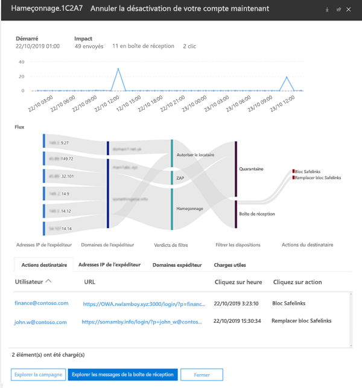

# Campaign Views dans Office 365 - Protection avancée contre les menaces

> [!NOTE]
> Les fonctionnalités décrites dans cette rubrique sont actuellement en préversion et peuvent faire l’objet de modifications.

Campaign Views est une fonctionnalité de la protection avancée contre les menaces (ATP) dans le Centre de sécurité et de conformité Office 365 qui identifie et catégorise les attaques par hameçonnage dans le service. Campaign Views permet d’effectuer les opérations suivantes :

- Examiner et répondre efficacement aux attaques par hameçonnage.

- Mieux comprendre l’étendue de l’attaque.

- Afficher la valeur pour les décideurs.

Campaign Views vous permet de voir la présentation d’une attaque plus rapidement et plus complètement que n’importe quel autre utilisateur.

## Qu’est-ce qu’une campagne ?

Une campagne est une attaque par e-mail coordonné contre une ou plusieurs organisations. Aujourd’hui, les attaques par e-mail qui volent les informations d’identification et les données de l’entreprise sont une activité importante et lucrative. Au fur et à mesure de l’augmentation des attaques, les intrus sont suffisamment sophistiqués pour modifier leurs méthodes pour garantir la réussite de l’opération.

Microsoft exploite les nombreuses fonctionnalités de protection contre le hameçonnage, l’anti-courrier indésirable et les programmes malveillants sur l’ensemble du service Office 365 dans le monde entier pour identifier les campagnes. Les informations de l’attaque sont analysées et classées en fonction de plusieurs facteurs. Par exemple :

- **Sources d’attaque** : adresses IP sources et domaines de l’e-mail de l’expéditeur.

- **Propriétés du message d’attaque** : le contenu, le style et le ton des messages d’attaques.

- **Destinataires d’attaques** : domaines de destinataires, fonctions de tâche de destinataire (administrateurs, cadres, etc.), types d’entreprise (grand, petit, public, privé, etc.) et industries.

- **Charge utile d’attaques** : liens malveillants, pièces jointes ou autres charges utiles.

## Campaign Views dans le Centre de sécurité et conformité Office 365

Campaign Views est disponible dans le [Centre de sécurité et conformité](https://docs.microsoft.com/microsoft-365/compliance/go-to-the-securitycompliance-center) aux emplacements suivants :

- **Gestion des menaces** \> **Explorer** \> **Affichage** \> **Hameçonnage** \> **Top campagne (Aperçu)**

- **Gestion des menaces** \> **Explorer** \> **Affichage** \> **Tous les e-mails** \> **Top campagne (Aperçu)**

> [!TIP]
> Pour l’instant, le seul filtrage disponible est la plage de dates. Si aucune donnée de campagne n’apparaît, essayez de modifier la plage de dates.

La page vue d’ensemble présente les informations suivantes sur la campagne :

- **Nom**

- **Exemple d’objet** : la ligne d’objet de l’un des messages de la campagne. Notez que _toutes_ les messages de la campagne ne comportent pas nécessairement cette même ligne d’objet.

- **Type** : pour l’instant, cette valeur sera toujours **Hameçonnage**.

- **Sous-type** : s’il est disponible, il s’agit de la marque faisant l’objet d’un hameçonnage par cette campagne. Lorsque la détection est contrôlée par la technologie ATP, le préfixe **ATP-** est ajouté à la valeur de sous-type.

- **Destinataires** : nombre d’utilisateurs qui ont été ciblés par cette campagne.

- **Remis**: nombre d’utilisateurs qui ont reçu des messages de cette campagne dans leur boîte de réception.

- **ID** : identificateur unique de la campagne.

Lorsque vous cliquez sur le nom d’une campagne, les détails de la campagne s’affichent dans une fenêtre mobile.

## Détails de la campagne

Dans la vue Détails de la campagne, de nombreuses informations sont disponibles sur la campagne :

- Informations sur la campagne :

  - **ID** : il s’agit de l’identificateur unique de la campagne dans l’écran vue d’ensemble.

  - **Commencé** et **terminé** : le filtre de la plage de dates que vous avez sélectionné.

  - **Impact** : nombre de messages envoyés dans la plage de dates que vous avez sélectionnée, nombre de boîtes aux lettres dans la boîte de réception (autrement dit, remis à la boîte de réception) et nombre d’utilisateurs sur la charge utile d’URL dans le message de hameçonnage.

  - Chronologie de l’activité de la campagne : lorsque la campagne a commencé et se termine et que le volume de messages s’affiche au fil du temps.

### Flux de la campagne

Des informations importantes sur la campagne sont présentées dans un diagramme de flux horizontal (appelé diagramme de _Sankey_) dans la section **Flux**. Ces détails vous aideront à comprendre les éléments de la campagne et l’impact potentiel au sein de votre organisation.

Si vous pointez sur une bande horizontale dans le diagramme, vous pouvez voir le nombre de messages associés (par exemple, les messages d’une adresse IP source particulière, les messages provenant de l’adresse IP source en utilisant le domaine d’expéditeur spécifié, etc.).

Le diagramme contient les informations suivantes :

- **Adresses IP de l’expéditeur**

- **Domaines de l’expéditeur**

- **Filtrer les verdicts**: les valeurs ici sont liées aux verdicts de filtre anti-hameçonnage et anti-courrier indésirable disponibles, comme décrit dans [En-têtes des messages anti-courrier indésirable](anti-spam-message-headers.md). Voici les valeurs **Client autorisent**, ce qui signifie qu’un paramètre configuré dans l’organisation permettait l’envoi d’un message qui aurait été autrement bloqué par le service (par exemple, un domaine dans la liste des expéditeurs autorisés).

  - **Blocage de locataire** : cette valeur indique qu’un paramètre de votre organisation (par exemple, une entrée de domaine dans la [liste d’expéditeurs bloqués](create-block-sender-lists-in-office-365.md)) a détecté le message et déterminé l’emplacement où il a été remis. Pour les messages qui n’ont pas été mis en quarantaine, consultez vos paramètres d’expéditeurs bloqués pour déterminer la raison pour laquelle le message a été remis.

  - **Détecté**

  - **Autoriser le locataire**

- **Emplacements de remise**: vous souhaiterez peut-être examiner les messages qui ont été remis aux destinataires (soit dans la boîte de réception, soit dans le dossier courrier indésirable), même si les utilisateurs n'ont pas cliqué sur l'URL de la charge utile dans le message. Vous pouvez également supprimer les messages mis en quarantaine de [Messages mis en quarantaine dans Office 365](quarantine-email-messages.md).

  - **Dossier Courrier indésirable**

  - **Mise en quarantaine**

  - **Boîte de réception**

#### Clics d’URL

Il y a toujours la possibilité que les messages remis à la boîte de réception ou au dossier courrier indésirable du destinataire soient traités par l’utilisateur (autrement dit, l’utilisateur peut cliquer sur l’URL malveillante dans le message). Si ce n’est pas le cas, il s’agit d’une mesure de réussite minime, même si vous avez certainement besoin de déterminer pourquoi le message nuisible a été remis à sa boîte aux lettres en premier lieu.

Si un utilisateur clique sur l’URL malveillante, les actions s’affichent dans la zone **Clics d’URL** du diagramme.

- **Blocage de liens fiables** : cette valeur indique que le destinataire a cliqué sur l’URL de la charge utile dans le message, mais qu’il a été bloqué par les stratégies de[Liens fiables ATP](atp-safe-links.md) de votre organisation.

- **Annulation du blocage des liens fiables**: cette valeur indique également que le destinataire a cliqué sur l’URL de charge utile dans le message. les liens fiables ATP ont tenté de les arrêter, mais ils ont été autorisés à remplacer le blocage. Vous devez examiner vos [Stratégies de liens fiables](set-up-atp-safe-links-policies.md) pour déterminer la raison pour laquelle les utilisateurs sont autorisés à remplacer les liens de verdict des liens fiables et à cliquer sur URL malveillantes.

### Onglets

La vue Détails de la campagne comporte plusieurs onglets qui vous permettent d’approfondir l’examen de la campagne.

- **Clics d’URL** : si l’URL de la charge utile dans le message d’hameçonnage n’a pas été activé, cette section reste vide. Si un utilisateur a pu cliquer sur l’URL, vous pouvez

  - **Utilisateur**\*

  - **URL**\*

  - **Cliquez sur heure**

  - **Cliquez sur Action**

- **Adresses IP de l’expéditeur**

  - **IP de l’expéditeur**\*

  - **Nombre total**

  - **Nombre de la boîte de réception**

  - **Nombre de bloqués**

  - **SPF réussi**

- **Expéditeurs**

  - **Expéditeur**

  - **Nombre total**

  - **Nombre de la boîte de réception**

  - **Nombre de bloqués**

  - **DKIM réussi**

  - **DMARC réussi**

- **Charge utile**

  - **URL**\*

  - **Nombre total**

\* Le fait de cliquer sur cette valeur ouvre un nouveau menu mobile qui contient plus de détails sur l’élément spécifié (utilisateur, URL, etc.) au-dessus de la vue Détails de la campagne. Pour revenir à la vue Détails de la campagne, cliquez sur **Terminé** dans la nouvelle fenêtre mobile.

### Boutons

Les boutons de la vue Détails de la campagne vous permettent d’utiliser le Power Explorer pour approfondir l’examen de la campagne.

- **Explorer la campagne**: ouvre un nouvel onglet de recherche de l’Explorateur de menaces à l’aide de la valeur **ID de campagne** comme filtre de recherche.

- **Explorer les messages de la boîte de réception**: ouvre un nouvel onglet de recherche de l’Explorateur de menaces à l’aide de la **ID de campagne** et de **emplacement de remise : boîte de réception** comme filtre de recherche.
