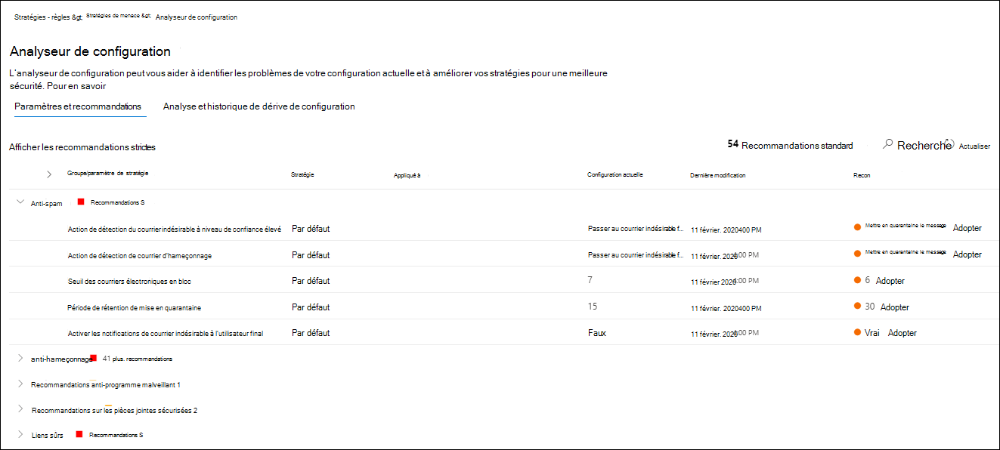
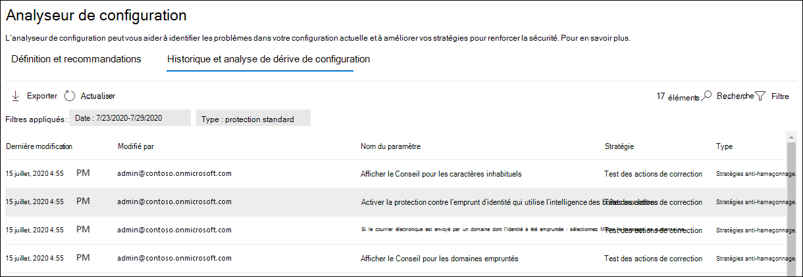

# Configuration Analyzer pour les stratégies de protection dans EOP et Microsoft Defender pour Office 365

[!INCLUDE [Microsoft 365 Defender rebranding](../includes/microsoft-defender-for-office.md)]

> [!NOTE]
> Les fonctionnalités décrites dans cet article sont en aperçu, ne sont pas disponibles dans toutes les organisations et peuvent faire l’objet de modifications. Pour plus d’informations sur le calendrier des publications, consultez la feuille de [route Microsoft 365](https://www.microsoft.com/microsoft-365/roadmap?filters=&searchterms=config%2Canalyzer).

Configuration Analyzer dans le centre de sécurité & conformité fournit un emplacement central pour rechercher et corriger les stratégies de sécurité lorsque les paramètres sont sous les paramètres de protection standard et de profil de protection stricte dans les [stratégies de sécurité prédéfinies](preset-security-policies.md).

Les types de stratégies suivants sont analysés par l’analyseur de configuration :

- **Stratégies Exchange Online Protection (EoP)**: cela inclut les organisations Microsoft 365 avec les boîtes aux lettres Exchange Online et les organisations EOP autonomes sans boîtes aux lettres Exchange Online :

  - [Stratégies de blocage du courrier indésirable](configure-your-spam-filter-policies.md).
  - [Stratégies de protection contre les programmes malveillants](configure-anti-malware-policies.md).
  - [Stratégies de hameçonnage d’EOP](set-up-anti-phishing-policies.md#spoof-settings).

- **Stratégies Microsoft Defender pour office 365**: cela inclut les organisations avec Microsoft 365 E5 ou Defender pour Office 365 abonnements complémentaires :

  - Les stratégies anti-hameçonnage dans Microsoft Defender pour Office 365, notamment :

    - Les mêmes [paramètres d’usurpation](set-up-anti-phishing-policies.md#spoof-settings) qui sont disponibles dans les stratégies anti-hameçonnage EOP.
    - [Paramètres d’emprunt d’identité](set-up-anti-phishing-policies.md#impersonation-settings-in-anti-phishing-policies-in-microsoft-defender-for-office-365)
    - [Seuils de hameçonnage avancés](set-up-anti-phishing-policies.md#advanced-phishing-thresholds-in-anti-phishing-policies-in-microsoft-defender-for-office-365)

  - [Stratégies de liens fiables](set-up-atp-safe-links-policies.md).

  - [Stratégies de pièces jointes approuvées](set-up-atp-safe-attachments-policies.md).

Les valeurs de paramètres de stratégie **standard** et **strictes** utilisées comme configurations de référence sont décrites dans [paramètres recommandés pour EOP et Microsoft Defender for Office 365 Security](recommended-settings-for-eop-and-office365-atp.md).

## Ce qu'il faut savoir avant de commencer

- Vous ouvrez le Centre de conformité et sécurité sur <https://protection.office.com/>. Pour accéder directement à la page de l' **Analyseur de configuration** , utilisez <https://protection.office.com/configurationAnalyzer> .

- Pour vous connecter à Exchange Online PowerShell, voir [Connexion à Exchange Online PowerShell](https://docs.microsoft.com/powershell/exchange/connect-to-exchange-online-powershell).

- Pour pouvoir utiliser ce cmdlet, vous devez disposer des autorisations dans le centre de sécurité et conformité Office 365.
  - Pour utiliser l’analyseur de configuration **et** mettre à jour les stratégies de sécurité, vous devez être membre des groupes de rôles de gestion de l' **organisation** ou d' **administrateur de sécurité** .
  - Pour un accès en lecture seule à Configuration Analyzer, vous devez être membre des groupes de rôles **lecteur global** ou **lecteur de sécurité** .

  Pour en savoir plus, consultez [Autorisations dans le Centre de sécurité et de conformité](permissions-in-the-security-and-compliance-center.md).

  **Remarques** :

  - L’ajout d’utilisateurs au rôle Azure Active Directory correspondant dans le Centre d’administration Microsoft 365 donne aux utilisateurs les autorisations requises dans le centre de sécurité et de conformité _et_ les autorisations pour les autres fonctionnalités de Microsoft 365. Pour plus d’informations, consultez [À propos des rôles d’administrateur](https://docs.microsoft.com/microsoft-365/admin/add-users/about-admin-roles).
  - Le groupe de rôles **Gestion de l’organisation en affichage seul** dans [Exchange Online](https://docs.microsoft.com/Exchange/permissions-exo/permissions-exo#role-groups) permet également d’accéder en lecture seule à la fonctionnalité.

## Utiliser l’analyseur de configuration dans le centre de sécurité & conformité

Dans le centre de sécurité & conformité, accédez à **Threat Management** \> **Policy** \> **Analyzer**.

L’analyseur de configuration comporte deux onglets principaux :

- **Paramètres et recommandations**: sélectionnez standard ou strict et Comparez ces paramètres à vos stratégies de sécurité existantes. Dans les résultats, vous pouvez ajuster les valeurs de vos paramètres pour les ramener au même niveau que standard ou strict.

- **Analyse de la dérive de la configuration et historique**: cette vue vous permet d’effectuer le suivi des modifications de stratégie au fil du temps.

### Onglet définition et recommandations de l’analyseur de configuration

Par défaut, l’onglet s’ouvre sur la comparaison avec le profil de protection standard. Vous pouvez passer à la comparaison du profil de protection strict en cliquant sur **Afficher rigoureuse Recommendations**. Pour revenir en arrière, sélectionnez **afficher les recommandations standard**.

Par défaut, la colonne **groupe de stratégies/nom du paramètre** contient une vue réduite des différents types de stratégies de sécurité et le nombre de paramètres qui doivent être améliorés (le cas échéant). Les types de stratégies sont les suivants :

- **Blocage du courrier indésirable**
- **Anti-hameçonnage**
- **Anti-programme malveillant**
- **Pièces jointes sécurisées** pour la protection avancée contre les menaces (si votre abonnement inclut Microsoft Defender pour Office 365)
- **Liens fiables ATP** (si votre abonnement inclut Microsoft Defender pour Office 365)

Dans l’affichage par défaut, tout est réduit. En regard de chaque stratégie, il existe un résumé des résultats de la comparaison de vos stratégies (que vous pouvez modifier) et les paramètres des stratégies correspondantes pour les profils de protection standard ou stricte (que vous ne pouvez pas modifier). Les informations suivantes s’affichent pour le profil de protection que vous comparez :

- **Vert**: tous les paramètres de toutes les stratégies existantes sont au moins aussi sécurisés que le profil de protection.
- **Orange**: un petit nombre de paramètres dans les stratégies existantes n’est pas aussi sécurisé que le profil de protection.
- **Rouge**: un nombre significatif de paramètres dans les stratégies existantes n’est pas aussi sécurisé que le profil de protection. Il peut s’agir de quelques paramètres dans de nombreuses stratégies ou de nombreux paramètres dans une stratégie.

Pour les comparaisons favorables, vous verrez le texte : **tous les paramètres suivent** les \<**Standard** or **Strict**\> **recommandations**. Dans le cas contraire, vous verrez le nombre de paramètres recommandés à modifier.

Si vous développez le **nom du groupe de stratégies/du paramètre**, toutes les stratégies et les paramètres associés dans chaque stratégie spécifique nécessitant une attention sont révélés. Vous pouvez également développer un type spécifique de stratégie (par exemple, le **blocage du courrier indésirable**) pour afficher uniquement ces paramètres dans ces types de stratégies qui nécessitent votre attention.

Si la comparaison n’a pas de recommandations d’amélioration (en vert), le développement de la stratégie n’indique rien. S’il existe un nombre de recommandations pour l’amélioration (jaune ou rouge), les paramètres nécessitant une attention sont révélés, et les informations correspondantes sont révélées dans les colonnes suivantes :

- Nom du paramètre qui requiert votre attention. Par exemple, dans la capture d’écran précédente, il s’agit du **seuil de courrier électronique en bloc** dans une stratégie de blocage du courrier indésirable.

- **Stratégie**: nom de la stratégie concernée qui contient le paramètre.

- **Appliqué à**: nombre d’utilisateurs auxquels les stratégies affectées sont appliquées.

- **Configuration actuelle**: valeur actuelle du paramètre.

- **Dernière modification**: date de la dernière modification de la stratégie.

- **Recommandations**: valeur du paramètre dans le profil de protection standard ou strict. Pour modifier la valeur du paramètre dans votre stratégie pour qu’elle corresponde à la valeur recommandée dans le profil de protection, cliquez sur **adopter**. Si la modification réussit, vous verrez le message suivant : **recommandations correctement adoptées**. Cliquez sur **Actualiser** pour afficher le nombre réduit de recommandations, ainsi que la suppression de la ligne de paramètre/stratégie spécifique des résultats.

### Onglet analyse de dérive et historique de configuration de l’analyseur de configuration

Cet onglet vous permet de suivre les modifications que vous avez apportées à vos stratégies de sécurité personnalisées. Par défaut, les informations suivantes s’affichent :

- **Dernière modification**
- **Modifié par**
- **Nom du paramètre**
- **Stratégie**
- **Type**

Pour filtrer les résultats, cliquez sur **Filtrer**. Dans le menu volant **filtres** qui s’affiche, vous pouvez sélectionner l’un des filtres suivants :

- Heure de **début** et **heure de fin** (date)
- **Protection standard** ou **protection stricte**

Pour exporter les résultats dans un fichier. csv, cliquez sur **Exporter**.

