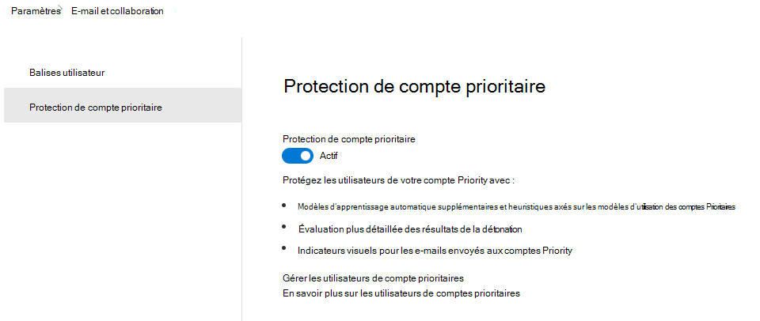
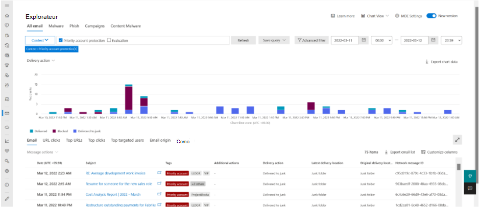

# <a name="configure-and-review-priority-accounts-in-microsoft-defender-for-office-365"></a>Configurer et passer en revue les comptes Priority dans Microsoft Defender pour Office 365

[!INCLUDE [MDO Trial banner](../includes/mdo-trial-banner.md)]

**S’applique à**
- [Microsoft Defender pour Office 365 : offre 1 et offre 2](defender-for-office-365.md)
- [Microsoft 365 Defender](../defender/microsoft-365-defender.md)

Dans chaque organisation, il existe des personnes critiques, telles que des cadres, des dirigeants, des responsables ou d’autres utilisateurs, qui ont accès à des informations sensibles, propriétaires ou hautement prioritaires. Vous pouvez marquer ces utilisateurs dans Microsoft Defender pour Office 365 en tant que comptes prioritaires, ce qui permet aux équipes de sécurité de hiérarchiser leur attention sur ces personnes critiques. Avec la protection différenciée pour les comptes prioritaires, les utilisateurs marqués comme comptes prioritaires bénéficient d’un niveau de protection plus élevé contre les menaces.

Les comptes prioritaires sont plus souvent ciblés par des attaquants et sont généralement attaqués avec des techniques plus sophistiquées. La protection différenciée pour les comptes prioritaires se concentre sur cet ensemble d’utilisateurs spécifique et fournit un niveau de protection plus élevé à l’aide de modèles Machine Learning améliorés. Cette différenciation dans l’apprentissage et la gestion des messages offre le niveau de protection le plus élevé pour ces comptes et contribue à maintenir un faible taux de faux positifs, car un taux élevé de faux positifs peut également avoir un impact négatif sur ces utilisateurs.

## <a name="configure-priority-account-protection"></a>Configurer la protection des comptes prioritaires

La protection de compte prioritaire est activée par défaut pour les utilisateurs critiques pré-identifiés. Toutefois, l’administrateur de sécurité de votre organisation peut également activer la protection de compte prioritaire en procédant comme suit :

1. Dans le portail Microsoft 365 Defender, <https://security.microsoft.com>accédez à **Settings** \> **Email & collaboration** \> **Priority account protection**. Pour accéder directement à la page **de protection du compte Priority** , utilisez <https://security.microsoft.com/securitysettings/priorityAccountProtection>.

2. Dans la page **Protection du compte Prioritaire** , activez **la protection du compte Priority** (:::image type="icon" source="../../media/scc-toggle-on.png" border="false":::).

    > [!div class="mx-imgBorder"]
    > 

> [!NOTE]
> Nous vous déconseillons de désactiver ou de désactiver la protection de compte prioritaire.

Si vous souhaitez utiliser Exchange Online PowerShell pour activer la protection de compte prioritaire, procédez comme suit :

1. [Connectez-vous à Exchange Online PowerShell](/powershell/exchange/connect-to-exchange-online-powershell) et exécutez la commande suivante :

   ```powershell
   Set-EmailTenantSettings -EnablePriorityAccountProtection $true
   ```

2. Pour vérifier que la protection du compte prioritaire est activée, exécutez la commande suivante pour vérifier la valeur de la propriété EnablePriorityAccountProtection :

   ```powershell
   Get-EmailTenantSettings | Format-List Identity,EnablePriorityAccountProtection
   ```

   La valeur True signifie que la protection du compte prioritaire est activée. La valeur False signifie que la protection du compte prioritaire est désactivée.

### <a name="assign-the-priority-account-tag-to-users"></a>Affecter la balise de compte Priority aux utilisateurs

Microsoft Defender pour Office 365 prend en charge les comptes prioritaires en tant que balises qui peuvent être utilisées comme filtres dans les alertes, les rapports, les incidents, etc.

Pour plus d’informations, consultez [les balises utilisateur dans Microsoft Defender pour Office 365](user-tags.md).

## <a name="review-differentiated-protection-from-priority-account-protection"></a>Passer en revue la protection différenciée de la protection de compte prioritaire

Les effets de la protection de compte prioritaire sont visibles dans les fonctionnalités suivantes :

- [Alertes](alerts.md)
- [Stratégies d’alerte personnalisées](../../compliance/alert-policies.md#view-alerts)
- [Explorateur de menaces et détections en temps réel](threat-explorer.md)
- [Rapport utilisateur compromis](view-email-security-reports.md#compromised-users-report)
- [Page de l’entité d’e-mail](mdo-email-entity-page.md#other-innovations)
- [Rapport sur l’état de la protection contre les menaces](view-email-security-reports.md#threat-protection-status-report)
- [Rapport des principaux expéditeurs et destinataires](view-email-security-reports.md#top-senders-and-recipients-report)
- [Simulation d’attaque](attack-simulation-training.md#target-users)
- [Vues de campagne](campaigns.md)
- [Administration et soumissions d’utilisateurs](admin-submission.md)
- [Mise en quarantaine](quarantine.md)

### <a name="threat-protection-status-report"></a>Rapport sur l’état de la protection contre les menaces

Le rapport **d’état de la protection contre les menaces** est une vue unique qui rassemble des informations sur le contenu malveillant et les e-mails malveillants détectés et bloqués par Microsoft Defender pour Office 365.

Pour afficher le rapport, procédez comme suit :

1. Dans le portail Microsoft 365 Defender, <https://security.microsoft.com>accédez à **Rapports** \> **Email & collaboration** \> **Email & les rapports** \> de collaboration recherchent l’état **de la protection contre les menaces**, puis cliquez sur **Afficher les détails**. Pour accéder directement au rapport, utilisez <https://security.microsoft.com/reports/TPSAggregateReportATP>.

2. La vue par défaut est **Afficher les données par vue d’ensemble**. Cliquez sur cette valeur pour modifier l’affichage en sélectionnant l’une des valeurs suivantes :
   - **Afficher les données par Email \> Phish**
   - **Afficher les données par Email \> malware**
   - **Afficher les données par Email \> Spam**

3. Cliquez sur l’icône  **Filtre**.

4. Dans le menu volant **Filtres** qui s’ouvre, dans la section **Comptes prioritaires** , sélectionnez **Oui**, **Non** ou les deux valeurs.

   

### <a name="threat-explorer"></a>Threat Explorer

Le filtre de contexte dans l’Explorateur de menaces permet de rechercher des e-mails dans lesquels la protection de compte prioritaire a été impliquée dans la détection du message. Cela permet aux équipes d’opérations de sécurité de voir la valeur fournie par cette protection. Vous pouvez toujours filtrer les messages par balise de compte prioritaire pour rechercher tous les messages pour l’ensemble spécifique d’utilisateurs.

Pour afficher la protection supplémentaire dans l’Explorateur de menaces, procédez comme suit :

1. Dans le portail Microsoft 365 Defender, <https://security.microsoft.com>accédez à Email & **Explorateur** **de collaboration**\>. Pour accéder directement à la page **Explorateur de menaces** , utilisez <https://security.microsoft.com/threatexplorer>.

2. Sélectionnez **Contexte** dans la liste déroulante, puis cochez la case en regard de **la protection du compte Priority**.

> [!div class="mx-imgBorder"]
> 

### <a name="email-entity-page"></a>Page de l’entité d’e-mail

La page d’entité d’e-mail est disponible dans **l’Explorateur de menaces**. Sélectionnez l’objet d’un e-mail que vous examinez. Une barre d’or s’affiche en haut du menu volant du courrier électronique. Sélectionnez cette option pour afficher la nouvelle page.

Les onglets situés en haut de la page d’entité vous permettent d’examiner efficacement les e-mails. Cliquez sur l’onglet **Analyse** . La protection des comptes prioritaires est désormais répertoriée sous **Les détails de la détection des menaces**.

## <a name="more-information"></a>Informations supplémentaires

- [Balises utilisateur dans Microsoft Defender pour Office 365](user-tags.md)
- [Gérer et surveiller les comptes prioritaires](../../admin/setup/priority-accounts.md)
