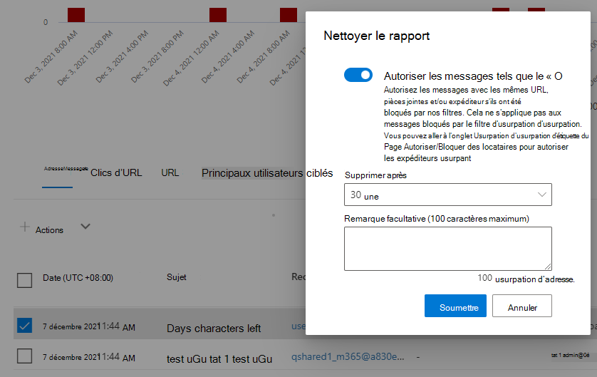

# Sécurité du courrier électronique avec l’Explorateur de menaces dans Microsoft Defender Office 365

Contenu de cet article :

- [Afficher les programmes malveillants détectés dans le courrier électronique](#view-malware-detected-in-email)
- [Afficher l’URL de hameçonnage et cliquer sur les données de verdict](#view-phishing-url-and-click-verdict-data)
- [Démarrer un examen et une réponse automatisés](#start-automated-investigation-and-response)

> [!NOTE]
> Cela fait partie d’une série de **3** articles sur l’Explorateur de menaces **,** la sécurité du courrier électronique et les détections de l’Explorateur et en temps réel **(telles** que les différences entre les outils et les autorisations nécessaires pour les exploiter). Les deux autres articles de cette série sont le repérage de menaces dans [l’Explorateur](threat-hunting-in-threat-explorer.md) de menaces et l’Explorateur de menaces et les [détections en temps réel.](real-time-detections.md)

Cet article explique comment afficher et examiner les programmes malveillants et les tentatives de hameçonnage détectés dans le courrier électronique par Microsoft 365 fonctionnalités de sécurité.

**S’applique à :**

- [Microsoft Defender pour Office 365 : offre 1 et offre 2](defender-for-office-365.md)
- [Microsoft 365 Defender](../defender/microsoft-365-defender.md)

## Afficher les programmes malveillants détectés dans le courrier électronique

Pour voir les programmes malveillants détectés dans les [**\>**](threat-explorer-views.md#email--malware) e-mails triés par Microsoft 365, utilisez la vue Programmes malveillants de l’Explorateur (ou détections en temps réel). Les programmes malveillants étant l’affichage par défaut, ils peuvent être sélectionnés dès que vous ouvrez l’Explorateur.

1. In the Microsoft 365 Defender portal at <https://security.microsoft.com> , go to Email & **collaboration,** and then choose **Explorer** or **Real-time detections**. Pour aller directement à la page, utilisez <https://security.microsoft.com/threatexplorer> ou <https://security.microsoft.com/realtimereports> .

   Cet exemple utilise **l’Explorateur**.

   À partir de là, commencez à l’affichage, choisissez une période particulière pour examiner (si nécessaire) et concentrez vos filtres, comme le décrit l’Explorateur.

2. Dans la **liste de** listes listes de l’affichage, vérifiez **que** les programmes malveillants de messagerie électronique \>  sont sélectionnés.

3. Cliquez **sur Expéditeur,** puis choisissez Technologie **de** détection \> **de base** dans la liste liste.

   :::image type="content" source="../../media/exploreremailmalwaredetectiontech-newimg.png" alt-text="technologie de détection des programmes malveillants.":::

   Vos technologies de détection sont désormais disponibles en tant que filtres pour le rapport.

4. Choisissez une option, puis cliquez sur **Actualiser** pour appliquer ce filtre (n’actualisez pas la fenêtre de votre navigateur).

   :::image type="content" source="../../media/exploreremailmalwaredetectiontech2-new.png" alt-text="technologie de détection sélectionnée.":::

   Le rapport est actualisé pour afficher les résultats détectés par les programmes malveillants détectés dans le courrier électronique, à l’aide de l’option technologique que vous avez sélectionnée. À partir de là, vous pouvez effectuer une analyse plus approfondie.

### Signaler un message comme propre dans l’Explorateur

Vous pouvez utiliser l’option Signaler **propre** dans l’Explorateur pour signaler un message comme faux positif. 

1. Dans le portail Microsoft 365 Defender,  allez dans l’Explorateur de collaboration & courrier électronique, puis, dans la liste de listes listes, vérifiez que le hameçonnage \> est sélectionné.  

2. Vérifiez que vous êtes  sous l’onglet Courrier électronique, puis, dans la liste des messages signalés, sélectionnez celui que vous souhaitez signaler comme propre. 

3. Cliquez **sur Actions** pour développer la liste des options.

4. Faites défiler la liste des options pour aller à la **section** Démarrer une nouvelle soumission, puis sélectionnez **Rapport propre**. Un volant s’affiche.

   > [!div class="mx-imgBorder"]
   >  

5. Basculez le curseur sur **Sur**. Dans la liste de listes, spécifiez le nombre de jours pendant combien de jours vous souhaitez que le message soit supprimé, ajoutez une note si nécessaire, puis sélectionnez **Envoyer.** 

## Afficher l’URL de hameçonnage et cliquer sur les données de verdict

Vous pouvez afficher les tentatives de hameçonnage par le biais d’URL dans le courrier électronique, y compris une liste d’URL qui ont été autorisées, bloquées et bloquées. Pour identifier les URL sur qui vous avez cliqué, [Coffre liens](safe-links.md) doivent être configurés. Veillez à configurer  des stratégies Coffre liens pour la protection au moment du clic et la journalisation des verdicts de clic en Coffre liens.

1. In the Microsoft 365 Defender portal at <https://security.microsoft.com> , go to Email & **collaboration,** and then choose **Explorer** or **Real-time detections**. Pour aller directement à la page, utilisez <https://security.microsoft.com/threatexplorer> ou <https://security.microsoft.com/realtimereports> .

   Cet exemple utilise **l’Explorateur**.

2. In the **View** drop down list, choose **Email** \> **Phish**.

   > [!div class="mx-imgBorder"]
   > 

3. Cliquez **sur Expéditeur,** puis sélectionnez **URL** Verdict \> **de clic** dans la liste liste.

4. Dans les options qui s’affichent,  sélectionnez une ou plusieurs options, telles que Blocage et Blocage, puis cliquez sur Actualiser **(ne** pas actualiser la fenêtre de votre navigateur).

    :::image type="content" source="../../media/threatexploreremailphishclickverdict-new.png" alt-text="URL et verdicts de clic.":::

   Le rapport est actualisé pour afficher deux tables d’URL différentes sous **l’onglet URL** sous le rapport :

   - **Les URL les plus fréquentes** sont les URL des messages que vous avez filtrés et le nombre d’actions de remise de courrier pour chaque URL. Dans l’affichage de courrier d’hameçonnage, cette liste contient généralement des URL légitimes. Les attaquants incluent un mélange d’URL bonnes et mauvaises dans leurs messages pour essayer de les remettre, mais ils rendent les liens malveillants plus intéressants. Le tableau des URL est trié par nombre total de messages électroniques, mais cette colonne est masquée pour simplifier l’affichage.

   - **Les clics principaux** sont Coffre URL wrapped links qui ont été cliquées, triées par nombre total de clics. Cette colonne n’est pas non plus affichée, pour simplifier l’affichage. Le nombre total par colonne indique le nombre Coffre nombre de verdicts de clics de liens pour chaque URL cliquée. Dans l’affichage courrier d’hameçonnage, il s’agit généralement d’URL suspectes ou malveillantes. Toutefois, l’affichage peut inclure des URL qui ne sont pas des menaces mais qui figurent dans des messages d’hameçonnage. Les clics d’URL sur les liens déballés ne s’affiche pas ici.

   Les deux tableaux d’URL indiquent les PRINCIPALES URL des messages électroniques de hameçonnage par action de remise et emplacement. Les tableaux indiquent les clics d’URL qui ont été bloqués ou visités malgré un avertissement. Vous pouvez ainsi voir quels liens de mauvaises adresses ont été présentés aux utilisateurs et que les utilisateurs ont cliqué. À partir de là, vous pouvez effectuer une analyse plus approfondie. Par exemple, sous le graphique, vous pouvez voir les URL les plus fréquentes dans les messages électroniques bloqués dans l’environnement de votre organisation.

   > [!div class="mx-imgBorder"]
   > 

   Sélectionnez une URL pour afficher des informations plus détaillées.

   > [!NOTE]
   > Dans la boîte de dialogue du volant d’URL, le filtrage des messages électroniques est supprimé pour afficher la vue complète de l’exposition de l’URL dans votre environnement. Cela vous permet de filtrer les messages électroniques qui vous préoccupent dans l’Explorateur, de rechercher des URL spécifiques qui sont des menaces potentielles, puis d’étendre votre compréhension de l’exposition des URL dans votre environnement (via la boîte de dialogue Détails de l’URL) sans avoir à ajouter de filtres d’URL à l’affichage De l’Explorateur lui-même.

### Interprétation des verdicts de clic

Dans les volants d’e-mail ou d’URL, les clics principaux et dans nos expériences de filtrage, vous verrez différentes valeurs de verdict de clic :

- **Aucun :** Impossible de capturer le verdict pour l’URL. L’utilisateur a peut-être cliqué sur l’URL.
- **Autorisé :** L’utilisateur a été autorisé à accéder à l’URL.
- **Bloqué :** L’accès à l’URL a été bloqué pour l’utilisateur.
- **Verdict en attente :** La page en attente de détonation s’est présentée à l’utilisateur.
- **Blocked overridden:** L’utilisateur ne peut pas accéder directement à l’URL. Toutefois, l’utilisateur a overrode le bloc pour accéder à l’URL.
- **Verdict en attente contourné :** La page de détonation s’est présentée à l’utilisateur. Toutefois, l’utilisateur a overrode le message pour accéder à l’URL.
- **Erreur :** La page d’erreur s’est présentée à l’utilisateur ou une erreur s’est produite lors de la capture du verdict.
- **Échec :** Une exception inconnue s’est produite lors de la capture du verdict. L’utilisateur a peut-être cliqué sur l’URL.

## Démarrer un examen et une réponse automatisés

> [!NOTE]
> Des fonctionnalités d’investigation et de réponse automatisées sont disponibles dans *Microsoft Defender pour Office 365 Plan 2* et *Office 365 E5*.

[L’examen et la réponse automatisés](automated-investigation-response-office.md) peuvent faire gagner du temps et des efforts à votre équipe en matière d’opérations de sécurité pour examiner et réduire les cyberattaques. En plus de configurer des alertes qui peuvent déclencher un manuel de sécurité, vous pouvez démarrer un processus d’examen et de réponse automatisé à partir d’un affichage dans l’Explorateur. Pour plus d’informations, [voir l’exemple : un administrateur de sécurité déclenche une enquête à partir de l’Explorateur.](automated-investigation-response-office.md#example-a-security-administrator-triggers-an-investigation-from-threat-explorer)

## Autres articles

[Examiner les e-mails avec la page Entité de messagerie](mdo-email-entity-page.md)
