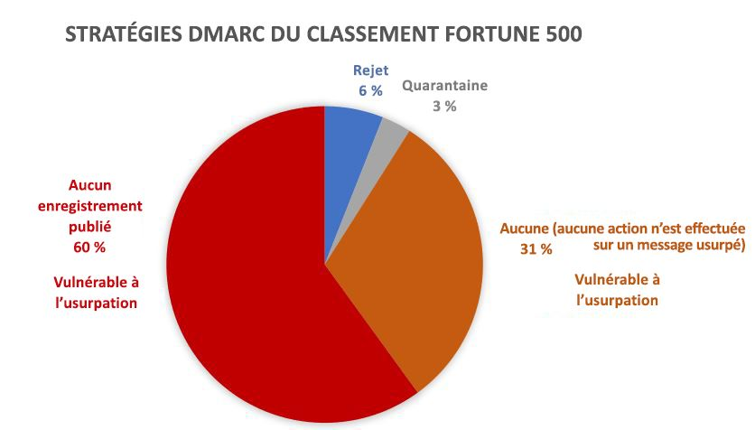
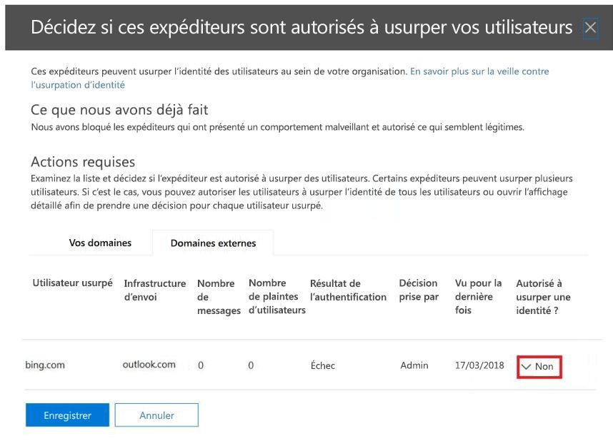

# <a name="email-authentication-in-eop"></a>Authentification de messagerie électronique dans EOP

[!INCLUDE [Microsoft 365 Defender rebranding](../includes/microsoft-defender-for-office.md)]

**S’applique à**
- [Exchange Online Protection](https://go.microsoft.com/fwlink/?linkid=2148611)
- [Microsoft Defender pour Office 365 Plan 1 et Plan 2](https://go.microsoft.com/fwlink/?linkid=2148715)
- [Microsoft 365 Defender](https://go.microsoft.com/fwlink/?linkid=2118804)


L’authentification de messagerie électronique (également appelée validation du courrier électronique) est un ensemble de normes qui tente de bloquer l’usurpation d’identité (messages électroniques provenant de faux expéditeurs). Dans toutes les organisations Microsoft 365, EOP utilise ces normes pour vérifier les e-mails entrants :

- [SPF](set-up-spf-in-office-365-to-help-prevent-spoofing.md)

- [DKIM](use-dkim-to-validate-outbound-email.md)

- [DMARC](use-dmarc-to-validate-email.md)

L’authentification de messagerie électronique vérifie que les messages électroniques d’un expéditeur (par exemple, laura@contoso.com) sont légitimes et proviennent de sources attendues pour ce domaine de courrier électronique (par exemple, contoso.com).

Le reste de cette rubrique explique comment fonctionnent ces technologies et comment EOP les utilise pour vérifier les e-mail entrant.

## <a name="use-email-authentication-to-help-prevent-spoofing"></a>Utilisez l’authentification de messagerie électronique pour empêcher l’usurpation d’identité

DMARC empêche l’usurpation d’identité en examinant l’adresse **de provenance** dans les messages. L’adresse **de provenance** est l’adresse e-mail de l’expéditeur que les utilisateurs voient dans leur client de messagerie. Les organisations de messagerie de destination peuvent également vérifier que le domaine de messagerie a réussi les vérifications SPF ou DKIM. En d’autres termes, le domaine a été authentifié et, par conséquent, l’adresse de messagerie de l’expéditeur n’est pas usurpée.

Toutefois, les enregistrements DNS pour SPF, DKIM et DMARC (appelés stratégies d’authentification de messagerie électronique) sont facultatifs. Les domaines dotés de stratégies d’authentification de messagerie électronique fortes telles que microsoft.com et skype.com sont protégés contre l’usurpation d’identité. Certains domaines qui ont des stratégies d’authentification de messagerie électronique plus faibles ,ou qui n’en ont aucune, ont beaucoup plus de chances d’être usurpés.

Depuis le mois de mars 2018, seuls 9 % des domaines des entreprises figurant au classement Fortune 500 ont publié des stratégies d’authentification de messagerie électronique fortes. Les 91 % d'entreprises restantes peuvent être usurpées par un intrus. À moins qu'un autre mécanisme de filtrage de messagerie électronique ne soit en place, le courrier électronique provenant d'expéditeurs usurpés dans ces domaines peut être transmis aux utilisateurs.



La part de petites et moyennes entreprises qui publient des stratégies d’authentification de messagerie électronique renforcées est plus petite. Ce nombre est encore plus petit pour les domaines de messagerie électronique situés hors Amérique du Nord et Europe de l’Ouest.

L’absence de stratégies d’authentification fortes est un problème fréquent. Si les organisations ne comprennent pas le fonctionnement de l’authentification de messagerie électronique, les intrus, eux, en tire parti grâce à leur parfaite compréhension. En raison de problèmes d’hameçonnage et du faible taux d’adoption de stratégies d’authentification fortes, Microsoft utilise l’*authentification de courrier implicite* pour vérifier les courriers entrants.

L’authentification de courrier implicite est une extension de stratégies d’authentification de messagerie électronique classiques. Ces extensions incluent : la réputation de l’expéditeur, l’historique de l’expéditeur, l’historique du destinataire, l’analyse comportementale et d’autres techniques avancées. En l’absence d’autres signaux de ces extensions, les messages envoyés depuis des domaines qui n’utilisent pas de stratégie d’authentification de messagerie électronique sont marqués comme provenant d’usurpateurs.

Pour lire l’annonce générale de Microsoft Corporation, voir [A Sea of Phish Part 2 – Enhanced Anti-spoofing in Microsoft 365](https://techcommunity.microsoft.com/t5/Security-Privacy-and-Compliance/Schooling-A-Sea-of-Phish-Part-2-Enhanced-Anti-spoofing/ba-p/176209).

## <a name="composite-authentication"></a>Authentification composite

Si un domaine ne dispose pas d’enregistrements SPF, DKIM et DMARC traditionnels, ces vérifications n’indiquent pas assez d’informations sur l’état d’authentification. Par conséquent, Microsoft a développé un algorithme pour l’authentification de courrier implicite. Cet algorithme combine plusieurs signaux dans une valeur unique appelée l’_authentification composite_, ou `compauth`. La valeur `compauth` est marquée dans l’en-tête **Authentication-Results**, à l’intérieur des en-têtes de message.

```text
Authentication-Results:
   compauth=<fail | pass | softpass | none> reason=<yyy>
```

Ces valeurs sont expliquées dans [En-tête de message d’authentification-résultats](anti-spam-message-headers.md#authentication-results-message-header).

En examinant les en-têtes de message, les administrateurs ou même les utilisateurs finaux peuvent déterminer comment Microsoft 365 a déterminé que l'expéditeur est usurpé.

## <a name="why-email-authentication-is-not-always-enough-to-stop-spoofing"></a>Pourquoi l’authentification messagerie électronique ne suffit pas toujours pour empêcher l’usurpation

Le fait de se fier uniquement aux enregistrements d'authentification de messagerie électronique pour déterminer si un message entrant est usurpé présente les limites suivantes :

- Il se peut que le domaine d’envoi ne dispose pas des enregistrements DNS requis ou que les enregistrements soient mal configurés.

- Le domaine source a correctement configuré les enregistrements DNS, mais ce domaine ne correspond pas au domaine dans l’adresse De. SPF et DKIM n'exigent pas que le domaine soit utilisé dans l'adresse De. Les intrus ou services légitimes peuvent enregistrer un domaine, configurer SPF et DKIM pour le domaine, et utiliser un domaine totalement différent dans l’adresse l’expéditeur. Les messages provenant d’expéditeurs de ce domaine réussissent les vérifications SPF et DKIM.

L’authentification composite peut résoudre ces limites en transférant les messages qui, autrement, échoueraient aux contrôles d'authentification de messagerie électronique.

Par souci de simplicité, les exemples suivants se concentrent sur les résultats d’authentification de messagerie électronique. D’autres facteurs d’intelligence en aval peuvent identifier les messages qui franchissent l’authentification de messagerie électronique comme étant usurpés, ou les messages qui échouent à l'authentification de messagerie électronique comme étant légitimes.

Par exemple, le domaine fabrikam.com ne disposent pas d’enregistrements SPF, DKIM ou DMARC. Les messages en provenance des expéditeurs du domaine fabrikam.com peuvent échouer à l'authentification composite (notez la valeur `compauth` et la raison) :

```text
Authentication-Results: spf=none (sender IP is 10.2.3.4)
  smtp.mailfrom=fabrikam.com; contoso.com; dkim=none
  (message not signed) header.d=none; contoso.com; dmarc=none
  action=none header.from=fabrikam.com; compauth=fail reason=001
From: chris@fabrikam.com
To: michelle@contoso.com
```

Si fabrikam.com configure un SPF sans enregistrement DKIM, le message peut réussir l’authentification composite. Le domaine ayant réussi les vérifications SPF est aligné sur le domaine de l’adresse de l’expéditeur :

```text
Authentication-Results: spf=pass (sender IP is 10.2.3.4)
  smtp.mailfrom=fabrikam.com; contoso.com; dkim=none
  (message not signed) header.d=none; contoso.com; dmarc=bestguesspass
  action=none header.from=fabrikam.com; compauth=pass reason=109
From: chris@fabrikam.com
To: michelle@contoso.com
```

Si fabrikam.com configure un DKIM sans enregistrement SPF, le message peut réussir l’authentification composite. Le domaine dans la signature DKIM est aligné sur le domaine de l’adresse de l’expéditeur :

```text
Authentication-Results: spf=none (sender IP is 10.2.3.4)
  smtp.mailfrom=fabrikam.com; contoso.com; dkim=pass
  (signature was verified) header.d=outbound.fabrikam.com;
  contoso.com; dmarc=bestguesspass action=none
  header.from=fabrikam.com; compauth=pass reason=109
From: chris@fabrikam.com
To: michelle@contoso.com
```

Si le domaine dans SPF ou si la signature DKIM ne s'alignent pas sur le domaine de l'adresse de l’expéditeur, le message peut échouer à l'authentification composite :

```text
Authentication-Results: spf=none (sender IP is 192.168.1.8)
  smtp.mailfrom=maliciousdomain.com; contoso.com; dkim=pass
  (signature was verified) header.d=maliciousdomain.com;
  contoso.com; dmarc=none action=none header.from=contoso.com;
  compauth=fail reason=001
From: chris@contoso.com
To: michelle@fabrikam.com
```

## <a name="solutions-for-legitimate-senders-who-are-sending-unauthenticated-email"></a>Solutions pour les expéditeurs légitimes qui envoient du courrier électronique non authentifié

Microsoft 365 conserve la trace des contacts qui envoient du courrier électronique non authentifié à votre organisation. Si le service considère que l’expéditeur n’est pas légitime, il indique un échec à l’authentification composite sur les messages de cet expéditeur. Pour éviter cette décision, vous pouvez utiliser les recommandations de cette section.

### <a name="configure-email-authentication-for-domains-you-own"></a>Configurez l’authentification de messagerie électronique pour les domaines que vous possédez

Vous pouvez utiliser cette méthode pour résoudre l’usurpation d’identité intra-organisationnelle et inter-domaines dans les cas où vous êtes propriétaire ou interagissez avec plusieurs clients. Cela aide également à résoudre l’usurpation inter-domaines lorsque vous envoyez du courrier à d’autres clients dans Microsoft 365 ou à des tiers hébergés par d’autres fournisseurs.

- [Configurez des enregistrements SPF](set-up-spf-in-office-365-to-help-prevent-spoofing.md) pour vos domaines.

- [Configurez des enregistrements DKIM](use-dkim-to-validate-outbound-email.md) pour vos domaines principaux.

- [Pensez à configurer des enregistrements DMARC](use-dmarc-to-validate-email.md) pour votre domaine afin de déterminer qui sont vos expéditeurs légitimes.

Microsoft Corporation ne fournit pas de directives d’implémentation détaillées pour les enregistrements SPF, DKIM et DMARC. Cependant, de nombreuses informations sont disponibles en ligne. Il existe également des sociétés tierces spécialisées dans l’aide à la configuration d’enregistrements d’authentification de courrier électronique.

#### <a name="you-dont-know-all-sources-for-your-email"></a>Vous ne connaissez pas toutes les sources de votre courrier électronique

De nombreux domaines ne publient pas d’enregistrements SPF parce qu’ils ne connaissent pas toutes les sources de messagerie pour les messages de leur domaine. Commencez par publier un enregistrement SPF qui contient toutes les sources de messagerie électronique que vous connaissez (en particulier l'endroit où se situe le trafic de votre entreprise), et publiez la stratégie SPF neutre `?all`. Par exemple :

```text
fabrikam.com IN TXT "v=spf1 include:spf.fabrikam.com ?all"
```

Cet exemple signifie que le courrier électronique provenant de l'infrastructure de votre entreprise franchira l’authentification de courrier électronique, mais que le courrier électronique provenant de sources inconnues reviendra au mode neutre.

Microsoft 365 traite les messages entrants de votre infrastructure d’entreprise comme authentifiés. Les messages électroniques provenant de sources non identifiées peuvent rester marqués comme usurpés si l’authentification implicite échoue. Cela constitue cependant toujours une amélioration par rapport à tout le courrier électronique que Microsoft 365 marque comme usurpant une identité.

Une fois que vous avez commencé à utiliser une stratégie de secours SPF de `?all`, vous pouvez progressivement découvrir et inclure d’autres sources de messagerie électronique pour vos messages, puis mettre à jour votre enregistrement SPF avec une stratégie plus stricte.

### <a name="use-spoof-intelligence-to-configure-permitted-senders-of-unauthenticated-email"></a>Utiliser la veille contre l’usurpation d’identité pour configurer les expéditeurs autorisés de courrier électronique non authentifié.

Vous pouvez également utiliser la [veille contre l’usurpation d’identité](learn-about-spoof-intelligence.md) pour autoriser des expéditeurs à transmettre des messages non authentifiés à votre organisation.

Pour les domaines externes, l’utilisateur usurpé est le domaine dans l’adresse De, tandis que l’infrastructure d’envoi est soit l’adresse IP source (divisée en /24 plages CIDR), soit le domaine de l’organisation de l’enregistrement DNS inversé (PTR).

Dans la capture d’écran ci-dessous, l’adresse IP source peut être 131.107.18.4 avec l’enregistrement PTR outbound.mail.protection.outlook.com. Il s’affiche sous la forme outlook.com pour l’infrastructure d’envoi.

Pour autoriser cet expéditeur à envoyer un courrier non authentifié, remplacez **Non** par **Oui**.



### <a name="create-an-allow-entry-for-the-senderrecipient-pair"></a>Créer une entrée d’autorisation pour la paire expéditeur/destinataire

Pour contourner le filtrage du courrier indésirable, certaines parties du filtrage pour le hameçonnage, et non le filtrage des programmes malveillants pour des expéditeurs spécifiques, consultez la rubrique [Créer des listes d’expéditeurs sûrs dans Microsoft 365](create-safe-sender-lists-in-office-365.md).

### <a name="ask-the-sender-to-configure-email-authentication-for-domains-you-dont-own"></a>Demandez à l’expéditeur de configurer l’authentification de courrier électronique pour les domaines que vous ne possédez pas

En raison du problème de courrier indésirable et de hameçonnage, Microsoft Corporation recommande l'authentification de courrier électronique pour toutes les organisations de messagerie électronique. Au lieu de configurer les remplacements manuels au sein de votre organisation, vous pouvez demander à un administrateur du domaine d’envoi de configurer ses enregistrements d'authentification de courrier électronique.

- Même si, par le passé, ils n'avaient pas besoin de publier des enregistrements d'authentification de courrier électronique dans le passé, ils doivent le faire s'ils envoient du courrier électronique à Microsoft Corporation.

- Configurez SPF pour publier les adresses IP d’envoi du domaine et configurez DKIM (si disponible) pour signer numériquement les messages. Vous devez également envisager de configurer des enregistrements DMARC.

- S’ils utilisent des expéditeurs en bloc pour envoyer du courrier électronique en leur nom, vérifiez que le domaine dans l'adresse De (s'il leur appartient) s'aligne sur le domaine qui franchit les protocoles SPF ou DMARC.

- Vérifiez que les emplacements suivants (s’ils sont utilisés) sont inclus dans l’enregistrement SPF :

  - Serveurs de messagerie électronique locaux.
  - Courrier électronique envoyé à partir d’un fournisseur Software as-a-service (Logiciel en tant que service).
  - Courrier électronique envoyé à partir d’un service d’hébergement Cloud (Microsoft Azure, GoDaddy, Rackspace, services Web Amazon, etc.).

- Pour les petits domaines hébergés par un fournisseur de services Internet, configurez l’enregistrement SPF selon les instructions du fournisseur de services Internet.

S’il peut être difficile au début d’obtenir des domaines d’envoi qu’ils s’authentifient, avec le temps, à mesure que de plus en plus de filtres de courrier considéreront leurs e-mails comme indésirables, voire les rejetteront, ils seront amenés à configurer les enregistrements appropriés pour améliorer la remise. En outre, leur participation peut contribuer à la lutte contre le hameçonnage et peut réduire la possibilité de hameçonnage au sein de leur organisation ou des organisations auxquelles ils envoient du courrier électronique.

#### <a name="information-for-infrastructure-providers-isps-esps-or-cloud-hosting-services"></a>Informations pour les fournisseurs d’infrastructure (FSI – Fournisseurs de services Internet, ESP – Fournisseur de services de messagerie électronique ou services d’hébergement Cloud)

Si vous hébergez le courrier électronique d'un domaine ou fournissez une infrastructure d'hébergement qui peut envoyer du courrier électronique, procédez comme suit :

- Veillez à ce que vos clients disposent d'une documentation expliquant comment ils doivent configurer leurs enregistrements SPF

- Pensez à apposer des signatures DKIM sur le courrier électronique sortant, même si le client ne les a pas explicitement configurées (signer avec un domaine par défaut). Vous pouvez même signer deux fois le courrier avec des signatures DKIM (une fois avec le domaine du client s’il l’a configuré, et une seconde fois avec la signature DKIM de votre organisation).

La remise à Microsoft Corporation n’est nullement garantie, même si vous authentifiez le courrier électronique provenant de votre plateforme, mais cela garantit au moins que Microsoft ne considèrera pas votre envoi comme du courrier indésirable parce qu’il n’est pas authentifié.

## <a name="related-links"></a>Liens connexes

Pour plus d’informations sur de meilleures utilisations des fournisseurs de services, voir le document [Les meilleures pratiques des fournisseurs de services de messagerie mobile M3AAWG](https://www.m3aawg.org/sites/default/files/m3aawg-mobile-messaging-best-practices-service-providers-2015-08_0.pdf).

Découvrez comment Office 365 utilise SPF et prend en charge la validation DKIM :

- [En savoir plus sur SPF](how-office-365-uses-spf-to-prevent-spoofing.md)

- [En savoir plus sur DKIM](support-for-validation-of-dkim-signed-messages.md)
