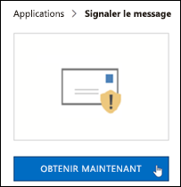
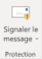
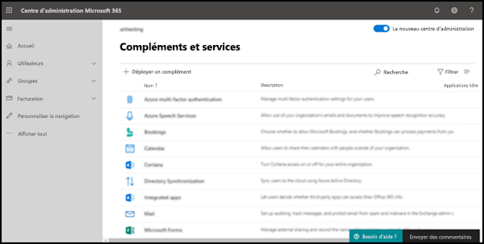
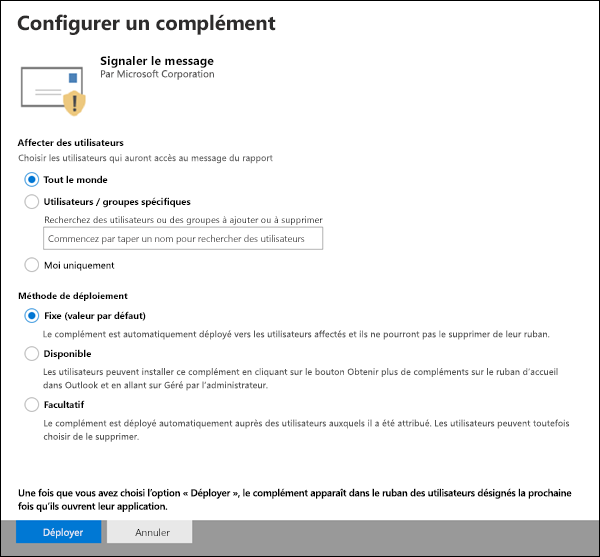
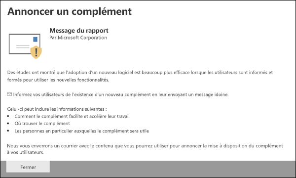
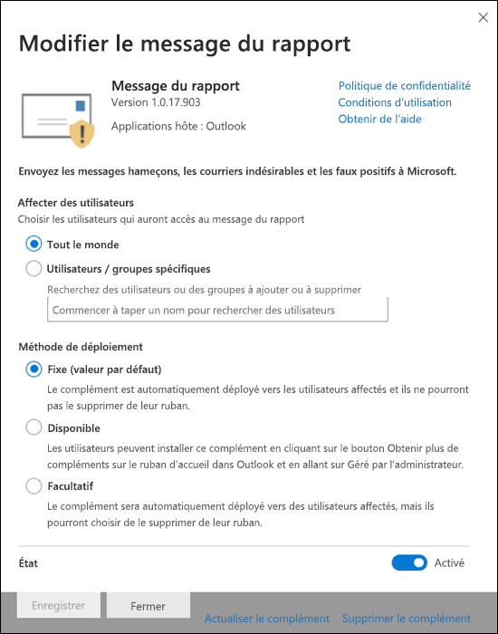

# Activez le complément Signaler un message

[!INCLUDE [Microsoft 365 Defender rebranding](../includes/microsoft-defender-for-office.md)]

> [!NOTE]
> Si vous êtes un administrateur d’une organisation Microsoft 365 avec des boîtes aux lettres Exchange Online, nous vous recommandons d’utiliser le portail soumissions dans le Centre de sécurité & conformité. Pour plus d’informations, voir Utiliser la soumission d’administrateur pour soumettre des messages suspects de courrier indésirable, d’hameçonnage, d’URL et [de fichiers à Microsoft.](admin-submission.md)

Les add-ins Signaler le message et Signaler le hameçonnage pour Outlook et Outlook sur le web (anciennement Outlook Web App) permettent aux utilisateurs de signaler facilement les faux positifs (messages électroniques de qualité marqués comme faux) ou les faux négatifs (courrier électronique non autorisé) à Microsoft et à ses affiliés pour analyse.

Microsoft utilise ces soumissions pour améliorer l’efficacité des technologies de protection de la messagerie. Par exemple, si des personnes signalent un grand nombre de messages marqués comme courrier indésirable à l’aide du add-in Signaler un message, l’équipe de sécurité de votre organisation devra peut-être ajuster les stratégies [anti-courrier](configure-your-spam-filter-policies.md)indésirable.

Vous pouvez installer le module de rapport de message ou de signalement du hameçonnage. Si vous souhaitez que vos utilisateurs signalent uniquement les messages de hameçonnage, déployez le module de signalement du hameçonnage dans votre organisation. Pour plus d’informations, [voir Enable the Report Phishing add-in](enable-the-report-phish-add-in.md).

Le add-in Report Message offre la possibilité de signaler les messages de courrier indésirable et de hameçonnage. Les administrateurs peuvent activer le add-in Message de rapport pour l’organisation, et les utilisateurs individuels peuvent l’installer eux-mêmes.

Si vous êtes un utilisateur individuel, vous pouvez activer le module de rapport de [message pour vous-même.](#get-the-report-message-add-in-for-yourself)

Si vous êtes un administrateur général ou un administrateur Exchange Online et qu’Exchange est configuré pour utiliser l’authentification OAuth, vous pouvez activer le [add-in](#get-and-enable-the-report-message-add-in-for-your-organization)Message de rapport pour votre organisation. Le message de Add-In est désormais disponible via [le déploiement centralisé.](https://docs.microsoft.com/microsoft-365/admin/manage/centralized-deployment-of-add-ins)

## Ce qu'il faut savoir avant de commencer

- Le add-in Message de rapport fonctionne avec la plupart des abonnements Microsoft 365 et les produits suivants :

  - Outlook sur le web
  - Outlook 2013 SP1 ou une édition ultérieure
  - Outlook 2016 pour Mac
  - Outlook inclus dans les applications Microsoft 365 pour Entreprise

- Le module de rapport de message n’est pas disponible pour les boîtes aux lettres dans les organisations Exchange locales.

- Vous pouvez configurer la copie ou la redirection des messages signalés vers une boîte aux lettres que vous spécifiez. Pour plus d’informations, voir [Stratégies d’envoi des utilisateurs.](user-submission.md)

- Votre navigateur web existant doit fonctionner avec le add-in Message de rapport. Toutefois, si vous remarquez que le module n’est pas disponible ou ne fonctionne pas comme prévu, essayez un autre navigateur.

- Pour les installation organisationnelles, l’organisation doit être configurée pour utiliser l’authentification OAuth. Pour plus d’informations, [voir Determine if Centralized Deployment of add-ins works for your organization](../../admin/manage/centralized-deployment-of-add-ins.md).

- Les administrateurs doivent être membres du groupe de rôles Administrateurs globaux. Pour en savoir plus, consultez [Autorisations dans le Centre de sécurité et de conformité](permissions-in-the-security-and-compliance-center.md).

## Obtenir le add-in Message de rapport pour vous-même

1. Go to the Microsoft AppSource at <https://appsource.microsoft.com/marketplace/apps> and search for the Report Message add-in. To go directly to the Report Message add-in, go to <https://appsource.microsoft.com/product/office/wa104381180> .

2. Cliquez **sur GET IT NOW**.

   

3. Dans la boîte de dialogue qui s’affiche, examinez les conditions d’utilisation et la politique de confidentialité, puis cliquez sur **Continuer**.

4. Connectez-vous à l’aide de votre compte scolaire ou scolaire (pour une utilisation professionnelle) ou de votre compte Microsoft (pour un usage personnel).

Une fois que le module est installé et activé, les icônes suivantes s’offrent à vous :

- Dans Outlook, l’icône ressemble à ceci :

  

- Dans Outlook sur le web, l’icône ressemble à ceci :

  

Pour savoir comment utiliser le add-in, voir Utiliser le [add-in Message de rapport.](https://support.microsoft.com/office/b5caa9f1-cdf3-4443-af8c-ff724ea719d2)

## Obtenir et activer le add-in Message de rapport pour votre organisation

> [!NOTE]
> L’apparition du module dans votre organisation peut prendre jusqu’à 12 heures.

1. Dans le Centre d’administration Microsoft 365, consultez la page **Paramètres,** Applications intégrées & Les applications et les applications à l’adresse , puis cliquez sur Déployer <https://admin.microsoft.com/AdminPortal/Home#/Settings/AddIns> un **application.**

   

2. Dans le **volant Déployer un** nouveau module complémentaire qui s’affiche, examinez les informations, puis cliquez sur **Suivant**.

3. Sur la page suivante, cliquez sur **Choisir dans le Store.**

   

4. Dans la page **Sélectionner un add-in** qui s’affiche, cliquez dans la zone De recherche, entrez Message de rapport, puis cliquez sur **Icône**    Rechercher. Dans la liste des résultats, recherchez Message de **rapport,** puis cliquez sur **Ajouter.**

   

5. Dans la boîte de dialogue qui s’affiche, examinez les informations de licence et de confidentialité, puis cliquez sur **Continuer**.

6. Dans la page **Configurer le add-in** qui s’affiche, configurez les paramètres suivants :

   - **Utilisateurs affectés**: sélectionnez l’une des valeurs suivantes :

     - **Tout le monde** (par défaut)
     - **Utilisateurs/groupes spécifiques**
     - **Juste moi**

   - **Méthode de déploiement**: sélectionnez l’une des valeurs suivantes :

     - **Fixe (par défaut)**: le add-in est automatiquement déployé pour les utilisateurs spécifiés et ils ne peuvent pas le supprimer.
     - **Disponible**: les utilisateurs peuvent installer le add-in sur **home** \> **get add-ins** \> **admin-managed**.
     - **Facultatif**: le add-in est automatiquement déployé pour les utilisateurs spécifiés, mais ils peuvent choisir de le supprimer.

   

   Lorsque vous avez terminé, cliquez sur **Déployer.**

7. Dans la page Déployer le **message** de rapport qui s’affiche, vous verrez un rapport d’avancement suivi d’une confirmation du déploiement du module. Après avoir lu les informations, cliquez sur **Suivant**.

   

8. Dans la page **Annoncer le add-in** qui s’affiche, examinez les informations, puis cliquez sur **Fermer**.

   

## Découvrez comment utiliser le add-in Report Message

Les personnes à qui le add-in est affecté voient les icônes suivantes :

- Dans Outlook, l’icône ressemble à ceci :

  

- Dans Outlook sur le web, l’icône ressemble à ceci :

  

Lorsque vous informez les utilisateurs du add-in Message de rapport, incluez un lien pour utiliser le [add-in Message de rapport.](https://support.microsoft.com/office/b5caa9f1-cdf3-4443-af8c-ff724ea719d2)

## Passer en revue ou modifier les paramètres du add-in Message de rapport

1. In the Microsoft 365 admin center, go to the **Services & add-ins** page at <https://admin.microsoft.com/AdminPortal/Home#/Settings/ServicesAndAddIns> .

   

2. Recherchez et sélectionnez le add-in **Message** de rapport.

3. Dans le **volant Modifier le message** de rapport qui s’affiche, examinez et modifiez les paramètres selon le cas pour votre organisation. Lorsque vous avez terminé, cliquez sur **Enregistrer**.

   

## Afficher et examiner les messages signalés

Pour passer en revue les messages que les utilisateurs signalent à Microsoft, vous avez les options ci-après :

- Utilisez le portail Soumissions d’administrateur. Pour plus d’informations, voir [Afficher les soumissions d’utilisateurs à Microsoft.](admin-submission.md#view-user-submissions-to-microsoft)

- Créez une règle de flux de messagerie (également appelée règle de transport) pour envoyer des copies des messages signalés. Pour obtenir des instructions, voir Utiliser des règles de flux de messagerie pour voir ce [que vos utilisateurs rapportent à Microsoft.](use-mail-flow-rules-to-see-what-your-users-are-reporting-to-microsoft.md)
