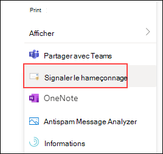

# Activer les compléments Signaler le message ou Signaler l’hameçonnage

[!INCLUDE [MDO Trial banner](../includes/mdo-trial-banner.md)]

**S’applique à**
- [Exchange Online Protection](exchange-online-protection-overview.md)
- [Microsoft Defender pour Office 365 : offre 1 et offre 2](defender-for-office-365.md)
- [Microsoft 365 Defender](../defender/microsoft-365-defender.md)

> [!NOTE]
> Si vous êtes administrateur dans une organisation Microsoft 365 avec des boîtes aux lettres Exchange Online, nous vous recommandons d’utiliser la page **Soumissions** dans le portail Microsoft 365 Defender. Pour plus d’informations, consultez [Utiliser la soumission d’administrateur pour envoyer des courriers indésirables, des hameçonnages, des URL et des fichiers suspects à Microsoft](admin-submission.md).

Les compléments Report Message et Report Phishing pour Outlook et Outlook sur le web (anciennement Outlook Web App) facilitent le signalement de faux positifs (e-mail marqué comme incorrect) ou de faux négatifs (e-mail incorrect autorisé) à Microsoft et à ses affiliés pour analyse.

Microsoft utilise ces soumissions pour améliorer l’efficacité des technologies de protection des e-mails. Par exemple, supposons que les utilisateurs signalent de nombreux messages à l’aide du complément Report Phishing. Ces informations apparaissent dans le tableau de bord de sécurité et d’autres rapports. L’équipe de sécurité de votre organisation peut utiliser ces informations pour indiquer que les stratégies anti-hameçonnage doivent peut-être être mises à jour.

Vous pouvez installer le message de rapport ou le complément Report Phishing. Si vous souhaitez que vos utilisateurs signalent des messages de courrier indésirable et de hameçonnage, déployez le complément Message de rapport dans votre organisation.

Le complément Message de rapport offre la possibilité de signaler à la fois les courriers indésirables et les messages de hameçonnage. Les administrateurs peuvent activer le complément Message de rapport pour l’organisation, et les utilisateurs individuels peuvent l’installer eux-mêmes.

Le complément Report Phishing offre la possibilité de signaler uniquement les messages de hameçonnage. Les administrateurs peuvent activer le complément Report Phishing pour l’organisation, et les utilisateurs individuels peuvent l’installer eux-mêmes.

Si vous êtes un utilisateur individuel, vous pouvez activer les deux compléments pour vous-même.

Si vous êtes administrateur général ou administrateur Exchange Online et qu’Exchange est configuré pour utiliser l’authentification OAuth, vous pouvez activer le complément Message de rapport et le complément Report Phishing pour votre organisation. Les deux compléments sont désormais disponibles via [le déploiement centralisé](../../admin/manage/centralized-deployment-of-add-ins.md).

## Ce qu'il faut savoir avant de commencer

- Le complément Message de rapport et le complément Report Phishing fonctionnent avec la plupart des abonnements Microsoft 365 et les produits suivants :
  - Outlook sur le web
  - Outlook 2013 SP1 ou version ultérieure
  - Outlook 2016 pour Mac
  - Outlook inclus avec les applications Microsoft 365 pour Entreprise
  - Application Outlook pour iOS et Android

- Les deux compléments ne sont pas disponibles pour les boîtes aux lettres partagées, de groupe ou déléguées (les compléments seront grisés).

- Les deux compléments ne sont pas disponibles pour les boîtes aux lettres Exchange locales.

- Votre navigateur web existant doit fonctionner avec les compléments Message de rapport et Hameçonnage de rapport. Toutefois, si vous remarquez que le complément n’est pas disponible ou ne fonctionne pas comme prévu, essayez un autre navigateur.

- Pour les installations organisationnelles, l’organisation doit être configurée pour utiliser l’authentification OAuth. Pour plus d’informations, consultez [Déterminer si le déploiement centralisé des compléments fonctionne pour votre organisation](../../admin/manage/centralized-deployment-of-add-ins.md).

- Les administrateurs doivent être membres du groupe de rôles Administrateurs généraux. Pour plus d’informations, consultez [Autorisations dans le portail Microsoft 365 Defender](permissions-microsoft-365-security-center.md).

- Pour plus d’informations sur la façon de signaler un message à l’aide de la fonctionnalité Message de rapport, consultez [Signaler les faux positifs et les faux négatifs dans Outlook](report-false-positives-and-false-negatives.md).

- Les organisations qui disposent d’une solution de filtrage d’URL ou de sécurité (par exemple, un proxy et/ou un pare-feu) doivent avoir ipagave.azurewebsites.net et outlook.office.com points de terminaison autorisés à être atteints sur le protocole HTTPS.

> [!IMPORTANT]
> Pour afficher les messages signalés à Microsoft sous l’onglet <https://security.microsoft.com/reportsubmission>**Messages signalés par l’utilisateur**, ne désactivez pas l’expérience de création de rapports intégrée.

## Obtenir le complément Message de rapport

### Obtenir le complément Message de rapport pour vous-même

1. Accédez à <https://appsource.microsoft.com/marketplace/apps> Microsoft AppSource et recherchez le complément Message de rapport. Pour accéder directement au complément Message de rapport, accédez à <https://appsource.microsoft.com/product/office/wa104381180>.

2. Cliquez sur **OBTENIR MAINTENANT**.

   :::image type="content" source="../../media/ReportMessageGETITNOW.png" alt-text="Message de rapport Obtenir maintenant." lightbox="../../media/ReportMessageGETITNOW.png":::

3. Dans la boîte de dialogue qui s’affiche, passez en revue les conditions d’utilisation et la politique de confidentialité, puis cliquez sur **Continuer**.

4. Connectez-vous à l’aide de votre compte professionnel ou scolaire (pour une utilisation professionnelle) ou de votre compte Microsoft (à des fins personnelles).

Une fois le complément installé et activé, les icônes suivantes s’affichent :

- Dans Outlook, l’icône ressemble à ceci :

    > [!div class="mx-imgBorder"]
    > :::image type="content" source="../../media/OutlookReportMessageIcon.png" alt-text="Icône de complément Message de rapport pour Outlook." lightbox="../../media/OutlookReportMessageIcon.png":::

- Dans Outlook sur le web, l’icône ressemble à ceci :

    > [!div class="mx-imgBorder"]
    > 

### Obtenir le complément Message de rapport pour votre organisation

> [!NOTE]
> L’apparition du complément dans votre organisation peut prendre jusqu’à 12 heures.

1. Dans le [Centre d'administration Microsoft 365](https://admin.microsoft.com/AdminPortal/Home?#/homepage), accédez à **Paramètres des** **applications intégrées**\>. Cliquez sur **Obtenir des applications**.

    > [!div class="mx-imgBorder"]
    > :::image type="content" source="../../media/microsoft-365-admin-center-integrated-apps.png" alt-text="Les applications intégrées Centre d'administration Microsoft 365." lightbox="../../media/microsoft-365-admin-center-integrated-apps.png":::

2. Dans la **page Microsoft 365 Apps** qui s’affiche, cliquez dans la zone **de recherche**, entrez **le message** de rapport, puis cliquez sur l’icône](../../media/search-icon.png) **Rechercher**![. Dans la liste des résultats, recherchez et sélectionnez **Message de rapport**.

3. La page de détails de l’application s’ouvre. Sélectionnez **Obtenir maintenant**.

    > [!div class="mx-imgBorder"]
    > :::image type="content" source="../../media/microsoft-365-admin-center-report-message.png" alt-text="Complément Message de rapport." lightbox="../../media/microsoft-365-admin-center-report-message.png":::

4. Renseignez les informations de profil de base, puis cliquez sur **Continuer**.

    > [!div class="mx-imgBorder"]
    > :::image type="content" source="../../media/microsoft-365-admin-center-profile-info.png" alt-text="Configuration du profil de complément Message de rapport." lightbox="../../media/microsoft-365-admin-center-profile-info.png":::

5. Le menu volant **Déployer une nouvelle application s’ouvre** . Configurez les paramètres suivants. Cliquez sur **Suivant** pour accéder à la page suivante pour terminer l’installation.

   - **Ajouter des utilisateurs** : sélectionnez l’une des valeurs suivantes :
     - **Juste moi**
     - **Organisation entière**
     - **Utilisateurs/groupes spécifiques**

   - **Déploiement** :
     - **Accepter les demandes d’autorisations** : lisez attentivement les autorisations et fonctionnalités de l’application avant d’accéder à la page suivante.

        > [!div class="mx-imgBorder"]
        > :::image type="content" source="../../media/microsoft-365-admin-center-deploy-new-app.png" alt-text="Page Accepter les demandes d’autorisations." lightbox="../../media/microsoft-365-admin-center-deploy-new-app.png":::

     - **Terminer le déploiement** : passez en revue et terminez le déploiement du complément.
     - **Déploiement terminé** : sélectionnez **Terminé** pour terminer l’installation.

        > [!div class="mx-imgBorder"]
        > :::image type="content" source="../../media/microsoft-365-admin-center-deployment-complete.png" alt-text="Message de notification du déploiement terminé." lightbox="../../media/microsoft-365-admin-center-deployment-complete.png":::

## Modifier les paramètres du complément Message de rapport

1. Dans le Centre d'administration Microsoft 365, accédez à **Paramètres des** **applications intégrées** \> \. Recherchez et sélectionnez ensuite **le complément Message** de rapport.

2. Dans le menu volant qui s’affiche, **sélectionnez Modifier les utilisateurs** pour modifier les paramètres utilisateur.

    > [!div class="mx-imgBorder"]
    > :::image type="content" source="../../media/microsoft-365-admin-center-report-message-edit.png" alt-text="Menu volant Du message de rapport." lightbox="../../media/microsoft-365-admin-center-report-message-edit.png":::

3. Pour supprimer le complément, **sélectionnez Supprimer l’application** sous **Actions** dans le même menu volant.

## Obtenir le complément Report Phishing

### Obtenir le complément Report Phishing pour vous-même

1. Accédez à <https://appsource.microsoft.com/marketplace/apps> Microsoft AppSource et recherchez le complément Report Phishing.

2. Cliquez sur **OBTENIR MAINTENANT**.

3. Dans la boîte de dialogue qui s’affiche, passez en revue les conditions d’utilisation et la politique de confidentialité, puis cliquez sur **Continuer**.

4. Connectez-vous à l’aide de votre compte professionnel ou scolaire (pour une utilisation professionnelle) ou de votre compte Microsoft (à des fins personnelles).

Une fois le complément installé et activé, les icônes suivantes s’affichent :

- Dans Outlook, l’icône ressemble à ceci :

  

- Dans Outlook sur le web, l’icône ressemble à ceci :

    > [!div class="mx-imgBorder"]
    > 

### Obtenir le complément Report Phishing pour votre organisation

> [!NOTE]
> L’apparition du complément dans votre organisation peut prendre jusqu’à 12 heures.

1. Dans le [Centre d'administration Microsoft 365](https://admin.microsoft.com/AdminPortal/Home?#/homepage), accédez à **Paramètres des** **applications intégrées**\>. Cliquez sur **Obtenir des applications**.

    > [!div class="mx-imgBorder"]
    > :::image type="content" source="../../media/microsoft-365-admin-center-integrated-apps.png" alt-text="Les applications intégrées Centre d'administration Microsoft 365." lightbox="../../media/microsoft-365-admin-center-integrated-apps.png":::

2. Dans la page **Microsoft 365 Apps** qui s’affiche, cliquez dans la zone **de recherche**, entrez **l’hameçonnage** de rapport, puis cliquez sur l’icône](../../media/search-icon.png) **Rechercher** pour terminer l’installation.

## Modifier les paramètres du complément Report Phishing

1. Dans le Centre d'administration Microsoft 365, accédez à **Paramètres des** **applications intégrées** \> \. Ensuite, recherchez et sélectionnez **le complément Signaler l’hameçonnage** .

2. Dans le menu volant qui s’affiche, **sélectionnez Modifier les utilisateurs** pour modifier les paramètres utilisateur.

    > [!div class="mx-imgBorder"]
    > :::image type="content" source="../../media/microsoft-365-admin-center-report-phishing-edit.png" alt-text="Menu volant d’hameçonnage de rapport." lightbox="../../media/microsoft-365-admin-center-report-phishing-edit.png":::

3. Pour supprimer le complément, **sélectionnez Supprimer l’application** sous **Actions** dans le même menu volant.
