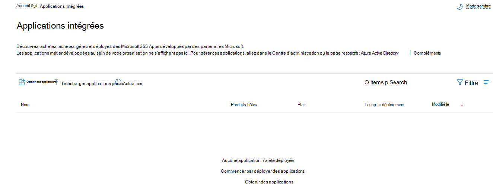
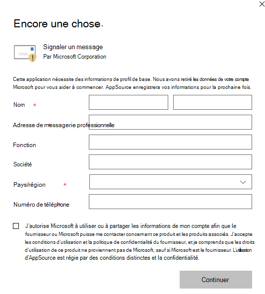
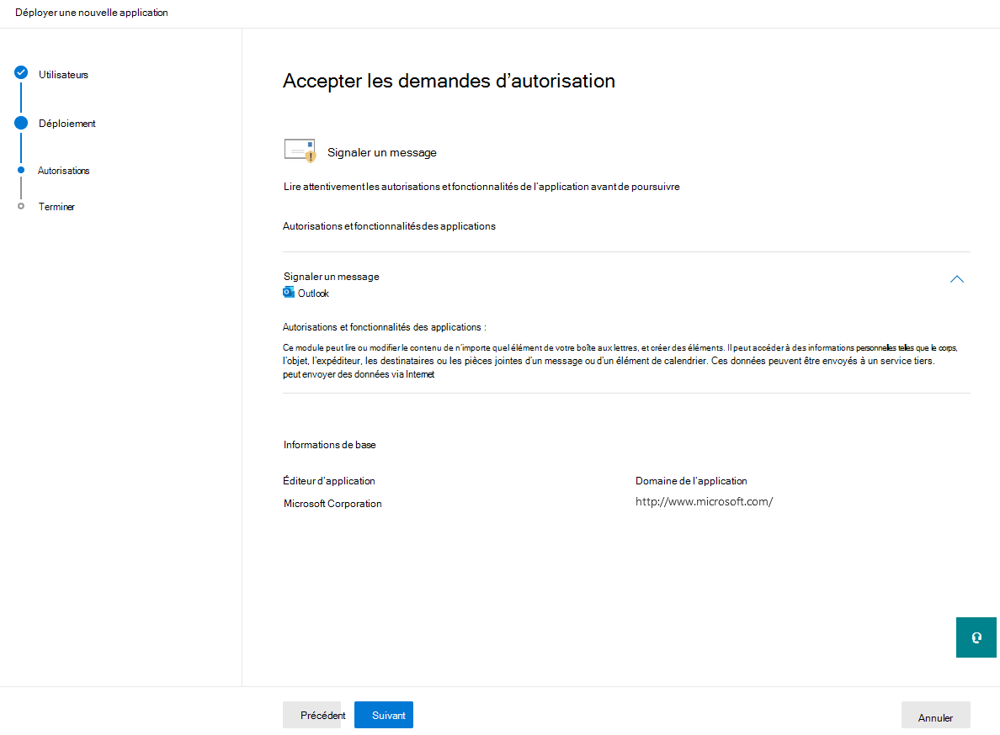
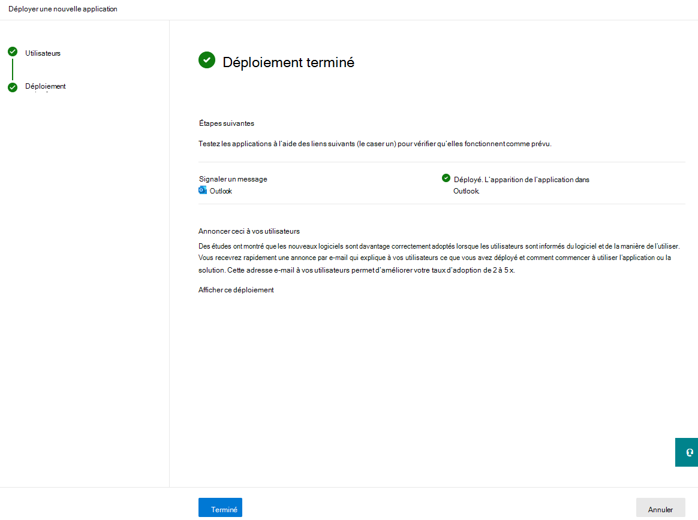
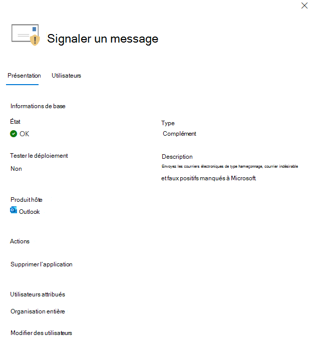
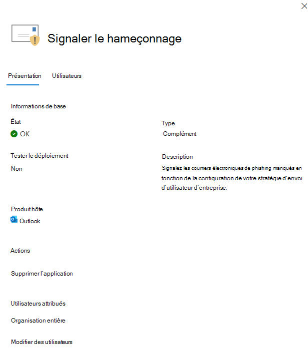

# Activer les compléments Signaler le message ou Signaler l’hameçonnage

[!INCLUDE [Microsoft 365 Defender rebranding](../includes/microsoft-defender-for-office.md)]

**S’applique à**
- [Exchange Online Protection](exchange-online-protection-overview.md)
- [Microsoft Defender pour Office 365 : offre 1 et offre 2](defender-for-office-365.md)
- [Microsoft 365 Defender](../defender/microsoft-365-defender.md)

> [!NOTE]
> Si vous êtes un administrateur d’une organisation Microsoft 365 avec des boîtes aux lettres Exchange Online, nous vous recommandons d’utiliser la page **Soumissions** dans le portail Microsoft 365 Defender. Pour plus d’informations, voir Utiliser la soumission d’administrateur pour soumettre des messages suspects de courrier indésirable, d’hameçonnage, d’URL et [de fichiers à Microsoft.](admin-submission.md)

Les modules de signalement des messages et du hameçonnage pour Outlook et Outlook sur le web (anciennement appelés Outlook Web App) facilitent le signalement de faux positifs (messages électroniques de qualité marqués comme faux) ou de faux négatifs (courriers électroniques erronés autorisés) à Microsoft et à ses affiliés pour analyse.

Microsoft utilise ces soumissions pour améliorer l’efficacité des technologies de protection de la messagerie. Par exemple, supposons que des personnes signalent de nombreux messages à l’aide du module de signalement du hameçonnage. Ces informations sont disponibles dans le Tableau de bord de sécurité et d’autres rapports. L’équipe de sécurité de votre organisation peut utiliser ces informations pour indiquer que les stratégies anti-hameçonnage peuvent avoir besoin d’être mises à jour.

Vous pouvez installer le message de rapport ou le module de signalement du hameçonnage. Si vous souhaitez que vos utilisateurs signalent à la fois le courrier indésirable et les messages de hameçonnage, déployez le add-in Signaler un message dans votre organisation.

Le add-in Report Message offre la possibilité de signaler les messages de courrier indésirable et de hameçonnage. Les administrateurs peuvent activer le add-in Message de rapport pour l’organisation, et les utilisateurs individuels peuvent l’installer eux-mêmes.

Le module de signalement du hameçonnage offre la possibilité de signaler uniquement les messages de hameçonnage. Les administrateurs peuvent activer le module de signalement du hameçonnage pour l’organisation, et les utilisateurs individuels peuvent l’installer eux-mêmes.

Si vous êtes un utilisateur individuel, vous pouvez activer les deux modules pour vous-même.

Si vous êtes un administrateur général ou un administrateur Exchange Online et que Exchange est configuré pour utiliser l’authentification OAuth, vous pouvez activer le module de signalement des messages et le module de signalement du hameçonnage pour votre organisation. Les deux modules sont désormais disponibles via [le déploiement centralisé.](../../admin/manage/centralized-deployment-of-add-ins.md)

## Ce qu'il faut savoir avant de commencer

- Le add-in Report Message et le add-in Report Phishing fonctionnent avec la plupart Microsoft 365 abonnements et les produits suivants :
  - Outlook sur le web
  - Outlook 2013 SP1 ou une ultérieure
  - Outlook 2016 pour Mac
  - Outlook incluses dans Microsoft 365 applications pour Enterprise
  - Outlook application pour iOS et Android

- Les deux modules ne sont pas disponibles pour les boîtes aux lettres partagées ou les boîtes aux lettres dans des organisations Exchange locales.

- Votre navigateur web existant doit fonctionner à la fois avec les add-ins Message de rapport et Signaler le hameçonnage. Toutefois, si vous remarquez que le module n’est pas disponible ou ne fonctionne pas comme prévu, essayez un autre navigateur.

- Pour les installation organisationnelles, l’organisation doit être configurée pour utiliser l’authentification OAuth. Pour plus d’informations, [voir Determine if Centralized Deployment of add-ins works for your organization](../../admin/manage/centralized-deployment-of-add-ins.md).

- Les administrateurs doivent être membres du groupe de rôles Administrateurs globaux. Pour plus d’informations, consultez [Autorisations dans le portail Microsoft 365 Defender](permissions-microsoft-365-security-center.md).

- Pour plus d’informations sur la façon de signaler un message à l’aide de la fonctionnalité Signaler un message, voir Signaler les faux positifs et les [faux négatifs dans Outlook](report-false-positives-and-false-negatives.md).

- Les organisations qui ont une solution de filtrage d’URL ou de sécurité (telle qu’un proxy et/ou un pare-feu) doivent avoir des points de terminaison ipagave.azurewebsites.net et outlook.office.com autorisés à être atteints sur le protocole HTTPS.

> [!IMPORTANT]
> Nous ne recommandons pas l’expérience de rapport intégrée dans Outlook car elle ne peut pas utiliser la stratégie de [soumission d’utilisateur.](./user-submission.md) Nous vous recommandons plutôt d’utiliser le add-in Report Message ou report Phishing.

## Obtenir le add-in Message de rapport

### Obtenir le add-in Message de rapport pour vous-même

1. Go to the Microsoft AppSource at <https://appsource.microsoft.com/marketplace/apps> and search for the Report Message add-in. To go directly to the Report Message add-in, go to <https://appsource.microsoft.com/product/office/wa104381180> .

2. Cliquez **sur GET IT NOW**.

   

3. Dans la boîte de dialogue qui s’affiche, examinez les conditions d’utilisation et la politique de confidentialité, puis cliquez sur **Continuer**.

4. Connectez-vous à l’aide de votre compte scolaire ou scolaire (pour une utilisation professionnelle) ou de votre compte Microsoft (pour un usage personnel).

Une fois le add-in installé et activé, les icônes suivantes s’offrent à vous :

- Dans Outlook, l’icône ressemble à ceci :

    > [!div class="mx-imgBorder"]
    > 

- Dans Outlook sur le web, l’icône ressemble à ceci :

    > [!div class="mx-imgBorder"]
    > 

### Obtenir le add-in Message de rapport pour votre organisation

> [!NOTE]
> L’apparition du module dans votre organisation peut prendre jusqu’à 12 heures.

1. Dans la [Centre d'administration Microsoft 365,](https://admin.microsoft.com/AdminPortal/Home?#/homepage)allez à **Paramètres** \> **applications intégrées.** Cliquez **sur Obtenir des applications.**

    > [!div class="mx-imgBorder"]
    > 

2. Dans la page **Microsoft 365 Apps** qui s’affiche, cliquez dans la zone  De recherche, entrez Message de **rapport,** puis cliquez sur Icône   Dans la liste des résultats, recherchez et sélectionnez **Message de rapport.** 

3. La page de détails de l’application s’ouvre. Sélectionnez **Obtenir maintenant.** 

    > [!div class="mx-imgBorder"]
    >   

4. Complétez les informations de profil de base, puis cliquez sur **Continuer.** 

    > [!div class="mx-imgBorder"]
    > 

5. Le **volant Déployer une nouvelle** application s’ouvre. Configurez les paramètres suivants. Cliquez **sur Suivant** pour passer à la page suivante pour terminer l’installation. 

   - **Ajouter des utilisateurs**: sélectionnez l’une des valeurs suivantes :
     - **Juste moi**
     - **Organisation entière**
     - **Utilisateurs/groupes spécifiques**

   - **Déploiement**:
     - **Acceptez les demandes d’autorisations**: lisez attentivement les autorisations et fonctionnalités de l’application avant de passer à la page suivante.

        > [!div class="mx-imgBorder"]
        > 

     - **Terminer le** déploiement : examinez et terminez le déploiement du add-in. 
     - **Déploiement terminé :** **sélectionnez Terminé** pour terminer l’installation. 

        > [!div class="mx-imgBorder"]
        > 

## Modifier les paramètres du add-in Message de rapport

1. Dans la Centre d'administration Microsoft 365, allez **à** Paramètres \> **applications intégrées** \. Recherchez et sélectionnez **ensuite le** add-in Signaler un message.

2. Dans le volant qui s’affiche, sélectionnez **Modifier les utilisateurs** pour modifier les paramètres utilisateur.

    > [!div class="mx-imgBorder"]
    > 

3. Pour supprimer le module, sélectionnez **Supprimer l’application** sous **Actions** dans le même flyout. 

## Obtenir le module de signalement du hameçonnage

### Obtenir le module de signalement du hameçonnage par vous-même

1. Go to the Microsoft AppSource at <https://appsource.microsoft.com/marketplace/apps> and search for the Report Phishing add-in.

2. Cliquez **sur GET IT NOW**.

3. Dans la boîte de dialogue qui s’affiche, examinez les conditions d’utilisation et la politique de confidentialité, puis cliquez sur **Continuer**.

4. Connectez-vous à l’aide de votre compte scolaire ou scolaire (pour une utilisation professionnelle) ou de votre compte Microsoft (pour un usage personnel).

Une fois le add-in installé et activé, les icônes suivantes s’offrent à vous :

- Dans Outlook, l’icône ressemble à ceci :

  

- Dans Outlook sur le web, l’icône ressemble à ceci :

    > [!div class="mx-imgBorder"]
    > 

### Obtenir le module de signalement du hameçonnage pour votre organisation

> [!NOTE]
> L’apparition du module dans votre organisation peut prendre jusqu’à 12 heures.

1. Dans la [Centre d'administration Microsoft 365,](https://admin.microsoft.com/AdminPortal/Home?#/homepage)allez à **Paramètres** \> **applications intégrées.** Cliquez **sur Obtenir des applications.**

    > [!div class="mx-imgBorder"]
    > 

2. Dans la page **Microsoft 365 Apps** qui s’affiche, cliquez dans la zone De  recherche, entrez Hameçonnage de **rapport,** puis cliquez sur Icône   Dans la liste des résultats, recherchez et sélectionnez **Signaler le hameçonnage.** 
 
3. La page de détails de l’application s’ouvre. Sélectionnez **Obtenir maintenant.**

4. Complétez les informations de profil de base, puis cliquez sur **Continuer.**

5. Le **volant Déployer une nouvelle** application s’ouvre. Suivez les étapes [décrites ci-dessus](enable-the-report-message-add-in.md#get-the-report-message-add-in-for-your-organization) pour terminer l’installation. 

## Modifier les paramètres du module de signalement du hameçonnage

1. Dans la Centre d'administration Microsoft 365, allez **à** Paramètres \> **applications intégrées** \. Recherchez et sélectionnez **le module** de signalement du hameçonnage.

2. Dans le volant qui s’affiche, **sélectionnez Modifier les utilisateurs** pour modifier les paramètres utilisateur.

    > [!div class="mx-imgBorder"]
    > 

3. Pour supprimer le module, sélectionnez **Supprimer l’application** sous **Actions** dans le même flyout. 
