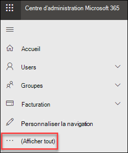
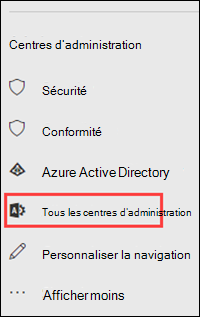

# Centre d’administration Exchange dans EOP autonome

[!INCLUDE [Microsoft 365 Defender rebranding](../includes/microsoft-defender-for-office.md)]

Le centre d’administration Exchange (EAA) est une console de gestion basée sur le Web pour Exchange Online Protection (EOP).

Vous recherchez la version Exchange Online de cette rubrique ? Consultez la rubrique [Exchange admin center in Exchange Online](https://docs.microsoft.com/exchange/exchange-admin-center).

## Ouvrir le centre d’administration Exchange dans EOP

Les clients EOP autonomes peuvent accéder au centre d’administration Exchange à l’aide des méthodes suivantes :

- **À partir du centre d’administration Microsoft 365**:

  1. Accédez à <https://admin.microsoft.com> et cliquez sur **Afficher tout**.

     

  2. Dans la section **centres d’administration** qui s’affiche, cliquez sur **tous les centres d’administration**.

     

  3. Sur la page **tous les centres d’administration** qui s’affiche, cliquez sur **Exchange Online Protection**.

- Accédez directement à `https://admin.protection.outlook.com/ecp/` .

## Éléments d’interface utilisateur courants dans le centre d’administration Exchange dans EOP

Cette section décrit les éléments d'interface utilisateur disponibles dans le CAE.

### Volet des fonctionnalités

Il s'agit du premier niveau de navigation pour la plupart des tâches que vous effectuez au sein du CAE. Le volet des fonctionnalités est organisé par domaines de fonctionnalités.

- **Destinataires**: c’est ici que vous pouvez afficher les groupes et les contacts externes.

- **Autorisations**: ce qui vous permet de gérer les rôles d’administrateur.

- **Gestion** de la conformité : c’est ici que vous trouverez le rapport de groupe de rôles d’administrateur et le rapport du journal d’audit de l’administrateur.

- **Protection**: c’est ici que vous pouvez gérer les stratégies de protection contre les programmes malveillants, la stratégie de filtrage des connexions par défaut et DKIM.

  > [!NOTE]
  > Vous devez gérer les stratégies anti-programme malveillant et la stratégie de filtrage des connexions par défaut dans le centre de sécurité & conformité. Pour plus d’informations, consultez la rubrique [configurer des stratégies anti-programmes malveillants dans EOP](configure-anti-malware-policies.md) et [configurer le filtrage des connexions dans EOP](configure-the-connection-filter-policy.md).

- **Flux de messagerie**: c’est ici que vous gérerez les règles de flux de messagerie (également appelées règles de transport), les domaines acceptés et les connecteurs, ainsi que les emplacements où vous pouvez exécuter le suivi des messages.

- **Hybride**: c’est ici que vous pouvez exécuter l' [Assistant Configuration hybride](https://docs.microsoft.com/Exchange/hybrid-configuration-wizard)et où vous pouvez installer le [module Exchange Online PowerShell](https://docs.microsoft.com/powershell/exchange/mfa-connect-to-exchange-online-powershell).

### Onglets

Les onglets constituent votre deuxième niveau de navigation. Chaque domaine de fonctionnalités contient différents onglets, chacun représentant une fonctionnalité.

### Barre d'outils

Lorsque vous cliquez sur la plupart des onglets, vous devez voir une barre d'outils. La barre d'outils contient des icônes qui correspondent à une action spécifique. Le tableau suivant décrit les icônes et leurs actions.

****

|Icône|Nom|Action|
|---|---|---|
||Ajouter, Nouveau|Permet de créer un objet. Certaines de ces icônes comportent une flèche vers le bas associée, sur laquelle vous pouvez cliquer pour afficher des objets supplémentaires que vous pouvez créer.|
||Modifier|Permet de modifier un objet.|
||Supprimer|Permet de supprimer un objet. Certaines des icônes de suppression comportent une flèche vers le bas, sur laquelle vous pouvez cliquer pour afficher des options supplémentaires.|
||Rechercher|Permet d'ouvrir une zone de recherche dans laquelle vous pouvez entrer une expression pour rechercher un objet.|
||Actualiser|Permet d'actualiser l'affichage Liste.|
||Plus d'options|Utilisez cette icône pour afficher d'autres actions que vous pouvez effectuer pour les objets figurant sous cet onglet. Par exemple, dans **Destinataires \> Utilisateurs**, le fait de cliquer sur cette icône affiche l'option de **Recherche avancée**.  |
||Flèche Haut et flèche Bas|Utilisez ces icônes pour relever ou abaisser la priorité d'un objet.|
||Supprimer|Permet de supprimer des objets d'une liste.|
|

### Affichage Liste

Dans la plupart des cas, vous devez voir un affichage Liste lorsque vous sélectionnez un onglet. La limite d'affichage de l'affichage Liste du CAE est d'environ 10 000 objets. En outre, la pagination est incluse pour vous permettre de paginer les résultats.

### Volet d'informations

Quand vous sélectionnez un objet de l'affichage Liste, les informations relatives à cet objet apparaissent dans le volet d'informations. Dans certains cas, le volet d'informations inclut les tâches de gestion.

### Vignette de l'utilisateur en cours et Aide

La vignette **Moi** vous permet de fermer votre session du Centre d'administration Exchange (CAE) pour ouvrir ensuite une session en tant qu'utilisateur différent. Dans le menu déroulant de l’icône aide à **l’aide**  , vous pouvez effectuer les actions suivantes :

- **Aide**: cliquez sur l'  pour afficher le contenu de l’aide en ligne.
- **Commentaires**: laisser une évaluation.
- **Communauté**: Publiez une question pour trouver des réponses dans les forums de la communauté.
- **Désactiver la bulle d'** aide : la bulle d’aide affiche une aide contextuelle pour les champs lorsque vous créez ou modifiez un objet. Vous pouvez activer ou désactiver la bulle d'aide.
- **Afficher la journalisation des commandes**: une nouvelle fenêtre s’ouvre et affiche les commandes PowerShell équivalentes en fonction des informations que vous avez configurées dans le centre d’administration Exchange.

## Navigateurs pris en charge

Pour bénéficier d’une meilleure expérience d’utilisation du CAE, nous vous recommandons de toujours utiliser les navigateurs, clients Office et applications les plus récents. Nous vous recommandons également d'installer les mises à jour logicielles lorsqu'elles sont disponibles. Pour plus d’informations sur les navigateurs pris en charge et la configuration système requise pour le service, voir [Configuration requise pour Office](https://products.office.com/office-system-requirements).

## Langues prises en charge

Les langues suivantes sont prises en charge et disponibles pour le centre d’administration Exchange en mode autonome EOP.

- Amharique
- Arabe
- basque (Basque)
- Bengla (Inde)
- Bulgare
- Catalan
- Chinois (simplifié)
- Chinois (traditionnel)
- Croate
- Tchèque
- Danois
- Néerlandais
- Anglais
- Estonien
- Filipino (Philippines)
- Finnois
- Français
- Galicien
- Allemand
- Grec
- Goudjrati
- Hébreu
- Hindi
- Hongrois
- Islandais
- Indonésien
- Italien
- Japonais
- Kannada
- Kazakh
- Kiswahili
- Coréen
- Letton
- Lituanien
- Malais (Brunei Darussalam)
- Malais (Malaisie)
- Malayalam
- Marathe
- Norvégien (Bokmål)
- Norvégien (nynorsk)
- Odia
- Perse
- Polonais
- Portugais (Brésil)
- Portugais (Portugal)
- Roumain
- Russe
- Serbe (cyrillique, Serbie)
- Serbe (latin)
- Slovaque
- Slovène
- Espagnol
- Suédois
- Tamoul
- Télougou
- Thaï
- Turc
- Ukrainien
- Ourdou
- Vietnamien
- Gallois
