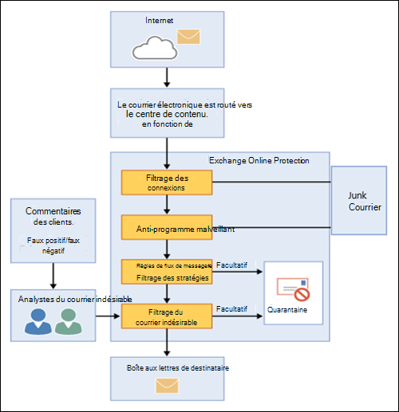

# Vue d’ensemble d’Exchange Online Protection

Exchange Online Protection (EOP) est le service de filtrage basé sur le Cloud qui permet de protéger votre organisation contre le courrier indésirable et les programmes malveillants. EOP est inclus dans toutes les organisations Microsoft 365 avec des boîtes aux lettres Exchange Online.

Toutefois, EOP est également disponible dans les scénarios locaux suivants :

- **Dans un scénario autonome**: EOP offre une protection de messagerie en nuage pour votre organisation Exchange locale ou pour toute autre solution de messagerie SMTP locale.

- **Dans un déploiement hybride**: EOP peut être configuré pour protéger votre environnement de messagerie et contrôler le routage des messages lorsque vous combinez des boîtes aux lettres sur site et dans le Cloud.

Dans ces scénarios, EOP peut simplifier la gestion de votre environnement de messagerie et réduire les nombreuses charges inhérentes à la maintenance du matériel et des logiciels sur site.

Le reste de cette rubrique explique le fonctionnement d’EOP dans les environnements autonomes et hybrides.

## Fonctionnement d'EOP

Pour comprendre le fonctionnement d'EOP, il est utile devoir comment le courrier entrant est traité :

- Un message entrant passe initialement par le filtrage des connexions, qui vérifie la réputation de l’expéditeur et inspecte le message pour les programmes malveillants. La majorité du courrier indésirable est arrêtée à ce stade et supprimée par EOP. Pour plus d’informations, consultez [Configuration du filtrage des connexions](configure-the-connection-filter-policy.md).

- Les messages se poursuivent via le filtrage des stratégies, dans lequel les messages sont évalués par rapport aux règles de flux de messagerie personnalisées (également appelées règles de transport) que vous créez ou appliquez à partir d’un modèle. Par exemple, vous pouvez avoir une règle qui envoie une notification à un responsable lorsque le courrier électronique est envoyé par un expéditeur spécifique. Les vérifications de protection contre la perte de données (DLP) se produisent également à ce stade (licence d’accès client Exchange Enterprise avec services).

- Ensuite, les messages passent par le filtrage du courrier indésirable (également appelé filtrage du contenu). Un message déterminé comme étant du courrier indésirable peut être envoyé dans le dossier de courrier indésirable d’un utilisateur ou en quarantaine, entre autres options. Pour plus d’informations, consultez [Configurer les stratégies anti-courrier indésirable](configure-your-spam-filter-policies.md).

- Une fois qu’un message a réussi à transmettre tous ces calques de protection, il est remis au destinataire.

Pour plus d’informations, reportez-vous à la rubrique [Order and Precedence of mail protection](how-policies-and-protections-are-combined.md).

### Centres de données EOP

EOP s’exécute sur un réseau mondial de centres de données conçus pour offrir une disponibilité optimale. Par exemple, si un centre de données devient indisponible, les courriers électroniques sont automatiquement routés vers un autre centre de données sans interruption du service. Les serveurs de chaque centre de distribution acceptent des messages en votre nom, ce qui permet de réduire la charge sur vos serveurs. Grâce à ce réseau à haut niveau de disponibilité, Microsoft peut garantir que le courrier atteint votre organisation en temps opportun.

EOP effectue l'équilibrage de charge entre les centres de données, mais uniquement au sein d'une région. Si votre système est mis en service dans une région, tous vos messages seront traités sur la base du routage de courrier propre à cette région. La liste suivante présente le fonctionnement du routage de courrier régional pour les centres de données EOP :

- En Europe, au Moyen-Orient et en Afrique (région EMEA), toutes les boîtes aux lettres Exchange Online sont situées dans des centres de données EMEA et tous les messages sont routés via des centres de données EMEA pour le filtrage EOP.

- Dans la région Asie Pacifique (APAC), toutes les boîtes aux lettres Exchange Online sont situées dans des centres de contenu APAC, et les messages sont actuellement routés via des centres de contenu APAC pour le filtrage EOP.

- En Amérique, les services sont distribués aux emplacements suivants :

  - Amérique du Sud : les boîtes aux lettres Exchange Online sont situées dans des centres de contenu au Brésil et au Chili. Tous les messages sont routés via des centres de défilements locaux pour le filtrage EOP. Les messages mis en quarantaine sont stockés dans le centre de contenu où se trouve le client.

  - Canada : les boîtes aux lettres Exchange Online sont situées dans des centres de contenu au Canada. Tous les messages sont routés via des centres de défilements locaux pour le filtrage EOP. Les messages mis en quarantaine sont stockés dans le centre de contenu où se trouve le client.

  - États-Unis : les boîtes aux lettres Exchange Online sont situées dans des centres de connaissances américains. Tous les messages sont routés via des centres de défilements locaux pour le filtrage EOP. Les messages mis en quarantaine sont stockés dans le centre de contenu où se trouve le client.

- En ce qui concerne le nuage communautaire propre aux gouvernements (CCG), toutes les boîtes aux lettres Exchange Online sont situées dans des centres de données américains et tous les messages sont routés via ces centres de données pour le filtrage EOP.

## Plans et fonctionnalités EOP pour les organisations de messagerie locales

Les plans d’abonnement EOP disponibles sont les suivants :

- **EOP autonome**: vous vous inscrivez dans EOP pour protéger votre organisation de messagerie locale.

- **Fonctionnalités EOP dans Exchange Online**: tout abonnement qui inclut Exchange Online (autonome ou intégré à Microsoft 365) utilise EOP pour protéger vos boîtes aux lettres Exchange Online.

- **Licence d’accès client Exchange Enterprise avec services**: Si vous disposez d’une organisation Exchange locale où vous avez acheté des licences de licence d’accès client Exchange Enterprise supplémentaires avec des services, EOP fait partie des services inclus.

Pour plus d’informations sur les conditions requises, les limites importantes et la disponibilité des fonctionnalités dans tous les plans d’abonnement EOP, consultez la rubrique [Description du service de protection Exchange Online](https://docs.microsoft.com/office365/servicedescriptions/exchange-online-protection-service-description/exchange-online-protection-service-description).

## Configuration d’EOP pour les organisations de messagerie locales

La configuration d'EOP peut être simple, en particulier dans le cas d'une organisation de taille modeste appliquant un nombre restreint de règles de conformité. En revanche, si votre organisation est de grande taille, avec plusieurs domaines, des règles de conformité personnalisées ou un flux de messagerie hybride, la configuration peut nécessiter plus de temps et de travail de planification.

Si vous avez déjà acheté EOP, consultez la rubrique [Configurer votre service EOP](set-up-your-eop-service.md) pour être certain d'accomplir toutes les étapes nécessaires à la configuration d'EOP pour la protection de votre environnement de messagerie.

## Aide EOP pour les administrateurs

Le contenu de l’aide pour les administrateurs d’EOP se compose des catégories de niveau supérieur suivantes :

- [Vue d’ensemble d’Exchange Online Protection](exchange-online-protection-overview.md): présente le fonctionnement d’EOP et fournit des liens vers des informations supplémentaires.

- [Fonctionnalités EOP](eop-features.md): fournit la liste des fonctionnalités disponibles dans EOP.

- [Configurer votre service EOP](set-up-your-eop-service.md): fournit la procédure de configuration de votre service EOP, ainsi que des liens vers des informations supplémentaires.

- [Basculez vers EOP à partir de Google Postini, The Barracuda spam and virus Firewall, ou Cisco IronPort](switch-to-eop-from-google-postini-the-barracuda-spam-and-virus-firewall-or-cisco.md): décrit le processus de passage à EOP à partir d’un autre produit de protection du courrier électronique.

- [Gérer les destinataires dans une version autonome d’EOP](manage-recipients-in-eop.md): décrit comment gérer les utilisateurs et les groupes de messagerie dans EOP.

- [Flux de messagerie dans EOP](mail-flow-in-eop.md): décrit comment configurer des scénarios de flux de messagerie personnalisés à l’aide de connecteurs, comment gérer les domaines associés au service et comment activer la fonctionnalité de blocage du périmètre basé sur l’annuaire (DBEB).

- [Meilleures pratiques pour la configuration de EOP](best-practices-for-configuring-eop.md): décrit les paramètres de configuration recommandés et les éléments à prendre en compte après avoir configuré et mis en service votre service.

- [Audit des rapports dans EOP autonome](auditing-reports-in-eop.md): décrit comment utiliser les rapports d’audit pour suivre les modifications apportées à la configuration du service.

- [Protection contre le courrier indésirable et les programmes malveillants dans EOP](anti-spam-and-anti-malware-protection.md): décrit le filtrage du courrier indésirable et des programmes malveillants et montre comment les personnaliser pour répondre au mieux aux besoins de votre organisation. Décrit également les tâches que les administrateurs et les utilisateurs finaux peuvent effectuer sur les messages en quarantaine.

- [Création de rapports et suivi des messages dans Exchange Online Protection](reporting-and-message-trace-in-exchange-online-protection.md): décrit les outils de rapports et de résolution des problèmes disponibles.

- [Centre d’administration Exchange en mode autonome EOP](exchange-admin-center-in-exchange-online-protection-eop.md): explique comment accéder à l’interface de gestion du centre d’administration Exchange afin de gérer votre service EOP, et comment naviguer dans celle-ci.

- [Exchange Online Protection PowerShell](https://docs.microsoft.com/powershell/exchange/exchange-online-protection-powershell): fournit des informations sur PowerShell à distance, qui vous permet de gérer votre service EOP à partir de la ligne de commande.

- [Aide et support pour EOP](help-and-support-for-eop.md) Fournit des informations sur la manière d'obtenir de l'aide et un support technique.
