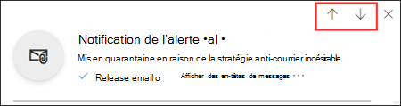
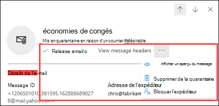
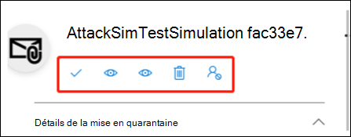

# Rechercher et publier des messages mis en quarantaine en tant qu’utilisateur dans EOP

[!INCLUDE [Microsoft 365 Defender rebranding](../includes/microsoft-defender-for-office.md)]

**S’applique à**
- [Exchange Online Protection](exchange-online-protection-overview.md)
- [Microsoft Defender pour Office 365 : offre 1 et offre 2](defender-for-office-365.md)
- [Microsoft 365 Defender](../defender/microsoft-365-defender.md)

Dans les organisations Microsoft 365 avec des boîtes aux lettres dans Exchange Online ou des organisations Exchange Online Protection (EOP) autonomes sans boîtes aux lettres Exchange Online, la quarantaine contient des messages potentiellement dangereux ou indésirables. Si vous souhaitez en savoir plus, consultez l’article [La quarantaine dans EOP](quarantine-email-messages.md).

En tant que destinataire d'un message en quarantaine, ce que vous pouvez faire au message en tant qu'utilisateur ordinaire (pas en tant qu'administrateur) est décrit dans le tableau suivant :

 

****

|Raison de la mise en quarantaine :|Afficher|Débloquer|Supprimer|
|---|:---:|:---:|:---:|
|En nombre||||
|Courrier indésirable||||
|Hameçonnage (à confiance peu élevée)||||
|

Vous pouvez afficher et gérer vos messages mis en quarantaine dans le Portail Microsoft 365 Defender ou (si un administrateur a utilisé cette configuration) dans les [notifications de courrier indésirable de l’utilisateur final](use-spam-notifications-to-release-and-report-quarantined-messages.md).

## Ce qu'il faut savoir avant de commencer

- Pour ouvrir le Portail Microsoft 365 Defender, accédez à <https://security.microsoft.com>. Pour ouvrir la page Web de **quarantaine** directement, utilisez <https://security.microsoft.com/quarantine>.

- Les administrateurs peuvent configurer la durée pendant laquelle les messages sont conservés dans la quarantaine avant d’être définitivement supprimés dans les stratégies anti-courrier indésirable. Les messages dont la mise en quarantaine est arrivée à expiration ne peuvent pas être récupérés. Si vous souhaitez en savoir plus, consultez l’article [Configurer les stratégies anti-courrier indésirable dans EOP](configure-your-spam-filter-policies.md).

- Les administrateurs peuvent également [activer les notifications de courrier indésirable pour l’utilisateur final](configure-your-spam-filter-policies.md#configure-end-user-spam-notifications) dans les stratégies anti-courrier indésirable. Les destinataires du message original peuvent *libérer* les messages de spam mis en quarantaine directement à partir de ces notifications. Les destinataires du message original peuvent *réviser* les messages de phishing mis en quarantaine (pas les messages de phishing à haut niveau de confiance) directement à partir de ces notifications. Si vous souhaitez en savoir plus, veuillez consulter l’article [Notifications de courrier indésirable pour l’utilisateur final dans EOP](use-spam-notifications-to-release-and-report-quarantined-messages.md).

- Les messages mis en quarantaine car considérés comme de l’hameçonnage, des programmes malveillants ou par règles de flux de messagerie (également appelés règles de transport) ne sont disponibles que pour les administrateurs. Ils sont en revanche invisibles pour les utilisateurs. Si vous souhaitez en savoir plus, voir [Gérer les messages et les fichiers mis en quarantaine en tant qu'administrateur dans EOP](manage-quarantined-messages-and-files.md).

- Vous ne pouvez déplacer un message et le signaler comme faux positif (légitime) qu'une seule fois.

## Afficher les messages en quarantaine

1. Dans le Portail Microsoft 365 Defender, accédez à **Messagerie et collaboration** \> **Évaluation** \> **Quarantaine**.
2. Sur la page Web **Quarantaine**, vous pouvez trier les résultats en cliquant sur un en-tête de colonne disponible. Cliquez sur **Personnaliser les colonnes** pour modifier les colonnes qui s'affichent. Les valeurs par défaut sont marquées d'un astérisque (\*) :

   - **Heure de réception**\*
   - **Sujet**\*
   - **Expéditeur**\*
   - **Raison de la quarantaine**\*
   - **Libérer le statut**\*
   - **Type de stratégie**\*
   - **Expire**\*
   - **Destinataire**
   - **ID de message**
   - **Nom de la stratégie**
   - **Taille du message**
   - **Direction du courrier**

   Lorsque vous avez terminé, cliquez sur **Appliquer**.

3. Pour filtrer les résultats, cliquez sur **Filtrer**. Les filtres suivants sont disponibles dans le menu déroulant **Filtres** qui apparaît :
   - **ID du message** : l’identificateur global unique du message.
   - **Adresse de l’expéditeur**
   - **Adresse du destinataire**
   - **Sujet**
   - **Heure reçue** : Saisissez une **heure de début** et une **heure de fin** (date).
   - **Date d’expiration** : filtrer les messages par date d'expiration de la quarantaine :
     - **Aujourd’hui**
     - **Dans les 2 prochains jours**
     - **Dans les 7 prochains jours**
     - **Heure reçue** : Saisissez une **heure de début** et une **heure de fin** (date).
   - **Raison de la mise en quarantaine :**
     - **E-mail de masse**
     - **Courrier indésirable**
     - **Hameçonnage** : Le verdict du filtre anti-spam était **hameçonnant** ou la protection anti-phishing a mis le message en quarantaine ([paramètres d'usurpation](set-up-anti-phishing-policies.md#spoof-settings) ou [protection contre l'usurpation d'identité](set-up-anti-phishing-policies.md#impersonation-settings-in-anti-phishing-policies-in-microsoft-defender-for-office-365)).
     - **Hameçonnage à haute fiabilité**
   - **Statut de la version** : Une des valeurs suivantes :
     - **Révision requise.**
     - **Approuvé**
     - **Refusé**
     - **Publication demandée**
     - **Date de publication**
   - **Type de stratégie** : filtrer les messages par type de stratégie :
     - **Stratégie anti-programme malveillant**
     - **Stratégie de pièces jointes fiables**
     - **Politique de lutte contre l'hameçonnage**
     - **Stratégie anti-courrier indésirable**

   Lorsque vous avez terminé, cliquez sur **Appliquer**. Pour effacer les filtres, cliquez sur  **Effacer les filtres**.

4. Utilisez le **champ de recherche** et une valeur correspondante pour trouver des messages spécifiques. Les caractères génériques ne sont pas pris en charge. Vous pouvez effectuer une recherche sur les valeurs suivantes :
   - Message ID
   - Adresse de messagerie de l’expéditeur
   - Adresse de messagerie du destinataire
   - Objet. Utiliser l'intégralité du sujet du message La recherche n’est pas sensible à la casse.
   - Nom de la stratégie Nom de la stratégie : utilisez le nom de stratégie complet indiqué dans le message. La recherche n’est pas sensible à la casse.

   Après avoir saisi les critères de recherche, appuyez sur ENTRÉE pour filtrer les résultats.

Une fois le message spécifique mis en quarantaine trouvé, sélectionnez-le pour afficher des détails à son sujet et pour prendre des mesures (par exemple, afficher, déplacer, télécharger ou supprimer le message).

### Afficher les détails des messages mis en quarantaine

Lorsque vous sélectionnez un message mis en quarantaine dans la liste, les informations suivantes sont disponibles dans le flyout de détails qui apparaît.

Lorsque vous sélectionnez un message électronique dans la liste, les détails de message suivants s’affichent dans le volet déroulant **Détails** :

- **ID du message** : l’identificateur global unique pour le message.
- **Adresse de l’expéditeur**
- **Reçu** : Date et heure de réception du message.
- **Subject**
- **Raison de mise en quarantaine** : indique si un message a été identifié comme **courrier indésirable**, **courrier en nombre** ou **hameçonnage**.
- **Type de politique** : Le type de politique. Par exemple, **la politique anti-spam**.
- **Nombre de destinataires**
- **Destinataires** : si le message contient plusieurs destinataires, vous devez cliquer sur **Prévisualiser le message** ou **Afficher l’en-tête du message** pour afficher la liste complète des destinataires.
- **Expires** : Date et heure auxquelles le message sera automatiquement et définitivement supprimé de la quarantaine.

Pour donner suite au message, consultez la section suivante.

> [!NOTE]
> Pour rester dans le menu déroulant des détails, mais changer le message en quarantaine que vous regardez, utilisez les flèches haut et bas en haut du menu déroulant.
>
> 

### Effectuer une action sur les messages mis en quarantaine

Après avoir sélectionné un message en quarantaine dans la liste, les actions suivantes sont disponibles dans le flyout des détails :

-  **E-mail de version**\* : Transmet le message dans votre boîte de réception.

-  **Afficher les en-têtes de message** : Sélectionnez ce lien pour voir le texte de l'en-tête du message. Le flyout de **l'en-tête de message** apparaît avec les liens suivants :
- **Copier l'en-tête du message** : Cliquez sur ce lien pour copier l'en-tête du message (tous les champs d'en-tête) dans votre presse-papiers.
- **Analyseur d'en-tête de message Microsoft Corporation** : Pour analyser en profondeur les champs et les valeurs de l'en-tête, cliquez sur ce lien pour accéder à l'analyseur d'en-tête de message. Collez l'en-tête du message dans la section **Insérez l'en-tête du message que vous souhaitez analyser** (CTRL+V ou cliquez avec le bouton droit de la souris et choisissez **Coller**), puis cliquez sur **Analyser les en-têtes**.

Les actions suivantes sont disponibles après avoir cliqué sur l'icône.  **Autres actions** :

-  **Prévisualisation de message** : Dans le menu flottant qui apparaît, sélectionnez l'un des onglets suivants :
  - **Affichage Source** : affiche la version HTML du corps du message, dans laquelle tous les liens sont désactivés.
  - **Texte simple** : affiche le corps du message au format texte brut.

-  **Supprimer de la quarantaine** : Après avoir cliqué sur **Oui** dans l'avertissement qui apparaît, le message est immédiatement supprimé sans être envoyé aux destinataires d'origine.

-  **Télécharger l'e-mail** : Dans le menu flottant qui apparaît, sélectionnez **je comprends les risques liés au téléchargement de ce message**, puis cliquez sur **Télécharger** pour enregistrer une copie locale du message au format .eml.

-  **Bloquer l'expéditeur** : Ajouter l'expéditeur à la liste des expéditeurs bloqués dans **votre** boîte aux lettres. Pour plus d'informations, consultez [Bloquer un expéditeur du courrier](https://support.microsoft.com/office/b29fd867-cac9-40d8-aed1-659e06a706e4).

\* Cette option n'est pas disponible pour les messages qui ont déjà été validés (la **valeur du statut** Validé est **publiée**).

Si vous ne libérez pas ou ne supprimez pas le message, il sera supprimé après l'expiration de la période de conservation en quarantaine par défaut (comme indiqué dans la **colonne Expiration**).

> [!NOTE]
> Sur un appareil mobile, le texte de description n'est pas disponible sur les icônes d'action.
>
> 
>
> Les icônes dans l'ordre et leurs descriptions correspondantes sont résumées dans le tableau suivant :
>
> |Icône|Description|
> |---:|---|
> ||**Version d’e-mail**|
> ||**Afficher les en-têtes de messages**|
> ||**Afficher une prévisualisation du message**|
> ||**Supprimer de la quarantaine**|
> ||**Bloquer l’expéditeur**|

#### Effectuer une action sur plusieurs courriers électroniques mis en quarantaine

Lorsque vous sélectionnez plusieurs messages mis en quarantaine dans la liste (jusqu'à 100) en cliquant dans la zone vide à gauche de la première colonne, la liste déroulante **Actions en vrac** s'affiche et vous permet d'effectuer les actions suivantes :

-  **Version des messages** : Transmet le message dans votre boîte de réception.
-  **Supprimer les messages** :  Après avoir cliqué sur **Oui** dans l'avertissement qui apparaît, les messages sont immédiatement supprimés de la quarantaine sans être envoyés aux destinataires d'origine.
