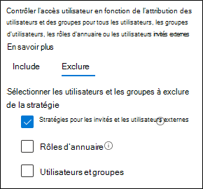

# Stratégies d’accès invité et d’accès des utilisateurs externes B2B

Cet article traite de l’ajustement des stratégies d’accès aux appareils et aux identités recommandées pour autoriser l’accès aux invités et aux utilisateurs externes qui ont un compte Azure Active Directory (Azure AD) Business-to-Business (B2B). Ces instructions s’appuient sur les stratégies [communes d’accès aux appareils et aux identités.](identity-access-policies.md)

Ces recommandations sont conçues pour s’appliquer au **niveau de** protection de référence. Mais vous pouvez également ajuster les recommandations  en fonction de vos besoins spécifiques en matière de protection sensible et **hautement réglementée.**

Le fait de fournir un chemin d’accès aux comptes B2B pour s’authentifier auprès de votre client Azure AD ne permet pas à ces comptes d’accéder à l’ensemble de votre environnement. Les utilisateurs B2B et leurs comptes ont accès à des services et des ressources, tels que des fichiers, partagés avec eux par la stratégie d’accès conditionnel.

## Mise à jour des stratégies courantes pour autoriser et protéger les invités et l’accès des utilisateurs externes

Ce diagramme montre les stratégies à ajouter ou à mettre à jour parmi les stratégies d’accès aux identités et appareils courantes, pour l’accès des invités B2B et des utilisateurs externes.

[Voir une version plus grande de cette image](https://github.com/MicrosoftDocs/microsoft-365-docs/raw/public/microsoft-365/media/microsoft-365-policies-configurations/identity-access-ruleset-guest.png)

Le tableau suivant répertorie les stratégies que vous devez créer et mettre à jour. Les stratégies courantes sont liées aux instructions de configuration associées dans l’article [Stratégies](identity-access-policies.md) communes d’identité et d’accès aux appareils.

|Niveau de protection|Stratégies|Informations supplémentaires|
|---|---|---|
|**Baseline**|[Exiger l’mf toujours pour les invités et les utilisateurs externes](identity-access-policies.md#require-mfa-based-on-sign-in-risk)|Créez cette stratégie et configurez : <ul><li>Pour **les affectations > utilisateurs** et groupes > inclure, sélectionnez Sélectionner des utilisateurs et des **groupes,** puis sélectionnez Tous les utilisateurs **invités et externes.**</li><li>Pour **les affectations > conditions >** se connectez, laissez toutes les options désactivées pour toujours appliquer l’authentification multifacteur (MFA).</li></ul>|
||[Exiger l’mf lorsque le risque de se connecte *est moyen* ou *élevé*](identity-access-policies.md#require-mfa-based-on-sign-in-risk)|Modifiez cette stratégie pour exclure les invités et les utilisateurs externes.|
||[Exiger des PC conformes](identity-access-policies.md#require-compliant-pcs-but-not-compliant-phones-and-tablets)|Modifiez cette stratégie pour exclure les invités et les utilisateurs externes.|

Pour inclure ou exclure des invités et des utilisateurs externes dans les stratégies d’accès conditionnel, pour affectations > Utilisateurs et groupes > Inclure ou exclure, vérifier tous les **utilisateurs invités** et **externes.**

## Informations supplémentaires

### Invités et accès des utilisateurs externes avec Microsoft Teams

Microsoft Teams définit les utilisateurs suivants :

- **L’accès invité** utilise un compte Azure AD B2B qui peut être ajouté en tant que membre d’une équipe et qui a accès aux communications et aux ressources de l’équipe.

- **L’accès** externe est pour un utilisateur externe qui n’a pas de compte B2B. L’accès des utilisateurs externes inclut les invitations, les appels, les conversations et les réunions, mais n’inclut pas l’appartenance à une équipe et l’accès aux ressources de l’équipe.

Pour plus d’informations, voir la [comparaison entre les invités et l’accès des utilisateurs externes pour teams.](https://docs.microsoft.com/microsoftteams/communicate-with-users-from-other-organizations#compare-external-and-guest-access)

Pour plus d’informations sur la sécurisation des stratégies d’accès aux identités et aux appareils pour Teams, voir recommandations de stratégie pour la [sécurisation des conversations, des groupes et des fichiers Teams.](teams-access-policies.md)

### Exiger toujours l’ment MFA pour les utilisateurs invités et externes

Cette stratégie invite les invités à s’inscrire à l’mf auprès de votre client, qu’ils soient inscrits ou non à l’mf dans leur client d’accueil. Lorsque vous accédez à des ressources dans votre client, les invités et les utilisateurs externes doivent utiliser l’ation MFA pour chaque demande.

### Exclusion des invités et des utilisateurs externes de l’fa MFA basée sur les risques

Bien que les organisations peuvent appliquer des stratégies basées sur les risques pour les utilisateurs B2B à l’aide d’Azure AD Identity Protection, il existe des limitations dans l’implémentation d’Azure AD Identity Protection pour les utilisateurs de collaboration B2B dans un répertoire de ressources en raison de leur identité existante dans leur annuaire d’accueil. En raison de ces limitations, Microsoft vous recommande d’exclure les invités des stratégies DFA basées sur les risques et d’exiger que ces utilisateurs utilisent toujours l’mffa.

Pour plus d’informations, voir [Limitations of Identity Protection for B2B collaboration users](https://docs.microsoft.com/azure/active-directory/identity-protection/concept-identity-protection-b2b#limitations-of-identity-protection-for-b2b-collaboration-users).

### Exclusion des invités et des utilisateurs externes de la gestion des appareils

Une seule organisation peut gérer un appareil. Si vous n’excluez pas les invités et les utilisateurs externes des stratégies qui nécessitent la conformité des appareils, ces stratégies bloqueront ces utilisateurs.

## Étape suivante

Configurer des stratégies d’accès conditionnel pour :

- [Microsoft Teams](teams-access-policies.md)
- [Exchange Online](secure-email-recommended-policies.md)
- [SharePoint](sharepoint-file-access-policies.md)
