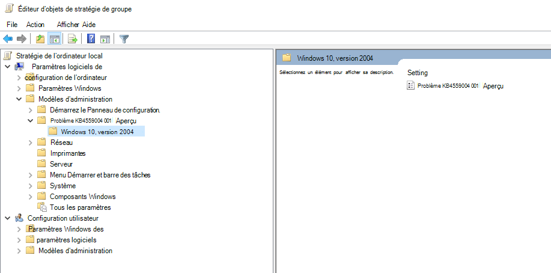
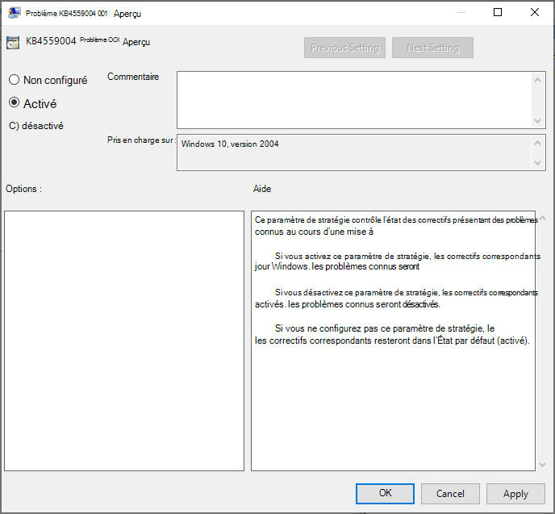
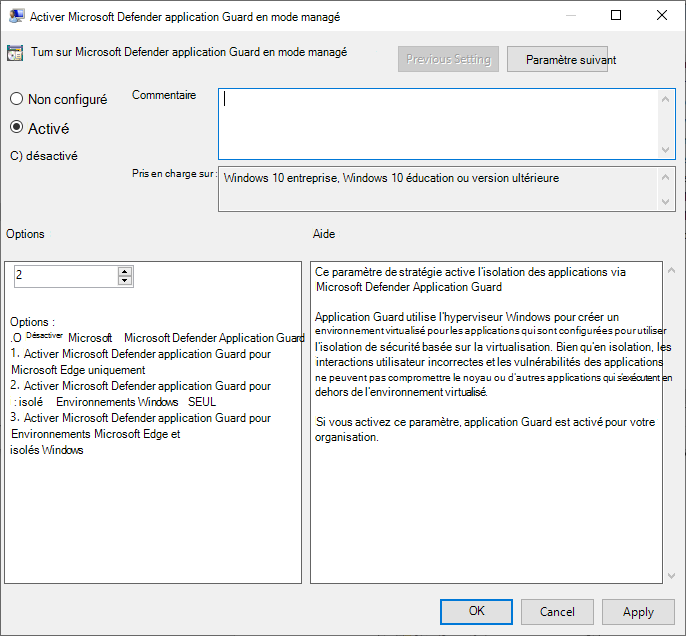
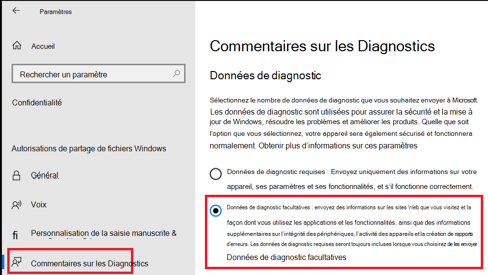
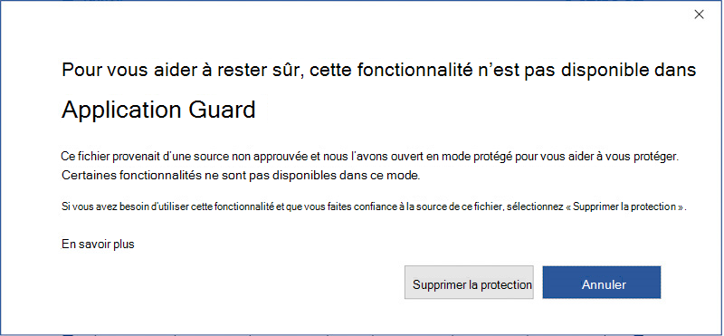

# <a name="application-guard-for-office-public-preview-for-admins"></a>Application Guard pour Office (préversion publique) pour les administrateurs


**S’applique à :** Word, Excel et PowerPoint pour Microsoft 365, Windows 10 entreprise

>[!IMPORTANT]
>Certaines informations concernent un produit précommercial susceptible d’être modifié de manière substantielle avant sa publication commerciale. Microsoft makes no warranties, express or implied, with respect to the information provided here.


Microsoft Defender application Guard pour Office (application Guard pour Office) permet d’empêcher les fichiers non approuvés d’accéder aux ressources approuvées, tout en garantissant la sécurité de votre entreprise contre les attaques nouvelles et émergentes. Cet article guide les administrateurs par le biais de la configuration d’appareils pour un aperçu de application Guard pour Office. Il fournit des informations sur la configuration système requise et les étapes d’installation permettant d’activer application Guard pour Office sur un appareil.

## <a name="prerequisites"></a>Conditions préalables

### <a name="minimum-hardware-requirements"></a>Configuration matérielle minimale requise

* **CPU**: 64-bit, 4 cœurs (physique ou virtuel), extensions de virtualisation (Intel VT-x ou AMD-V), Core i5 équivalent ou supérieur recommandé
* **Mémoire physique**: 8 Go de RAM
* **Disque dur**: 10 Go d’espace libre sur le lecteur système (SSD recommandé)

### <a name="minimum-software-requirements"></a>Configuration logicielle minimale requise

* **Windows 10**: Windows 10 Enterprise Edition, client build version 2004 (20H1) Build 19041
* **Office**: Office Beta Channel Build version 2008 16.0.13212 ou version ultérieure
* **Package de mise à jour**: mises à jour de sécurité mensuelles Windows 10 [KB4566782](https://support.microsoft.com/help/4566782/windows-10-update-kb4566782) 

Pour plus d’informations sur la configuration système requise, reportez-vous à la [Configuration système requise pour Microsoft Defender application Guard](https://docs.microsoft.com/windows/security/threat-protection/microsoft-defender-application-guard/reqs-md-app-guard). Pour en savoir plus sur les versions d’évaluation d’Office Insider, consultez la rubrique [prise en main du déploiement des builds Office Insider](https://insider.office.com/business/deploy).

### <a name="licensing-requirements"></a>Critères de licence
* Microsoft 365 E5 ou Microsoft 365 E5 sécurité

## <a name="deploy-application-guard-for-office"></a>Déployer application Guard pour Office

### <a name="enable-application-guard-for-office"></a>Activer application Guard pour Office

1.  Téléchargez et installez les **mises à jour de sécurité mensuelles cumulatives de Windows 10 KB4566782**. 

2. Téléchargez et installez le [**package d’activation des fonctionnalités d’application Guard pour Office**](https://download.microsoft.com/download/e/4/c/e4c1180a-fcff-462a-8324-4151c44973a8/Windows%20Preview%20-%20WDAG%20Office%20070920%2001.msi). Ce package installe une stratégie de groupe appelée « KB4559004 issue 001 Preview » sous **Computer Configuration\Administrative templates**. Définissez cette stratégie de groupe sur **activé**.
     

     

    Vous pouvez également définir directement les clés de Registre suivantes : 
    
    ```
    reg add HKLM\SYSTEM\CurrentControlSet\Policies\Microsoft\FeatureManagement\Overrides /v 3457697930 /t REG_DWORD /d 1 
    ```
    ```
    reg add HKLM\SYSTEM\CurrentControlSet\Policies\Microsoft\FeatureManagement\Overrides /v 94539402 /t REG_DWORD /d 1 
    ```
    Ensuite, exécutez la commande PowerShell suivante : 
    
    ```powershell
    Get-ScheduledTask -TaskName "ReconcileFeatures" -TaskPath "\Microsoft\Windows\Flighting\FeatureConfig\" | Start-ScheduledTask 
    ```

3.  Sélectionnez **Microsoft Defender application Guard** sous fonctionnalités Windows, puis cliquez sur **OK**. L’activation de la fonctionnalité application Guard demande un redémarrage du système. Vous pouvez choisir de redémarrer maintenant ou après l’étape 4.

    
    
    La fonctionnalité peut également être activée en exécutant la commande PowerShell suivante en tant qu’administrateur : 

    ```powershell
    Enable-WindowsOptionalFeature -online -FeatureName Windows-Defender-ApplicationGuard 
    ```

4.  Recherchez la stratégie de groupe Microsoft Defender application Guard en mode managé située dans Configuration de l' **ordinateur \\ modèles d’administration \\ composants Windows Components \\ Microsoft Defender application Guard**. Activez cette stratégie en définissant la valeur sous options sur **2** ou **3** , puis en sélectionnant **OK** ou **appliquer**.

    
  
    Vous pouvez également définir la stratégie de fournisseur de services de chiffrement correspondante : 

    OMA-URI : **./Device/Vendor/msft/WindowsDefenderApplicationGuard/Settings/AllowWindowsDefenderApplicationGuard** 
    <br>Type de données : **entier** 
    <br>Valeur : **2**


5.  Redémarrez le système.

### <a name="set-diagnostics--feedback-to-send-full-data"></a>Set Diagnostics & feedback pour envoyer des données complètes

Cette étape permet de s’assurer que les données nécessaires pour identifier et résoudre les problèmes arrivent dans Microsoft. Pour activer les diagnostics sur votre appareil Windows, procédez comme suit :

1.  Ouvrez **paramètres** dans le menu Démarrer.

    

2.  Dans **Paramètres Windows**, sélectionnez **confidentialité**.

    

3.  Sous confidentialité, sélectionnez **diagnostics & Feedback** et sélectionnez **Optional Data Diagnostics**.

    

Pour plus d’informations sur la configuration des paramètres de diagnostic Windows, reportez-vous à [la rubrique Configuring Windows diagnostic Data in Your Organization](https://docs.microsoft.com/windows/privacy/configure-windows-diagnostic-data-in-your-organization#enterprise-management).

### <a name="confirm-that-application-guard-for-office-is-enabled-and-working"></a>Vérifier que application Guard pour Office est activé et opérationnel

Avant de vérifier que application Guard pour Office est activé, lancez Word, Excel ou PowerPoint sur un appareil sur lequel les stratégies ont été déployées. Assurez-vous qu’Office est activé. Vous devrez peut-être utiliser votre identité professionnelle pour activer le produit Office en premier.

Pour vérifier que application Guard pour Office est désormais activé, lancez Word, Excel ou PowerPoint et ouvrez un document non approuvé. Par exemple, vous pouvez ouvrir un document téléchargé à partir d’Internet ou une pièce jointe à un message électronique provenant d’une personne extérieure à votre organisation.

Lors du premier lancement d’un fichier non approuvé, un écran de démarrage Office semblable à celui-ci peut apparaître. Il peut s’afficher pendant un certain temps lorsque application Guard pour Office est activé et que le fichier est en cours d’ouverture. Les prochains lancements de fichiers non approuvés doivent être plus rapides.


Lors de son ouverture, le fichier doit indiquer quelques indicateurs visuels d’ouverture du fichier dans application Guard pour Office :

* Une légende dans le ruban

    
* Icône d’application avec un bouclier dans la barre des tâches 

    


## <a name="configure-application-guard-for-office"></a>Configurer application Guard pour Office
Office prend en charge les stratégies suivantes pour vous permettre de configurer les fonctionnalités d’application Guard pour Office. Ces stratégies peuvent être configurées via des stratégies de groupe ou via le service de stratégie de Cloud Office. 

>[!NOTE] 
> Ces stratégies seront bientôt disponibles.
>En outre, la configuration de ces stratégies peut désactiver certaines fonctionnalités des fichiers ouverts dans application Guard pour Office.

| Stratégie                                                                          | Description                                                                                                                                                                                                                                                                                             |
|---------------------------------------------------------------------------------|---------------------------------------------------------------------------------------------------------------------------------------------------------------------------------------------------------------------------------------------------------------------------------------------------------|
| Désactiver application Guard pour Office                                            | L’activation de cette stratégie force Word, Excel et PowerPoint à utiliser le conteneur d’isolation d’affichage protégé au lieu d’application Guard pour Office. Cette stratégie peut être utilisée pour désactiver temporairement application Guard pour Office lorsqu’il existe des problèmes pour la laisser activée pour le serveur Edge.                                  |
| Désactiver le copier/coller pour les documents ouverts dans application Guard                    | L’activation de cette stratégie empêche un utilisateur de copier et de coller du contenu d’un document ouvert dans application Guard pour Office dans un document ouvert en dehors de celui-ci.                                                                                                                                   |
| Empêcher les utilisateurs de supprimer la protection d’application Guard sur les fichiers               | L’activation de cette stratégie permet de supprimer l’option (dans l’expérience de l’application Office) de désactiver la protection application Guard ou d’ouvrir un fichier en dehors d’application Guard. <br><br>**Remarque :** Les utilisateurs peuvent toujours contourner cette stratégie en supprimant manuellement la marque de la propriété Web du fichier ou en détransférant un document vers un emplacement approuvé. |
| Limiter l’impression à partir de documents ouverts dans application Guard                    | L’activation de cette stratégie permet de limiter les imprimantes vers lesquelles un utilisateur peut imprimer à partir d’un fichier ouvert dans application Guard pour Office. Par exemple, vous pouvez utiliser cette stratégie pour limiter les utilisateurs à l’impression au format PDF uniquement.                              |
| Désactiver l’accès caméra et microphone pour les documents ouverts dans application Guard | L’activation de cette stratégie permet de supprimer l’accès à l’appareil photo et microphone dans application Guard pour Office.                                                                                                                                                                                                     |
>[!NOTE] 
>Les stratégies suivantes demanderont à l’utilisateur de se déconnecter et de se reconnecter à Windows pour prendre effet :
> 
> *  Désactiver le copier/coller pour les documents ouverts dans application Guard
>*  Restreindre l’impression pour les documents ouverts dans application Guard
> *  Désactiver l’accès caméra et micro aux documents ouverts dans application Guard


## <a name="submit-feedback"></a>Envoyer les commentaires

### <a name="submit-feedback-via-feedback-hub"></a>Envoyer des commentaires via le hub de commentaires

Si vous rencontrez des problèmes lors du lancement d’application Guard pour Office, nous vous conseillons d’envoyer vos commentaires via le hub de commentaires :

1.  Ouvrez l' **application Hub de commentaires** et connectez-vous.

2.  Si vous obtenez une boîte de dialogue d’erreur pendant le lancement d’application Guard, sélectionnez **Envoyer un rapport à Microsoft** dans la boîte de dialogue d’erreur pour démarrer une nouvelle soumission de commentaires. Dans le cas contraire, accédez à <https://aka.ms/wdagoffice-fb> pour sélectionner la bonne catégorie pour application Guard, puis sélectionnez **+ Ajouter un nouveau commentaire** dans la partie supérieure droite.

3.  Remplissez la zone **résumer votre commentaire** si elle n’est pas déjà renseignée pour vous.

4.  Renseignez la zone **expliquer dans plus de détails** avec une description détaillée du problème que vous avez rencontré et des étapes que vous avez effectuées, puis sélectionnez **suivant**.

5.  Sélectionnez la bulle en regard de problème. Assurez-vous que la catégorie sélectionnée est **sécurité et confidentialité \> Microsoft Defender application Guard – Office**, puis sélectionnez **suivant**.

6.  Sélectionnez **Nouveau commentaire**, puis **suivant**.

7.  Collectez des traces à propos du problème :

    1. Développez la vignette **recréer mon problème** .

    2.  Si le problème que vous rencontrez se produit alors que application Guard est en cours d’exécution, ouvrez une instance d’application Guard. Cette opération permet de collecter des traces supplémentaires à partir du conteneur application Guard.

    3.  Sélectionnez **Démarrer l’enregistrement** et attendez que la mosaïque s’arrête et qu’elle cesse *d’enregistrer*.

    4.  Reproduisez complètement le problème avec application Guard. Cela peut inclure la tentative de lancement d’une instance d’application Guard et l’attente jusqu’à ce qu’elle échoue ou la reproduction d’un problème dans une instance d’application Guard en cours d’exécution.

    5.  Sélectionnez la vignette **arrêter l’enregistrement** .

    6.  Conservez toutes les instances d’application Guard en cours d’exécution, même jusqu’à quelques minutes après l’envoi, afin que les diagnostics de conteneur puissent également être collectés.

8.  Joignez toutes les captures d’écran ou tous les fichiers appropriés liés au problème.

9.  Sélectionnez **Envoyer**.


### <a name="submit-feedback-via-office-customer-voice"></a>Envoyer des commentaires via la voix client d’Office

Vous pouvez également envoyer des commentaires à partir d’Office si le problème se produit lorsque des documents Office sont ouverts dans application Guard. Consultez le [Manuel Office Insider](https://insider.office.com/handbook) pour envoyer des commentaires.

## <a name="integration-with-microsoft-defender-atp-and-office-atp"></a>Intégration à Microsoft Defender ATP et Office ATP

Application Guard pour Office est intégré à la protection avancée contre les menaces (ATP) de Microsoft Defender pour assurer la surveillance et l’alerte sur les activités malveillantes dans l’environnement isolé.

Microsoft Defender ATP est une plateforme de sécurité conçue pour aider les réseaux d’entreprise à prévenir, détecter, examiner et répondre aux menaces avancées. Pour plus d’informations sur cette plateforme, consultez la page [protection avancée contre les menaces de Microsoft Defender](https://www.microsoft.com/microsoft-365/windows/microsoft-defender-atp) . Pour plus d’informations sur l’intégration de périphériques à cette plateforme sur [les appareils intégrés, consultez le service Microsoft Defender ATP](https://docs.microsoft.com/windows/security/threat-protection/microsoft-defender-atp/onboard-configure).

Vous pouvez également configurer la protection avancée contre les menaces Office 365 pour qu’elle fonctionne avec Microsoft Defender ATP. Reportez-vous à la rubrique [intégrer Office 365 ATP avec Microsoft Defender ATP](https://docs.microsoft.com/microsoft-365/security/office-365-security/integrate-office-365-ti-with-wdatp?view=o365-worldwide).

## <a name="limitations-and-considerations"></a>Limitations et considérations

* Application Guard pour Office est un mode restreint qui isole les documents non approuvés de l’accès aux ressources d’entreprise de confiance, l’intranet, l’identité de l’utilisateur et les fichiers arbitraires présents sur l’ordinateur. Par conséquent, si un utilisateur tente d’accéder à une fonctionnalité qui a une dépendance sur un tel accès, par exemple, en insérant une image à partir d’un fichier local sur le disque, il échoue et génère une invite comme celle ci-dessous. Pour permettre à un document non approuvé d’accéder aux ressources approuvées, les utilisateurs doivent supprimer le document protection d’application Guard.

    

    >[!NOTE]    
    >Conseillez aux utilisateurs de ne pas ôter la protection s’ils approuvent le fichier et sa source ou son origine.

* Le contenu actif dans les documents, comme les macros et les contrôles ActiveX, est désactivé dans application Guard pour Office. Les utilisateurs doivent supprimer la protection d’application Guard pour activer le contenu actif.

* Les fichiers non approuvés ouverts à partir de partages réseau ou de fichiers partagés à partir de OneDrive, OneDrive entreprise ou SharePoint Online d’une organisation différente sont ouverts en lecture seule dans application Guard. Les utilisateurs peuvent enregistrer une copie locale de ces fichiers pour continuer à travailler dans le conteneur ou supprimer la protection pour fonctionner directement avec le fichier d’origine.

* Les fichiers protégés par la gestion des droits relatifs à l’information (IRM) continuent à s’ouvrir en mode protégé.
* Les personnalisations apportées aux applications Office dans application Guard pour Office ne sont pas conservées lorsqu’un utilisateur se déconnecte et redémarre l’appareil. 

* Seuls les outils d’accessibilité qui utilisent l’infrastructure UIA peuvent fournir une expérience accessible pour les fichiers ouverts dans application Guard pour Office.

* La connectivité réseau est requise pour le premier lancement d’application Guard après l’installation. Cela est nécessaire pour que application Guard valide la licence.
* Dans la section infos du document, la propriété *Last modified by* peut afficher WDAGUtilityAccount en tant qu’utilisateur. Il s’agit de l’utilisateur anonyme configuré dans application Guard, étant donné que l’identité de l’utilisateur de bureau n’est pas partagée dans le conteneur application Guard. 

## <a name="performance-optimizations-for-application-guard"></a>Optimisations des performances pour application Guard 

Cette section fournit une vue d’ensemble des optimisations de performances utilisées dans application Guard pour Office. Ces informations peuvent aider les administrateurs à diagnostiquer des rapports d’utilisateurs liés aux performances d’Office ou de l’ensemble du système lorsqu’application Guard est activé. 

Application Guard utilise un conteneur virtualisé pour isoler les documents non approuvés hors du système. Le processus de création d’un conteneur et de configuration du conteneur application Guard pour ouvrir des documents Office a une charge de performances qui peut avoir un impact négatif sur l’expérience utilisateur lorsque les utilisateurs ouvrent un document non approuvé. 


Pour fournir aux utilisateurs l’expérience d’ouverture de fichiers attendue, application Guard utilise la logique pour pré-créer un conteneur lorsque l’heuristique suivante est satisfaite sur un système : un utilisateur a ouvert un fichier en mode protégé ou application Guard au cours des 28 derniers jours. 

Lorsque cette heuristique est satisfaite, Office crée un conteneur application Guard pour l’utilisateur après s’être connecté à Windows. Lorsque cette opération pré-création est en cours, le système peut présenter un ralentissement des performances. Cela est résolu dès que l’opération se termine. 


>[!NOTE] 
>Les indications nécessaires pour l’heuristique utilisée pour pré-créer le conteneur sont générées par les applications Office lorsqu’un utilisateur les utilise. Si un utilisateur installe Office sur un nouveau système où application Guard est activé, Office ne crée pas de pré-création du conteneur avant la première ouverture d’un document non approuvé par un utilisateur sur le système. L’utilisateur observera que ce premier fichier prend plus de temps à s’ouvrir dans application Guard. 

## <a name="known-issues-in-preview"></a>Problèmes connus en aperçu

* Le fait de cliquer sur Liens Web ( ```http``` ou ```https``` ) n’ouvre pas le navigateur. 
* Les mises à jour .NET provoquent l’échec de l’ouverture des fichiers dans application Guard. Pour résoudre ce problème, les utilisateurs peuvent redémarrer leur appareil.
    En savoir plus sur le problème lié à la [réception d’un message d’erreur lors de la tentative d’ouverture de Windows Defender application Guard ou Windows sandbox](https://support.microsoft.com/help/4575917/receiving-an-error-message-when-attempting-to-open-windows-defender-ap).
