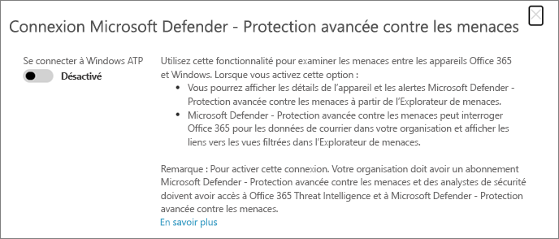

# Utiliser Microsoft Defender pour Office 365 avec Microsoft Defender pour le point de terminaison

[!INCLUDE [Microsoft 365 Defender rebranding](../includes/microsoft-defender-for-office.md)]

[Microsoft Defender pour Office 365](https://docs.microsoft.com/microsoft-365/security/office-365-security/office-365-atp?view=o365-worldwide) peut être configuré pour fonctionner avec [Microsoft Defender pour le point de terminaison](https://docs.microsoft.com/windows/security/threat-protection).

L’intégration de Microsoft Defender pour Office 365 avec Microsoft Defender for Endpoint peut aider votre surveillance d’équipe en matière de sécurité et prendre des mesures rapidement si les appareils des utilisateurs sont menacés. Par exemple, une fois l’intégration activée, votre équipe d’opérations de sécurité pourra voir les appareils potentiellement affectés par un message électronique détecté, ainsi que le nombre d’alertes récentes générées pour ces appareils dans Microsoft Defender pour le point de terminaison. 

L’image suivante montre à quoi ressemble l’onglet **appareils** comme qui est activé pour l’intégration de Microsoft Defender pour les points de terminaison :
  

  
Dans cet exemple, vous pouvez voir que les destinataires du message électronique détecté ont quatre appareils et que l’un d’entre eux comporte une alerte. Si vous cliquez sur le lien d’un appareil, celui-ci s’ouvre dans le centre de sécurité Microsoft Defender ( [https://securitycenter.windows.com](https://securitycenter.windows.com) ).

> [!TIP]
> **[En savoir plus sur le centre de sécurité Microsoft Defender](https://docs.microsoft.com/windows/security/threat-protection/microsoft-defender-atp/use)** (également appelé portail Microsoft Defender pour les points de terminaison).
  
## Configuration requise

- Votre organisation doit avoir Microsoft Defender pour Office 365 (ou Office 365 E5) et Microsoft Defender pour le point de terminaison.
    
- Vous devez être un administrateur général ou disposer d’un rôle d’administrateur de sécurité (tel que administrateur de sécurité) affecté dans le [ &amp; Centre de sécurité](https://protection.office.com)et de conformité. (Voir [Permissions in the Security &amp; Compliance Center](permissions-in-the-security-and-compliance-center.md))
    
- Vous devez avoir accès à l' [Explorateur (ou aux détections en temps réel)](threat-explorer.md) dans le centre de sécurité & conformité et au centre de sécurité Microsoft Defender.
    
## Pour intégrer Microsoft Defender pour Office 365 à Microsoft Defender pour le point de terminaison

L’intégration de Microsoft Defender pour Office 365 avec Microsoft Defender pour le point de terminaison est configurée à l’aide du centre de sécurité & de la sécurité et du centre de sécurité Microsoft Defender.
  
1. En tant qu’administrateur général ou administrateur de sécurité, accédez à [https://protection.office.com](https://protection.office.com) et connectez-vous. (Vous accédez au centre de sécurité & conformité d’Office 365.)
    
2. Dans le volet de navigation, sélectionnez Explorateur de **gestion des menaces**  >  **Explorer**.  
    
3. Dans le coin supérieur droit de l’écran, choisissez **Defender pour les paramètres de point de terminaison**.
    
4. Dans la boîte de dialogue Microsoft Defender pour la connexion au point de terminaison, activez **connexion à Microsoft Defender pour le point de terminaison**.  
    
5. Accédez au centre de sécurité Microsoft Defender ( [https://securitycenter.windows.com](https://securitycenter.windows.com) ).

6. Dans la barre de navigation, sélectionnez **paramètres**. Ensuite, sous **général** , choisissez **fonctionnalités avancées**.

7. Faites défiler vers le bas jusqu’à **Office 365 Threat Intelligence Connection** et activez la connexion.  

## Articles connexes

[Fonctionnalités d’enquête et de réponse aux menaces dans Office 365](office-365-ti.md)
  
[Microsoft Defender pour Office 365](office-365-atp.md)
  
[Microsoft Defender pour point de terminaison](https://docs.microsoft.com/windows/security/threat-protection)
