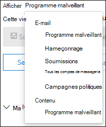

# Examiner les e-mails malveillants qui ont été remis dans Microsoft 365

[!INCLUDE [Microsoft 365 Defender rebranding](../includes/microsoft-defender-for-office.md)]

**S’applique à :**

- [Microsoft Defender pour Office 365 : offre 1 et offre 2](defender-for-office-365.md)
- [Microsoft 365 Defender](../defender/microsoft-365-defender.md)

[Microsoft Defender pour Office 365](defender-for-office-365.md) vous permet d’examiner les activités qui mettent les personnes de votre organisation en danger et de prendre des mesures pour protéger votre organisation. Par exemple, si vous faites partie de l’équipe de sécurité de votre organisation, vous pouvez rechercher et examiner les messages électroniques suspects qui ont été remis. Vous pouvez le faire à l’aide de [l’Explorateur de menaces (ou des détections en temps réel).](threat-explorer.md)

> [!NOTE]
> Retentez l’article de [correction ici.](remediate-malicious-email-delivered-office-365.md)

## Avant de commencer

Assurez-vous que les conditions suivantes sont remplies :

- Votre organisation dispose [de Microsoft Defender pour Office 365](defender-for-office-365.md) et les [licences sont attribuées aux utilisateurs.](../../admin/manage/assign-licenses-to-users.md)

- [La journalisation d’audit](../../compliance/turn-audit-log-search-on-or-off.md) est désactivée pour votre organisation.

- Votre organisation a des stratégies définies pour la protection contre le courrier indésirable, les programmes malveillants, l’anti-hameçonnage, etc. Voir [Protéger contre les menaces dans Office 365](protect-against-threats.md).

- Vous êtes un administrateur général ou le rôle Administrateur de sécurité ou Recherche et purge est attribué dans le portail Microsoft 365 Defender web. Pour plus d’informations, consultez [Autorisations dans le portail Microsoft 365 Defender](permissions-microsoft-365-security-center.md). Pour certaines actions, le rôle Aperçu doit également vous être attribué.

### Autorisations de rôle d’aperçu

Pour effectuer certaines actions, telles que l’affichage des en-têtes de message ou le téléchargement de contenu de message électronique, le rôle Aperçu doit être ajouté à un autre groupe de rôles approprié.  Le tableau suivant clarifie les rôles et autorisations requis.

 

****

|Activité|Groupe de rôles|Rôle d’aperçu nécessaire ?|
|---|---|---|
|Utiliser l’Explorateur de menaces (et détections en temps réel) pour analyser les menaces |Administrateur général 
 Administrateur de sécurité 
 Lecteur de sécurité|Non|
|Utiliser l’Explorateur de menaces (et détections en temps réel) pour afficher les en-têtes des messages électroniques, ainsi que prévisualiser et télécharger les messages électroniques mis en quarantaine|Administrateur général 
 Administrateur de sécurité 
 Lecteur de sécurité|Non|
|Utiliser l’Explorateur de menaces pour afficher les en-têtes, prévisualiser le courrier électronique (uniquement dans la page d’entité de messagerie) et télécharger les messages électroniques remis aux boîtes aux lettres|Administrateur général 
 Administrateur de sécurité 
 Lecteur de sécurité 
 Preview|Oui|
|

> [!NOTE]
> *La* prévisualisation est un rôle, et non un groupe de rôles. Le rôle Aperçu doit être ajouté à un groupe de rôles existant dans le portail Microsoft 365 Defender ( <https://security.microsoft.com> ). Go to **Permissions**, and then either edit an existing role group or add a new role group with the **Preview** role assigned.
>
> Le rôle Administrateur général se voit attribuer Centre d’administration Microsoft 365 ( ), et les rôles Administrateur de la sécurité et Lecteur sécurité sont attribués <https://admin.microsoft.com> dans Microsoft 365 Defender ( <https://security.microsoft.com> ). Si vous souhaitez en savoir plus sur les rôles et les autorisations, consultez [le portail Autorisations dans Microsoft 365 Defender](permissions-microsoft-365-security-center.md).

Nous comprenons que la prévisualisation et le téléchargement des e-mails soient des activités sensibles, et donc l’audit est activé pour ces activités. Une fois qu’un administrateur effectue ces activités sur les e-mails, les journaux d’audit sont générés pour le même et sont visibles dans le portail Microsoft 365 Defender ( <https://security.microsoft.com> ). Go to **Audit** \> **Search** tab, and filter on the admin name in **Users** box. Les résultats filtrés afficheront **l’activité AdminMailAccess**. Sélectionnez une ligne pour afficher les détails dans **la** section Plus d’informations sur les e-mails prévisualés ou téléchargés.

## Rechercher les messages suspects qui ont été remis

L’Explorateur de menaces est un rapport puissant qui peut servir à plusieurs fins, telles que la recherche et la suppression de messages, l’identification de l’adresse IP d’un expéditeur de courrier malveillant ou le démarrage d’un incident pour un examen plus approfondie. La procédure suivante se concentre sur l’utilisation de l’Explorateur pour rechercher et supprimer des messages malveillants des boîtes aux lettres du destinataire.

> [!NOTE]
> Les recherches par défaut dans l’Explorateur n’incluent pas actuellement les éléments remis qui ont été supprimés de la boîte aux lettres cloud par la protection automatique sans heure (ZAP). Cette limitation s’applique à tous les affichages (par exemple, les affichages **Email \> Malware** ou **Email \> Phish).** Pour inclure les éléments supprimés par ZAP, vous devez ajouter un jeu **d’actions** de remise pour inclure **Supprimé par ZAP**. Si vous incluez toutes les options, vous verrez tous les résultats de l’action de remise, y compris les éléments supprimés par ZAP.

1. Ouvrez le Microsoft 365 Defender et connectez-vous à l’aide de votre compte scolaire ou <https://security.microsoft.com> Office 365.

2. Go to **Threat Explorer** by choosing Email **& collaboration** \> **Explorer** in the left navigation. Pour aller directement dans **l’Explorateur de** menaces, utilisez <https://security.microsoft.com/threatexplorer> .

   Dans la page **Explorateur,** la colonne **Actions supplémentaires** indique aux administrateurs le résultat du traitement d’un e-mail. La **colonne Actions supplémentaires** est accessible au même endroit que l’action de **remise** et **l’emplacement de remise.** Des actions spéciales peuvent être mises à jour à la fin de la chronologie des e-mails de l’Explorateur de menaces, qui est une nouvelle fonctionnalité visant à améliorer l’expérience de recherche pour les administrateurs.

3. Dans le menu **Affichage,** sélectionnez **Courrier** \> **électronique dans** la liste déroulante.

    

    La *vue Programmes* malveillants est actuellement la valeur par défaut et capture les e-mails dans lequel une menace de programme malveillant est détectée. *L’affichage* Hameçonnage fonctionne de la même manière, pour le hameçonnage.

    Toutefois, *l’affichage Tous* les messages électroniques répertorie tous les messages reçus par l’organisation, que des menaces soient détectées ou non. Comme vous pouvez l’imaginer, il s’agit d’un grand nombre de données, c’est pourquoi cet affichage affiche un espace réservé qui demande l’application d’un filtre. (Cette vue est uniquement disponible pour Defender pour les Office 365 P2.)

    *L’affichage* Soumissions affiche tous les messages envoyés par l’administrateur ou l’utilisateur qui ont été signalés à Microsoft.

4. **Recherche et filtrage dans l’Explorateur** de menaces : les filtres apparaissent en haut de la page dans la barre de recherche pour aider les administrateurs dans leurs enquêtes. Notez que plusieurs filtres peuvent être appliqués en même temps et que plusieurs valeurs séparées par des virgules sont ajoutées à un filtre pour affiner la recherche. N’oubliez pas :

    - Les filtres correspondent exactement à la plupart des conditions de filtre.
    - Le filtre d’objet utilise une requête CONTAINS.
    - Les filtres d’URL fonctionnent avec ou sans protocoles (par exemple. https).
    - Les filtres de domaine d’URL, de chemin d’URL, de domaine et de chemin d’URL ne nécessitent pas de protocole à filtrer.
    - Vous devez cliquer sur l’icône Actualiser chaque fois que vous modifiez les valeurs de filtre pour obtenir des résultats pertinents.

5. **Filtres avancés**: avec ces filtres, vous pouvez créer des requêtes complexes et filtrer votre jeu de données. Le fait de cliquer *sur Filtres* avancés ouvre un volant avec des options.

   Le filtrage avancé est un excellent ajout aux fonctionnalités de recherche. Une valeur BOOlean NOT sur  **les** filtres de domaine **destinataire,** expéditeur et expéditeur permet aux administrateurs d’examiner en excluant les valeurs. Cette option est **l’option Égal à aucune sélection.** Cette option permet aux administrateurs d’exclure les boîtes aux lettres indésirables des enquêtes (par exemple, les boîtes aux lettres d’alerte et les boîtes aux lettres de réponse par défaut) et est utile dans les cas où les administrateurs recherchent un sujet spécifique (par exemple, Attention) où le destinataire peut être égal à aucun des éléments defaultMail@contoso.com *.* Il s’agit d’une recherche de valeur exacte.

   

   L’ajout d’un filtre d’heure à la date de début et à la date de fin permet à votre équipe de sécurité d’descendre rapidement dans le temps. La durée autorisée la plus courte est de 30 minutes. Si vous pouvez limiter l’action suspecte par période (par exemple, cela s’est produit il y a 3 heures), cela limite le contexte et aide à identifier le problème.

   

6. **Champs de l’Explorateur** de menaces : l’Explorateur de menaces expose beaucoup plus d’informations de messagerie *liées* à la sécurité, telles que *l’action* de *remise,* l’emplacement de remise, l’action *spéciale,* la *direction,* les remplacements et la menace *d’URL.* Elle permet également à l’équipe de sécurité de votre organisation d’enquêter avec une plus grande certitude.

    *L’action de* remise est l’action entreprise sur un e-mail en raison de stratégies ou de détections existantes. Voici les actions possibles qu’un e-mail peut prendre :

    - **Remis :** le courrier électronique a été remis à la boîte de réception ou au dossier d’un utilisateur et l’utilisateur peut y accéder directement.
    - **Courrier** indésirable (remis au courrier indésirable) : le courrier électronique a été envoyé au dossier courrier indésirable ou au dossier supprimé de l’utilisateur, et l’utilisateur a accès aux messages électroniques dans son dossier Courrier indésirable ou Supprimé.
    - **Bloqué** : tous les messages électroniques mis en quarantaine, qui ont échoué ou ont été supprimés. (Ceci est complètement inaccessible par l’utilisateur.)
    - **Remplacé :** tout e-mail où des pièces jointes malveillantes sont remplacées par des .txt qui font état d’une pièce jointe malveillante

    **Emplacement de remise**: le filtre d’emplacement de remise est disponible pour aider les administrateurs à comprendre où les messages malveillants suspectés ont été envoyés et quelles actions ont été prises sur celui-ci. Les données résultantes peuvent être exportées vers une feuille de calcul. Les emplacements de remise possibles sont les :

    - **Boîte de réception ou dossier** : le courrier électronique se trouve dans la boîte de réception ou un dossier spécifique, conformément à vos règles de messagerie.
    - **Local ou externe** : la boîte aux lettres n’existe pas dans le cloud, mais est en local.
    - **Dossier de courrier indésirable** : le courrier électronique se trouve dans le dossier Courrier indésirable d’un utilisateur.
    - **Dossier Éléments supprimés** : le courrier électronique se trouve dans le dossier Éléments supprimés d’un utilisateur.
    - **Quarantaine :** courrier électronique mis en quarantaine et non dans la boîte aux lettres d’un utilisateur.
    - **Échec :** l’e-mail n’a pas pu atteindre la boîte aux lettres.
    - **L’e-mail** a été perdu quelque part dans le flux de messagerie.

    **Direction :** cette option permet à votre équipe des opérations de sécurité de filtrer selon la « direction » d’où provient un message ou est en cours d’envoi. Les valeurs de direction sont entrantes, sortantes et *intra-organisationnelle* (correspondant aux messages provenant de l’extérieur de votre organisation, envoyés hors de votre organisation ou envoyés en interne à votre organisation, respectivement). Ces informations peuvent aider les équipes en matière d’opérations de sécurité à repérer l’usurpation d’identité et l’usurpation d’identité, car il existe une insécurité entre la valeur Directionality (par exemple. *Entrant*), et le domaine de  l’expéditeur (qui semble être un domaine interne) sera évident ! La valeur Directionality est distincte et peut différer de la trace des messages. Les résultats peuvent être exportés vers une feuille de calcul.

    Remplacements : ce filtre prend les informations qui apparaissent sous l’onglet Détails du courrier électronique et les utilise pour exposer l’endroit où les **stratégies** organisationnelles ou utilisateur, pour autoriser et bloquer les messages ont été *substituer.* L’élément le plus important de ce filtre est qu’il permet à l’équipe de sécurité de votre organisation de voir le nombre d’e-mails suspects remis en raison de la configuration. Cela leur donne la possibilité de modifier les autoriser et les blocs selon les besoins. Ce jeu de résultats de ce filtre peut être exporté vers une feuille de calcul.

     

    ****

    |Remplacements de l’Explorateur de menaces|Ce qu’elles signifient|
    |---|---|
    |Autorisé par la stratégie d’organisation|Le courrier a été autorisé dans la boîte aux lettres comme indiqué par la stratégie de l’organisation.|
    |Bloqué par la stratégie d’organisation|La remise du courrier à la boîte aux lettres a été bloquée, comme indiqué par la stratégie de l’organisation.|
    |Extension de fichier bloquée par la stratégie d’organisation|La remise du fichier à la boîte aux lettres a été bloquée, comme indiqué par la stratégie de l’organisation.|
    |Autorisé par la stratégie utilisateur|Le courrier a été autorisé dans la boîte aux lettres comme indiqué par la stratégie de l’utilisateur.|
    |Bloqué par la stratégie de l’utilisateur|La remise du courrier à la boîte aux lettres a été bloquée, comme indiqué par la stratégie de l’utilisateur.|
    |

    **Menace d’URL**: le champ menace d’URL a été inclus sous l’onglet *Détails* d’un e-mail pour indiquer la menace présentée par une URL. Les menaces présentées par une URL peuvent inclure des  programmes *malveillants,* du hameçonnage ou du courrier *indésirable,* et une URL sans menace n’en parlera pas dans la section menaces. 

7. **Affichage de la chronologie des e-mails**: votre équipe en matière d’opérations de sécurité peut avoir besoin de détails détaillés sur le courrier électronique pour examiner plus en détail. La chronologie du courrier électronique permet aux administrateurs d’afficher les actions entreprises sur un e-mail de la remise à la remise post-remise. Pour afficher une chronologie de courrier électronique, cliquez sur l’objet d’un message électronique, puis cliquez sur Chronologie de l’e-mail. (Elle apparaît parmi d’autres titres du panneau, tels que Résumé ou Détails.) Ces résultats peuvent être exportés vers une feuille de calcul.

    La chronologie du courrier électronique s’ouvre dans une table qui affiche tous les événements de remise et de post-remise pour le courrier électronique. S’il n’y a aucune autre action sur le courrier électronique, vous devez voir un événement unique pour la remise d’origine qui indique un résultat, tel que Bloqué *,* avec un verdict comme *hameçonnage*. Les administrateurs peuvent exporter l’intégralité de la chronologie du courrier électronique, y compris tous les détails sous l’onglet et le courrier électronique (par exemple, objet, expéditeur, destinataire, réseau et ID de message). La chronologie du courrier électronique réduit la randomisation, car il y a moins de temps passé à vérifier les différents emplacements pour essayer de comprendre les événements qui se sont produit depuis l’arrivée de l’e-mail. Lorsque plusieurs événements se produisent en même temps sur un e-mail ou à proximité de celui-ci, ces événements s’affiche dans un affichage chronologique.

8. **Aperçu /téléchargement :** l’Explorateur de menaces fournit à votre équipe des opérations de sécurité les détails dont elle a besoin pour examiner les e-mails suspects. Votre équipe des opérations de sécurité peut :

    - [Vérifiez l’action de remise et l’emplacement.](#check-the-delivery-action-and-location)

    - [Afficher la chronologie de votre courrier électronique.](#view-the-timeline-of-your-email)

### Vérifier l’action de remise et l’emplacement

Dans [l’Explorateur de menaces (et](threat-explorer.md)les détections  en temps réel), vous avez désormais des colonnes **Action** de remise et Emplacement de remise au lieu de l’ancienne colonne État **de** remise. Cela se traduit par une image plus complète de l’endroit où vos messages électroniques sont envoyés. Une partie de l’objectif de cette modification est de faciliter les enquêtes pour les équipes en matière d’opérations de sécurité, mais le résultat est de connaître l’emplacement des messages électroniques problématiques en un coup d’œil.

L’état de remise est maintenant divisé en deux colonnes :

- **Action de remise** : quel est l’état de ce courrier électronique ?
- **Emplacement de remise** : où ce courrier a-t-il été acheminé ?

L’action de remise est l’action entreprise sur un e-mail en raison de stratégies ou de détections existantes. Voici les actions possibles qu’un e-mail peut prendre :

- **Remis :** le courrier électronique a été remis à la boîte de réception ou au dossier d’un utilisateur et l’utilisateur peut y accéder directement.
- **Courrier indésirable** : le courrier électronique a été envoyé au dossier courrier indésirable ou au dossier supprimé de l’utilisateur, et l’utilisateur a accès aux messages électroniques dans son dossier Courrier indésirable ou Supprimé.
- **Bloqué** : tous les messages électroniques mis en quarantaine, qui ont échoué ou ont été supprimés. (Ceci est complètement inaccessible par l’utilisateur.)
- **Remplacé :** tout e-mail où des pièces jointes malveillantes sont remplacées par .txt qui font état d’une pièce jointe malveillante.

L’emplacement de remise affiche les résultats des stratégies et des détections qui s’exécutent après la remise. Il est lié à une action de remise. Ce champ a été ajouté pour donner un aperçu de l’action prise lorsqu’un message est trouvé. Voici les valeurs possibles d’emplacement de remise :

- **Boîte de réception ou dossier** : le courrier électronique se trouve dans la boîte de réception ou un dossier (conformément à vos règles de messagerie).
- **Local ou externe** : la boîte aux lettres n’existe pas sur le cloud mais est en local.
- **Dossier de courrier indésirable** : le courrier électronique se trouve dans le dossier Courrier indésirable d’un utilisateur.
- **Dossier Éléments supprimés** : le courrier électronique se trouve dans le dossier Éléments supprimés d’un utilisateur.
- **Quarantaine :** courrier électronique mis en quarantaine et non dans la boîte aux lettres d’un utilisateur.
- **Échec :** l’e-mail n’a pas pu atteindre la boîte aux lettres.
- **L’e-mail** est perdu quelque part dans le flux de messagerie.

### Afficher la chronologie de votre courrier électronique

**La chronologie du courrier** électronique est un champ de l’Explorateur de menaces qui facilite le recherche pour votre équipe des opérations de sécurité. Lorsque plusieurs événements se produisent en même temps ou presque sur un e-mail, ces événements s’affiche dans un affichage chronologie. Certains événements qui se produisent après la remise à un e-mail sont capturés dans la **colonne Actions spéciales.** La combinaison des informations de la chronologie d’un message électronique avec les actions spéciales qui ont été prises après la remise donne aux administrateurs un aperçu des stratégies et de la gestion des menaces (par exemple, l’endroit où le courrier a été acheminé et, dans certains cas, l’évaluation finale).

> [!IMPORTANT]
> Aller à une rubrique de [correction ici.](remediate-malicious-email-delivered-office-365.md)

## Rubriques connexes

[Corriger les messages malveillants remis dans Office 365](remediate-malicious-email-delivered-office-365.md)

[Microsoft Defender pour Office 365](office-365-ti.md)

[Se protéger contre les menaces dans Office 365](protect-against-threats.md)

[Afficher des rapports pour Defender pour Office 365](view-reports-for-mdo.md)
