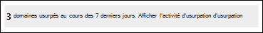

# <a name="spoof-intelligence-insight-in-eop"></a>Informations sur l’usurpation d’intelligence dans EOP

[!INCLUDE [Microsoft 365 Defender rebranding](../includes/microsoft-defender-for-office.md)]

**S’applique à**
- [Exchange Online Protection](exchange-online-protection-overview.md)
- [Microsoft Defender pour Office 365 : offre 1 et offre 2](defender-for-office-365.md)
- [Microsoft 365 Defender](../defender/microsoft-365-defender.md)

> [!NOTE]
> Les fonctionnalités décrites dans cet article sont en prévisualisation, peuvent faire l’objet de changements et ne sont pas disponibles dans toutes les organisations. Si votre organisation ne dispose pas des fonctionnalités décrites dans cet article, consultez l’ancienne expérience de gestion de l’usurpation d’adresse chez [Manage spoof senders using the spoof intelligence policy and spoof intelligence insight in EOP](walkthrough-spoof-intelligence-insight.md).

Dans Microsoft 365 organisations avec des boîtes aux lettres dans Exchange Online ou des organisations Exchange Online Protection autonomes (EOP) sans boîtes aux lettres Exchange Online, les messages électroniques entrants sont automatiquement protégés contre l’usurpation d’adresses. EOP utilise **la veille contre** l’usurpation d’adresse dans le cadre de la protection globale de votre organisation contre le hameçonnage. Pour plus d’informations, voir [Protection contre l’usurpation d’adresse dans EOP.](anti-spoofing-protection.md)

Lorsqu’un expéditeur usurpe une adresse de messagerie, il semble qu’il s’agit d’un utilisateur dans l’un des domaines de votre organisation ou d’un utilisateur d’un domaine externe qui envoie du courrier électronique à votre organisation. Les personnes malveillantes qui usurpent des expéditeurs pour envoyer du courrier indésirable ou du hameçonnage doivent être bloquées. Toutefois, il existe des scénarios où des expéditeurs légitimes usurpent l’adresse. Par exemple :

- Scénarios légitimes pour l’usurpation d’un domaine interne :
  - Les expéditeurs tiers utilisent votre domaine pour envoyer des messages en bloc à vos propres employés pour les sondages de l’entreprise.
  - Une société externe génère et envoie des mises à jour publicitaires ou des mises à jour de produit en votre nom.
  - Un assistant doit régulièrement envoyer des courriers électroniques à une autre personne au sein de votre organisation.
  - Une application interne envoie des notifications par courrier électronique.

- Scénarios légitimes d’usurpation de domaines externes :
  - L’expéditeur figure sur une liste de diffusion (également appelée liste de discussion) et la liste de diffusion relaie le courrier électronique de l’expéditeur d’origine à tous les participants de la liste de diffusion.
  - Une société externe envoie du courrier électronique pour le compte d’une autre société (par exemple, un rapport automatisé ou une société de logiciels en tant que service).

Vous pouvez  utiliser la veille contre l’usurpation d’identité dans le portail Microsoft 365 Defender pour identifier rapidement les expéditeurs usurpés qui vous envoient légitimement des messages électroniques non authentifiés (messages provenant de domaines ne réussissant pas les vérifications SPF, DKIM ou DMARC) et autoriser manuellement ces expéditeurs.

En permettant aux expéditeurs connus d’envoyer des messages usurpés à partir d’emplacements connus, vous pouvez réduire les faux positifs (e-mail de qualité marqué comme faux). En surveillant les expéditeurs usurpés autorisés, vous fournissez une couche de sécurité supplémentaire pour empêcher les messages non sécurisés d’arriver dans votre organisation.

De même, vous pouvez examiner les expéditeurs usurpés qui ont été autorisés par la veille contre l’usurpation d’informations et bloquer manuellement ces expéditeurs à partir de la veille contre l’usurpation d’informations.

Le reste de cet article explique comment utiliser la veille contre l’usurpation d’informations dans le portail Microsoft 365 Defender et dans PowerShell (Exchange Online PowerShell pour les organisations Microsoft 365 avec des boîtes aux lettres en Exchange Online ; EOP PowerShell autonome pour les organisations sans boîtes aux lettres Exchange Online).

> [!NOTE]
>
> - Seuls les expéditeurs usurpés qui ont été détectés par la veille contre l’usurpation d’informations apparaissent dans l’aperçu de l’usurpation d’intelligence. Lorsque vous remplacez le verdict d’autoriser ou de bloquer dans l’insight, l’expéditeur  usurpé devient une entrée d’accès ou de blocage manuelle qui apparaît uniquement sous l’onglet Usurpation d’adresse dans la liste d’adresses client autoriser/bloquer. Vous pouvez également créer manuellement des entrées d’autoriser ou de bloquer des expéditeurs usurpés avant qu’ils ne soit détectés par la veille contre l’usurpation d’adresse. Pour plus d’informations, voir [Gérer liste rouge/verte du client dans EOP](tenant-allow-block-list.md).
>
> - Les informations sur la  veille contre l’usurpation d’adresse et l’onglet Usurpation d’adresse dans la liste d’adresses client autoriser/bloquer remplacent la fonctionnalité de la stratégie de veille contre l’usurpation d’adresses qui était disponible sur la page de stratégie anti-courrier indésirable dans le Centre de sécurité & conformité.
>
>- La veille contre l’usurpation d’informations indique 7 jours de données. La cmdlet **Get-SpoofIntelligenceInsight** affiche 30 jours de données.

## <a name="what-do-you-need-to-know-before-you-begin"></a>Ce qu'il faut savoir avant de commencer

- Vous ouvrez le Portail Microsoft 365 Defender sur <https://security.microsoft.com/>. Pour aller directement à la page **anti-hameçonnage,** utilisez <https://security.microsoft.com/antiphishing> . Pour aller directement à la page Informations sur **l’usurpation d’intelligence,** utilisez <https://security.microsoft.com/spoofintelligence> .

- Pour vous connecter à Exchange Online PowerShell, voir [Connexion à Exchange Online PowerShell](/powershell/exchange/connect-to-exchange-online-powershell). Pour vous connecter à un service Exchange Online Protection PowerShell autonome, voir [Se connecter à Exchange Online Protection PowerShell](/powershell/exchange/connect-to-exchange-online-protection-powershell).

- Des autorisations doivent vous avoir été attribuées dans **Exchange Online** pour que vous puissiez effectuer les procédures décrites dans cet article :
  - Pour modifier la stratégie de veille contre l’usurpation d’informations ou activer  ou  désactiver la veille contre l’usurpation d’informations, vous devez être membre des groupes de rôles Gestion de l’organisation ou Administrateur de la sécurité.
  - Pour accéder en lecture seule à la stratégie d’intelligence contre  l’usurpation d’informations, vous devez être membre des groupes de rôles Lecteur global ou Lecteur **de** sécurité.

  Pour plus d'informations, voir [Permissions en échange en ligne](/exchange/permissions-exo/permissions-exo).

  **Remarques** :

  - L’ajout d’utilisateurs au rôle Azure Active Directory correspondant dans le Centre d’administration Microsoft 365 donne aux utilisateurs les autorisations requises _et_ les autorisations pour les autres fonctionnalités de Microsoft 365. Pour plus d’informations, consultez [À propos des rôles d’administrateur](../../admin/add-users/about-admin-roles.md).
  - Le groupe de rôles **Gestion de l’organisation en affichage seul** dans [Exchange Online](/Exchange/permissions-exo/permissions-exo#role-groups) permet également d’accéder en lecture seule à la fonctionnalité.

- Vous activez et désactivez la veille contre l’usurpation d’Office 365. La veille contre l’usurpation d’informations est activée par défaut. Pour plus d’informations, voir [Configure anti-phishing policies in EOP](configure-anti-phishing-policies-eop.md) or [Configure anti-phishing policies in Microsoft Defender for Office 365](configure-mdo-anti-phishing-policies.md).

- Pour obtenir nos paramètres recommandés pour la veille contre l’usurpation d’adresse, consultez les paramètres de stratégie [anti-hameçonnage EOP.](recommended-settings-for-eop-and-office365-atp.md#eop-anti-phishing-policy-settings)

## <a name="open-the-spoof-intelligence-insight-in-the-microsoft-365-defender-portal"></a>Ouvrir les informations sur l’usurpation d’Microsoft 365 Defender

1. Dans le portail Microsoft 365 Defender, go to **Email & Collaboration** Policies & \> **Rules** Threat \>  \> **policies** section \> **Anti-phishing**.

2. Dans la page **Anti-hameçonnage,** l’aperçu de l’usurpation d’intelligence ressemble à ceci :

   

   L’aperçu a deux modes :

   - **Mode Insight**: si la veille contre l’usurpation d’informations est activée, l’aperçu vous montre le nombre de messages détectés par la veille contre l’usurpation d’informations au cours des sept derniers jours.
   - **Que se** passe-t-il si le mode : si la veille contre l’usurpation d’informations est désactivée, l’aperçu vous montre le nombre de *messages* détectés par la veille contre l’usurpation d’informations au cours des sept derniers jours.

Pour afficher des informations sur les détections d’usurpation d’informations, cliquez sur Afficher l’activité d’usurpation d’informations sur l’usurpation d’informations. 

### <a name="view-information-about-spoofed-messages"></a>Afficher des informations sur les messages usurpés

> [!NOTE]
> N’oubliez pas que seuls les expéditeurs usurpés détectés par la veille contre l’usurpation d’adresse apparaissent sur cette page. Lorsque vous remplacez le verdict d’autoriser ou de bloquer dans l’insight, l’expéditeur  usurpé devient une entrée d’accès ou de blocage manuelle qui apparaît uniquement sous l’onglet Usurpation d’adresse dans la liste d’adresses client autoriser/bloquer.

Dans la page **Informations** sur l’usurpation d’informations sur l’usurpation d’informations qui s’affiche après avoir cliqué sur Afficher l’activité d’usurpation d’informations dans l’aperçu de l’usurpation d’intelligence, la page contient les informations suivantes : 

- **Utilisateur usurpé**:  domaine de l’utilisateur usurpé qui s’affiche dans la zone De des clients de messagerie.  L’adresse De est également appelée `5322.From` adresse.
- **Infrastructure d’envoi**: également appelée _infrastructure_. L’infrastructure d’envoi aura l’une des valeurs suivantes :
  - Domaine trouvé dans une recherche DNS inversée (enregistrement PTR) de l’adresse IP du serveur de messagerie source.
  - Si l’adresse IP source n’a pas d’enregistrement PTR, l’infrastructure d’envoi est identifiée comme \<source IP\> /24 (par exemple, 192.168.100.100/24).
- **Nombre de** messages : nombre de messages provenant de  la combinaison du domaine usurpé et de l’infrastructure d’envoi à votre organisation au cours des 7 derniers jours.
- **Dernière vue**: date de la dernière réception d’un message de l’infrastructure d’envoi contenant le domaine usurpé.
- **Type d’usurpation**: l’une des valeurs suivantes :
  - **Interne**: l’expéditeur usurpé se trouve dans un domaine appartenant à votre organisation [(un domaine accepté).](/exchange/mail-flow-best-practices/manage-accepted-domains/manage-accepted-domains)
  - **Externe**: l’expéditeur usurpé se trouve dans un domaine externe.
- **Action**: cette valeur est **autorisée ou** **bloquée**:
  - **Autorisé**: le domaine a échoué aux vérifications explicites de l’authentification de courrier [électronique SPF,](how-office-365-uses-spf-to-prevent-spoofing.md) [DKIM](use-dkim-to-validate-outbound-email.md)et [DMARC](use-dmarc-to-validate-email.md). Toutefois, le domaine a réussi nos vérifications d’authentification de messagerie implicites[(authentification composite).](email-validation-and-authentication.md#composite-authentication) Par conséquent, aucune action anti-usurpation n’a été prise sur le message.
  - **Bloqué**: les messages provenant de la  combinaison du domaine usurpé et de l’infrastructure d’envoi sont marqués comme étant mauvais par la veille contre l’usurpation d’informations. L’action entreprise sur les messages usurpés est contrôlée par la stratégie anti-hameçonnage par défaut ou les stratégies anti-hameçonnage personnalisées (la valeur par défaut est Déplacer **le message** vers le dossier Courrier indésirable). Pour plus d’informations, voir [Configurer des stratégies anti-hameçonnage dans Microsoft Defender pour Office 365](configure-mdo-anti-phishing-policies.md).

Vous pouvez cliquer sur les en-tête de colonne sélectionnés pour trier les résultats.

Pour filtrer les résultats, vous avez les options suivantes :

- Cliquez sur **le bouton** Filtrer. Dans le **flyout Filter** qui s’affiche, vous pouvez filtrer les résultats en :
  - **Type d’usurpation**
  - **Action**
- Utilisez la **zone de** recherche pour entrer une liste séparée par des virgules de valeurs de domaine usurpées ou des valeurs d’infrastructure d’envoi pour filtrer les résultats.

### <a name="view-details-about-spoofed-messages"></a>Afficher les détails sur les messages usurpés

Lorsque vous sélectionnez une entrée dans la liste, un volant de détails s’affiche qui contient les informations et fonctionnalités suivantes :

-  Autoriser l’usurpation ou empêcher l’usurpation : sélectionnez l’une de ces valeurs pour remplacer le verdict d’intelligence contre l’usurpation d’usurpation d’origine et déplacez l’entrée de la veille contre l’usurpation d’informations vers la liste d’attente/d’usurpation d’usurpation d’informations en tant qu’entrée d’usurpation d’usurpation d’informations.
- Pourquoi nous l’avons capturé.
- Ce que vous devez faire.
- Résumé de domaine qui inclut la plupart des informations de la page principale de veille contre l’usurpation d’informations.
- WhoIs data about the sender.
- Lien vers [l’Explorateur de](threat-explorer.md) menaces pour voir des détails supplémentaires sur l’expéditeur (Microsoft Defender pour Office 365).
- Messages similaires que nous avons vus dans votre client à partir du même expéditeur.

### <a name="about-allowed-spoofed-senders"></a>À propos des expéditeurs usurpés autorisés

Un expéditeur usurpé autorisé dans les informations sur l’usurpation d’informations ou un  expéditeur usurpé bloqué que vous avez modifié manuellement pour  autoriser l’usurpation d’adresse autorise uniquement les messages provenant de la combinaison du domaine usurpé et de l’infrastructure d’envoi. Il n’autorise pas le courrier électronique provenant du domaine usurpé d’aucune source, ni le courrier provenant de l’infrastructure d’envoi pour n’importe quel domaine.

Par exemple, l’expéditeur usurpé suivant est autorisé à usurper :

- **Domaine**: gmail.com
- **Infrastructure**: tms.mx.com

Seul le courrier électronique provenant de cette paire d’infrastructure de domaine/d’envoi est autorisé à usurper l’adresse. Les autres expéditeurs qui tentent d’usurper gmail.com ne sont pas automatiquement autorisés. Les messages provenant d’expéditeurs d’autres domaines tms.mx.com sont toujours vérifiés par la veille contre l’usurpation d’adresse et peuvent être bloqués.

## <a name="use-the-spoof-intelligence-insight-in-exchange-online-powershell-or-standalone-eop-powershell"></a>Utiliser la veille contre l’usurpation d’Exchange Online PowerShell ou powerShell EOP autonome

Dans PowerShell, vous utilisez la cmdlet **Get-SpoofIntelligenceInsight** pour afficher les expéditeurs usurpés autorisés et bloqués qui ont été détectés par la veille contre l’usurpation d’adresses.  Pour autoriser ou bloquer manuellement les expéditeurs usurpés, vous devez utiliser la cmdlet **New-TenantAllowBlockListSpoofItems.** Pour plus d’informations, [voir Utiliser PowerShell pour configurer la liste d’attente des locataires.](tenant-allow-block-list.md#use-exchange-online-powershell-or-standalone-eop-powershell-to-configure-the-tenant-allowblock-list)

Pour afficher les informations dans l’aperçu de l’usurpation d’intelligence, exécutez la commande suivante :

```powershell
Get-SpoofIntelligenceInsight
```

Pour obtenir des informations détaillées sur la syntaxe et les paramètres, voir [Get-SpoofIntelligenceInsight.](/powershell/module/exchange/get-spoofintelligenceinsight)

## <a name="other-ways-to-manage-spoofing-and-phishing"></a>Autres façons de gérer l’usurpation et le hameçonnage

Soyez prudent sur l’usurpation d’informations et la protection contre le hameçonnage. Voici quelques méthodes connexes pour vérifier les expéditeurs qui usurpent votre domaine et les empêcher d’endommager votre organisation :

- Vérifiez le **rapport de courrier d’usurpation d’adresse .** Vous pouvez souvent utiliser ce rapport pour afficher et gérer les expéditeurs usurpés. Pour plus d’informations, [voir le rapport sur les détections d’usurpation d’informations.](view-email-security-reports.md#spoof-detections-report)

- Examinez votre configuration SPF (Sender Policy Framework). Pour consulter une brève présentation de SPF et le configurer rapidement, voir [Configurer SPF dans Microsoft 365 pour empêcher l’usurpation d’identité](set-up-spf-in-office-365-to-help-prevent-spoofing.md). Pour consulter des informations plus approfondies sur l’utilisation de SPF par Office 365, la résolution des problèmes et les déploiements non standard tels que les déploiements hybrides, voir Comment Office 365 utilise SPF (Sender Policy Framework) pour empêcher l’usurpation d’identité.

- Examinez votre configuration DKIM (DomainKeys Identified Mail). Vous devez utiliser DKIM en plus de SPF et DMARC pour empêcher les personnes malveillantes d’envoyer des messages qui semblent provenant de votre domaine. DKIM vous permet d'ajouter une signature numérique aux messages électroniques dans l'en-tête du message. Pour plus d’informations, [voir Utiliser DKIM pour valider](use-dkim-to-validate-outbound-email.md)les messages sortants envoyés à partir de votre domaine personnalisé dans Office 365 .

- Examinez votre configuration DMARC (Domain-based Message Authentication, Reporting, and Conformance). L’implémentation de DMARC avec SPF et DKIM fournit une protection supplémentaire contre l’usurpation et les courriers de hameçonnage. DMARC permet aux systèmes de messagerie de réception de déterminer ce qu’ils doivent faire des messages envoyés à partir de votre domaine qui sont rejetés par les contrôles de SPF ou de DKIM. Pour plus d’informations, [voir Utiliser DMARC pour valider le courrier électronique Office 365](use-dmarc-to-validate-email.md).
