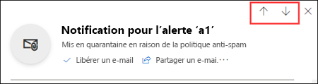
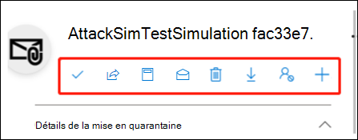

# Gérer les messages et fichiers mis en quarantaine en tant qu’administrateur dans Exchange Online PowerShell

[!INCLUDE [Microsoft 365 Defender rebranding](../includes/microsoft-defender-for-office.md)]

**S’applique à**
- [Exchange Online Protection](exchange-online-protection-overview.md)
- [Microsoft Defender pour Office 365 : offre 1 et offre 2](defender-for-office-365.md)
- [Microsoft 365 Defender](../defender/microsoft-365-defender.md)

Dans les organisations Microsoft 365 avec des boîtes aux lettres dans Exchange Online ou des organisations Exchange Online Protection (EOP) autonomes sans boîtes aux lettres Exchange Online, la quarantaine contient des messages potentiellement dangereux ou indésirables. Pour plus d’informations, voir [Messages électroniques mis en quarantaine dans EOP.](quarantine-email-messages.md)

Les administrateurs peuvent afficher, libérer et supprimer tous les types de messages mis en quarantaine pour tous les utilisateurs. Les administrateurs peuvent également signaler des faux positifs à Microsoft.

Par défaut, seuls les administrateurs peuvent gérer les messages mis en quarantaine en tant que programmes malveillants, hameçonnage à haut niveau de confiance ou suite à des règles de flux de messagerie (également appelées règles de transport). Toutefois, les  administrateurs peuvent utiliser des stratégies de mise en quarantaine pour définir ce que les utilisateurs sont autorisés à faire pour mettre en quarantaine les messages en fonction de la raison pour laquelle le message a été mis en quarantaine (pour les fonctionnalités prise en charge). Pour plus d’informations, voir [Stratégies de mise en quarantaine](quarantine-policies.md).

Les administrateurs des organisations avec Microsoft Defender pour Office 365 peuvent également gérer les fichiers mis en quarantaine par la mise en quarantaine par les pièces jointes Coffre pour [SharePoint, OneDrive](mdo-for-spo-odb-and-teams.md)et Microsoft Teams .

Vous affichez et gérez les messages mis en quarantaine dans le portail Microsoft 365 Defender ou dans PowerShell (Exchange Online PowerShell pour les organisations Microsoft 365 avec des boîtes aux lettres en Exchange Online ; EOP Autonome PowerShell pour les organisations sans Exchange Online boîtes aux lettres).

## Ce qu'il faut savoir avant de commencer

- Pour ouvrir le Portail Microsoft 365 Defender, accédez à <https://security.microsoft.com>. Pour aller directement à la page de mise **en** quarantaine, utilisez <https://security.microsoft.com/quarantine> .

- Pour vous connecter à Exchange Online PowerShell, voir [Connexion à Exchange Online PowerShell](/powershell/exchange/connect-to-exchange-online-powershell). Pour vous connecter à un service Exchange Online Protection PowerShell autonome, voir [Se connecter à Exchange Online Protection PowerShell](/powershell/exchange/connect-to-exchange-online-protection-powershell).

- Des autorisations doivent vous avoir été attribuées dans **Exchange Online** pour que vous puissiez effectuer les procédures décrites dans cet article :
  - Pour prendre des mesures sur les messages mis en quarantaine pour tous les  utilisateurs, vous devez être membre des groupes de rôles Gestion de l’organisation, Administrateur de la sécurité ou Administrateur de la mise en \* quarantaine. Pour envoyer des messages à Microsoft, vous devez être membre du groupe de rôles **Administrateur** de la sécurité.
  - Pour accéder en lecture seule aux messages mis en quarantaine pour  tous  les utilisateurs, vous devez être membre des groupes de rôles Lecteur global ou Lecteur de sécurité.

  Pour plus d'informations, voir [Permissions en échange en ligne](/exchange/permissions-exo/permissions-exo).

  **Remarques** :

  - L'ajout d'utilisateurs au rôle Azure Active Directory Domain Services correspondant dans le centre d'administration Microsoft 365 donne aux utilisateurs les autorisations _et_ autorisations requises pour d'autres fonctionnalités dans Microsoft 365. Pour plus d'informations, consultez [À propos des rôles d'administrateur](../../admin/add-users/about-admin-roles.md).
  - Le groupe de rôles **Gestion de l’organisation en affichage seul** dans [Exchange Online](/Exchange/permissions-exo/permissions-exo#role-groups) permet également d’accéder en lecture seule à la fonctionnalité.
  - \*Les membres  du groupe de rôles Administrateur de mise en quarantaine dans les rôles de collaboration e-mail **&** dans le portail [Microsoft 365 Defender](permissions-microsoft-365-security-center.md#email--collaboration-roles-in-the-microsoft-365-defender-portal) doivent également être membres du groupe de rôles Gestion de l’hygiène dans [Exchange Online](/Exchange/permissions-exo/permissions-exo#role-groups) pour mettre en quarantaine les procédures dans Exchange Online PowerShell. 

- Les messages mis en quarantaine sont conservés pendant une période par défaut en fonction de la raison pour laquelle ils ont été mis en quarantaine. Une fois la période de rétention expirée, les messages sont automatiquement supprimés et ne sont pas récupérables. Pour plus d’informations, voir Messages électroniques mis en quarantaine dans [EOP et Defender pour Offie 365](quarantine-email-messages.md).

## Utiliser le portail Microsoft 365 Defender pour gérer les messages électroniques mis en quarantaine

### Afficher les e-mails mis en quarantaine

1. In the Microsoft 365 Defender portal at <https://security.microsoft.com> , go to Email & **collaboration** \> **Review** \> **Quarantine**. Pour aller directement à la page de mise **en** quarantaine, utilisez <https://security.microsoft.com/quarantine> .

2. Dans la page **Quarantaine,** vérifiez que **l’onglet** Courrier est sélectionné.

3. Vous pouvez trier les résultats en cliquant sur un en-tête de colonne disponible. Cliquez sur **Personnaliser les colonnes** pour modifier les colonnes qui s'affichent. Les valeurs par défaut sont marquées d'un astérisque (\*) :

   - **Heure de réception**\*
   - **Sujet**\*
   - **Expéditeur**\*
   - **Raison de la quarantaine**\*
   - **Libérer le statut**\*
   - **Type de stratégie**\*
   - **Expire**\*
   - **Destinataire**
   - **ID de message**
   - **Nom de la stratégie**
   - **Taille du message**
   - **Direction du courrier**
   - **Balise de destinataire**

   Lorsque vous avez terminé, cliquez sur **Appliquer**.

4. Pour filtrer les résultats, cliquez sur **Filtrer**. Les filtres suivants sont disponibles dans le menu déroulant **Filtres** qui apparaît :
   - **ID du message** : l’identificateur global unique du message.

     Par exemple,  vous avez utilisé le suivi des messages pour rechercher un message qui a été envoyé à un utilisateur de votre organisation, et vous déterminez que le message a été mis en quarantaine au lieu d’être remis. Assurez-vous d’inclure la valeur complète de l’ID du message, qui peut inclure des crochets ( \<\> ). Par exemple : `<79239079-d95a-483a-aacf-e954f592a0f6@XYZPR00BM0200.contoso.com>`.

   - **Adresse de l’expéditeur**
   - **Adresse du destinataire**
   - **Sujet**
   - **Heure reçue** : Saisissez une **heure de début** et une **heure de fin** (date).
   - **Date d’expiration** : filtrer les messages par date d'expiration de la quarantaine :
     - **Aujourd’hui**
     - **Dans les 2 prochains jours**
     - **Dans les 7 prochains jours**
     - **Heure reçue** : Saisissez une **heure de début** et une **heure de fin** (date).
   - **Balise de destinataire**
   - **Raison de la mise en quarantaine :**
     -  **Règle de transport** (règle de flux de courrier)
     - **E-mail de masse**
     - **Courrier indésirable**
     - **Programmes** malveillants : stratégies anti-programme malveillant dans EOP ou Coffre pièces jointes dans Defender pour Office 365. La **valeur Type de** stratégie indique quelle fonctionnalité a été utilisée.
     - **Hameçonnage**: le verdict  de filtrage du courrier indésirable était le hameçonnage ou la protection anti-hameçonnage qui a mis en quarantaine le message ([paramètres](set-up-anti-phishing-policies.md#spoof-settings) d’usurpation d’identité ou [protection contre l’usurpation d’identité](set-up-anti-phishing-policies.
     - **Hameçonnage à haute fiabilité**
   - **Destinataire**: **tous les utilisateurs** ou **uniquement moi**. Les utilisateurs finaux peuvent uniquement gérer les messages mis en quarantaine qui leur sont envoyés.
   - **Statut de la version** : Une des valeurs suivantes :
     - **Révision requise.**
     - **Approuvé**
     - **Refusé**
     - **Publication demandée**
     - **Date de publication**
   - **Type de stratégie** : filtrer les messages par type de stratégie :
     - **Stratégie anti-programme malveillant**
     - **Stratégie de pièces jointes fiables**
     - **Politique de lutte contre l'hameçonnage**
     - **Stratégie anti-courrier indésirable**
     -  **Règle de transport** (règle de flux de courrier)

   Lorsque vous avez terminé, cliquez sur **Appliquer**. Pour effacer les filtres, cliquez sur  **Effacer les filtres**.

5. Utilisez la **zone de** recherche et une valeur correspondante pour rechercher des messages spécifiques. Les caractères génériques ne sont pas pris en charge. Vous pouvez effectuer une recherche sur les valeurs suivantes :
   - Adresse de messagerie de l’expéditeur
   - Objet. Utiliser l'intégralité du sujet du message La recherche n’est pas sensible à la casse.

   Après avoir saisi les critères de recherche, appuyez sur ENTRÉE pour filtrer les résultats.

Une fois le message spécifique mis en quarantaine trouvé, sélectionnez-le pour afficher des détails à son sujet et pour prendre des mesures (par exemple, afficher, déplacer, télécharger ou supprimer le message).

#### Afficher les détails des messages mis en quarantaine

Lorsque vous sélectionnez un message mis en quarantaine dans la liste, les informations suivantes sont disponibles dans le flyout de détails qui apparaît.

- **ID du message** : l’identificateur global unique pour le message. Disponible dans le **champ d’en-tête Message-ID** dans l’en-tête du message.
- **Adresse de l’expéditeur**
- **Reçu** : Date et heure de réception du message.
- **Subject**
- **Raison de la** mise en quarantaine : indique si un message a été identifié comme courrier **indésirable,** en **bloc,** **hameçonnage,** correspond à une règle de flux de messagerie ( règle de **transport**), ou a été identifié comme contenant un programme **malveillant**.
- **Type de stratégie**
- **Nom de la stratégie**
- **Nombre de destinataires**
- **Destinataires** : si le message contient plusieurs destinataires, vous devez cliquer sur **Prévisualiser le message** ou **Afficher l’en-tête du message** pour afficher la liste complète des destinataires.
- **Balise destinataire**: pour plus d’informations, voir [Balises utilisateur dans Microsoft Defender pour Office 365](user-tags.md).
- **Expires** : Date et heure auxquelles le message sera automatiquement et définitivement supprimé de la quarantaine.
- **Déplacé pour** : toutes les adresses e-mail (le cas échéant) auxquelles le message a été envoyé.
- **Pas encore déplacé pour** : toutes les adresses e-mail (le cas échéant) auxquelles le message n'a pas encore été envoyé.

Pour donner suite au message, consultez la section suivante.

> [!NOTE]
> Pour rester dans le menu déroulant des détails, mais changer le message en quarantaine que vous regardez, utilisez les flèches haut et bas en haut du menu déroulant.
>
> 

### Effectuer une action sur les messages mis en quarantaine

Après avoir sélectionné un message en quarantaine dans la liste, les actions suivantes sont disponibles dans le flyout des détails :

-  **Publier un e-mail**: dans le volet volant qui s’affiche, \* configurez les options suivantes :
  - **Ajouter un expéditeur à la** liste d’adresses de votre organisation : sélectionnez cette option pour empêcher la mise en quarantaine des messages provenant de l’expéditeur.
  - Sélectionnez l’une des options suivantes :
    - **Publication pour tous les destinataires**
    - **Libérer des destinataires spécifiques**: sélectionnez les destinataires dans la zone **Destinataires** qui s’affiche
  - **Envoyez une copie de ce message à d’autres destinataires**: sélectionnez cette option pour entrer les adresses de messagerie des destinataires dans la zone **Destinataires** qui s’affiche.

    > [!NOTE]
    > Pour envoyer une copie du message à d’autres destinataires, vous devez également libérer le message au moins l’un des destinataires d’origine (sélectionnez Release **to all recipients** or **Release to specific recipients**).

  - Envoyer le message à Microsoft pour améliorer la détection **(faux positif)**: cette option est sélectionnée par défaut et signale le message mis en quarantaine par erreur à Microsoft comme faux positif. Si le message a été mis en quarantaine en tant que courrier indésirable, en bloc, hameçonnage ou contenant un programme malveillant, le message est également signalé à l’équipe d’analyse du courrier indésirable de Microsoft. Selon les résultats de leur analyse, les règles de filtrage du courrier indésirable à l’échelle du service peuvent être ajustées pour autoriser le message.

  - **Autoriser les messages de** ce genre : cette option est désactivée par défaut  ). L’activer (activer) pour empêcher temporairement la mise en quarantaine des messages avec des URL, des pièces jointes et d’autres  propriétés similaires. Lorsque vous activer cette option, les options suivantes sont disponibles :
    - **Supprimer après**: sélectionnez la durée pendant combien de temps vous souhaitez autoriser des messages comme celui-ci. Sélectionnez **1 jour** **à 30 jours.** La valeur par défaut est 30.
    - **Remarque facultative**: entrez une description utile pour l’autoriser.

  Lorsque vous avez terminé, cliquez sur **Libérer le message.**

  Remarques sur la libération des messages :

  - Vous ne pouvez pas envoyer un message au même destinataire plusieurs fois.
  - Seuls les destinataires qui n’ont pas reçu le message apparaissent dans la liste des destinataires potentiels.
  - Seuls les membres du groupe de **rôles Administrateurs** de la sécurité peuvent voir et utiliser l’option Envoyer le message à Microsoft pour améliorer la détection **(faux positif)** et autoriser les **messages** comme ces options. 

-  **Partager un** e-mail : dans le volant qui s’affiche, ajoutez un ou plusieurs destinataires pour recevoir une copie du message. Lorsque vous avez terminé, cliquez sur **Partager.**

Les actions suivantes sont disponibles après avoir cliqué sur l'icône.  **Autres actions** :

-  **Afficher les en-têtes de message** : Sélectionnez ce lien pour voir le texte de l'en-tête du message. Le flyout de **l'en-tête de message** apparaît avec les liens suivants :
  - **Copier l'en-tête du message** : Cliquez sur ce lien pour copier l'en-tête du message (tous les champs d'en-tête) dans votre presse-papiers.
  - **Analyseur d'en-tête de message Microsoft Corporation** : Pour analyser en profondeur les champs et les valeurs de l'en-tête, cliquez sur ce lien pour accéder à l'analyseur d'en-tête de message. Collez l'en-tête du message dans la section **Insérez l'en-tête du message que vous souhaitez analyser** (CTRL+V ou cliquez avec le bouton droit de la souris et choisissez **Coller**), puis cliquez sur **Analyser les en-têtes**.

-  **Prévisualisation de message** : Dans le menu flottant qui apparaît, sélectionnez l'un des onglets suivants :
  - **Affichage Source** : affiche la version HTML du corps du message, dans laquelle tous les liens sont désactivés.
  - **Texte simple** : affiche le corps du message au format texte brut.

-  **Supprimer de la quarantaine**: une fois que vous avez cliqué sur **Oui** dans l’avertissement qui s’affiche, le message est immédiatement supprimé sans être envoyé aux destinataires d’origine.

-  **Télécharger l'e-mail** : Dans le menu flottant qui apparaît, sélectionnez **je comprends les risques liés au téléchargement de ce message**, puis cliquez sur **Télécharger** pour enregistrer une copie locale du message au format .eml.

-  **Bloquer l'expéditeur** : Ajouter l'expéditeur à la liste des expéditeurs bloqués dans **votre** boîte aux lettres. Pour plus d'informations, consultez [Bloquer un expéditeur du courrier](https://support.microsoft.com/office/b29fd867-cac9-40d8-aed1-659e06a706e4).

-  **Envoyer uniquement**: signale le message à Microsoft pour analyse. Dans le volant qui s’affiche, choisissez les options suivantes :
  - **Sélectionnez le type de soumission**: **e-mail** (par défaut), **URL** ou **fichier**.
  - **Ajoutez l’ID de message réseau ou téléchargez le fichier de courrier** électronique : sélectionnez l’une des options suivantes :
    - **Ajouter l’ID du message** réseau de messagerie (par défaut, avec la valeur correspondante dans la zone)
    - Télécharger le fichier de messagerie **(.msg** ou  eml) : cliquez sur Parcourir les fichiers pour rechercher et sélectionner le fichier de message .msg ou .eml à envoyer.
  - **Choisissez un destinataire qui a eu un problème**: sélectionnez un (de préférence) ou plusieurs destinataires d’origine du message pour analyser les stratégies qui leur ont été appliquées.
  - **Sélectionnez une raison pour l’envoi à Microsoft**: choisissez l’une des options suivantes :
    - **Ne doit pas avoir été bloqué (faux positif)** (valeur par défaut) : les options suivantes sont disponibles :
      - **Autoriser les messages de** ce genre : cette option est désactivée par défaut  ). L’activer (activer) pour empêcher temporairement la mise en quarantaine des messages avec des URL, des pièces jointes et d’autres  propriétés similaires. Lorsque vous activer cette option, les options suivantes sont disponibles :
        - **Supprimer après**: sélectionnez la durée pendant combien de temps vous souhaitez autoriser des messages comme celui-ci. Sélectionnez **1 jour** **à 30 jours.** La valeur par défaut est 30.
        - **Remarque facultative**: entrez une description utile pour l’autoriser.
    - **Doit avoir été bloqué (faux négatif).**

  Lorsque vous avez terminé, cliquez sur **Envoyer**.

\* Cette option n'est pas disponible pour les messages qui ont déjà été validés (la **valeur du statut** Validé est **publiée**).

Si vous ne libérez pas ou ne supprimez pas le message, il sera supprimé après l'expiration de la période de conservation en quarantaine par défaut (comme indiqué dans la **colonne Expiration**).

> [!NOTE]
> Sur un appareil mobile, le texte de description n'est pas disponible sur les icônes d'action.
>
> 
>
> Les icônes dans l'ordre et leurs descriptions correspondantes sont résumées dans le tableau suivant :
>
> |Icône|Description|
> |---:|---|
> ||**Version d’e-mail**|
> ||**Partager des e-mails**|
> ||**Afficher les en-têtes de messages**|
> ||**Afficher une prévisualisation du message**|
> ||**Supprimer de la quarantaine**|
> ||**Télécharger le courrier électronique**|
> ||**Bloquer l’expéditeur**|
> ||**Envoyer uniquement**|

#### Effectuer une action sur plusieurs courriers électroniques mis en quarantaine

Lorsque vous sélectionnez plusieurs messages mis en quarantaine dans la liste (jusqu'à 100) en cliquant dans la zone vide à gauche de la première colonne, la liste déroulante **Actions en vrac** s'affiche et vous permet d'effectuer les actions suivantes :

-  **Messages de** libération : libère les messages à tous les destinataires. Dans le volant qui s’affiche, vous pouvez choisir les options suivantes, qui sont les mêmes que lorsque vous publiez un seul message :
  - **Ajouter un expéditeur à la liste d’adresses de votre organisation**
  - **Envoyer une copie de ce message à d’autres destinataires**
  - **Envoyer le message à Microsoft pour améliorer la détection (faux positif)**
  - **Autorisez les messages comme ceci**:
    - **Supprimer après**: **1 jour** **à 30 jours**
    - **Note facultative**

  Lorsque vous avez terminé, cliquez sur **Libérer le message.**

  > [!NOTE]
  > Envisagez le scénario suivant : john@gmail.com envoie un message à faith@contoso.com et john@subsidiary.contoso.com. Gmail bifurcate ce message en deux copies qui sont toutes deux acheminées vers la quarantaine en tant que hameçonnage dans Microsoft. Un administrateur publie ces deux messages admin@contoso.com. Le premier message publié qui atteint la boîte aux lettres d’administration est remis. Le deuxième message publié est identifié comme remise en double et est ignoré. Les messages sont identifiés comme doublons s’ils ont le même ID de message et le même temps de réception.

-  **Supprimer des messages**: une fois que vous avez cliqué sur **Oui** dans l’avertissement qui s’affiche, les messages sont immédiatement supprimés de la quarantaine sans être envoyés aux destinataires d’origine.
-  **Télécharger des messages**
-  **Envoyer uniquement**

## Utilisez le portail Microsoft 365 Defender pour gérer les fichiers mis en quarantaine dans Defender pour Office 365

> [!NOTE]
> Les procédures pour les fichiers mis en quarantaine dans cette section sont disponibles uniquement pour Microsoft Defender pour les abonnés Office 365 Plan 1 ou Plan 2.

Dans les organisations avec Defender pour Office 365, les administrateurs peuvent gérer les fichiers mis en quarantaine par les pièces jointes Coffre pour SharePoint, OneDrive et Microsoft Teams. Pour activer la protection de ces fichiers, voir [Activer Coffre pièces jointes](turn-on-mdo-for-spo-odb-and-teams.md)pour SharePoint, OneDrive et Microsoft Teams .

### Afficher les fichiers mis en quarantaine

1. In the Microsoft 365 Defender portal at <https://security.microsoft.com> , go to Email & **collaboration** \> **Review** \> **Quarantine**. Pour aller directement à la page de mise **en** quarantaine, utilisez <https://security.microsoft.com/quarantine> .

2. Dans la page **Quarantaine,** sélectionnez **l’onglet Fichiers** **(l’e-mail** est l’onglet par défaut).

3. Vous pouvez trier les résultats en cliquant sur un en-tête de colonne disponible. Cliquez **sur Personnaliser les colonnes** pour modifier les colonnes affichées. Les colonnes par défaut sont marquées d’un astérisque ( \* :
   - **Utilisateur**\*
   - **Emplacement**\*
   - **Attachment filename**\*
   - **URL du fichier**\*
   - **Taille du fichier**
   - **Libérer le statut**\*
   - **Expire**\*
   - **Détecté par**
   - **Modifié par heure**

   Lorsque vous avez terminé, cliquez sur **Appliquer** ou **Annuler.**

4. Pour filtrer les résultats, cliquez sur **Filtrer**. Les filtres suivants sont disponibles dans le menu déroulant **Filtres** qui apparaît :
   - **Heure reçue**: **heure de début** et heure de **fin** (date).
   - **Expire :** heure **de début** et heure **de fin** (date).
   - **Raison de la mise** en quarantaine : la seule valeur disponible est **Programme malveillant.**
   - **Type de stratégie**

   Lorsque vous avez terminé, cliquez sur **Appliquer** ou **Annuler.**

Une fois que vous avez trouvé un fichier spécifique mis en quarantaine, sélectionnez-le pour afficher les détails à son sujet et pour agir dessus (par exemple, afficher, libérer, télécharger ou supprimer le fichier).

#### Afficher les détails du fichier mis en quarantaine

Lorsque vous sélectionnez un fichier en quarantaine dans la liste, les informations suivantes sont disponibles dans le volant de détails qui s’ouvre :

- **Nom de fichier**
- **URL du** fichier : URL qui définit l’emplacement du fichier (par exemple, dans SharePoint Online).
- **Contenu malveillant détecté sur** Date/heure de mise en quarantaine du fichier.
- **Expire :** date à laquelle le fichier sera supprimé de la quarantaine.
- **Détecté par**
- **Publication ?**
- **Nom du programme malveillant**
- **ID de document**: identificateur unique du document.
- **Taille du** fichier : en kilo-octets (Ko).
- **Organisation** ID unique de votre organisation.
- **Dernière modification**
- **Modifié par**: l’utilisateur qui a modifié le fichier en dernier.
- **Valeur SHA-256 bits (Secure Hash Algorithm)**: vous pouvez utiliser cette valeur de hachage pour identifier le fichier dans d’autres magasins de réputation ou à d’autres emplacements de votre environnement.

Pour prendre des mesures sur le fichier, consultez la section suivante.

> [!NOTE]
> Pour rester dans le volant des détails, mais modifier le fichier mis en quarantaine que vous regardez, utilisez les flèches haut et bas en haut du volant.
>
> 

### Prendre des mesures sur les fichiers mis en quarantaine

Une fois que vous avez sélectionné un fichier mis en quarantaine dans la liste, les actions suivantes sont disponibles dans le volant de détails :

-  **Fichier de publication**: dans le volet volant qui s’affiche, activer ou désactiver les fichiers de rapport à Microsoft pour analyse, puis cliquez sur \* **Libérer.** 
- 
-  **Fichier de téléchargement**: dans le volant qui s’affiche, sélectionnez  Je comprends les risques liés au téléchargement de ce **fichier,** puis cliquez sur Télécharger pour enregistrer une copie locale du fichier.
-  **Supprimer de la quarantaine**: une fois que vous avez cliqué sur **Oui** dans l’avertissement qui s’affiche, le fichier est immédiatement supprimé.
-  **Bloquer l'expéditeur** : Ajouter l'expéditeur à la liste des expéditeurs bloqués dans **votre** boîte aux lettres. Pour plus d'informations, consultez [Bloquer un expéditeur du courrier](https://support.microsoft.com/office/b29fd867-cac9-40d8-aed1-659e06a706e4).

\* Cette option n’est pas disponible pour les fichiers qui ont déjà été publiés (la valeur d’état **Released** est **Released**).

Si vous ne relâchez pas ou ne supprimez pas le fichier, il sera supprimé à l’expiration de la période de rétention de mise en quarantaine par défaut (comme indiqué dans la **colonne Expires).**

#### Prendre des mesures sur plusieurs fichiers mis en quarantaine

Lorsque vous sélectionnez plusieurs fichiers mis en quarantaine dans la liste (jusqu’à 100) en cliquant dans la zone vierge à gauche de la colonne Objet, la liste de listes de listes des **actions** en bloc s’affiche où vous pouvez prendre les mesures suivantes : 

-  **Fichier de publication**: dans le volet volant qui s’affiche, activer ou désactiver les fichiers de rapport à **Microsoft** pour analyse, puis cliquez sur **Libérer.**
-  **Supprimer de la quarantaine**: une fois que vous avez cliqué sur **Oui** dans l’avertissement qui s’affiche, le fichier est immédiatement supprimé.
-  **Fichier de téléchargement**: dans le volant qui s’affiche, sélectionnez  Je comprends les risques liés au téléchargement de ce **fichier,** puis cliquez sur Télécharger pour enregistrer une copie locale du fichier.

## Utiliser Exchange Online PowerShell ou EOP PowerShell autonome pour afficher et gérer les messages et fichiers mis en quarantaine

Les cmdlets que vous utilisez pour afficher et gérer les messages et les fichiers en quarantaine sont décrites dans la liste suivante :

- [Delete-QuarantineMessage](/powershell/module/exchange/delete-quarantinemessage)
- [Export-QuarantineMessage](/powershell/module/exchange/export-quarantinemessage)
- [Get-QuarantineMessage](/powershell/module/exchange/get-quarantinemessage)
- [Preview-QuarantineMessage](/powershell/module/exchange/preview-quarantinemessage): notez que cette cmdlet est uniquement pour les messages, et non pour les fichiers mis en quarantaine à partir de Coffre Attachments for SharePoint, OneDrive et Microsoft Teams.
- [Release-QuarantineMessage](/powershell/module/exchange/release-quarantinemessage)

## Pour plus d'informations

[FAQ sur les messages mis en quarantaine](quarantine-faq.yml)
