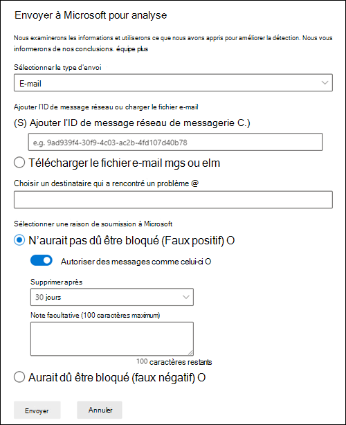
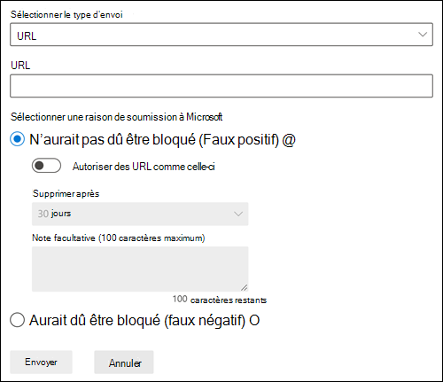
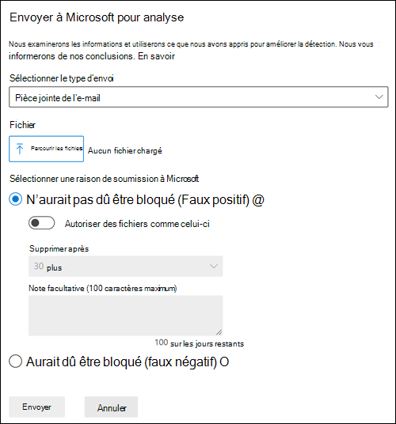

# <a name="add-allows-in-the-tenant-allowblock-list"></a>Ajouter des autorisations dans la liste verte/rouge du client

[!INCLUDE [Microsoft 365 Defender rebranding](../includes/microsoft-defender-for-office.md)]

**S’applique à**
- [Exchange Online Protection](exchange-online-protection-overview.md)
- [Microsoft Defender pour Office 365 : offre 1 et offre 2](defender-for-office-365.md)
- [Microsoft 365 Defender](../defender/microsoft-365-defender.md)

Les administrateurs ne peuvent pas ajouter d’autorisations directement à la liste d’autorisation/de blocage du locataire. Au lieu de cela, vous utilisez le processus de soumission de l’administrateur pour envoyer le message qui a été bloqué afin que l’URL, le fichier et/ou les expéditeurs correspondants soient ajoutés à la liste d’autorisations/de blocs du locataire. Si aucun bloc du fichier, de l’URL ou de l’expéditeur ne s’est produit, l’autorisation n’est pas créée. Dans la plupart des cas où le message a été déterminé comme un faux positif qui a été bloqué de manière incorrecte, les autorisations sont conservées aussi longtemps que nécessaire pour donner au système le temps de les autoriser naturellement.

> [!IMPORTANT]
> Étant donné que Microsoft gère les autorisations pour vous, l’expéditeur, l’URL ou les autorisations de fichier qui ne sont pas nécessaires ou considérées comme incorrectes seront supprimées. Il s’agit de protéger votre environnement et d’éviter une configuration incorrecte des autorisations. Dans les cas où vous n’êtes pas d’accord, un cas de support peut être nécessaire pour vous aider à déterminer pourquoi un message est toujours considéré comme incorrect.

## <a name="add-sender-allows-using-the-submissions-portal"></a>Ajouter un expéditeur permet d’utiliser le portail Soumissions

Autorisez les expéditeurs (ou domaines) sur la page **Soumissions** dans Microsoft 365 Defender.

1. Dans le portail Microsoft 365 Defender, <https://security.microsoft.com>accédez à **Actions & soumissions** \> **soumissions**. Ou, pour accéder directement à la page **Soumissions** , utilisez <https://security.microsoft.com/reportsubmission>.

2. Dans la page **Soumissions** , vérifiez que l’onglet **e-mails** est sélectionné, puis cliquez sur  **Envoyer à Microsoft pour analyse**.

3. Utilisez le menu volant **Envoyer à Microsoft pour passer en revue** l’envoi d’un message en ajoutant l’ID de message réseau ou en chargeant le fichier e-mail.

4. Dans la section **Sélectionner une raison pour l’envoi à Microsoft**, sélectionnez **Ne doit pas avoir été bloquée (faux positif).**

5. Activez **Autoriser les messages comme cette** option.

6. Dans la liste **déroulante Supprimer après** la liste déroulante, spécifiez la durée pendant laquelle vous souhaitez que l’option d’autorisation fonctionne.

7. Lorsque vous avez terminé, cliquez sur le bouton **Envoyer** .

> 

## <a name="add-url-allows-using-the-submissions-portal"></a>Ajouter une URL permet d’utiliser le portail Soumissions

Autorisez les URL sur la page **Soumissions** dans Microsoft 365 Defender.

1. Dans le portail Microsoft 365 Defender, <https://security.microsoft.com>accédez à **Actions & soumissions** \> **soumissions**. Ou, pour accéder directement à la page **Soumissions** , utilisez <https://security.microsoft.com/reportsubmission>.

2. Dans la page **Soumissions** , sélectionnez l’onglet **URL** , puis cliquez sur  **Envoyer à Microsoft pour analyse**.

3. Utilisez le menu volant **Envoyer à Microsoft pour passer en revue** l’envoi d’un message en ajoutant l’URL.

4. Dans la section **Sélectionner une raison pour l’envoi à Microsoft**, sélectionnez **Ne doit pas avoir été bloquée (faux positif).**

5. Activez les **URL Allow comme celle-ci** .

6. Dans la liste **déroulante Supprimer après** la liste déroulante, spécifiez la durée pendant laquelle vous souhaitez que l’option d’autorisation fonctionne.

7. Lorsque vous avez terminé, cliquez sur le bouton **Envoyer** .

> [!div class="mx-imgBorder"]
> 

## <a name="add-file-allows-using-the-submissions-portal"></a>Ajouter un fichier permet d’utiliser le portail Soumissions

Autoriser les fichiers sur la page **Soumissions** dans Microsoft 365 Defender.

1. Dans le portail Microsoft 365 Defender, <https://security.microsoft.com>accédez à **Actions & soumissions** \> **soumissions**. Ou, pour accéder directement à la page **Soumissions** , utilisez <https://security.microsoft.com/reportsubmission>.

2. Dans la page **Soumissions** , sélectionnez l’onglet **Pièces jointes de l’e-mail** , puis cliquez sur  **Envoyer à Microsoft pour analyse**.

3. Utilisez le menu volant **Envoyer à Microsoft pour passer en revue** l’envoi d’un message en ajoutant le fichier ou les fichiers.

4. Dans la section **Sélectionner une raison pour l’envoi à Microsoft**, sélectionnez **Ne doit pas avoir été bloquée (faux positif).**

5. Activez les **fichiers Autoriser comme cette** option.

6. Dans la liste **déroulante Supprimer après** la liste déroulante, spécifiez la durée pendant laquelle vous souhaitez que l’option d’autorisation fonctionne.

7. Lorsque vous avez terminé, cliquez sur le bouton **Envoyer** .

> [!div class="mx-imgBorder"]
> 

## <a name="create-spoofed-sender-allow-entries-using-microsoft-365-defender"></a>Créer des entrées d’autorisation d’expéditeur usurpées à l’aide de Microsoft 365 Defender

> [!NOTE]
>
> - Seule la _combinaison_ de l’utilisateur usurpé _et_ de l’infrastructure d’envoi définie dans la paire de domaines est spécifiquement autorisée ou bloquée pour l’usurpation d’identité.
> - Lorsque vous configurez une entrée d’autorisation ou de blocage pour une paire de domaines, les messages de cette paire de domaines n’apparaissent plus dans l’insight d’intelligence de l’usurpation d’identité.
> - Les entrées des expéditeurs usurpés n’expirent jamais.
> - L’usurpation d’identité prend en charge l’autorisation et le blocage. L’URL prend uniquement en charge l’autorisation.

1. Dans le portail Microsoft 365 Defender, <https://security.microsoft.com>accédez à **Email & collaboration** \> **Policies & rules** \> **Threat policies** \> **Tenant Allow/Block Lists** dans la section **Règles**. Ou, pour accéder directement à la page **Autoriser/Bloquer les listes de locataires** , utilisez <https://security.microsoft.com/tenantAllowBlockList>.

2. Dans la page **Autoriser/Bloquer la liste des locataires** , sélectionnez l’onglet **Usurpation d’identité** , puis cliquez sur  **Ajouter**.

3. Dans le menu volant **Ajouter de nouvelles paires de domaines** qui s’affiche, configurez les paramètres suivants :
   - **Ajoutez de nouvelles paires de domaines avec des caractères génériques** : entrez une paire de domaines par ligne, jusqu’à un maximum de 20. Pour plus d’informations sur la syntaxe des entrées d’expéditeur usurpées, consultez [Gérer la liste d’autorisation/de blocage du locataire](tenant-allow-block-list.md).
   - **Type d’usurpation** d’identité : sélectionnez l’une des valeurs suivantes :
     - **Interne** : l’expéditeur usurpé se trouve dans un domaine qui appartient à votre organisation ( [un domaine accepté](/exchange/mail-flow-best-practices/manage-accepted-domains/manage-accepted-domains)).
     - **Externe** : l’expéditeur usurpé se trouve dans un domaine externe.
   - **Action** : sélectionnez **Autoriser** ou **Bloquer**.

4. Lorsque vous avez terminé, cliquez sur **Ajouter**.

## <a name="add-spoofed-sender-allow-entries-using-powershell"></a>Ajouter des entrées d’autorisation d’expéditeur usurpées à l’aide de PowerShell

Pour ajouter des entrées d’expéditeur usurpées dans la liste d’autorisation/de blocage du locataire dans [Exchange Online PowerShell](/exchange/connect-to-exchange-online-powershell), utilisez la syntaxe suivante :

```powershell
New-TenantAllowBlockListSpoofItems -SpoofedUser <Domain | EmailAddress | *> -SendingInfrastructure <Domain | IPAddress/24> -SpoofType <External | Internal> -Action <Allow | Block>
```

Pour obtenir des informations détaillées sur la syntaxe et les [paramètres, consultez New-TenantAllowBlockListSpoofItems](/powershell/module/exchange/new-tenantallowblocklistspoofitems).

## <a name="related-articles"></a>Articles connexes

- [Envois par l’administrateur](admin-submission.md)
- [Signaler les faux positifs et les faux négatifs](report-false-positives-and-false-negatives.md)
