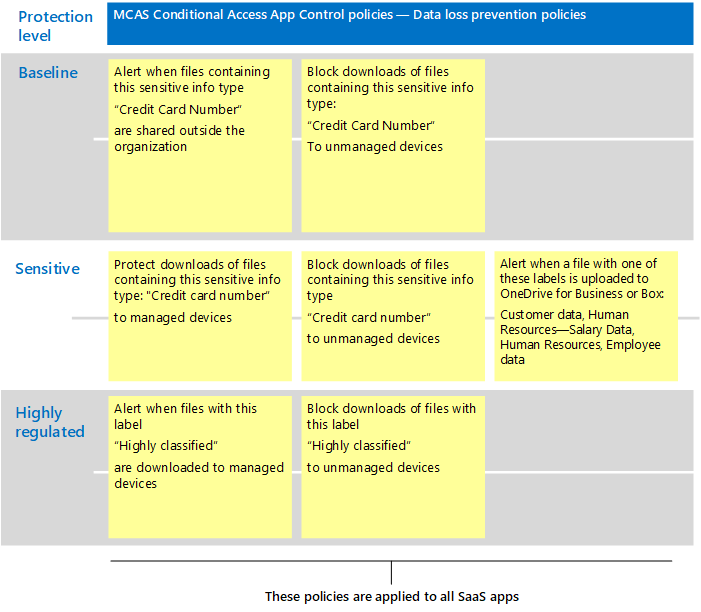

# Stratégies Microsoft Cloud App Security recommandées pour les applications SaaS
Microsoft Cloud App Security s’appuie sur les stratégies d’accès conditionnel Azure AD pour permettre la surveillance et le contrôle en temps réel des actions granulaires avec les applications SaaS, telles que le blocage des téléchargements, des téléchargements, des copier-coller et de l’impression. Cette fonctionnalité ajoute la sécurité aux sessions qui présentent des risques inhérents, par exemple lorsque des ressources d’entreprise sont accessibles à partir d’appareils nonmanagés ou par des utilisateurs invités.

Microsoft Cloud App Security s’intègre également en mode natif à La Protection des informations Microsoft, en fournissant une inspection du contenu en temps réel pour rechercher des données sensibles basées sur des types d’informations sensibles et des étiquettes de sensibilité et prendre les mesures appropriées.

Ces conseils incluent des recommandations pour ces scénarios :

- Faire entrer les applications SaaS dans la gestion des applications it
- Régler la protection pour des applications SaaS spécifiques
- Configurer la protection contre la perte de données (DLP) pour vous conformer aux réglementations en matière de protection des données

## Faire entrer les applications SaaS dans la gestion des applications it

La première étape de l’utilisation de Microsoft Cloud App Security pour gérer les applications SaaS consiste à les découvrir, puis à les ajouter à votre client Azure AD. Si vous avez besoin d’aide pour la découverte, [consultez Découvrir et gérer les applications SaaS dans votre réseau.](/cloud-app-security/tutorial-shadow-it) Une fois que vous avez découvert les applications, [ajoutez-les à votre client Azure AD.](/azure/active-directory/manage-apps/add-application-portal)

Vous pouvez commencer à les gérer en suivant les mesures suivantes :

1. Tout d’abord, dans Azure AD, créez une stratégie d’accès conditionnel et configurez-la pour « Utiliser le contrôle d’application d’accès conditionnel ». Cela redirige la demande vers Cloud App Security. Vous pouvez créer une stratégie et ajouter toutes les applications SaaS à cette stratégie.
1. Ensuite, dans Cloud App Security, créez des stratégies de session. Créez une stratégie pour chaque contrôle que vous souhaitez appliquer.

Les autorisations d’accès aux applications SaaS sont généralement basées sur les besoins de l’entreprise pour accéder à l’application. Ces autorisations peuvent être très dynamiques. L’utilisation des stratégies Cloud App Security garantit la protection des données d’application, que les utilisateurs soient affectés à un groupe Azure AD associé à la protection de référence, sensible ou hautement réglementée.

Pour protéger les données au sein de votre collection d’applications SaaS, le diagramme suivant illustre la stratégie d’accès conditionnel Azure AD nécessaire, ainsi que les stratégies suggérées que vous pouvez créer dans Cloud App Security. Dans cet exemple, les stratégies créées dans Cloud App Security s’appliquent à toutes les applications SaaS que vous gérez. Ces contrôles sont conçus pour appliquer les contrôles appropriés selon que les appareils sont gérés, ainsi que les étiquettes de niveau de sensibilité qui sont déjà appliquées aux fichiers.

Le tableau suivant répertorie la nouvelle stratégie d’accès conditionnel que vous devez créer dans Azure AD.

|Niveau de protection|Stratégie|Plus d’informations|
|---|---|---|
|Tous les niveaux de protection|[Utiliser le contrôle d’application d’accès conditionnel dans Cloud App Security](/cloud-app-security/proxy-deployment-aad#configure-integration-with-azure-ad)|Cela configure votre IdP (Azure AD) pour qu’il fonctionne avec Cloud App Security.|
||||

Le tableau suivant répertorie les exemples de stratégies illustrées ci-dessus que vous pouvez créer pour protéger toutes les applications SaaS. N’oubliez pas d’évaluer vos propres objectifs d’entreprise, de sécurité et de conformité, puis de créer des stratégies qui fournissent la protection la plus appropriée pour votre environnement.

|Niveau de protection|Stratégie|
|---|---|
|Baseline|Surveiller le trafic provenant d’appareils non utilisés 
 Ajouter une protection aux téléchargements de fichiers à partir d’appareils nonmanagés|
|Sensible|Bloquer le téléchargement de fichiers étiquetés avec des données sensibles ou classifiées à partir d’appareils non utilisés (cela permet d’accéder uniquement au navigateur)|
|Hautement réglementé|Bloquer le téléchargement des fichiers étiquetés avec classés à partir de tous les appareils (cela permet d’accéder uniquement au navigateur)|
|||

Pour obtenir des instructions de bout en bout sur la configuration du contrôle d’application d’accès conditionnel, voir [Deploy Conditional Access App Control for featured apps](/cloud-app-security/proxy-deployment-aad). Cet article vous explique tout au long du processus de création de la stratégie d’accès conditionnel nécessaire dans Azure AD et de test de vos applications SaaS.

Pour plus d’informations, voir [Protéger les applications avec microsoft Cloud App Security Conditional Access App Control](/cloud-app-security/proxy-intro-aad).

## Régler la protection pour des applications SaaS spécifiques

Vous pouvez appliquer une surveillance et des contrôles supplémentaires à des applications SaaS spécifiques dans votre environnement. Cloud App Security vous permet d’effectuer cette tâche. Par exemple, si une application telle que Box est très utilisée dans votre environnement, il est logique d’appliquer des contrôles supplémentaires. Ou, si votre service juridique ou financier utilise une application SaaS spécifique pour les données métiers sensibles, vous pouvez cibler une protection supplémentaire pour ces applications.

Par exemple, vous pouvez protéger votre environnement Box avec les types de modèles de stratégie de détection des anomalies intégrés :

- Activité provenant d’adresses IP anonymes
- Activité provenant d’un pays peu fréquent
- Activité provenant d’adresses IP suspectes
- Temps de trajet impossible
- Activité effectuée par l’utilisateur terminé (nécessite AAD comme IdP)
- Détection des logiciels malveillants
- Plusieurs tentatives de connexion infructueuses
- Activité de rançongiciel
- Application Oauth risquée
- Activité de partage de fichiers inhabituelle

Voici quelques exemples. Des modèles de stratégie supplémentaires sont ajoutés régulièrement. Pour obtenir des exemples d’application d’une protection supplémentaire à des applications spécifiques, voir [Protection des applications connectées.](/cloud-app-security/protect-connected-apps)

[La façon dont Cloud App Security contribue](/cloud-app-security/protect-box) à protéger votre environnement Box illustre les types de contrôles qui peuvent vous aider à protéger vos données métiers dans Box et d’autres applications avec des données sensibles.

## Configurer la protection contre la perte de données (DLP) pour vous conformer aux réglementations en matière de protection des données

Cloud App Security peut être un outil précieux pour configurer la protection des réglementations de conformité. Dans ce cas, vous créez des stratégies spécifiques pour rechercher des données spécifiques qu’une réglementation applique et vous configurez chaque stratégie pour prendre les mesures appropriées.

L’illustration et le tableau suivants fournissent plusieurs exemples de stratégies qui peuvent être configurées pour vous aider à respecter le Règlement général sur la protection des données (R GDPR). Dans ces exemples, les stratégies recherchent des données spécifiques. En fonction de la sensibilité des données, chaque stratégie est configurée pour prendre les mesures appropriées.

|Niveau de protection|Exemples de stratégies|
|---|---|
|Baseline|Alerte lorsque les fichiers contenant ce type d’informations sensibles (« Numéro de carte de crédit ») sont partagés à l’extérieur de l’organisation 
 >bloquer les téléchargements de fichiers contenant ce type d’informations sensibles (« numéro de carte de crédit ») sur les appareils non utilisés|
|Sensible|Protéger les téléchargements de fichiers contenant ce type d’informations sensibles (« Numéro de carte de crédit ») sur les appareils gérés 
 Bloquer les téléchargements de fichiers contenant ce type d’informations sensibles (« Numéro de carte de crédit ») sur les appareils non utilisés 
 Alerte lorsqu’un fichier avec l’une de ces étiquettes est téléchargé vers OneDrive Entreprise ou Box (données client, ressources humaines : données sur le salaire, ressources humaines, données sur les employés)|
|Hautement réglementé|Alerte lorsque les fichiers avec cette étiquette (« Hautement classé ») sont téléchargés sur les appareils gérés 
 Bloquer les téléchargements de fichiers avec cette étiquette (« Hautement classé ») sur les appareils nonmanagés|
|||

## Étapes suivantes

Pour plus d’informations sur l’utilisation de Cloud App Security, voir [la documentation microsoft Cloud App Security.](//cloud-app-security/)
