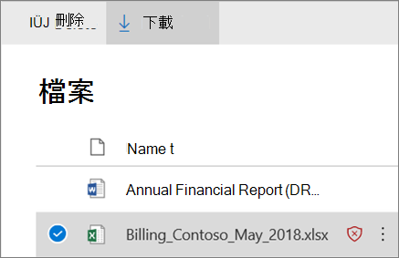

# Pièces jointes sécurisées pour SharePoint, OneDrive et Microsoft Teams

[!INCLUDE [Microsoft 365 Defender rebranding](../includes/microsoft-defender-for-office.md)]

**S’applique à**
- [Microsoft Defender pour Office 365 : offre 1 et offre 2](defender-for-office-365.md)
- [Microsoft 365 Defender](../defender/microsoft-365-defender.md)

Coffre Les pièces jointes pour SharePoint, OneDrive et Microsoft Teams dans [Microsoft Defender pour Office 365](whats-new-in-defender-for-office-365.md) fournissent une couche supplémentaire de protection pour les fichiers qui ont déjà été analysés de manière asynchrone par le moteur de détection de virus courant dans [Microsoft 365](virus-detection-in-spo.md). Coffre Les pièces jointes pour SharePoint, OneDrive et Microsoft Teams permettent de détecter et de bloquer les fichiers existants identifiés comme malveillants dans les sites d’équipe et les bibliothèques de documents.

Coffre Les pièces jointes SharePoint, OneDrive et Microsoft Teams ne sont pas activées par défaut. Pour l’activer, voir [Activer Coffre pièces jointes](turn-on-mdo-for-spo-odb-and-teams.md)pour SharePoint, OneDrive et Microsoft Teams .

## Fonctionnement Coffre pièces jointes SharePoint, OneDrive et Microsoft Teams pièces jointes

Lorsque Coffre pièces jointes pour SharePoint, OneDrive et Microsoft Teams est activée et identifie un fichier comme malveillant, le fichier est verrouillé à l’aide de l’intégration directe avec les magasins de fichiers. L’image suivante illustre un exemple de fichier malveillant détecté dans une bibliothèque.

Bien que le fichier bloqué soit toujours répertorié dans la bibliothèque de documents et dans les applications web, mobiles ou de bureau, les utilisateurs ne peuvent pas ouvrir, copier, déplacer ou partager le fichier. Toutefois, ils peuvent supprimer le fichier bloqué.

Voici un exemple de ce à quoi ressemble un fichier bloqué sur un appareil mobile :

Par défaut, les personnes peuvent télécharger un fichier bloqué. Voici à quoi ressemble le téléchargement d’un fichier bloqué sur un appareil mobile :

SharePoint Les administrateurs en ligne peuvent empêcher les utilisateurs de télécharger des fichiers malveillants. Pour obtenir des instructions, voir Utiliser SharePoint Online PowerShell pour empêcher les utilisateurs de [télécharger des fichiers malveillants.](turn-on-mdo-for-spo-odb-and-teams.md#step-2-recommended-use-sharepoint-online-powershell-to-prevent-users-from-downloading-malicious-files)

Pour en savoir plus sur l’expérience utilisateur lorsqu’un fichier a été détecté comme malveillant, voir comment faire lorsqu’un fichier malveillant est trouvé dans [SharePoint Online, OneDrive](https://support.microsoft.com/office/01e902ad-a903-4e0f-b093-1e1ac0c37ad2)ou Microsoft Teams .

## Afficher des informations sur les fichiers malveillants détectés par Coffre pièces jointes pour SharePoint, OneDrive et Microsoft Teams

Les fichiers identifiés comme malveillants par les pièces jointes Coffre pour SharePoint, OneDrive et Microsoft Teams s’afficheront dans les rapports de [Microsoft Defender](view-reports-for-mdo.md) pour Office 365 et dans l’Explorateur (et les détections en temps [réel).](threat-explorer.md)

Lorsqu’un fichier est identifié comme malveillant par des pièces jointes Coffre pour SharePoint, OneDrive et Microsoft Teams, le fichier est également disponible en quarantaine, mais uniquement pour les administrateurs. Pour plus d’informations, [voir Gérer les fichiers mis en quarantaine dans Defender pour Office 365](manage-quarantined-messages-and-files.md#use-the-microsoft-365-defender-portal-to-manage-quarantined-files-in-defender-for-office-365).

## Gardez ces points à l’esprit

- Defender for Office 365 analysera pas chaque fichier dans SharePoint Online, OneDrive Entreprise ou Microsoft Teams. Ce comportement est voulu par la conception même du produit. Les fichiers sont analysés de manière asynchrone. Le processus utilise les événements de partage et d’activité invité, ainsi que les signaux heuristiques intelligents et les signaux de menace pour identifier les fichiers malveillants.

- Assurez-vous que SharePoint sites sont configurés pour utiliser [l’expérience moderne.](/sharepoint/guide-to-sharepoint-modern-experience) Defender pour Office 365 protection s’applique que l’expérience moderne ou l’affichage classique soit utilisé ; toutefois, les indicateurs visuels qui montrent qu’un fichier est bloqué sont disponibles uniquement dans l’expérience moderne.

- Coffre Les pièces jointes pour SharePoint, OneDrive et Microsoft Teams font partie de la stratégie globale de protection contre les menaces de votre organisation, qui inclut la protection contre le courrier indésirable et les programmes malveillants dans Exchange Online Protection (EOP), ainsi que les liens Coffre et les pièces jointes Coffre dans Microsoft Defender pour Office 365. Pour en savoir plus, consultez La protection contre [les menaces dans Office 365](protect-against-threats.md).
