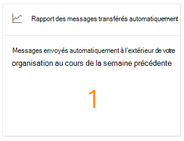
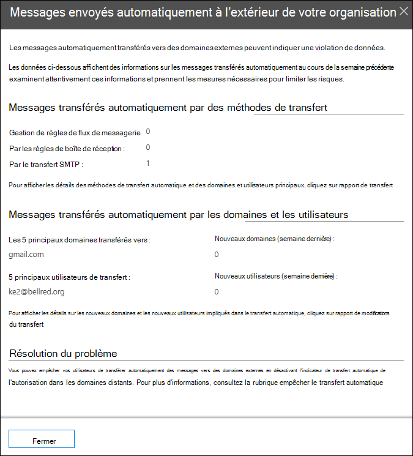

# Informations sur les messages transmis automatiquement dans le Centre de sécurité & conformité

[!INCLUDE [Microsoft 365 Defender rebranding](../includes/microsoft-defender-for-office.md)]

**S’applique à**
- [Exchange Online Protection](exchange-online-protection-overview.md)
- [Microsoft Defender pour Office 365 : offre 1 et offre 2](defender-for-office-365.md)
- [Microsoft 365 Defender](../defender/microsoft-365-defender.md)

Les informations sur les **messages** transmis automatiquement dans le  tableau de bord de flux de messagerie dans le Centre de sécurité [et conformité &](https://protection.office.com) affichent des informations sur les messages qui sont automatiquement transmis de votre organisation à des destinataires dans des domaines externes.

## Détails des messages transmis automatiquement

Lorsque vous cliquez sur le nombre de messages dans le widget, un volet volant s’affiche, qui affiche plus d’informations sur les messages transmis automatiquement :

- **Les messages transmis automatiquement par le système de forwarding** :

  - **Par règles de flux de messagerie**
  - **Par règles de boîte de réception**
  - **Par le forwarding SMTP** : cette méthode indique le forwarding automatique que les administrateurs peuvent configurer sur une boîte aux lettres comme décrit dans Configurer le forwarding de courrier pour [une boîte aux lettres](/Exchange/recipients-in-exchange-online/manage-user-mailboxes/configure-email-forwarding).
  - Lien vers le rapport [de report pour](view-mail-flow-reports.md#forwarding-report) plus d’informations.

- **Messages transmis automatiquement par des domaines et des utilisateurs** :

  - **5 principaux domaines vers**
  - **Nouveaux domaines (dernière semaine)**
  - **5 principaux utilisateurs de forwarding**
  - **Nouveaux utilisateurs (dernière semaine)**
  - Lien vers le rapport [de modifications de report pour](mfi-new-users-forwarding-email.md#forwarding-modifications-report) plus d’informations.

## Informations

Deux informations sont générées en fonction des données du rapport :

- [Nouveaux utilisateurs qui envoient du courrier électronique](mfi-new-users-forwarding-email.md)
- [Nouveaux domaines en cours de envoi de courrier électronique](mfi-new-domains-being-forwarded-email.md)

## Voir aussi

Pour plus d’informations sur d’autres informations dans le tableau de bord de flux de messagerie, voir Informations sur le flux de messagerie dans le Centre de sécurité [& conformité](mail-flow-insights-v2.md).