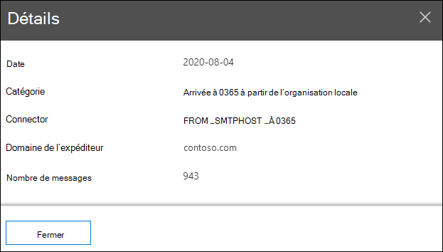

# Carte de flux de messagerie dans le centre de sécurité & conformité

La **carte de flux de messagerie** dans le [tableau de bord de flux de messagerie](mail-flow-insights-v2.md) dans le centre de [sécurité & conformité](https://protection.office.com) offre un aperçu de la façon dont les messages circulent dans votre organisation. Vous pouvez utiliser ces informations pour apprendre des modèles, identifier des anomalies et corriger les problèmes au fur et à mesure qu’ils se produisent.

Par défaut, le widget affiche le modèle de flux de messagerie du jour précédent dans un graphique appelé diagramme *Sankey* . Vous pouvez utiliser la flèche gauche et la flèche droite   pour afficher les informations de jours différents. Chaque couleur représente le flux de messagerie sur un connecteur entrant ou sortant différent (ou sans connecteurs). Si vous placez le curseur de la souris sur une couleur spécifique, le nombre de messages s’affiche pour ce type de connecteur.

## Affichage de rapport pour la carte de flux de messagerie

Cliquez sur le widget **carte de flux de messagerie** pour accéder au rapport de carte de flux de **messagerie** .

Les graphiques suivants sont disponibles dans l’affichage rapport :

- **Afficher les données de : vue d’ensemble**: il s’agit fondamentalement d’un affichage plus large du widget. Si vous placez le curseur de la souris sur une couleur spécifique, le nombre de messages s’affiche pour ce type de connecteur.

  

- **Afficher les données pour : Detail**: cette vue affiche des détails sur les connecteurs et les domaines de destination. Les principaux domaines expéditeur et destinataire sont répertoriés et les autres sont placés dans **d’autres**. Si vous placez le curseur de la souris sur une couleur et une section spécifiques, le nombre de messages s’affiche.

  

Si vous cliquez sur **filtres** dans un affichage de rapport, vous pouvez spécifier une plage de dates avec **Date de début** et date de **fin**.

Pour envoyer par courrier électronique le rapport pour une plage de dates spécifique à un ou plusieurs destinataires, cliquez sur **demander un téléchargement**.

Les informations associées s’affichent sous la carte de flux de messagerie si elles sont disponibles (par exemple, l’analyseur de la [boucle de messagerie possible](mfi-mail-loop-insight.md)).

## Vue de la table des détails pour la carte de flux de messagerie

Si vous cliquez sur **afficher la table des détails** dans un affichage de rapport, les informations suivantes s’affichent :

- **Date**
- **Catégorie**
- **Connecteur/fournisseur de services tiers**
- **Domaine de l’expéditeur/du destinataire**
- **Nombre de messages**

Si vous cliquez sur **filtres** dans un affichage tableau détaillé, vous pouvez spécifier une plage de dates avec **Date de début** et date de **fin**.

Si vous sélectionnez une ligne, des détails similaires s’affichent dans un menu volant :

Pour envoyer par courrier électronique le rapport pour une plage de dates spécifique à un ou plusieurs destinataires, cliquez sur **demander un téléchargement**.

Pour revenir à l’affichage rapports, cliquez sur **afficher le rapport**.

## Voir aussi

Pour plus d’informations sur les autres informations du tableau de bord de flux de messagerie, consultez [la rubrique mail Flow Insights in the Security & Compliance Center](mail-flow-insights-v2.md).
