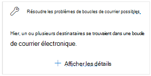

# Résoudre les problèmes de boucle de messagerie dans le Centre de sécurité & conformité

[!INCLUDE [Microsoft 365 Defender rebranding](../includes/microsoft-defender-for-office.md)]

**S’applique à**
- [Exchange Online Protection](exchange-online-protection-overview.md)
- [Microsoft Defender pour Office 365 : offre 1 et offre 2](defender-for-office-365.md)
- [Microsoft 365 Defender](../defender/microsoft-365-defender.md)

Les boucles de messagerie sont mauvaises car :

- Ils perdent les ressources système.
- Ils utilisent le quota de volume de messagerie de votre organisation.
- Ils envoient des rapports de non-remise déroutants (également appelés messages de non-remise ou de non-remise) aux expéditeurs du message d’origine.

L’aperçu de la  boucle de courrier de  correction possible dans la zone Recommandé pour vous du tableau de bord de flux de messagerie dans le Centre de sécurité & conformité vous [avertit](https://protection.office.com) lorsqu’une boucle de messagerie est détectée dans votre organisation. 

Cette information apparaît uniquement après la détection de la condition (si vous n’avez pas de boucles de messagerie, vous ne verrez pas l’aperçu).

Lorsque vous cliquez **sur Afficher les détails** sur le widget, un flyout s’affiche avec plus d’informations :

- **Domaine**
- **Nombre de messages**: vous pouvez cliquer  sur Afficher les exemples de **messages** pour afficher les résultats du suivi des messages pour un échantillon des messages affectés par la boucle.
- **Type de domaine**« Par exemple, faisant autorité ou ne faisant pas autorité.
- **Enregistrement MX**: valeurs d’hôte (serveur **de messagerie)** et de priorité de l’enregistrement MX pour le domaine. 
- **Raison de la** boucle et **comment corriger :** nous allons identifier les scénarios de boucle de messagerie les plus courants et fournir des actions recommandées pour corriger la boucle.

## Voir aussi

Pour plus d’informations sur d’autres informations dans le tableau de bord de flux de messagerie, voir Informations sur le flux de messagerie dans le Centre de sécurité [& conformité.](mail-flow-insights-v2.md)
