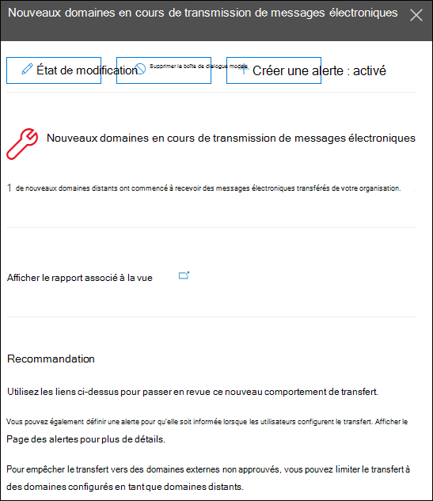

# Nouveaux domaines transmis par courrier électronique dans le centre de sécurité & conformité

Même si vous avez des raisons professionnelles valables pour transférer des messages électroniques à des destinataires externes dans des domaines spécifiques, il est suspect lorsque les utilisateurs de votre organisation redirigent soudainement les messages vers des domaines externes et que personne de l’organisation n’a transféré les messages vers ces domaines avant (nouveaux domaines). Cette condition peut indiquer que les comptes d’utilisateur sont compromis. Si vous pensez que les comptes ont été compromis, consultez la rubrique relative [à la réponse à un compte de courrier compromis](https://docs.microsoft.com/microsoft-365/security/office-365-security/responding-to-a-compromised-email-account).

Les **nouveaux domaines transmis par courrier électronique** vous avertissent lorsque les utilisateurs de votre organisation acheminent les messages vers de nouveaux domaines.

Cette vue s’affiche uniquement lorsque le problème est détecté et qu’il apparaît sur la page [rapport de transfert](view-mail-flow-reports.md#forwarding-report) .

Lorsque vous cliquez sur le widget, un menu volant s’affiche pour vous permettre de trouver plus d’informations sur les messages transférés, y compris un lien vers le [rapport de transfert](view-mail-flow-reports.md#forwarding-report).

Vous pouvez également accéder à cette page de détails lorsque vous sélectionnez l’option **Afficher tout** dans la zone de **recommandations & premières Insights** (tableau de**Reports** \> **bord** rapports ou <https://protection.office.com/insightdashboard> ).

Pour empêcher le transfert automatique des messages vers des domaines externes, configurez un domaine distant pour certains ou tous les domaines externes. Pour plus d’informations, consultez la rubrique [gestion des domaines distants dans Exchange Online](https://docs.microsoft.com/Exchange/mail-flow-best-practices/remote-domains/manage-remote-domains).

## Rubriques connexes

Pour plus d’informations sur les autres informations du tableau de bord de flux de messagerie, consultez [la rubrique mail Flow Insights in the Security & Compliance Center](mail-flow-insights-v2.md).
