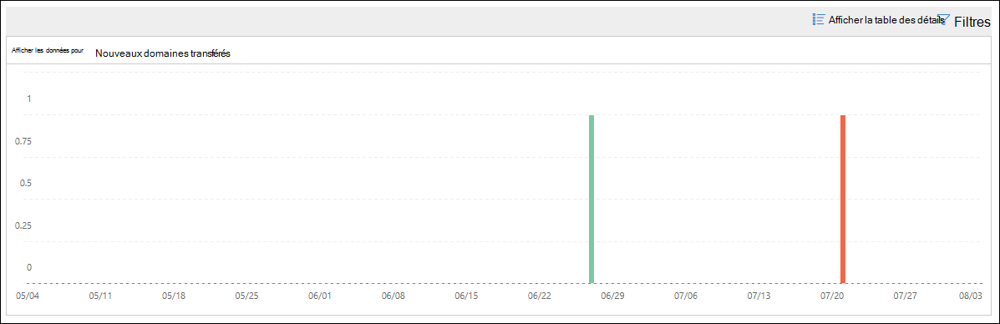

# Les nouveaux utilisateurs transférant des courriers électroniques dans le centre de sécurité & conformité

[!INCLUDE [Microsoft 365 Defender rebranding](../includes/microsoft-defender-for-office.md)]

Il est suspect lorsque les nouveaux comptes d’utilisateur dans votre organisation commencent soudainement à transférer les messages électroniques vers des domaines externes.

Les **nouveaux domaines en cours de transmission de courrier électronique** dans le [centre de sécurité & de conformité](https://protection.office.com) vous avertit lorsque des utilisateurs nouvellement créés dans votre organisation acheminent des messages vers des domaines externes. Cette condition peut indiquer que des comptes d’administrateur compromis ont été utilisés pour créer les nouveaux utilisateurs. Si vous pensez que les comptes ont été compromis, consultez la rubrique relative [à la réponse à un compte de courrier compromis](https://docs.microsoft.com/microsoft-365/security/office-365-security/responding-to-a-compromised-email-account).

Cette vue s’affiche uniquement lorsque le problème est détecté et qu’il apparaît sur la page [rapport de transfert](view-mail-flow-reports.md#forwarding-report) .

Lorsque vous cliquez sur le widget, un menu volant s’affiche pour vous permettre d’obtenir plus de détails sur les messages transférés, y compris un lien vers le [rapport de modifications du transfert](#forwarding-modifications-report) , comme décrit plus loin dans cette rubrique.

Vous pouvez également accéder à cette page de détails lorsque vous sélectionnez l’option **Afficher tout** dans la zone de **recommandations & premières Insights** (tableau de**Reports** \> **bord** rapports ou <https://protection.office.com/insightdashboard> ).

Vous pouvez cliquer sur le lien **Voir le rapport associé** à la vue pour accéder au **rapport des modifications de transfert** , comme décrit dans la section suivante.

## Rapport de transfert des modifications

Le **rapport de transfert des modifications** affiche des détails sur les messages qui sont automatiquement transférés des expéditeurs au sein de votre organisation :

- Les comptes nouvellement créés qui transfèrent des messages vers des domaines externes.
- Comptes qui transfèrent des messages vers des domaines externes qui n’ont jamais été transférés par d’autres expéditeurs de votre organisation.

Ces types de messages transférés peuvent présenter un risque de sécurité ou de conformité, et peuvent indiquer des comptes compromis.

Le rapport contient des données pour 90 jours maximum. Par défaut, le rapport affiche les données des 7 derniers jours.

Ce rapport n’est pas disponible directement dans le [tableau de bord de flux de messagerie](mail-flow-insights-v2.md) ou dans le tableau de [bord rapports](view-mail-flow-reports.md). En plus de cliquer sur le lien **afficher le rapport associé** à la vue d' **envoi des nouveaux utilisateurs** , vous accédez au rapport en procédant comme suit :

- En cliquant sur le lien **rapport de notifications de transfert** dans les détails des [nouveaux domaines en cours de transmission de messages électroniques](mfi-new-domains-being-forwarded-email.md).
- Ouverture <https://protection.office.com/reportv2?id=MailFlowNewForwarding> .

### Affichage de rapport pour le rapport des modifications du transfert

Les graphiques suivants sont disponibles dans l’affichage rapport :

- **Afficher les données pour : nouveaux utilisateurs de transfert**:

  

- **Afficher les données pour : nouveaux domaines de transfert**:

  

Si vous cliquez sur **filtres** dans un affichage de rapport, vous pouvez spécifier une plage de dates avec **Date de début** et date de **fin**.

### Vue de la table Détails pour le rapport des modifications de transfert

Si vous cliquez sur **afficher les détails table**, les informations affichées dépendent du graphique que vous examinez :

- **Afficher les données pour : nouveaux utilisateurs de transfert**:

  - **Name**: adresse de messagerie de l’expéditeur.
  - **Type de transfert**
  - **Adresse du destinataire**
  - **Details**
  - **Count**
  - **Première date de transfert**

- **Afficher les données pour : nouveaux domaines de transfert**:

  - **Name**: domaine de messagerie de l’expéditeur.
  - **Type de transfert**
  - **Adresse du destinataire**
  - **Details**
  - **Count**
  - **Première date de transfert**

Si vous cliquez sur **filtres** dans un affichage tableau détaillé, vous pouvez spécifier une plage de dates avec **Date de début** et date de **fin**.

Si vous sélectionnez une ligne dans le tableau, une fenêtre volante de **Détails** s’affiche avec les informations suivantes :

- **Name**: il s’agit de l’adresse de messagerie de l’expéditeur (de l’affichage des **données pour : nouvelle** vue des utilisateurs de transfert) ou du domaine de messagerie de l’expéditeur (de l’affichage des **données pour : nouvelle** vue des domaines de transfert).
- **Type de transfert**
- **Destinataire**
- **Details**
- **Count**
- **Date de début**
- **Recommandation**: à partir de là, vous pouvez cliquer sur le lien pour gérer l’utilisateur dans le centre d’administration 365 de Microsoft.

Pour revenir à l’affichage rapports, cliquez sur **afficher le rapport**.

## Voir aussi

Pour plus d’informations sur les autres informations du tableau de bord de flux de messagerie, consultez [la rubrique mail Flow Insights in the Security & Compliance Center](mail-flow-insights-v2.md).
