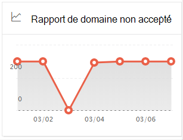

# Rapport de domaine non accepté dans le Centre de sécurité & conformité

[!INCLUDE [Microsoft 365 Defender rebranding](../includes/microsoft-defender-for-office.md)]

**S’applique à**
- [Exchange Online Protection](exchange-online-protection-overview.md)
- [Microsoft Defender pour Office 365 : offre 1 et offre 2](defender-for-office-365.md)
- [Microsoft 365 Defender](../defender/microsoft-365-defender.md)

Le  rapport de domaine non  accepté dans le tableau de bord de flux de messagerie du Centre de sécurité [&](https://protection.office.com) conformité affiche des informations sur les messages provenant de votre organisation de messagerie sur site où le domaine de l’expéditeur n’est pas configuré en tant que domaine accepté dans votre organisation Microsoft 365.

Microsoft 365 peuvent limiter ces messages si nous avons des données pour prouver que l’intention de ces messages est malveillante. Par conséquent, il est important que vous compreniez ce qui se passe et que vous corrigez le problème.

## Affichage de rapport pour le rapport de domaine non accepté

Le fait de cliquer sur le graphique sur le widget **de** domaine non accepté vous permet d’avoir accès au **rapport de domaine** non accepté.

Par défaut, l’activité de tous les connecteurs affectés est affichée. Si vous cliquez **sur Afficher les données pour**, vous pouvez sélectionner un connecteur spécifique dans ladown.

Si vous pointez sur un point de données (jour) dans le graphique, vous verrez le nombre total de messages pour le connecteur.

## Vue de table Détails pour le rapport de domaine non accepté

Si vous cliquez **sur Afficher le tableau des détails** dans un affichage de rapport, les informations suivantes sont affichées :

- **Date**
- **Nom du connecteur entrant**
- **Domaine de l’expéditeur**
- **Nombre de messages**
- **Exemples de messages**: ID de message d’un échantillon de messages affectés.

Si vous cliquez sur **Filtres** dans une vue de tableau de détails, vous pouvez spécifier une plage de dates avec la **date** de début et la **date de fin.**

Pour envoyer par courrier électronique le rapport pour une plage de dates spécifique à un ou plusieurs destinataires, cliquez **sur Télécharger la demande.**

Lorsque vous sélectionnez une ligne dans le tableau, un flyout s’affiche avec les informations suivantes :

- **Date**
- **Nom du connecteur entrant**
- **Domaine de l’expéditeur**
- **Nombre de messages**
- **Exemples de messages**: vous pouvez cliquer sur Afficher les **exemples de messages** pour afficher les résultats du [suivi](message-trace-scc.md) des messages pour un échantillon des messages concernés.

Pour revenir à l’affichage Rapports, cliquez **sur Afficher le rapport.**

## Voir aussi

Pour plus d’informations sur d’autres informations dans le tableau de bord de flux de messagerie, voir Informations sur le flux de messagerie dans le Centre de sécurité [& conformité.](mail-flow-insights-v2.md)
