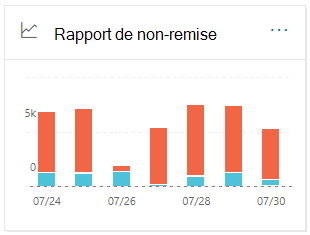
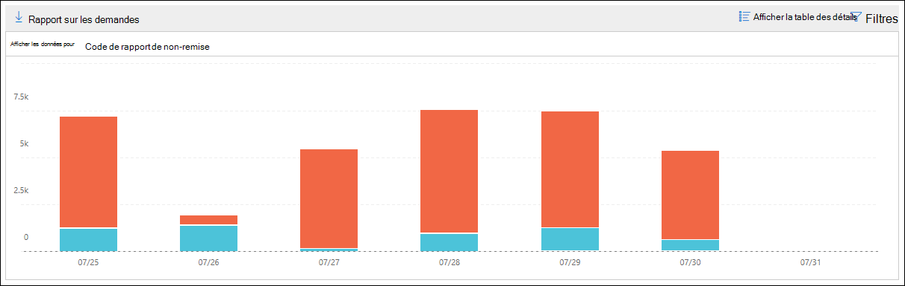

# Notification d’échec de remise dans le centre de sécurité & conformité

Le **rapport de non-remise** dans le [tableau de bord de flux de messagerie](mail-flow-insights-v2.md) dans le centre de sécurité & conformité affiche les codes d’erreur les plus détectés dans les notifications d’échec de remise (également appelées notifications de non-remise) pour les utilisateurs de votre organisation. Ce rapport affiche les détails des notifications d’échec de remise afin que vous puissiez résoudre les problèmes de remise des messages.

## Affichage de rapport pour la notification d’échec de remise

Cliquez sur le widget **rapport de non-remise** pour accéder à la **notification**d’échec de remise.

Par défaut, l’activité de tous les codes d’erreur est affichée. Si vous cliquez sur **afficher les données pour**, vous pouvez sélectionner un code d’erreur spécifique dans la liste déroulante.

Si vous pointez sur une couleur spécifique (code d’erreur) sur un jour spécifique du graphique, vous verrez le nombre total de messages pour l’erreur.

## Vue de la table Détails pour la notification d’échec de remise

Si vous cliquez sur **afficher la table des détails** dans un affichage de rapport, les informations suivantes s’affichent :

- **Date**
- **Code de rapport de non-remise**
- **Count**
- **Exemples de messages**: ID de message d’un exemple de messages concernés.

Si vous cliquez sur **filtres** dans un affichage tableau détaillé, vous pouvez spécifier une plage de dates avec **Date de début** et date de **fin**.

Pour envoyer par courrier électronique le rapport pour une plage de dates spécifique à un ou plusieurs destinataires, cliquez sur **demander un téléchargement**.

Lorsque vous sélectionnez une ligne dans le tableau, une fenêtre mobile apparaît avec les informations suivantes :

- **Date**
- **Code de rapport de non-remise**: vous pouvez cliquer sur le lien pour trouver des informations supplémentaires sur les causes et solutions pour le code d’erreur spécifique.
- **Count**
- **Exemples de messages**: vous pouvez cliquer sur **afficher les exemples de messages** pour afficher les résultats du [suivi](message-trace-scc.md) des messages pour un exemple des messages concernés.

## Sujets associés

Pour plus d’informations sur les autres informations du tableau de bord de flux de messagerie, consultez [la rubrique mail Flow Insights in the Security & Compliance Center](mail-flow-insights-v2.md).
