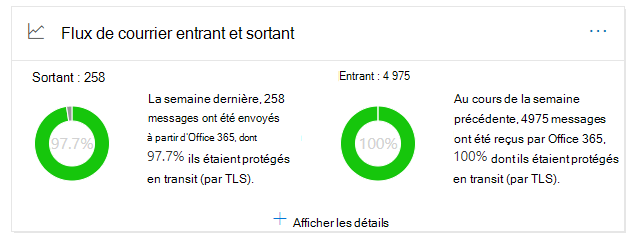
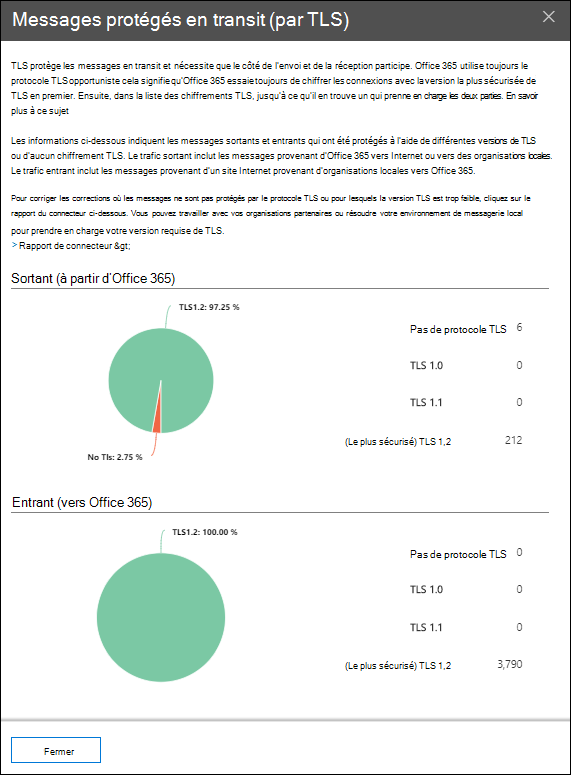

# Informations sur le flux de messagerie sortant et entrant dans le Centre de sécurité & conformité

[!INCLUDE [Microsoft 365 Defender rebranding](../includes/microsoft-defender-for-office.md)]

L’aperçu du flux de messagerie  sortant et entrant dans le tableau de bord flux  de messagerie dans le Centre de sécurité [&](https://protection.office.com) conformité combine les informations du rapport connecteur et de l’ancien rapport de vue d’ensemble **TLS** à un seul endroit. 

Le widget affiche le chiffrement TLS utilisé pour la connexion lorsque des messages sont remis à et depuis votre organisation. Les connexions établies avec d’autres services de messagerie sont chiffrées par TLS lorsque TLS est proposé par les deux côtés. Le widget offre un instantané de la dernière semaine de flux de messagerie.

Les informations du widget sont liées aux connecteurs et à la protection des messages TLS dans Microsoft 365. Pour plus d'informations, voir les rubriques suivantes :

- [Configurer le flux de messagerie à l’aide des connecteurs](https://docs.microsoft.com/exchange/mail-flow-best-practices/use-connectors-to-configure-mail-flow/use-connectors-to-configure-mail-flow)
- [Mode d’utilisation de TLS par Exchange Online pour sécuriser les connexions de messagerie](https://docs.microsoft.com/microsoft-365/compliance/exchange-online-uses-tls-to-secure-email-connections)
- [Informations de référence technique sur le chiffrement dans Microsoft 365](https://docs.microsoft.com/microsoft-365/compliance/technical-reference-details-about-encryption)

## Message protégé en transit (par TLS)

Lorsque vous cliquez sur Afficher les **détails** sur le widget, le volant Message protégé en **transit (par TLS)** vous présente la protection TLS pour les messages entrants et sortants de votre organisation.

Actuellement, TLS 1.2 est la version la plus sécurisée de TLS proposée par Microsoft 365. Souvent, vous devez connaître le chiffrement TLS utilisé pour les audits de conformité. Vous n’avez probablement pas de relation directe avec la plupart des serveurs de messagerie source et de destination (vous ne les possédez pas, et Microsoft non plus), vous n’avez donc pas beaucoup d’options pour améliorer le chiffrement TLS utilisé par ces serveurs.

Toutefois, vous pouvez utiliser des [connecteurs](https://docs.microsoft.com/exchange/mail-flow-best-practices/use-connectors-to-configure-mail-flow/use-connectors-to-configure-mail-flow) pour garantir la meilleure protection TLS disponible pour les messages envoyés entre vos serveurs de messagerie et Microsoft 365. Le flux de messagerie entre Microsoft 365 et vos propres serveurs de messagerie ou serveurs qui appartiennent à vos partenaires est souvent plus important et sensible que les messages ordinaires. Vous souhaiterez donc appliquer une sécurité et un niveau de sécurité supplémentaires à ces messages.

Vous pouvez mettre à niveau ou corriger vos propres serveurs de messagerie pour améliorer le chiffrement TLS utilisé, ou contactez vos partenaires pour en faire de même. Le **rapport connecteur affiche** le volume de flux de messagerie et le chiffrement TLS pour les messages qui utilisent vos connecteurs Microsoft 365.

Vous pouvez cliquer sur **le lien du rapport connecteur** pour y [aller.](view-mail-flow-reports.md#connector-report) Les informations suivantes peuvent être disponibles sur la page de rapport **connecteur** si la condition associée a été détectée :

- **Connecteur partenaire entrant avec un flux de messagerie TLS1.0 important**
- **Connecteur OnPremises entrant avec un flux de messagerie TLS1.0 important**

Pour les connexions TLS 1.0, vous devez vraiment mettre à niveau ou corriger votre serveur de messagerie ou le serveur de votre partenaire afin d’éviter tout problème lorsque la prise en charge de TLS 1.0 est finalement dépréciée dans Microsoft 365.

## Voir aussi

Pour plus d’informations sur d’autres informations dans le tableau de bord de flux de messagerie, voir Informations sur le flux de messagerie dans le Centre de sécurité [& conformité.](mail-flow-insights-v2.md)
