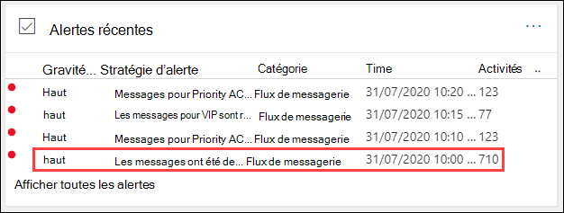
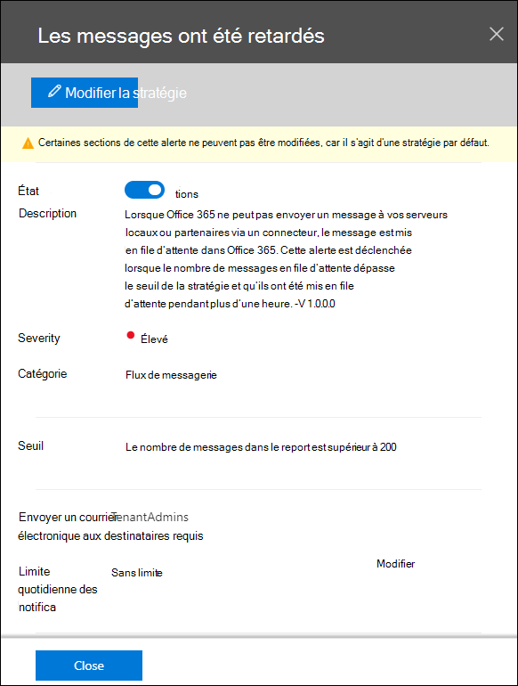
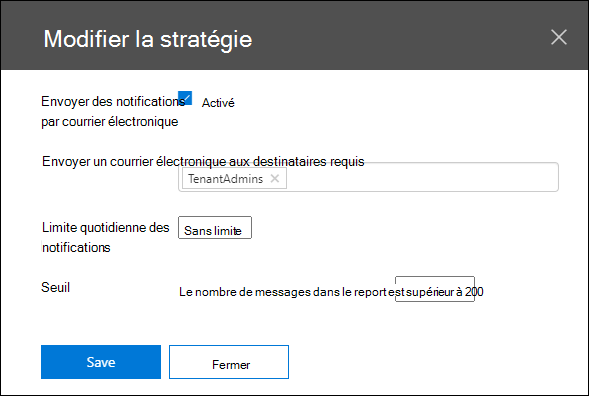
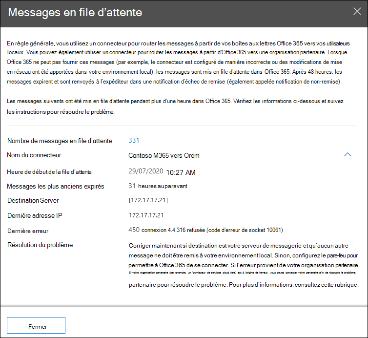

# Informations sur les files d’attente dans le Centre de sécurité & conformité

[!INCLUDE [Microsoft 365 Defender rebranding](../includes/microsoft-defender-for-office.md)]

**S’applique à**
- [Exchange Online Protection](exchange-online-protection-overview.md)
- [Microsoft Defender pour Office 365 : offre 1 et offre 2](defender-for-office-365.md)
- [Microsoft 365 Defender](../defender/microsoft-365-defender.md)

Lorsque les messages ne peuvent pas être envoyés depuis votre organisation vers vos serveurs de messagerie locaux ou partenaires à l’aide de connecteurs, les messages sont mis en file d’attente Microsoft 365. Les exemples courants à l’origine de cette condition sont les suivants :

- Le connecteur n’est pas correctement configuré.
- Des modifications ont été apportées au réseau ou au pare-feu dans votre environnement local.

Microsoft 365 continueront à retenter la remise pendant 24 heures. Au bout de 24 heures, les messages expirent et sont renvoyés aux expéditeurs dans les rapports de non-remise (également appelés messages de non-remise).

Si le volume de courrier en file d’attente dépasse le seuil prédéfiny (la valeur par défaut est 200 messages), les informations sont disponibles aux emplacements suivants :

- Informations **sur les files d’attente** dans le tableau de bord de [flux](mail-flow-insights-v2.md) de messagerie du Centre de sécurité [& conformité.](https://protection.office.com) Pour plus d’informations, voir [l’aperçu](#queues-insight-in-the-mail-flow-dashboard) des files d’attente dans la section Tableau de bord du flux de messagerie de cet article.

- Une alerte s’affiche dans **alertes récentes** le tableau de bord Alertes dans le Centre de sécurité [&](https://protection.office.com) conformité ( Tableau de bord des **alertes** \>  ou <https://protection.office.com/alertsdashboard> ).

  

- Les administrateurs recevront une notification par courrier électronique en fonction de la configuration de la stratégie d’alerte par défaut nommée **Messages qui a été retardée.** Pour configurer les paramètres de notification pour cette alerte, consultez la section suivante.

  Pour plus d’informations sur les stratégies d’alerte, voir Stratégies d’alerte dans le [Centre de sécurité & conformité.](../../compliance/alert-policies.md)

## Personnaliser les alertes de file d’attente

1. Dans le [Centre de sécurité & conformité,](https://protection.office.com)allez aux **stratégies d’alerte des alertes** \>  ou ouvrez <https://protection.office.com/alertpolicies> .

2. Dans la page **Stratégies d’alerte,** recherchez et sélectionnez la stratégie nommée **Messages qui a été retardée.**

3. Dans le **flyout Message qui** s’ouvre, vous pouvez activer ou désactiver l’alerte et configurer les paramètres de notification.

   

   - **État**: vous pouvez mettre l’alerte sur ou hors de l’état.

   - **Destinataires de courrier électronique** et **limite de notification quotidienne**: cliquez sur **Modifier** pour configurer les paramètres suivants :

4. Pour configurer les paramètres de notification, cliquez sur **Modifier.** Dans le **volant modifier la** stratégie qui s’affiche, configurez les paramètres suivants :

   - **Envoyer des notifications par courrier électronique**: la valeur par défaut est sur.
   - **Destinataires du courrier électronique**: la valeur par défaut **est TenantAdmins**.
   - **Limite de notification quotidienne**: la valeur par défaut est **Aucune limite.**
   - **Seuil**: la valeur par défaut est 200.

   

5. Lorsque vous avez terminé, cliquez sur **Enregistrer** et **fermer.**

## Informations sur les files d’attente dans le tableau de bord de flux de messagerie

Même si le volume de messages en file d’attente n’a pas  dépassé le  seuil et généré une alerte, vous pouvez toujours utiliser l’aperçu des files d’attente dans le tableau de bord de flux de messagerie pour voir les messages mis en file d’attente depuis plus d’une heure et agir avant que le nombre de messages mis en file d’attente ne devienne trop élevé.

Si vous cliquez sur le nombre  de messages sur le widget, un message volant Messages mis en file d’attente apparaît avec les informations suivantes :

- **Nombre de messages mis en file d’attente**
- **Nom du** connecteur : sélectionnez le nom du connecteur pour gérer le connecteur dans le Centre d’administration Exchange (EAC) à l’adresse <https://admin.exchange.microsoft.com/#/connectors> .
- **Heure de début de la file d’attente**
- **Messages les plus anciens arrivés à expiration**
- **Serveur de destination**
- **Dernière adresse IP**
- **Dernière erreur**
- **Comment résoudre :** des problèmes courants et des solutions sont disponibles. Si un **lien Résoudre maintenant** est disponible, cliquez dessus pour résoudre le problème. Dans le cas contraire, cliquez sur les liens disponibles pour plus d’informations sur l’erreur et les solutions possibles.

Le même volant s’affiche lorsque vous cliquez sur Afficher la **file** d’attente dans les détails d’une alerte de retard **de** messages.

## Voir aussi

Pour plus d’informations sur d’autres informations dans le tableau de bord de flux de messagerie, voir Informations sur le flux de messagerie dans le Centre de sécurité [& conformité.](mail-flow-insights-v2.md)
