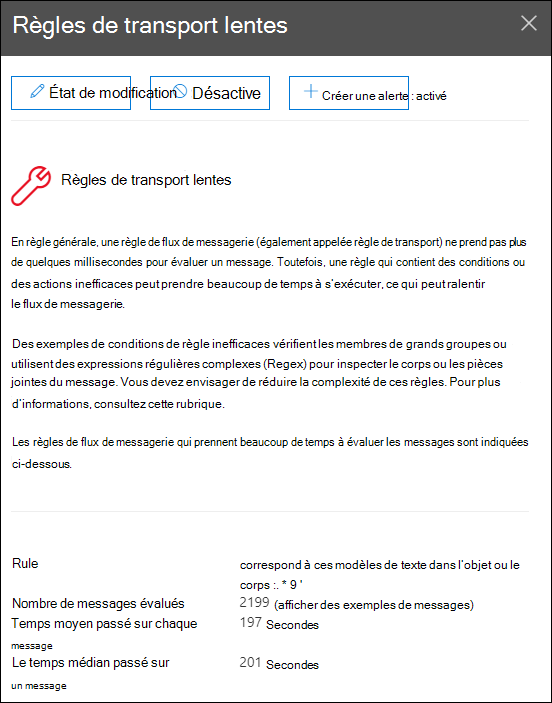

# Résoudre les problèmes de règles de flux de messagerie dans le Centre de sécurité & conformité

[!INCLUDE [Microsoft 365 Defender rebranding](../includes/microsoft-defender-for-office.md)]

**S’applique à**
- [Exchange Online Protection](exchange-online-protection-overview.md)
- [Microsoft Defender pour Office 365 : offre 1 et offre 2](defender-for-office-365.md)
- [Microsoft 365 Defender](../defender/microsoft-365-defender.md)

Des règles de flux de messagerie inefficaces (également appelées règles de transport) peuvent entraîner des retards de flux de messagerie pour votre organisation. Cette information signale les règles de flux de messagerie qui ont un impact sur le flux de messagerie de votre organisation. Voici quelques exemples de ces types de règles :

- Conditions qui **utilisent est membre de pour** les grands groupes.
- Conditions qui utilisent une correspondance complexe de modèle d’expression régulière (regex).
- Conditions qui utilisent la vérification du contenu dans les pièces jointes.

L’aperçu des règles de  correction du flux  de messagerie lent dans la zone Recommandé pour vous du tableau de bord de flux de messagerie dans le Centre de sécurité [&](https://protection.office.com) conformité vous avertit lorsqu’une règle de flux de messagerie prend trop de temps. 

Cette information apparaît uniquement après la détection de la condition (si vous n’avez pas de boucles de messagerie, vous ne verrez pas l’aperçu).

Vous pouvez utiliser cette notification pour vous aider à identifier et affiner les règles de flux de messagerie afin de réduire les retards de flux de messagerie.

Lorsque vous cliquez **sur Afficher les détails** sur le widget, un flyout s’affiche avec plus d’informations :

- **Règle**: vous pouvez pointer sur le résumé pour voir toutes les conditions, les exceptions et les actions de la règle. Vous pouvez cliquer sur le résumé pour modifier la règle dans le Centre d’administration Exchange (EAC).
- **Nombre de messages évalués**: vous pouvez  cliquer sur Afficher les exemples de **messages** pour afficher les résultats du suivi des messages pour un échantillon des messages affectés par la règle.
- **Temps moyen passé sur chaque message**
- **Temps moyen passé sur un message**: valeur intermédiaire qui sépare la moitié supérieure de la moitié inférieure des données de temps.

Pour plus d’informations sur les conditions et les exceptions dans les règles de flux de messagerie, voir Conditions et exceptions des règles de flux de messagerie [(prédicats) dans Exchange Online.](/Exchange/security-and-compliance/mail-flow-rules/conditions-and-exceptions)

## Voir aussi

Pour plus d’informations sur d’autres informations dans le tableau de bord de flux de messagerie, voir Informations sur le flux de messagerie dans le Centre de sécurité [& conformité.](mail-flow-insights-v2.md)