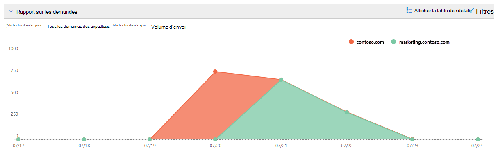

# Informations et rapports sur les clients d’th SMTP dans le Centre de sécurité & conformité

[!INCLUDE [Microsoft 365 Defender rebranding](../includes/microsoft-defender-for-office.md)]

**S’applique à**
- [Exchange Online Protection](exchange-online-protection-overview.md)
- [Microsoft Defender pour Office 365 : offre 1 et offre 2](defender-for-office-365.md)
- [Microsoft 365 Defender](../defender/microsoft-365-defender.md)

Les informations sur les clients  **SMTP Auth** dans le tableau de bord de flux de messagerie et le rapport des clients d’th [SMTP](#smtp-auth-clients-report) associés dans le Centre de sécurité [&](https://protection.office.com) conformité mettent en évidence l’utilisation du protocole d’envoi du client SMTP AUTH par les utilisateurs ou les comptes système de votre organisation. Ce protocole hérité (qui utilise le point de terminaison smtp.office365.com) offre uniquement l’authentification de base et peut être utilisé par des comptes compromis pour envoyer des messages électroniques. Les informations et le rapport vous permettent de vérifier l’activité inhabituelle pour les envois de courrier ÉLECTRONIQUE SMTP AUTH. Il affiche également les données d’utilisation TLS pour les clients ou les appareils utilisant SMTP AUTH.

Le widget indique le nombre d’utilisateurs ou de comptes de service qui ont utilisé le protocole SMTP Auth au cours des 7 derniers jours.

Si vous cliquez sur le nombre de messages sur le widget, un volant **de clients SMTP Auth** s’affiche. Le flyout fournit une vue agrégée de l’utilisation et des volumes TLS de la semaine dernière.

Vous pouvez cliquer sur le lien **du rapport des clients SMTP Auth** pour aller au rapport clients d’th SMTP, comme décrit dans la section suivante.

## Rapport de clients d’authentification SMTP

### Affichage du rapport pour le rapport clients d’th SMTP

Par défaut, le rapport affiche les données des 7 derniers jours, mais les données sont disponibles pour les 90 derniers jours.

La section vue d’ensemble contient les graphiques suivants :

- Afficher les données par : volume d’envoi : par défaut, le graphique affiche le nombre de messages clients SMTP Auth qui ont été envoyés à partir de tous les domaines ( Afficher les données pour : Tous les domaines des **expéditeurs** est sélectionné par défaut). Vous pouvez filtrer les résultats sur un  domaine d’expéditeur spécifique en cliquant sur Afficher les données pour et en sélectionnant le domaine de l’expéditeur dans la liste liste. Si vous pointez sur un point de données spécifique (jour), le nombre de messages s’affiche.

  

- **Afficher les données par : Utilisation TLS**: le graphique affiche le pourcentage d’utilisation de TLS pour tous les messages clients d’th SMTP pendant la période sélectionnée. Ce graphique vous permet d’identifier les utilisateurs et les comptes système qui utilisent encore des versions antérieures de TLS et d’agir sur ces derniers.

  

Si vous cliquez sur **Filtres** dans un affichage de rapport, vous pouvez spécifier une plage de dates avec la **date de** début et la date **de fin.**

Cliquez **sur Demander un** rapport pour recevoir une version plus détaillée du rapport dans un message électronique. Vous pouvez spécifier la plage de dates et les destinataires à recevoir.

### Affichage de table Détails pour le rapport des clients d’th SMTP

Si vous cliquez sur Afficher le tableau des **détails,** les informations affichées dépendent du graphique que vous regardiez :

- **Afficher les données par : volume d’envoi**: les informations suivantes sont affichées dans un tableau :

  - **Adresse de l’expéditeur**
  - **Nombre de messages**

  Si vous sélectionnez une ligne, les mêmes détails sont affichés dans un volant.

- **Afficher les données par : Utilisation de TLS**: les informations suivantes sont affichées dans un tableau :

  - **Adresse de l’expéditeur**
  - **TLS1.0%**\*
  - **TLS1.1%**\*
  - **TLS1.2%**\*
  - **Nombre de messages**

  \* Cette colonne indique le pourcentage et le nombre de messages de l’expéditeur.

Si vous cliquez sur **Filtres** dans une vue de tableau de détails, vous pouvez spécifier une plage de dates avec la **date** de début et la **date de fin.**

Si vous sélectionnez une ligne, des détails similaires sont affichés dans un volant :

Cliquez **sur Demander un** rapport pour recevoir une version plus détaillée du rapport dans un message électronique. Vous pouvez spécifier la plage de dates et les destinataires à recevoir.

Pour revenir à l’affichage Rapports, cliquez **sur Afficher le rapport.**

## Voir aussi

Pour plus d’informations sur d’autres informations dans le tableau de bord de flux de messagerie, voir Informations sur le flux de messagerie dans le Centre de sécurité [& conformité.](mail-flow-insights-v2.md)
