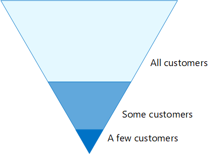

# Configurations des identités et de l’accès aux appareils

**S’applique à**
- [Exchange Online Protection](exchange-online-protection-overview.md)
- [Microsoft Defender pour Office 365 : offre 1 et offre 2](defender-for-office-365.md)

Le périmètre de sécurité moderne de votre organisation s’étend désormais au-delà de votre réseau pour inclure les utilisateurs accédant aux applications basées sur le cloud à partir de n’importe quel emplacement avec une variété d’appareils. Votre infrastructure de sécurité doit déterminer si une demande d’accès donnée doit être accordée et dans quelles conditions.

Cette détermination doit être basée sur le compte d’utilisateur de la connectez-vous, l’appareil utilisé, l’application que l’utilisateur utilise pour l’accès, l’emplacement à partir duquel la demande d’accès est faite et une évaluation du risque de la demande. Cela permet de s’assurer que seuls les utilisateurs et les appareils approuvés ont accès aux ressources critiques de l’entreprise.

Cette série d’articles décrit un ensemble de configurations requises pour l’accès aux identités et aux appareils, ainsi qu’un ensemble d’accès conditionnel, de Microsoft Intune et d’autres stratégies de Azure Active Directory pour sécuriser l’accès à Microsoft 365 pour les applications et services cloud d’entreprise, d’autres services SaaS et des applications sur site publiées avec le proxy d’application Azure AD.

Les paramètres et stratégies d’accès aux identités et appareils sont recommandés en trois niveaux : protection de référence, protection sensible et protection pour les environnements avec des données hautement réglementées ou classifiées. Ces niveaux de protection et les configurations correspondantes apportent des niveaux de protection cohérents selon les données, les identités et les appareils.

Ces fonctionnalités et leurs recommandations :

- Sont pris en charge dans Microsoft 365 E3 et Microsoft 365 E5.
- Sont alignés avec [le score de sécurité Microsoft,](../defender/microsoft-secure-score.md) ainsi que le score d’identité dans Azure [AD,](/azure/active-directory/fundamentals/identity-secure-score)et augmenteront ces scores pour votre organisation.
- Vous aidera à implémenter ces [cinq étapes pour sécuriser votre infrastructure d’identité.](/azure/security/azure-ad-secure-steps)

Si votre organisation a des exigences ou des complexités d’environnement uniques, utilisez ces recommandations comme point de départ. Toutefois, la plupart des organisations peuvent implémenter ces recommandations comme prévu.

Regardez cette vidéo pour obtenir une vue d’ensemble rapide des configurations d’identité et d’accès aux appareils pour Microsoft 365 entreprise.

 

> [!VIDEO https://www.microsoft.com/videoplayer/embed/RWxEDQ]

> [!NOTE]
> Microsoft vend également Enterprise Mobility + Security (EMS) pour Office 365 abonnements. Les fonctionnalités EMS E3 et EMS E5 sont équivalentes à celles des Microsoft 365 E3 et Microsoft 365 E5. Pour plus d’informations, voir [les plans EMS.](https://www.microsoft.com/microsoft-365/enterprise-mobility-security/compare-plans-and-pricing)

## Public cible

Ces recommandations sont destinées aux architectes d’entreprise et aux professionnels de l’informatique qui connaissent les services de productivité et de sécurité du cloud Microsoft 365, notamment Azure AD (identité), Microsoft Intune (gestion des appareils) et Protection des données Microsoft (protection des données).

### Environnement client

Les stratégies recommandées s’appliquent aux organisations d’entreprise qui opèrent entièrement dans le cloud Microsoft et aux clients avec une infrastructure d’identité hybride, qui est une forêt AD DS (Active Directory Domain Services) locale synchronisée avec un client Azure AD.

Bon nombre des recommandations fournies s’appuient sur les services disponibles uniquement avec Microsoft 365 E5, Microsoft 365 E3 avec le module de sécurité E5, EMS E5 ou Azure AD Premium P2 licences.

Pour les organisations qui ne sont pas titulaires de ces licences, Microsoft vous recommande d’implémenter au moins les [paramètres](/azure/active-directory/fundamentals/concept-fundamentals-security-defaults)de sécurité par défaut, qui sont inclus dans tous les plans Microsoft 365 de sécurité.

### Avertissements

Votre organisation peut être soumise à des exigences réglementaires ou d’autres exigences de conformité, y compris des recommandations spécifiques qui peuvent nécessiter l’application de stratégies qui divergent de ces configurations recommandées. Ces configurations recommandent des contrôles de l’utilisation qui n’étaient pas disponibles par le passé. Nous recommandons ces contrôles, car nous pensons qu’ils représentent un équilibre entre sécurité et productivité.

Nous avons fait de notre mieux pour tenir compte d’un large éventail d’exigences de protection organisationnelle, mais nous ne sommes pas en mesure de tenir compte de toutes les exigences possibles ou de tous les aspects uniques de votre organisation.

## Trois niveaux de protection

La plupart des organisations ont des besoins spécifiques en matière de sécurité et de protection des données. Ces besoins varient selon leur secteur d’activité et selon les postes de travail en leur sein. Par exemple, votre service juridique et vos administrateurs peuvent exiger des contrôles de sécurité et de protection des informations supplémentaires concernant leur correspondance par courrier électronique qui ne sont pas requis pour d’autres unités commerciales.

Chaque secteur d’activité possède aussi sa propre réglementation spécialisée. Au lieu de fournir une liste de toutes les options de sécurité possibles ou une recommandation par secteur d’activité ou fonction, des recommandations ont été fournies pour trois niveaux différents de sécurité et de protection qui peuvent être appliqués en fonction de la granularité de vos besoins.

- **Protection de** base : nous vous recommandons d’établir une norme minimale pour la protection des données, ainsi que les identités et les appareils qui accèdent à vos données. Vous pouvez suivre ces recommandations de référence pour fournir une protection par défaut forte qui répond aux besoins de nombreuses organisations.
- **Protection sensible**: certains clients ont un sous-ensemble de données qui doivent être protégées à des niveaux supérieurs, ou ils peuvent exiger que toutes les données soient protégées à un niveau supérieur. Vous pouvez appliquer une protection accrue à tous les ensembles de données ou à des jeux de données spécifiques dans votre Microsoft 365 de données. Nous vous recommandons de protéger les identités et les appareils qui accèdent à des données sensibles avec des niveaux de sécurité comparables.
- **Hautement réglementé : certaines** organisations peuvent avoir une petite quantité de données hautement classifiées, constituent des secrets commerciaux ou sont réglementées. Microsoft fournit des fonctionnalités pour aider les organisations à respecter de telles exigences, notamment de protection renforcée des appareils et des identités.

Ces instructions vous montrent comment implémenter la protection des identités et des appareils pour chacun de ces niveaux de protection. Utilisez ces conseils comme point de départ pour votre organisation et ajustez les stratégies pour répondre aux besoins spécifiques de votre organisation.

Il est important d'utiliser des niveaux de protection cohérents pour l'ensemble de vos données, de vos identités et de vos appareils. Par exemple, si vous implémentez ces instructions, assurez-vous de protéger vos données à des niveaux comparables.

Le **modèle d’architecture de protection** des identités Microsoft 365 appareils vous indique les fonctionnalités comparables.

   [Affichage au format PDF](../../downloads/MSFT_cloud_architecture_identity&device_protection.pdf) \| [Téléchargement au format PDF](https://github.com/MicrosoftDocs/microsoft-365-docs/raw/public/microsoft-365/downloads/MSFT_cloud_architecture_identity&device_protection.pdf) \| [Téléchargement en tant que Visio](https://github.com/MicrosoftDocs/microsoft-365-docs/raw/public/microsoft-365/downloads/MSFT_cloud_architecture_identity&device_protection.vsdx)  

En outre, consultez la solution Déployer la protection des informations pour [les](../../solutions/information-protection-deploy.md) réglementations en matière de confidentialité des données pour protéger les informations stockées dans Microsoft 365.

## Compromis entre sécurité et productivité

L’implémentation d’une stratégie de sécurité nécessite des compromis entre sécurité et productivité. Il est utile d’évaluer l’impact de chaque décision sur l’équilibre de la sécurité, des fonctionnalités et de la facilité d’utilisation.

Les recommandations fournies reposent sur les principes suivants :

- Connaissez vos utilisateurs et soyez flexible à leurs exigences fonctionnelles et de sécurité.
- Appliquez une stratégie de sécurité juste à temps et assurez-vous qu’elle est significative.

## Services et concepts pour la protection de l’accès aux identités et aux appareils

Microsoft 365 entreprise est conçu pour permettre aux grandes organisations d’être créatifs et de collaborer en toute sécurité.

Cette section fournit une vue d’ensemble Microsoft 365 services et fonctionnalités essentiels pour l’accès aux identités et aux appareils.

### Azure AD

Azure AD fournit une suite complète de fonctionnalités de gestion des identités. Nous vous recommandons d’utiliser ces fonctionnalités pour sécuriser l’accès.

|Fonctionnalité|Description|Licence|
|---|---|---|
|[Authentification multifacteur (MFA)](/azure/active-directory/authentication/concept-mfa-howitworks)|L’appelez mappé exige que les utilisateurs fournissent deux formes de vérification, telles qu’un mot de passe utilisateur, ainsi qu’une notification de l’application Microsoft Authenticator ou un appel téléphonique. L' portable réduit considérablement le risque que les informations d’identification volées soient utilisées pour accéder à votre environnement. Microsoft 365 utilise le service Azure AD Multi-Factor Authentication pour les authentifications basées sur l’authentification multifacteur.|Microsoft 365 E3 ou E5|
|[Accès conditionnel](/azure/active-directory/conditional-access/overview)|Azure AD évalue les conditions de la connectez-vous de l’utilisateur et utilise des stratégies d’accès conditionnel pour déterminer l’accès autorisé. Par exemple, dans ces instructions, nous vous montrons comment créer une stratégie d’accès conditionnel pour exiger la conformité de l’appareil pour l’accès aux données sensibles. Cela réduit considérablement le risque qu’un pirate informatique avec son propre appareil et des informations d’identification volées puisse accéder à vos données sensibles. Elle protège également les données sensibles sur les appareils, car ces derniers doivent répondre à des exigences spécifiques en matière d’état de santé et de sécurité.|Microsoft 365 E3 ou E5|
|[Groupes Azure AD](/azure/active-directory/fundamentals/active-directory-manage-groups)|Les stratégies d’accès conditionnel, la gestion des appareils avec Intune et même les autorisations sur les fichiers et les sites de votre organisation reposent sur l’affectation à des comptes d’utilisateurs ou à des groupes Azure AD. Nous vous recommandons de créer des groupes Azure AD qui correspondent aux niveaux de protection que vous implémentez. Par exemple, vos cadres sont probablement des cibles de plus grande valeur pour les pirates informatiques. Par conséquent, il est logique d’ajouter les comptes d’utilisateur de ces employés à un groupe Azure AD et d’affecter ce groupe à des stratégies d’accès conditionnel et à d’autres stratégies qui appliquent un niveau de protection plus élevé pour l’accès.|Microsoft 365 E3 ou E5|
|[Inscription des appareils](/azure/active-directory/devices/overview)|Vous inscrivez un appareil dans Azure AD pour créer une identité pour l’appareil. Cette identité permet d’authentifier l’appareil lorsqu’un utilisateur se connecté et d’appliquer des stratégies d’accès conditionnel qui nécessitent des PC joints à un domaine ou conformes. Pour ce faire, nous utilisons l’inscription des appareils pour inscrire automatiquement les ordinateurs Windows joints au domaine. L’inscription des appareils est une condition préalable à la gestion des appareils avec Intune.|Microsoft 365 E3 ou E5|
|[Azure AD Identity Protection](/azure/active-directory/identity-protection/overview)|Vous permet de détecter les vulnérabilités potentielles affectant les identités de votre organisation et de configurer une stratégie de correction automatisée en cas de risque de communication faible, moyen et élevé, ainsi que de risque pour l’utilisateur. Ces instructions s’appuient sur cette évaluation des risques pour appliquer des stratégies d’accès conditionnel pour l’authentification multifacteur. Ces instructions incluent également une stratégie d’accès conditionnel qui oblige les utilisateurs à modifier leur mot de passe si une activité à risque élevé est détectée pour leur compte.|Microsoft 365 E5, Microsoft 365 E3 avec le module de sécurité E5, EMS E5 ou Azure AD Premium P2 licences|
|[Réinitialisation du mot de passe en libre-service (SSPR)](/azure/active-directory/authentication/concept-sspr-howitworks)|Autorisez vos utilisateurs à réinitialiser leurs mots de passe en toute sécurité et sans intervention du service d’aide, en fournissant la vérification de plusieurs méthodes d’authentification que l’administrateur peut contrôler.|Microsoft 365 E3 ou E5|
|[Protection par mot de passe Azure AD](/azure/active-directory/authentication/concept-password-ban-bad)|Détectez et bloquez les mots de passe faibles connus, leurs variantes et d’autres termes faibles propres à votre organisation. Les listes générales par défaut de mots de passe interdits sont automatiquement appliquées à tous les utilisateurs d’un client Azure AD. Vous pouvez définir d’autres entrées dans une liste personnalisée de mots de passe interdits. Lorsque les utilisateurs modifient ou réinitialisent leurs mots de passe, ces listes sont vérifiées de façon à garantir l’utilisation de mots de passe forts.|Microsoft 365 E3 ou E5|
|

Voici les composants de l’accès aux identités et aux appareils, notamment les objets Intune et Azure AD, les paramètres et les sous-services.

### Microsoft Intune

[Intune est](/intune/introduction-intune) le service de gestion des appareils mobiles de Microsoft basé sur le cloud. Ces conseils recommandent la gestion des Windows pc avec Intune et recommandent des configurations de stratégie de conformité des appareils. Intune détermine si les appareils sont conformes et envoie ces données à Azure AD à utiliser lors de l’application de stratégies d’accès conditionnel.

#### Intune App Protection

[Les stratégies de protection](/intune/app-protection-policy) des applications Intune peuvent être utilisées pour protéger les données de votre organisation dans les applications mobiles, avec ou sans inscription des appareils à la gestion. Intune permet de protéger les informations, de s’assurer que vos employés peuvent toujours être productifs et d’éviter la perte de données. En implémentant des stratégies au niveau de l’application, vous pouvez restreindre l’accès aux ressources de l’entreprise et conserver les données sous le contrôle de votre service informatique.

Ce guide vous montre comment créer des stratégies recommandées pour appliquer l’utilisation d’applications approuvées et déterminer comment ces applications peuvent être utilisées avec vos données métiers.

### Microsoft 365

Ce guide vous montre comment implémenter un ensemble de stratégies pour protéger l’accès aux services cloud Microsoft 365, notamment Microsoft Teams, Exchange Online, SharePoint Online et OneDrive Entreprise. En plus d’implémenter ces stratégies, nous vous recommandons d’augmenter le niveau de protection de votre client à l’aide des ressources ci-après :

- [Configurer votre client pour une sécurité accrue](tenant-wide-setup-for-increased-security.md)

  Recommandations qui s’appliquent à la sécurité de référence pour votre client.

- [Feuille de route de sécurité : principales priorités pour les 30 premiers jours, 90 jours et au-delà](security-roadmap.md)

  Recommandations qui incluent la journalisation, la gouvernance des données, l’accès administrateur et la protection contre les menaces.

### Windows 10 et Microsoft 365 Apps for enterprise

Windows 10'Applications Microsoft 365 pour les grandes entreprises est l’environnement client recommandé pour les PC. Nous vous recommandons Windows 10 car Azure est conçu pour fournir l’expérience la plus fluide possible à la fois sur site et Azure AD. Windows 10 inclut également des fonctionnalités de sécurité avancées qui peuvent être gérées via Intune. Applications Microsoft 365 pour les grandes entreprises inclut les dernières versions de Office applications. Celles-ci utilisent l’authentification moderne, qui est plus sécurisée et qui est requise pour l’accès conditionnel. Ces applications incluent également des outils de conformité et de sécurité améliorés.

## Application de ces fonctionnalités sur les trois niveaux de protection

Le tableau suivant récapitule nos recommandations pour l’utilisation de ces fonctionnalités sur les trois niveaux de protection.

|Mécanisme de protection|Baseline|Sensible|Hautement réglementé|
|---|---|---|---|
|**Appliquer une authentification multifacteur**|En cas de risque de connexion moyen ou supérieur|En cas de risque de connexion faible ou supérieur|Pour toutes les nouvelles sessions|
|**Appliquer la modification du mot de passe**|Pour les utilisateurs à risque élevé|Pour les utilisateurs à risque élevé|Pour les utilisateurs à risque élevé|
|**Appliquer la protection des applications Intune**|Oui|Oui|Oui|
|**Appliquer l’inscription Intune pour l’appareil dont l’organisation est propriétaire**|Exiger un PC conforme ou joint à un domaine, mais autoriser les téléphones et tablettes BYOD (Bring-your-own devices)|Exiger un appareil conforme ou joint à un domaine|Exiger un appareil conforme ou joint à un domaine|
|

## Propriété des appareils

Le tableau ci-dessus reflète la tendance pour de nombreuses organisations à prendre en charge un mélange d’appareils d’entreprise, ainsi que des appareils personnels ou BYOD pour permettre la productivité mobile au sein du personnel. Les stratégies de protection des applications Intune garantissent que le courrier électronique est protégé contre l’exfiltrament de l’application mobile Outlook et d’autres applications mobiles Office, à la fois sur les appareils de l’organisation et les BYOD.

Nous vous recommandons de gérer les appareils gérés par l’organisation par Intune ou joints à un domaine pour appliquer des protections et un contrôle supplémentaires. Selon la sensibilité des données, votre organisation peut choisir de ne pas autoriser les BYOD pour des populations d’utilisateurs spécifiques ou des applications spécifiques.

## Déploiement et vos applications

Avant de configurer et de déployer la configuration des identités et de l’accès aux appareils pour vos applications intégrées à Azure AD, vous devez :

- Déterminez les applications utilisées dans votre organisation que vous souhaitez protéger.
- Analysez cette liste d’applications pour déterminer les ensembles de stratégies qui fournissent les niveaux de protection appropriés.

  Vous ne devez pas créer d’ensembles de stratégies distincts pour chaque application, car leur gestion peut devenir fastidieuse. Microsoft recommande de grouper vos applications qui ont les mêmes exigences de protection pour les mêmes utilisateurs.

  Par exemple, vous pouvez avoir un ensemble de stratégies qui incluent toutes les applications Microsoft 365 pour tous vos utilisateurs pour la protection de référence et un second ensemble de stratégies pour toutes les applications sensibles, telles que celles utilisées par les ressources humaines ou les services financiers, et les appliquer à ces groupes.

Une fois que vous avez déterminé l’ensemble des stratégies pour les applications que vous souhaitez sécuriser, déployer les stratégies de manière incrémentielle pour vos utilisateurs, afin de résoudre les problèmes en cours de route.

Par exemple, configurez les stratégies qui seront utilisées pour toutes vos applications Microsoft 365 uniquement pour Exchange Online avec les modifications supplémentaires pour Exchange. Déployer ces stratégies pour vos utilisateurs et passer par tous les problèmes. Ensuite, ajoutez Teams avec ses modifications supplémentaires et lancez-la à vos utilisateurs. Ensuite, ajoutez SharePoint avec ses modifications supplémentaires. Continuez à ajouter le reste de vos applications jusqu’à ce que vous pouvez configurer en toute confiance ces stratégies de référence pour inclure toutes Microsoft 365 applications.

De même, pour vos applications sensibles, créez l’ensemble de stratégies et ajoutez une application à la fois et traversez les problèmes jusqu’à ce qu’ils soient tous inclus dans l’ensemble de stratégies d’application sensibles.

Microsoft recommande de ne pas créer de jeux de stratégies qui s’appliquent à toutes les applications, car cela peut entraîner des configurations inattendues. Par exemple, les stratégies qui bloquent toutes les applications peuvent verrouiller vos administrateurs du portail Azure et les exclusions ne peuvent pas être configurées pour les points de terminaison importants tels que Microsoft Graph.

## Étapes de configuration de l’accès aux identités et aux appareils

1. Configurez les fonctionnalités d’identité prérequises et leurs paramètres.
2. Configurez les stratégies d’accès conditionnel d’accès et d’identité courantes.
3. Configurer des stratégies d’accès conditionnel pour les utilisateurs invités et externes.
4. Configurez des stratégies d’accès conditionnel pour Microsoft 365 applications cloud, telles que les stratégies Microsoft Teams, Exchange Online et SharePoint et Microsoft Cloud App Security cloud.

Une fois que vous avez configuré l’accès aux identités et aux appareils, consultez le guide de déploiement des fonctionnalités [Azure AD](/azure/active-directory/fundamentals/active-directory-deployment-checklist-p2) pour obtenir une liste de contrôle progressive des fonctionnalités supplémentaires à prendre en compte et la gouvernance d’identité [Azure AD](/azure/active-directory/governance/) pour protéger, surveiller et auditer l’accès.

## Étape suivante

[Travail prérequis pour l’implémentation des stratégies d’accès aux identités et aux appareils](identity-access-prerequisites.md)