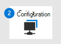

# Migrer vers Microsoft Defender pour Office 365 - Phase 1 : Préparer

**S’applique à**
- [Microsoft Defender pour Office 365 : offre 1 et offre 2](defender-for-office-365.md)

 

|   Phase 1 : préparation|   [Phase 2 : configuration](migrate-to-defender-for-office-365-setup.md)|   [Phase 3 : intégration](migrate-to-defender-for-office-365-onboard.md)|
|---|---|---|
|*Vous êtes là !*|||

Bienvenue dans **la phase 1 : Préparez** votre migration vers Microsoft Defender pour **[Office 365](migrate-to-defender-for-office-365.md#the-migration-process)**! Cette phase de migration comprend les étapes suivantes. Vous devez tout d’abord inventorier les paramètres de votre service de protection existant avant d’apporter des modifications. Dans le cas contraire, vous pouvez suivre les étapes restantes dans n’importe quel ordre :

1. [Inventorier les paramètres de votre service de protection existant](#inventory-the-settings-at-your-existing-protection-service)
2. [Vérifiez votre configuration de protection existante dans Microsoft 365](#check-your-existing-protection-configuration-in-microsoft-365)
3. [Vérifier la configuration du routage du courrier](#check-your-mail-routing-configuration)
4. [Déplacer des fonctionnalités qui modifient des messages Microsoft 365](#move-features-that-modify-messages-into-microsoft-365)
5. [Définir le courrier indésirable et les expériences utilisateur en bloc](#define-spam-and-bulk-user-experiences)
6. [Identifier et désigner les comptes prioritaires](#identify-and-designate-priority-accounts)

## Inventorier les paramètres de votre service de protection existant

Un inventaire complet des paramètres, règles, exceptions, etc. de votre service de protection existant est une bonne idée, car vous n’avez probablement pas accès aux informations après l’annulation de votre abonnement.

**Toutefois, il est très important de ne pas recréer automatiquement ou arbitrairement toutes vos personnalisations existantes dans Defender pour Office 365.** Au mieux, vous pouvez introduire des paramètres qui ne sont plus requis, pertinents ou fonctionnels. Au pire, certaines de vos personnalisations précédentes peuvent créer des problèmes de sécurité dans Defender pour Office 365.

Vos tests et observations des fonctionnalités natives et du comportement de Defender pour Office 365 détermineront finalement les remplacements et les paramètres dont vous avez besoin. Il peut s’avérer utile de classer les paramètres de votre service de protection existant dans les catégories suivantes :

- **Filtrage des connexions** ou du contenu : vous découvrirez probablement que vous n’avez pas besoin de la plupart de ces personnalisations dans Defender pour Office 365.
- **Routage d’entreprise**: la majorité des personnalisations que vous devez recréer relèveront probablement de cette catégorie. Par exemple, vous pouvez recréer ces paramètres dans Microsoft 365 en tant que règles de flux de messagerie Exchange (également appelées règles de transport), connecteurs et exceptions à l’usurpation d’intelligence.

Au lieu de déplacer les anciens paramètres de manière Microsoft 365, nous vous recommandons une approche en cascade qui implique une phase pilote avec une appartenance utilisateur croissante et un réglage basé sur l’observation en fonction de l’équilibrage des considérations de sécurité avec les besoins de l’entreprise.

## Vérifiez votre configuration de protection existante dans Microsoft 365

Comme nous l’avons indiqué précédemment, il est impossible de désactiver complètement toutes les fonctionnalités de protection du courrier remis en Microsoft 365, même lorsque vous utilisez un service de protection tiers. Par exemple, il n’est pas rare qu’une Microsoft 365 organisation dispose d’au moins certaines fonctionnalités de protection du courrier électronique configurées. Par exemple :

- Dans le passé, vous n’utilisiez pas le service de protection tiers avec Microsoft 365. Vous avez peut-être utilisé et configuré certaines fonctionnalités de protection Microsoft 365 sont actuellement ignorées. Toutefois, ces paramètres peuvent prendre effet lorsque vous « activez la numérotation » pour activer les fonctionnalités de protection Microsoft 365.
- Il se peut que vous Microsoft 365 une protection contre les faux positifs (messages positifs marqués comme faux) ou les faux négatifs (courrier indésirable autorisé) qui ont été mis en place par le biais de votre service de protection existant.

Examinez vos fonctionnalités de protection existantes dans Microsoft 365 et envisagez de supprimer ou de simplifier les paramètres qui ne sont plus nécessaires. Un paramètre de règle ou de stratégie qui était requis il y a des années peut mettre l’organisation en danger et créer des lacunes involontaires dans la protection.

## Vérifier la configuration du routage du courrier

- Si vous utilisez un type de routage complexe (par exemple, le transport de courrier [centralisé),](/exchange/transport-options)vous devez envisager de simplifier votre routage et de le documenter minutieusement. Les sauts externes, en particulier Microsoft 365 réception du message, peuvent compliquer la configuration et la résolution des problèmes.

- Le flux de messagerie sortant et de relais n’entre pas dans le cadre de cet article. Toutefois, sachez que vous devrez peut-être suivre une ou plusieurs des étapes suivantes :
  - Vérifiez que tous les domaines que vous utilisez pour envoyer des messages électroniques ont les enregistrements SPF appropriés. Pour plus d’informations, consultez [Configurer SPF pour prévenir l’usurpation d’identité](set-up-spf-in-office-365-to-help-prevent-spoofing.md).
  - Nous vous recommandons vivement de configurer la signature DKIM Microsoft 365. Pour plus d’informations, [voir Utiliser DKIM pour valider le courrier sortant.](use-dkim-to-validate-outbound-email.md)
  - Si vous ne routez pas le courrier directement à partir de Microsoft 365, vous devez modifier ce routage en supprimant ou en modifiant le connecteur sortant.

- L’Microsoft 365 pour relayer le courrier électronique à partir de vos serveurs de messagerie locaux peut être un projet complexe en soi. Un exemple simple est un petit nombre d’applications ou d’appareils qui envoient la plupart de leurs messages à des destinataires internes et qui ne sont pas utilisés pour les publipostages de masse. Pour [plus d’informations,](/exchange/mail-flow-best-practices/how-to-set-up-a-multifunction-device-or-application-to-send-email-using-microsoft-365-or-office-365) voir ce guide. Les environnements plus étendus devront être plus réfléchis. Les messages électroniques et les messages marketing qui pourraient être considérés comme du courrier indésirable par les destinataires ne sont pas autorisés.

- Defender pour Office 365 ne dispose pas de fonctionnalité pour l’agrégation des rapports DMARC. Visitez le [catalogue DEA (Microsoft Intelligent Security Association)](https://www.microsoft.com/misapartnercatalog) pour afficher les fournisseurs tiers qui proposent des rapports DMARC pour Microsoft 365.

## Déplacer des fonctionnalités qui modifient des messages Microsoft 365

Vous devez transférer toutes les personnalisations ou fonctionnalités qui modifient les messages d’une Microsoft 365. Par exemple, votre service de protection existant ajoute une balise **Externe** à l’objet ou au corps des messages provenant d’expéditeurs externes.

Si vous ne désactivez pas cette fonctionnalité dans votre service de protection existant, vous pouvez vous attendre à ce que les résultats négatifs suivants s’Microsoft 365 :

- DKIM va se rompre.
- [La veille contre l’usurpation](anti-spoofing-protection.md) d’informations ne fonctionne pas correctement.
- Vous recevrez probablement un nombre élevé de faux positifs (bon courrier marqué comme faux positif).

Pour recréer cette fonctionnalité dans Microsoft 365, vous avez les options suivantes :

- La Outlook de sortie [de l’expéditeur externe,](https://techcommunity.microsoft.com/t5/exchange-team-blog/native-external-sender-callouts-on-email-in-outlook/ba-p/2250098)ainsi que les conseils de sécurité du [premier contact.](set-up-anti-phishing-policies.md#first-contact-safety-tip)
- Règles de flux de messagerie (également appelées règles de transport). Pour plus d’informations, consultez les clauses d’exclusion de [responsabilité, les signatures,](/exchange/security-and-compliance/mail-flow-rules/disclaimers-signatures-footers-or-headers)les pieds de bas de gamme ou les en-têtes des messages à l’échelle de l’Exchange Online .

## Tenir compte des simulations de hameçonnage actives

Si vous avez des simulations de hameçonnage tierces actives, vous devez empêcher les messages, liens et pièces jointes d’être identifiés comme hameçonnage par Defender pour Office 365. Pour plus d’informations, voir Configurer des simulations de [hameçonnage tiers dans la stratégie de remise avancée.](configure-advanced-delivery.md#use-the-microsoft-365-defender-portal-to-configure-third-party-phishing-simulations-in-the-advanced-delivery-policy)

## Définir le courrier indésirable et les expériences utilisateur en bloc

- **Mise en quarantaine et envoi dans le** dossier Courrier indésirable : la réponse naturelle et recommandée pour les messages malveillants et sans aucun risque consiste à mettre les messages en quarantaine. Mais comment souhaitez-vous que vos utilisateurs gèrent les messages moins dangereux, tels que le courrier indésirable et les messages en nombre (également appelés *messages gris).* Ces types de messages doivent-ils être remis aux dossiers courrier indésirable de l’utilisateur ?

  Avec nos paramètres de sécurité Standard, nous livrons généralement ces types de messages moins risqués au dossier Courrier indésirable. Ce comportement est semblable à de nombreuses offres de messagerie grand public, où les utilisateurs peuvent vérifier leur dossier Courrier indésirable pour les messages manquants, et ils peuvent les identifier eux-mêmes. Ou, si l’utilisateur s’est intentionnellement inscrit à un bulletin d’informations ou à un courrier marketing, il peut choisir de se désabonner ou de bloquer l’expéditeur pour sa propre boîte aux lettres.

  Toutefois, de nombreux utilisateurs d’entreprise sont habitués à peu (le caser) de messages dans leur dossier Courrier indésirable. Au lieu de cela, ces utilisateurs d’entreprise sont utilisés pour vérifier la mise en quarantaine de leurs messages manquants. La mise en quarantaine introduit des problèmes de notifications de mise en quarantaine, de fréquence de notification et d’autorisations requises pour afficher et libérer des messages.

  - Les clés de domaine DKIM (Domain Keys Identified Mail) sont en pause.
  - [La veille contre l’usurpation](anti-spoofing-protection.md) d’informations ne fonctionne pas correctement.
  - Vous recevrez probablement un nombre élevé de faux positifs (bon courrier marqué comme faux positif).

  En fin de compte, c’est vous qui décidez d’empêcher la remise du courrier électronique dans le dossier Courrier indésirable en faveur de la remise en quarantaine. Toutefois, une chose est certaine : si l’expérience de Defender pour Office 365 est différente de celle utilisée par vos utilisateurs, vous devez les informer et leur fournir une formation de base. Intégrez les connaissances du pilote et assurez-vous que les utilisateurs sont préparés à tout nouveau comportement pour la remise du courrier électronique.

- **Courrier en nombre** souhaité et courrier indésirable : de nombreux systèmes de protection permettent aux utilisateurs d’autoriser ou de bloquer les messages électroniques en nombre pour eux-mêmes. Ces paramètres ne migrent pas facilement vers Microsoft 365, vous devez envisager de travailler avec des vip et leur personnel pour recréer leurs configurations existantes dans Microsoft 365.

  Aujourd’hui, Microsoft 365 considère certains messages en masse (par exemple, des bulletins d’informations) comme étant sûrs en fonction de la source du message. Le courrier provenant de ces sources « fiables » n’est actuellement pas marqué comme étant en bloc (le niveau de réclamation en bloc ou bcl est 0 ou 1), il est donc difficile de bloquer globalement le courrier provenant de ces sources. Pour la plupart des utilisateurs, la solution consiste à leur demander de se désabonner individuellement de ces messages en nombre ou d’utiliser Outlook pour bloquer l’expéditeur. Toutefois, certains utilisateurs n’aimeront pas bloquer ou se désinscrire des messages en masse eux-mêmes.

  Les règles de flux de messagerie qui filtrent les messages électroniques en masse peuvent être utiles lorsque les utilisateurs VIP ne souhaitent pas les gérer eux-mêmes. Pour plus d’informations, voir [Utiliser des règles de flux de messagerie pour filtrer les messages électroniques en nombre.](/exchange/security-and-compliance/mail-flow-rules/use-rules-to-filter-bulk-mail.md)

## Identifier et désigner les comptes prioritaires

Si la fonctionnalité est disponible, les  comptes de priorité et les **balises** utilisateur peuvent vous aider à identifier vos Microsoft 365 utilisateurs importants afin qu’ils se démarquent dans les rapports. Pour plus d’informations, voir [Balises utilisateur](user-tags.md) dans Microsoft Defender pour Office 365 gérer et surveiller [les comptes prioritaires.](/microsoft-365/admin/setup/priority-accounts)

## Étape suivante

**Félicitations**! Vous avez terminé la phase **de** préparation de [votre migration vers Microsoft Defender pour Office 365](migrate-to-defender-for-office-365.md#the-migration-process)!

- Passer à [la phase 2 : installation.](migrate-to-defender-for-office-365-setup.md)
