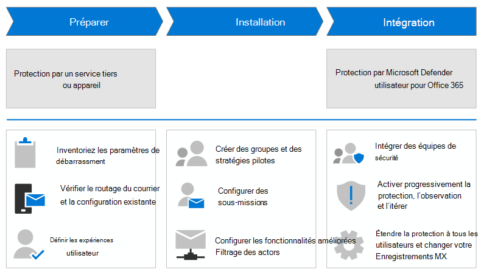

# Migrer d’un service ou d’un appareil de protection tiers vers Microsoft Defender pour Office 365

**S’applique à**
- [Microsoft Defender pour Office 365 : offre 1 et offre 2](defender-for-office-365.md)

Ce guide fournit des étapes spécifiques et actionnables pour la migration d’un service ou d’un appareil de protection tiers vers Microsoft Defender pour Office 365. Ce guide suppose les faits suivants :

- Vous avez déjà Microsoft 365 boîtes aux lettres, mais vous utilisez actuellement un service ou un appareil tiers pour la protection de la messagerie. Les messages provenant d’Internet circulent via le service de protection avant leur remise dans votre organisation Microsoft 365, et la protection Microsoft 365 est aussi faible que possible (elle n’est jamais complètement éteinte ; par exemple, la protection contre les programmes malveillants est toujours appliquée).

  

- Vous dépassez la phase d’examen et de prise en compte de la protection par Defender Office 365. Si vous avez besoin d’évaluer Defender pour Office 365 pour déterminer s’il est bon pour votre organisation, nous vous recommandons d’envisager le [mode d’évaluation.](office-365-evaluation.md)

- Vous avez déjà acheté Defender pour Office 365 licences.

- Vous devez retirer votre service de protection tiers existant, ce qui signifie que vous devrez finalement faire pointer les enregistrements MX de vos domaines de messagerie vers Microsoft 365. Lorsque vous avez terminé, le courrier provenant d’Internet circule directement dans Microsoft 365 et est protégé exclusivement par Exchange Online Protection (EOP) et Defender pour Office 365.

  

L’élimination de votre service de protection existant au profit de Defender pour Office 365 est une étape importante que vous ne devez pas prendre à la légère, et vous ne devez pas vous presser pour apporter les changements. Les instructions de ce guide de migration vous aideront à migrer votre protection de manière ordonnée avec une perturbation minimale pour vos utilisateurs.

Les étapes de migration de très haut niveau sont illustrées dans le diagramme suivant. Les étapes réelles sont répertoriées dans la section nommée [Processus de migration](#the-migration-process) plus loin dans cet article.

## Pourquoi utiliser les étapes de ce guide ?

Dans le secteur de l’industrie de l’it, les surprises sont généralement mauvaises. Le simple retournement de vos enregistrements MX pour qu’ils pointent vers Microsoft 365 sans test préalable et réfléchi entraîne de nombreuses surprises. Par exemple :

- Vous ou vos prédécesseurs avez probablement consacré beaucoup de temps et d’efforts à personnaliser votre service de protection existant pour une remise optimale du courrier (en d’autres termes, en bloquant ce qui doit être bloqué et en permettant ce qui doit être autorisé). Il est presque certain que toutes les personnalisations de votre service de protection actuel ne sont pas requises dans Defender Office 365. Il est également très possible que Defender pour Office 365 introduise de nouveaux problèmes (autoriser ou bloquer) qui n’ont pas eu lieu ou n’ont pas été requis dans votre service de protection actuel.
- Votre service d’aide et le personnel de sécurité doivent savoir quoi faire dans Defender pour Office 365. Par exemple, si un utilisateur se plaindra d’un message manquant, votre service d’aide sait-il où et comment le rechercher ? Ils sont probablement familiarisés avec les outils de votre service de protection existant, mais qu’en est-il des outils de Defender pour Office 365 ?

En revanche, si vous suivez les étapes de ce guide de migration, vous bénéficiez des avantages concrets suivants pour votre migration :

- Perturbation minimale pour les utilisateurs.
- Données objectives de Defender pour Office 365 que vous pouvez utiliser lorsque vous signalez la progression et la réussite de la migration vers la gestion.
- Implication précoce et instructions pour le service d’aide et le personnel de sécurité.

Plus vous vous familiarisez avec l’impact de Defender pour Office 365 sur votre organisation, meilleure sera la transition pour les utilisateurs, le personnel du service d’aide, le personnel de sécurité et la direction.

Ce guide de migration vous donne un plan pour « transformer progressivement la numérotation » afin que vous pouvez surveiller et tester l’impact de Defender pour Office 365 sur vos utilisateurs et leurs messages électroniques afin de pouvoir réagir rapidement aux problèmes que vous rencontrez.

## Processus de migration

Le processus de migration d’un service de protection tiers vers Defender pour Office 365 peut être divisé en trois phases, comme décrit dans le tableau suivant :

****

|Phase|Description|
|---|---|
|[Préparer votre migration](migrate-to-defender-for-office-365-prepare.md)|<ol><li>[Inventorier les paramètres de votre service de protection existant](migrate-to-defender-for-office-365-prepare.md#inventory-the-settings-at-your-existing-protection-service)</li><li>[Vérifiez votre configuration de protection existante dans Microsoft 365](migrate-to-defender-for-office-365-prepare.md#check-your-existing-protection-configuration-in-microsoft-365)</li><li>[Vérifier la configuration du routage du courrier](migrate-to-defender-for-office-365-prepare.md#check-your-mail-routing-configuration)</li><li>[Déplacer des fonctionnalités qui modifient des messages Microsoft 365](migrate-to-defender-for-office-365-prepare.md#move-features-that-modify-messages-into-microsoft-365)</li><li>[Définir le courrier indésirable et les expériences utilisateur en bloc](migrate-to-defender-for-office-365-prepare.md#define-spam-and-bulk-user-experiences)</li><li>[Identifier et désigner les comptes prioritaires](migrate-to-defender-for-office-365-prepare.md#identify-and-designate-priority-accounts)</li></ol>|
|[Configurer Defender pour Office 365](migrate-to-defender-for-office-365-setup.md)|<ol><li>[Créer des groupes de distribution pour les utilisateurs pilotes](migrate-to-defender-for-office-365-setup.md#step-1-create-distribution-groups-for-pilot-users)</li><li>[Configurer l’envoi d’utilisateurs pour les rapports de messages utilisateur](migrate-to-defender-for-office-365-setup.md#step-2-configure-user-submission-for-user-message-reporting)</li><li>[Gérer ou créer la règle de flux de messagerie SCL=-1](migrate-to-defender-for-office-365-setup.md#step-3-maintain-or-create-the-scl-1-mail-flow-rule)</li><li>[Configurer le filtrage amélioré pour les connecteurs](migrate-to-defender-for-office-365-setup.md#step-4-configure-enhanced-filtering-for-connectors)</li><li>[Créer des stratégies de protection pilote](migrate-to-defender-for-office-365-setup.md#step-5-create-pilot-protection-policies)</li></ol>|
|[Intégration à Defender pour Office 365](migrate-to-defender-for-office-365-onboard.md)|<ol><li>[Commencer l’intégration des Teams](migrate-to-defender-for-office-365-onboard.md#step-1-begin-onboarding-security-teams)</li><li>[(Facultatif) Exempter les utilisateurs pilotes du filtrage par votre service de protection existant](migrate-to-defender-for-office-365-onboard.md#step-2-optional-exempt-pilot-users-from-filtering-by-your-existing-protection-service)</li><li>[Régler la veille contre l’usurpation d’informations](migrate-to-defender-for-office-365-onboard.md#step-3-tune-spoof-intelligence)</li><li>[Régler la protection contre l’emprunt d’identité et l’intelligence des boîtes aux lettres](migrate-to-defender-for-office-365-onboard.md#step-4-tune-impersonation-protection-and-mailbox-intelligence)</li><li>[Utiliser les données des envois d’utilisateurs pour mesurer et ajuster](migrate-to-defender-for-office-365-onboard.md#step-5-use-data-from-user-submissions-to-measure-and-adjust)</li><li>[(Facultatif) Ajouter d’autres utilisateurs à votre projet pilote et itérer](migrate-to-defender-for-office-365-onboard.md#step-6-optional-add-more-users-to-your-pilot-and-iterate)</li><li>[Étendre Microsoft 365 protection à tous les utilisateurs et désactiver la règle de flux de messagerie SCL=-1](migrate-to-defender-for-office-365-onboard.md#step-7-extend-microsoft-365-protection-to-all-users-and-turn-off-the-scl-1-mail-flow-rule)</li><li>[Changer vos enregistrements MX](migrate-to-defender-for-office-365-onboard.md#step-8-switch-your-mx-records)</li></ol>|
|

## Étape suivante

- Passer à [la phase 1 : installation.](migrate-to-defender-for-office-365-prepare.md)
