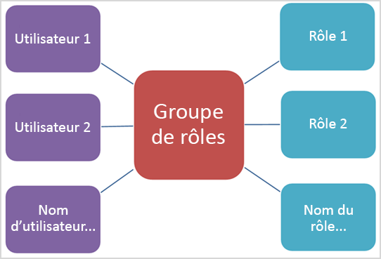

# Autorisations dans le Centre de conformité et sécurité

Le centre de sécurité & conformité vous permet d’accorder des autorisations aux personnes qui effectuent des tâches de conformité telles que la gestion des appareils, la protection contre la perte de données, la découverte électronique, la rétention, etc. Ces personnes peuvent effectuer uniquement les tâches auxquelles vous leur accordez explicitement l’accès. Pour accéder au centre de sécurité & conformité, les utilisateurs doivent être un administrateur général ou un membre d’un ou plusieurs groupes de rôles sécurité & service de conformité.

Les autorisations dans le centre de sécurité & conformité sont basées sur le modèle d’autorisations contrôle d’accès basé sur un rôle (RBAC). Il s’agit du même modèle d’autorisations que celui utilisé par Exchange, par conséquent, si vous êtes familiarisé avec Exchange, l’octroi d’autorisations dans le centre de sécurité & conformité sera très similaire. Toutefois, il est important de ne pas oublier que les groupes de rôles Exchange et les groupes de rôles sécurité & conformité ne partagent pas d’appartenance ou d’autorisations. Si tous deux disposent d’un groupe de rôles Gestion de l’organisation, ils ne sont pas identiques. Les autorisations qu’ils accordent et les membres des groupes de rôles sont différents. Vous trouverez ci-dessous une liste des groupes de rôles sécurité & conformité.

## Relation entre les membres, les rôles et les groupes de rôles

Un **rôle** accorde des autorisations pour un ensemble de tâches ; par exemple, le rôle Gestion des cas permet aux personnes d’utiliser des cas de découverte électronique.

Un **groupe** de rôles est un ensemble de rôles qui permet aux utilisateurs d’effectuer leur travail dans le centre de conformité & en matière de sécurité ; par exemple, le groupe de rôles Administrateur de conformité inclut les rôles de gestion des dossiers, de recherche de contenu et de configuration de l’organisation (en plus d’autres), car une personne qui est un administrateur de conformité aura besoin des autorisations pour ces tâches pour effectuer leur travail.

Le centre de sécurité & conformité inclut les groupes de rôles par défaut pour les tâches et les fonctions les plus courantes auxquelles vous devrez attribuer des personnes. Nous vous recommandons d’ajouter simplement des utilisateurs individuels en tant que **membres** aux groupes de rôles par défaut.

## Autorisations nécessaires pour utiliser les fonctionnalités dans le centre de sécurité & conformité

Le tableau suivant répertorie les groupes de rôles par défaut disponibles dans le centre de sécurité & conformité et les rôles attribués par défaut aux groupes de rôles. Pour accorder des autorisations à un utilisateur afin d’effectuer une tâche de conformité, ajoutez-le au groupe de rôles sécurité & conformité approprié.

La gestion des autorisations dans le centre de sécurité & conformité offre uniquement aux utilisateurs l’accès aux fonctionnalités de conformité disponibles dans le centre de sécurité & conformité. Si vous souhaitez accorder des autorisations à d’autres fonctionnalités de conformité qui ne figurent pas dans le centre de sécurité &, telles que les règles de flux de messagerie Exchange (également appelées règles de transport), vous devez utiliser le centre d’administration Exchange.

Pour savoir comment accorder l’accès au centre de sécurité & conformité, consultez la rubrique [accorder aux utilisateurs l’accès au centre d’administration de conformité Microsoft 365](grant-access-to-the-security-and-compliance-center.md).

****

|Groupe de rôles|Description|Rôles par défaut attribués|
|---|---|---|
|**Administrateur de conformité**1|Les membres peuvent gérer les paramètres de gestion des périphériques, de protection contre la perte de données, des rapports et de conservation.|Gestion des cas    Administrateur de conformité de communication    Analyse de la conformité de la communication    Gestion des cas de conformité de la communication    Enquête sur la conformité de la communication    Visionneuse de conformité de la communication    Fournisseur de commentaires sur la classification des données    Réviseur de la classification des données    Gestion de l’enquête sur les données    Administrateur de conformité    Recherche de conformité    Gestion des appareils    Gestion des destructions    Gestion de la conformité DLP    Suspension    Gestion de la conformité IB    Gérer les alertes    Configuration de l’Organisation    RecordManagement    Gestion de la rétention    Journaux d'audit en affichage seul    Gestion des appareils en affichage seul    Gestion de la conformité DLP en affichage seul    Gestion de la conformité IB en affichage seul    Vue gérer uniquement les alertes    Afficher uniquement les destinataires    Gestion des enregistrements en affichage seul    Gestion de la rétention en affichage seul    |
|**Administrateur des données de conformité**|Les membres peuvent gérer les paramètres de gestion des périphériques, de protection des données, de protection contre la perte de données, de rapports et de conservation.|Administrateur de conformité    Recherche de conformité    Gestion de la conformité DLP    Gestion des appareils    Gestion des destructions    Gestion de la conformité IB    Gérer les alertes    Configuration de l’Organisation    RecordManagement    Gestion de la rétention    Administrateur d’étiquette de sensibilité    Journaux d'audit en affichage seul    Gestion de la conformité DLP en affichage seul    Gestion des appareils en affichage seul    Gestion de la conformité IB en affichage seul    Vue gérer uniquement les alertes    Afficher uniquement les destinataires    Gestion des enregistrements en affichage seul    Gestion de la rétention en affichage seul|
|**Visionneuse de contenu de l’Explorateur de contenu**|Affichez les fichiers de contenu dans l’Explorateur de contenu.|Visionneuse de contenu de classification des données|
|**Afficheur de liste de l’Explorateur de contenu**|Afficher tous les éléments dans l’Explorateur de contenu sous forme de liste uniquement.|Visionneuse de liste de classification des données|
|**Expérimentateur de données**|Les membres peuvent effectuer des recherches sur les boîtes aux lettres, les sites SharePoint et les comptes OneDrive.|Communication    Recherche de conformité    Custodian    Gestion de l’enquête sur les données    Exporter   Aperçu    Déchiffrement RMS    Révision   Recherche et purge|
|**Gestionnaire eDiscovery**|Les membres peuvent effectuer des recherches et placer des conservations sur les boîtes aux lettres, les sites SharePoint Online et les emplacements OneDrive Entreprise. Les membres peuvent également créer et gérer des cas de découverte électronique, ajouter et supprimer des membres à un cas, créer et modifier des recherches de contenu associées à un cas, et accéder à des données de cas dans Advanced eDiscovery.    Un administrateur eDiscovery est un membre du groupe de rôles Gestionnaire eDiscovery auquel ont été attribuées des autorisations supplémentaires. Outre les tâches qu’un gestionnaire eDiscovery peut effectuer, un administrateur eDiscovery peut :<ul><li>Afficher tous les cas eDiscovery au sein de l’organisation.</li><li>Gérer tous les cas eDiscovery après s’être ajouté en tant que membre du cas.</li></ul>   La principale différence entre un gestionnaire eDiscovery et un administrateur eDiscovery est qu’un administrateur de découverte électronique peut accéder à tous les cas répertoriés sur la page **cas eDiscovery** dans le centre de sécurité & conformité. Un gestionnaire eDiscovery ne peut accéder qu’aux incidents qu’il a créés ou dont il est membre. Pour plus d’informations sur la façon de faire d’un utilisateur un administrateur de découverte électronique, consultez [la rubrique attribution d’autorisations eDiscovery dans le centre de sécurité & conformité](../../compliance/assign-ediscovery-permissions.md).|Gestion des cas    Communication    Recherche de conformité    Custodian    Exporter    Suspension    Aperçu    Déchiffrement RMS    Révision|
|**Lecteur général**|Les membres ont un accès en lecture seule aux rapports, aux alertes et peuvent afficher tous les paramètres et la configuration.   La principale différence entre le lecteur global et le lecteur de sécurité est qu’un lecteur global peut accéder à la **configuration et aux paramètres**.|Lecteur de sécurité    Lecteur d’étiquette de sensibilité    Vue de service assurance    Journaux d'audit en affichage seul    Gestion de la conformité DLP en affichage seul    Gestion des appareils en affichage seul    Gestion de la conformité IB en affichage seul    Vue gérer uniquement les alertes    Afficher uniquement les destinataires    Gestion des enregistrements en affichage seul    Gestion de la rétention en affichage seul|
|**Gestion des risques initiés**|Ce groupe de rôles permet de gérer la gestion des risques internes pour votre organisation au sein d’un seul groupe. En ajoutant tous les comptes d’utilisateur pour les administrateurs, analystes et enquêteurs désignés, vous pouvez définir des autorisations de gestion des risques internes dans un seul groupe. Ce groupe de rôles contient tous les rôles d’autorisation de gestion des risques internes. Il s’agit de la manière la plus simple de prendre en main la gestion des risques internes par les organisations qui n’ont pas besoin d’autorisations distinctes définies pour différents groupes d’utilisateurs.|Gestion des cas    Administrateur de gestion des risques des Insiders    Analyse de la gestion des risques des Insiders    Enquête sur la gestion des risques des Insiders    Contribution temporaire à la gestion des risques initiés|
|**Administrateurs de gestion des risques des Insiders**|Utilisez ce groupe de rôles pour configurer initialement la gestion des risques initiés et, par la suite, pour séparer les administrateurs des risques des Insiders en un groupe défini. Les utilisateurs de ce groupe de rôles peuvent créer, lire, mettre à jour et supprimer des stratégies de gestion des risques internes, des paramètres globaux et des affectations de groupe de rôles.|Gestion des cas    Administrateur de gestion des risques des Insiders|
|**Analystes de gestion des risques Insiders**|Utilisez ce groupe pour affecter des autorisations aux utilisateurs qui agiront comme des analystes de cas de risque internes. Les utilisateurs de ce groupe de rôles peuvent accéder à tous les modèles d’alertes, de cas et de notifications de gestion des risques internes. Ils ne peuvent pas accéder à l’Explorateur de contenu de risques internes.|Gestion des cas    Analyse de la gestion des risques des Insiders|
|**Investigateurs de gestion des risques Insiders**|Utilisez ce groupe pour affecter des autorisations aux utilisateurs qui agiront comme des enquêteurs de données de risque internes. Les utilisateurs de ce groupe de rôles peuvent accéder à tous les modèles d’alertes, de cas, de notifications de gestion des risques internes et d’Explorateur de contenu dans tous les cas.|Gestion des cas    Enquête sur la gestion des risques des Insiders|
|**Collaborateurs IRM**|Ce groupe de rôles est visible, mais il est utilisé par les services d’arrière-plan uniquement.|Contribution temporaire à la gestion des risques initiés|
|**Administrateur de flux de flux**|Les membres peuvent surveiller et afficher les informations et les rapports sur le flux de messagerie dans le centre de sécurité & conformité. Les administrateurs globaux peuvent ajouter des utilisateurs ordinaires à ce groupe, mais si l’utilisateur n’est pas membre du groupe d’administration Exchange, il n’aura pas accès aux tâches liées à l’administration d’Exchange.|Afficher uniquement les destinataires|
|**Gestion de l’organisation**1|Les membres peuvent contrôler les autorisations d’accès aux fonctionnalités dans le centre de sécurité & Compliance Center, ainsi que gérer les paramètres de gestion des périphériques, de protection contre la perte de données, de rapports et de conservation.    Notez que, pour qu’un utilisateur qui n’est pas administrateur général puisse voir la liste des appareils gérés par MDM pour Microsoft 365 et effectuer des actions sur ces appareils, comme la suppression d’un appareil de MDM pour Microsoft 365, l’utilisateur doit être un administrateur Exchange.    Les administrateurs globaux sont automatiquement ajoutés en tant que membres de ce groupe de rôles.|Journaux d’audit    Gestion des cas    Administrateur de conformité    Recherche de conformité    Gestion des appareils    Gestion de la conformité DLP    Suspension    Gestion de la conformité IB    Gérer les alertes    Configuration de l’Organisation    Quarantaine    RecordManagement    Gestion de la rétention    Gestion des rôles    Recherche et purge    Administrateur de sécurité    Lecteur de sécurité    Administrateur d’étiquette de sensibilité    Lecteur d’étiquette de sensibilité    Vue de service assurance    Journaux d'audit en affichage seul    Gestion de la conformité DLP en affichage seul    Gestion des appareils en affichage seul    Gestion de la conformité IB en affichage seul    Vue gérer uniquement les alertes    Afficher uniquement les destinataires    Gestion des enregistrements en affichage seul    Gestion de la rétention en affichage seul|
|**Administrateur de quarantaine**|Les membres peuvent accéder à toutes les actions de mise en quarantaine. Pour plus d’informations, consultez la rubrique [gestion des messages et des fichiers mis en quarantaine en tant qu’administrateur dans OEOP](manage-quarantined-messages-and-files.md)|Quarantaine|
|**Gestion des enregistrements**|Les membres peuvent gérer et supprimer le contenu des enregistrements.|RecordManagement|
|**Relecteur**|Les membres peuvent uniquement afficher la liste des incidents sur la page des cas eDiscovery dans le centre de sécurité & conformité. Ils ne peuvent pas créer, ouvrir ou gérer un cas de découverte électronique. Le principal objectif de ce groupe de rôles est de permettre aux membres d’afficher et d’accéder aux données de cas dans [Advanced eDiscovery (](../../compliance/office-365-advanced-ediscovery.md) également appelé *Advanced eDiscovery v1*).    Ce groupe de rôles dispose des autorisations les plus restrictives liées à la découverte électronique.  **Remarque :** Pour l’instant, les utilisateurs membres du groupe de rôles réviseur ne peuvent pas accéder aux données dans [Advanced eDiscovery dans Microsoft 365](../../compliance/overview-ediscovery-20.md) (également appelé *Advanced eDiscovery v2*). Pour ajouter des membres à un cas dans Advanced eDiscovery v2 afin qu’ils puissent consulter les données d’un incident, un utilisateur doit être membre du groupe de rôles gestionnaire eDiscovery.|Révision|
|**Administrateur de la sécurité**|Les membres ont accès à un certain nombre de fonctionnalités de sécurité du centre de protection des identités, la gestion des identités privilégiées, la surveillance de l’intégrité du service Microsoft 365 et la sécurité & Centre de conformité.    Par défaut, ce groupe de rôles ne semble pas avoir de membres. Toutefois, le rôle administrateur de sécurité d’Azure Active Directory est affecté à ce groupe de rôles. Par conséquent, ce groupe de rôles hérite des fonctionnalités et de l’appartenance au rôle administrateur de sécurité d’Azure Active Directory.    Pour gérer les autorisations de façon centralisée, ajoutez ou supprimez des membres du groupe dans le centre d’administration Azure Active Directory. Pour plus d’informations, consultez la rubrique [autorisations de rôle d’administrateur dans Azure Active Directory](https://docs.microsoft.com/azure/active-directory/users-groups-roles/directory-assign-admin-roles). Si vous modifiez ce groupe de rôles dans le centre de sécurité & conformité (appartenance ou rôles), ces modifications s’appliquent uniquement au centre de sécurité & de conformité et non à d’autres services.    Ce groupe de rôles inclut toutes les autorisations en lecture seule du rôle lecteur de sécurité, ainsi qu’un certain nombre d’autorisations d’administration supplémentaires pour les mêmes services : Azure information protection, Identity Protection Center, Privileged Identity Management, Monitor Microsoft 365 service Health, and Security & Compliance Center.|Journaux d’audit    Gestion de la conformité DLP    Gestion des appareils    Gestion de la conformité IB    Gérer les alertes    Quarantaine    Administrateur de sécurité    Administrateur d’étiquette de sensibilité    Journaux d'audit en affichage seul    Gestion de la conformité DLP en affichage seul    Gestion des appareils en affichage seul    Gestion de la conformité IB en affichage seul    Vue gérer uniquement les alertes|
|**Opérateur de sécurité**|Les membres peuvent gérer les alertes de sécurité et afficher également les rapports et les paramètres des fonctionnalités de sécurité.|Recherche de conformité    Gérer les alertes    Lecteur de sécurité    Journaux d'audit en affichage seul    Gestion de la conformité DLP en affichage seul    Gestion des appareils en affichage seul    Gestion de la conformité IB en affichage seul    Vue gérer uniquement les alertes|
|**Lecteur de sécurité**|Les membres disposent d’un accès en lecture seule à un certain nombre de fonctionnalités de sécurité du centre de protection des identités, de la gestion des identités privilégiées, de l’intégrité du service Microsoft 365 et de la sécurité & Centre de conformité.    Par défaut, ce groupe de rôles ne semble pas avoir de membres. Toutefois, le rôle de lecteur de sécurité d’Azure Active Directory est affecté à ce groupe de rôles. Par conséquent, ce groupe de rôles hérite des fonctionnalités et de l’appartenance au rôle de lecteur de sécurité d’Azure Active Directory.    Pour gérer les autorisations de façon centralisée, ajoutez ou supprimez des membres du groupe dans le centre d’administration Azure Active Directory. Pour plus d’informations, consultez la rubrique [autorisations de rôle d’administrateur dans Azure Active Directory](https://docs.microsoft.com/azure/active-directory/users-groups-roles/directory-assign-admin-roles). Si vous modifiez ce groupe de rôles dans le centre de sécurité & conformité (appartenance ou rôles), ces modifications s’appliquent uniquement au centre de sécurité & de conformité et non à d’autres services.|Lecteur de sécurité    Lecteur d’étiquette de sensibilité    Gestion de la conformité DLP en affichage seul    Gestion des appareils en affichage seul    Gestion de la conformité IB en affichage seul    Vue gérer uniquement les alertes|
|**Utilisateur de la certification de service**|Les membres peuvent accéder à la section assurance de service dans le centre de sécurité & conformité. Service assurance fournit des rapports et des documents qui décrivent les pratiques de sécurité Microsoft pour les données client qui sont stockées dans Microsoft 365. Il fournit également des rapports d’audit tiers indépendants sur Microsoft 365. Pour plus d’informations, consultez [la rubrique Service assurance dans le centre de sécurité & conformité](https://docs.microsoft.com/microsoft-365/compliance/service-assurance).|Vue de service assurance|
|**Vérification de surveillance**|Les membres peuvent créer et gérer les stratégies qui définissent les communications soumises à vérification dans une organisation. Pour plus d’informations, consultez [la rubrique Configurer des stratégies de conformité pour votre organisation](../../compliance/communication-compliance-configure.md).|Administrateur de la vérification de surveillance|
|

> [!NOTE]
> 1 ce groupe de rôles n’affecte pas de membres les autorisations nécessaires pour effectuer des recherches dans le journal d’audit ou pour utiliser des rapports susceptibles de contenir des données Exchange, telles que les rapports DLP ou ATP. Pour effectuer une recherche dans le journal d’audit ou pour afficher tous les rapports, l’utilisateur doit disposer d’autorisations dans Exchange Online. En effet, la cmdlet sous-jacente utilisée pour les recherches dans le journal d’audit est une cmdlet Exchange Online. Les administrateurs globaux peuvent effectuer des recherches dans le journal d’audit et afficher tous les rapports, car ils sont automatiquement ajoutés en tant que membres du groupe de rôles gestion de l’organisation dans Exchange Online. Pour plus d’informations, reportez-vous à la rubrique [Rechercher dans le journal d’audit dans le centre de sécurité & conformité](https://docs.microsoft.com/microsoft-365/compliance/search-the-audit-log-in-security-and-compliance).

## Rôles dans le centre de sécurité & conformité

Le tableau suivant répertorie les rôles disponibles et les groupes de rôles auxquels ils sont attribués par défaut.

Notez que les rôles suivants ne sont pas attribués au groupe de rôles gestion de l’organisation par défaut :

- Communication
- Administrateur de conformité de communication
- Analyse de la conformité de la communication
- Gestion des cas de conformité de la communication
- Enquête sur la conformité de la communication
- Visionneuse de conformité de la communication
- Custodian
- Visionneuse de contenu de classification des données
- Fournisseur de commentaires sur la classification des données
- Réviseur de la classification des données
- Visionneuse de liste de classification des données
- Gestion de l’enquête sur les données
- Gestion des destructions
- Exporter
- Administrateur de gestion des risques des Insiders
- Analyse de la gestion des risques des Insiders
- Enquête sur la gestion des risques des Insiders
- Contribution temporaire à la gestion des risques initiés
- Aperçu
- Révision
- Déchiffrement RMS
- Administrateur de la vérification de surveillance

****

|Role|Description|Affectations de groupe de rôles par défaut|
|---|---|---|
|**Journaux d’audit**|Activez et configurez l’audit pour l’organisation, affichez les rapports d’audit de l’organisation, puis exportez ces rapports dans un fichier.|Gestion de l’organisation    Administrateur de sécurité|
|**Gestion des cas**|Créer, modifier, supprimer et contrôler l’accès aux cas eDiscovery.|Administrateur de conformité    Le gestionnaire eDiscovery    Gestion des risques internes    Administrateurs de gestion des risques des Insiders    Analystes de gestion des risques Insiders    Investigateurs de gestion des risques Insiders    Gestion de l’organisation|
|**Communication**|Gérer toutes les communications avec les dépositaires identifiés dans un cas avancé de découverte électronique.  Créez des notifications de blocage, tenez compte des rappels et des escalades à la gestion. Suivre l’accusé de réception des notifications d’attente des dépositaires et gérer l’accès au portail dépositaire utilisé par chaque dépositaire dans un cas pour suivre les communications pour les cas où ils ont été identifiés en tant que dépositaire.|Le gestionnaire eDiscovery|
|**Administrateur de conformité de communication**|Permet de gérer les stratégies dans la fonctionnalité de conformité de la communication.|Administrateur de conformité|
|**Analyse de la conformité de la communication**|Permet d’effectuer une enquête et de résoudre les violations de message dans la fonctionnalité de conformité de la communication. Peut uniquement afficher les métadonnées de message.|Administrateur de conformité|
|**Gestion des cas de conformité de la communication**|Utilisé pour accéder aux cas de conformité de communication.|Administrateur de conformité|
|**Enquête sur la conformité de la communication**|Permet d’effectuer des recherches, des corrections et de passer en revue les violations de message dans la fonctionnalité de conformité de la communication. Peut afficher les métadonnées et le message d’un message.|Administrateur de conformité|
|**Visionneuse de conformité de la communication**|Utilisé pour accéder aux rapports et aux widgets dans la fonctionnalité de conformité de la communication.||
|**Administrateur de conformité**|Afficher et modifier des paramètres et des rapports pour les fonctionnalités de conformité.|Administrateur de conformité    Administrateur des données de conformité    Gestion de l’organisation|
|**Recherche de conformité**|Effectuer des recherches dans les boîtes aux lettres et obtenir une estimation des résultats.|Administrateur de conformité    Administrateur des données de conformité    Le gestionnaire eDiscovery    Gestion de l’organisation    Opérateur de sécurité|
|**Custodian**|Identifier et gérer les dépositaires pour les cas avancés de découverte électronique et utiliser les informations d’Azure Active Directory et d’autres sources pour rechercher des sources de données associées à des dépositaires. Associez d’autres sources de données telles que des boîtes aux lettres, des sites SharePoint et des équipes avec des dépositaires dans un cas.  Placez un blocage légal sur les sources de données associées aux dépositaires pour conserver le contenu dans le contexte d’un cas.|Le gestionnaire eDiscovery|
|**Visionneuse de contenu de classification des données**|Afficher le rendu inaltérable des fichiers dans l’Explorateur de contenu.|Visionneuse de contenu de l’Explorateur de contenu|
|**Fournisseur de commentaires sur la classification des données**|Permet de fournir des commentaires aux classifieurs dans l’Explorateur de contenu.|Administrateur de conformité|
|**Réviseur de la classification des données**|Permet de consulter les commentaires des classifieurs dans l’Explorateur de commentaires.|Administrateur de conformité|
|**Visionneuse de liste de classification des données**|Affichez la liste des fichiers dans l’Explorateur de contenu.|Afficheur de liste de l’Explorateur de contenu|
|**Gestion de l’enquête sur les données**|Créer, modifier, supprimer et contrôler l’accès aux analyses de données.|Administrateur de conformité    Expérimentateur de données|
|**Gestion des appareils**|Afficher et modifier les paramètres et les rapports des fonctionnalités de gestion des appareils.|Administrateur de conformité    Administrateur des données de conformité    Gestion de l’organisation    Administrateur de sécurité|
|**Gestion des destructions**|Contrôler les autorisations d’accès à la mise en place manuelle dans le centre de sécurité & conformité.|Administrateur de conformité    Administrateur des données de conformité|
|**Gestion de la conformité DLP**|Afficher et modifier des paramètres et des rapports pour les stratégies de protection contre la perte de données (DLP).|Administrateur de conformité    Administrateur des données de conformité    Gestion de l’organisation    Administrateur de sécurité|
|**Export**|Exporter le contenu de la boîte aux lettres et du site renvoyé par les recherches.|Le gestionnaire eDiscovery|
|**Suspension**|Placer le contenu dans les boîtes aux lettres, les sites et les dossiers publics en conservation. En cas de suspension, une copie du contenu est stockée dans un emplacement sécurisé. Les propriétaires de contenu pourront toujours modifier ou supprimer le contenu d’origine.|Administrateur de conformité    Le gestionnaire eDiscovery    Gestion de l’organisation|
|**Gestion de la conformité IB**|Afficher, créer, supprimer, modifier et tester des stratégies de barrière des informations.|Administrateur de conformité    Administrateur des données de conformité    Gestion de l’organisation    Administrateur de sécurité|
|**Administrateur de gestion des risques des Insiders**|Créer, modifier, supprimer et contrôler l’accès à la fonctionnalité de gestion des risques inSided.|Gestion des risques internes    Administrateurs de gestion des risques des Insiders|
|**Analyse de la gestion des risques des Insiders**|Accéder aux modèles alertes, incidents et notifications de gestion des risques Insider.|Gestion des risques internes    Analystes de gestion des risques Insiders|
|**Enquête sur la gestion des risques des Insiders**|Accédez à toutes les alertes de gestion des risques Insider, les cas, les modèles de notifications et l’Explorateur de contenu dans tous les cas.|Gestion des risques internes    Investigateurs de gestion des risques Insiders|
|**Contribution temporaire à la gestion des risques initiés**|Ce groupe de rôles est visible, mais il est utilisé par les services d’arrière-plan uniquement.|Collaborateurs IRM|
|**Gérer les alertes**|Afficher et modifier des paramètres et des rapports pour les alertes.|Administrateur de conformité    Administrateur des données de conformité    Gestion de l’organisation    Administrateur de sécurité    Opérateur de sécurité|
|**Configuration de l’Organisation**|Exécutez, affichez et exportez des rapports d’audit et gérez les stratégies de conformité pour DLP, les appareils et la conservation.|Administrateur de conformité    Administrateur des données de conformité    Gestion de l’organisation|
|**Aperçu**|Affichez la liste des éléments renvoyés par des recherches de contenu, puis ouvrez chaque élément de la liste pour en afficher le contenu.|Le gestionnaire eDiscovery|
|**Mise en quarantaine**|Permet d’afficher et de libérer les messages électroniques mis en quarantaine.|Administrateur de quarantaine    Administrateur de sécurité    Gestion de l’organisation|
|**RecordManagement**|Afficher et modifier la configuration et les rapports de la fonctionnalité de gestion des enregistrements.|Administrateur de conformité    Administrateur des données de conformité    Gestion de l’organisation    Gestion des enregistrements|
|**Gestion de la rétention**|Gérer les stratégies de rétention.|Administrateur de conformité    Administrateur des données de conformité    Gestion de l’organisation|
|**Révision**|Utilisez Advanced eDiscovery pour suivre, marquer, analyser et tester les documents qui leur sont affectés.|Le gestionnaire eDiscovery    Relecteur|
|**Déchiffrement RMS**|Déchiffrer le contenu protégé par RMS lors de l’exportation des résultats de la recherche.|Le gestionnaire eDiscovery|
|**Gestion des rôles**|Gérer l’appartenance à un groupe de rôles et créer ou supprimer des groupes de rôles personnalisés.|Gestion de l’organisation|
|**Recherche et purge**|Permet aux utilisateurs de supprimer en bloc des données qui répondent aux critères d’une recherche de contenu.|Gestion de l’organisation|
|**Administrateur de la sécurité**|Afficher et modifier la configuration et les rapports pour les fonctionnalités de sécurité.|Gestion de l’organisation    Administrateur de sécurité|
|**Lecteur de sécurité**|Affichez la configuration et les rapports pour les fonctionnalités de sécurité.|Gestion de l’organisation    Opérateur de sécurité    Lecteur de sécurité|
|**Administrateur d’étiquette de sensibilité**|Afficher, créer, modifier et supprimer des étiquettes de confidentialité.|Administrateur des données de conformité    Gestion de l’organisation    Administrateur de sécurité|
|**Lecteur d’étiquette de sensibilité**|Afficher la configuration et l’utilisation des étiquettes de confidentialité.|Lecteur général    Gestion de l’organisation    Lecteur de sécurité|
|**Vue de service assurance**|Téléchargez les documents disponibles à partir de la section service assurance. Le contenu inclut un audit indépendant, une documentation sur la conformité et des instructions relatives à l’utilisation des fonctionnalités de Microsoft 365 pour gérer les risques de conformité réglementaire et de sécurité.|Utilisateur de la certification de service    Gestion de l’organisation|
|**Administrateur de la vérification de surveillance**|Gérer les stratégies de vérification de surveillance, notamment les communications à vérifier et qui doit effectuer la révision.|Vérification de surveillance|
|**Journaux d'audit en affichage seul**|Afficher et exporter des rapports d’audit. Étant donné que ces rapports peuvent contenir des informations confidentielles, vous devez uniquement attribuer ce rôle à des personnes ayant un besoin explicite d’afficher ces informations.|Administrateur de conformité    Administrateur des données de conformité    Gestion de l’organisation    Administrateur de sécurité    Opérateur de sécurité|
|**Gestion des appareils en affichage seul**|Affichez la configuration et les rapports de la fonctionnalité de gestion des appareils.|Administrateur de conformité    Administrateur des données de conformité    Gestion de l’organisation    Administrateur de sécurité    Opérateur de sécurité    Lecteur de sécurité|
|**Gestion de la conformité DLP en affichage seul**|Affichez les paramètres et les rapports pour les stratégies de protection contre la perte de données (DLP).|Administrateur de conformité    Administrateur des données de conformité    Gestion de l’organisation    Administrateur de sécurité    Opérateur de sécurité    Lecteur de sécurité|
|**Gestion de la conformité IB en affichage seul**|Affichez la configuration et les rapports de la fonctionnalité barrières des informations.|Administrateur de conformité    Administrateur des données de conformité    Gestion de l’organisation    Administrateur de sécurité    Opérateur de sécurité    Lecteur de sécurité|
|**Vue gérer uniquement les alertes**|Affichez la configuration et les rapports pour la fonctionnalité gérer les alertes.|Administrateur de sécurité    Opérateur de sécurité    Lecteur de sécurité    Administrateur de conformité    Administrateur des données de conformité    Gestion de l’organisation|
|**Afficher uniquement les destinataires**|Afficher des informations sur les utilisateurs et les groupes.|Administrateur de flux de flux    Administrateur de conformité    Administrateur des données de conformité    Gestion de l’organisation|
|**Gestion des enregistrements en affichage seul**|Affichez la configuration et les rapports de la fonctionnalité de gestion des enregistrements.|Administrateur de conformité    Administrateur des données de conformité    Gestion de l’organisation|
|**Gestion de la rétention en affichage seul**|Affichez la configuration et les rapports de la fonctionnalité de gestion de la rétention.|Administrateur des données de conformité    Gestion de l’organisation    Administrateur de conformité|
|
