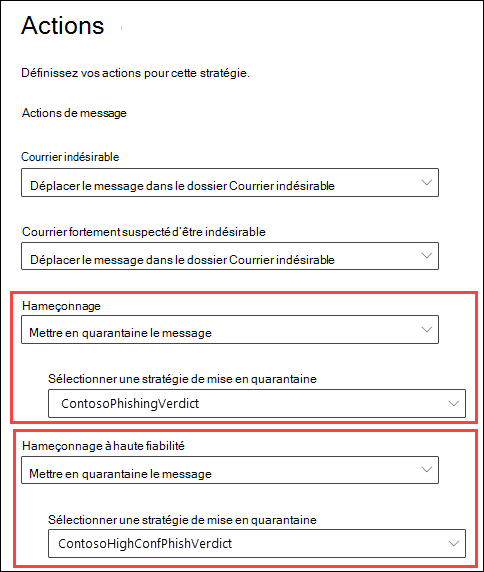
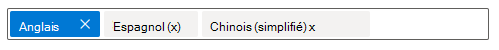
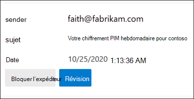
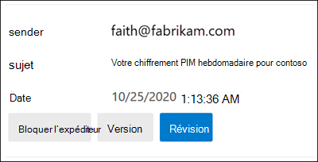

# <a name="quarantine-policies"></a>Stratégies de mise en quarantaine

> [!NOTE]
> Les fonctionnalités décrites dans cet article sont actuellement en prévisualisation, ne sont pas disponibles pour tout le monde et peuvent faire l’objet de changements.

Les stratégies de mise en quarantaine (auparavant appelées balises de mise en _quarantaine)_ dans Exchange Online Protection (EOP) et Microsoft Defender pour Office 365 permettent aux administrateurs de contrôler ce que les utilisateurs sont en mesure de faire pour leurs messages mis en quarantaine en fonction de la raison pour laquelle le message a été mis en quarantaine.

En général, les utilisateurs ont reçu des niveaux d’interactivité autorisés ou refusés pour les messages en quarantaine et dans les notifications de courrier indésirable de [l’utilisateur final.](use-spam-notifications-to-release-and-report-quarantined-messages.md) [](find-and-release-quarantined-messages-as-a-user.md) Par exemple, les utilisateurs peuvent afficher et libérer les messages mis en quarantaine par le filtrage anti-courrier indésirable en tant que courrier indésirable ou en bloc, mais ils ne peuvent pas afficher ou libérer les messages mis en quarantaine comme hameçonnage à haut niveau de confiance (seuls les administrateurs peuvent le faire).

Pour les [fonctionnalités](#step-2-assign-a-quarantine-policy-to-supported-features)de protection prise en charge, les stratégies de mise en quarantaine spécifient ce que les utilisateurs sont autorisés à faire dans les messages de notification de courrier indésirable de l’utilisateur final et en quarantaine (messages dont l’utilisateur est un destinataire). Les stratégies de mise en quarantaine par défaut sont automatiquement affectées pour appliquer les fonctionnalités historiques pour les utilisateurs sur les messages mis en quarantaine. Vous pouvez également créer et affecter des stratégies de mise en quarantaine personnalisées pour autoriser ou empêcher les utilisateurs finaux d’effectuer des actions spécifiques sur les messages mis en quarantaine.

Les autorisations individuelles sont combinées dans les groupes d’autorisations prédéfinës suivants :

- Pas d’accès
- Accès limité
- Accès total

Les autorisations individuelles disponibles et les autorisations incluses ou non dans les groupes d’autorisations prédéfinits sont décrites dans le tableau suivant :

<br>

****

|Autorisation|Pas d’accès|Accès limité|Accès total|
|---|:---:|:---:|:---:|
|**Bloquer l’expéditeur** (_PermissionToBlockSender_)||||
|**Delete** (_PermissionToDelete_)||||
|**Preview** (_PermissionToPreview_)||||
|**Autoriser les destinataires à libérer un message de la quarantaine** (_PermissionToRelease_)||||
|**Autoriser les destinataires à demander qu’un message soit libéré** de la quarantaine (_PermissionToRequestRelease_)||||
|

Les stratégies de mise en quarantaine par défaut et les groupes d’autorisations associés sont décrits dans le tableau suivant :

<br>

|Stratégie de mise en quarantaine par défaut|Groupe d’autorisations utilisé|
|---|---|
|AdminOnlyAccessPolicy|Pas d’accès|
|DefaultFullAccessPolicy|Accès total|
|

Si vous n’aimez pas les autorisations par défaut dans les groupes d’autorisations prédéfin produits, vous pouvez utiliser des autorisations personnalisées lorsque vous créez ou modifiez des stratégies de mise en quarantaine personnalisées. Pour plus d’informations sur l’objet de chaque autorisation, consultez la section Détails des [autorisations](#quarantine-policy-permission-details) de stratégie de mise en quarantaine plus loin dans cet article.

Vous créez et affectez des stratégies de mise en quarantaine dans le portail Microsoft 365 Defender ou dans PowerShell (Exchange Online PowerShell pour les organisations Microsoft 365 avec des boîtes aux lettres Exchange Online ; EOP PowerShell autonome dans les organisations EOP sans boîtes aux lettres Exchange Online).

## <a name="what-do-you-need-to-know-before-you-begin"></a>Ce qu'il faut savoir avant de commencer

- Vous ouvrez le Portail Microsoft 365 Defender sur <https://security.microsoft.com>. Ou pour aller directement à la page Des stratégies **de** mise en quarantaine, ouvrez <https://security.microsoft.com/quarantinePolicies> .

- Pour vous connecter à Exchange Online PowerShell, voir [Connexion à Exchange Online PowerShell](/powershell/exchange/connect-to-exchange-online-powershell). Pour vous connecter à un service Exchange Online Protection PowerShell autonome, voir [Se connecter à Exchange Online Protection PowerShell](/powershell/exchange/connect-to-exchange-online-protection-powershell).

- Pour afficher, créer, modifier ou supprimer des stratégies de mise en quarantaine,  vous devez être membre des rôles Gestion de l’organisation, Administrateur de la sécurité ou Administrateur de la mise en quarantaine dans le portail Microsoft 365 Defender. Pour plus d’informations, consultez [Autorisations dans le portail Microsoft 365 Defender](permissions-microsoft-365-security-center.md).

## <a name="step-1-create-quarantine-policies-in-the-microsoft-365-defender-portal"></a>Étape 1 : Créer des stratégies de mise en quarantaine dans le portail Microsoft 365 Defender de mise en quarantaine

1. Dans le portail Microsoft 365 Defender, sélectionnez Stratégies de mise en quarantaine & stratégies de **collaboration** sur les menaces, puis \>  \>  \>  sélectionnez **Stratégies de mise en quarantaine.**

2. Dans la page **Stratégie de** mise en quarantaine, cliquez sur Ajouter une icône de stratégie personnalisée Ajouter une  **personnalisée.**

3. **L’Assistant Nouvelle stratégie** s’ouvre. Dans la page **Nom de la** stratégie, entrez un nom court mais unique dans la zone Nom de **la** stratégie. Vous devez identifier et sélectionner la stratégie de mise en quarantaine par nom dans les étapes à venir. Lorsque vous avez terminé, cliquez sur **Suivant**.

4. Dans la page **d’accès aux messages du** destinataire, sélectionnez l’une des valeurs suivantes :
   - **Accès limité**: les autorisations individuelles incluses dans ce groupe d’autorisations sont décrites plus tôt dans cet article.
   - **Définir un accès spécifique (avancé)**: utilisez cette valeur pour spécifier des autorisations personnalisées. Configurez les paramètres suivants qui s’affichent :
     - **Sélectionnez la préférence d’action de** publication : sélectionnez l’une des valeurs suivantes :
       - **Aucune action de publication**: il s’agit de la valeur par défaut.
       - **Autoriser les destinataires à libérer un message de la quarantaine**
       - **Autoriser les destinataires à demander qu’un message soit libéré de la quarantaine**
     - **Sélectionnez des actions supplémentaires que les destinataires peuvent prendre** sur les messages mis en quarantaine : sélectionnez une partie, l’ensemble ou aucune des valeurs suivantes :
       - **Supprimer**
       - **Aperçu**
       - **Bloquer l’expéditeur**

   Ces autorisations et leur effet sur les messages mis en quarantaine et les notifications de courrier indésirable à l’utilisateur final sont décrits dans la section détails des [autorisations](#quarantine-policy-permission-details) de stratégie de mise en quarantaine plus loin dans cet article.

   Lorsque vous avez terminé, cliquez sur **Suivant**.

5. Dans la page **de notification de courrier indésirable** de l’utilisateur final, vous pouvez cocher la case pour activer la notification.

6. Dans la page **Examiner la stratégie** qui s’affiche, examinez vos paramètres. Vous pouvez sélectionner **Modifier** dans chaque section pour modifier les paramètres de la section. Vous pouvez également cliquer sur **Précédent** ou sélectionner la page spécifique dans l’Assistant.

   Lorsque vous avez terminé, cliquez sur **Envoyer**.

7. Dans la page de confirmation qui s’affiche, cliquez sur **Terminé**.

Vous êtes maintenant prêt à affecter la stratégie de mise en quarantaine à une fonctionnalité de mise en quarantaine, comme décrit dans la section [Étape 2.](#step-2-assign-a-quarantine-policy-to-supported-features)

### <a name="create-quarantine-policies-in-powershell"></a>Créer des stratégies de mise en quarantaine dans PowerShell

Si vous préférez utiliser PowerShell pour créer des stratégies de mise en quarantaine, connectez-vous à Exchange Online PowerShell ou Exchange Online Protection PowerShell et utilisez la cmdlet **New-QuarantineTag.** Vous avez le choix entre deux méthodes différentes :

- [Utilisez le _paramètre EndUserQuarantinePermissionsValue_](#use-the-enduserquarantinepermissionsvalue-parameter).
- [Utilisez le _paramètre EndUserQuarantinePermissions_](#use-the-enduserquarantinepermissions-parameter).

Ces méthodes sont décrites dans les sections suivantes.

#### <a name="use-the-enduserquarantinepermissionsvalue-parameter"></a>Utiliser le paramètre EndUserQuarantinePermissionsValue

Pour créer une stratégie de mise en quarantaine à l’aide du paramètre _EndUserQuarantinePermissionsValue,_ utilisez la syntaxe suivante :

```powershell
New-QuarantineTag -Name "<UniqueName>" -EndUserQuarantinePermissionsValue <0 to 236>
```

Le _paramètre EndUserQuarantinePermissionsValue_ utilise une valeur décimale convertie à partir d’une valeur binaire. La valeur binaire correspond aux autorisations de mise en quarantaine de l’utilisateur final disponibles dans un ordre spécifique. Pour chaque autorisation, la valeur 1 est égale à True et la valeur 0 à False.

L’ordre et les valeurs requis pour chaque autorisation individuelle dans les groupes d’autorisations prédéfinits sont décrits dans le tableau suivant :

<br>

****

|Autorisation|Accès limité|
|---|:---:|
|PermissionToBlockSender|1 |
|PermissionToDelete|1 |
|PermissionToDownload<sup>\*</sup>|0|
|PermissionToPreview|1 |
|PermissionToRelease<sup>\*\*</sup>|0|
|PermissionToRequestRelease<sup>\*\*</sup>|1 |
|PermissionToViewHeader<sup>\*</sup>|0|
|Valeur binaire|01101010|
|Valeur décimale à utiliser|106|
|

<sup>\*</sup> Actuellement, cette valeur est toujours 0. Pour PermissionToViewHeader, la valeur 0 ne masque pas le bouton Afficher l’en-tête du **message** dans les détails du message mis en quarantaine (le bouton est toujours disponible).

<sup>\*\*</sup> Ne définissez pas ces deux valeurs sur 1. Définissez l’un sur 1 et l’autre sur 0, ou définissez les deux sur 0.

Cet exemple crée un nouveau nom de stratégie de mise en quarantaine LimitedAccess qui attribue les autorisations d’accès limité comme décrit dans le tableau précédent.

```powershell
New-QuarantineTag -Name LimitedAccess -EndUserQuarantinePermissionsValue 106
```

Pour les autorisations personnalisées, utilisez le tableau précédent pour obtenir la valeur binaire qui correspond aux autorisations de votre choix. Convertissez la valeur binaire en valeur décimale et utilisez la valeur décimale pour le paramètre _EndUserQuarantinePermissionsValue._

Pour obtenir des informations détaillées sur la syntaxe et les paramètres, voir [New-QuarantineTag](/powershell/module/exchange/new-quarantinetag).

#### <a name="use-the-enduserquarantinepermissions-parameter"></a>Utiliser le paramètre EndUserQuarantinePermissions

Pour créer une stratégie de mise en quarantaine à l’aide du paramètre _EndUserQuarantinePermissionsValue,_ utilisez les étapes suivantes :

R : Stockez un objet d’autorisations de mise en quarantaine dans une variable à l’aide de la cmdlet **New-QuarantinePermissions.**

<p>

B. Utilisez la variable comme valeur _EndUserQuarantinePermissions_ dans la **commande New-QuarantineTag.**

##### <a name="step-a-store-a-quarantine-permissions-object-in-a-variable"></a>Étape A : Stocker un objet d’autorisations de mise en quarantaine dans une variable

Utilisez la syntaxe suivante :

```powershell
$<VariableName> = New-QuarantinePermissions [-PermissionToBlockSender <$true | $False>] [-PermissionToDelete <$true | $False>] [-PermissionToPreview <$true | $False>] [-PermissionToRelease <$true | $False>] [-PermissionToRequestRelease <$true | $False>]
```

La valeur par défaut pour les paramètres inutilisés est , de sorte que vous devez uniquement utiliser les paramètres où vous souhaitez définir `$false` la valeur sur `$true` .

L’exemple suivant montre comment créer des  objets d’autorisation qui correspondent au groupe d’autorisations prédéfinës à accès limité :

```powershell
$LimitedAccess = New-QuarantinePermissions -PermissionToBlockSender $true -PermissionToDelete $true -PermissionToPreview $true -PermissionToRequestRelease $true
```

Pour voir les valeurs que vous avez définies, exécutez le nom de la variable en tant que commande (par exemple, exécutez la `$LimitedAccess` commande).

Pour les autorisations personnalisées, ne définissez pas les paramètres _PermissionToRelease_ et _PermissionToRequestRelease_ sur `$true` . Définissez `$true` l’un sur et laissez l’autre en tant `$false` que , ou laissez les deux comme `$false` .

Vous pouvez également modifier une variable objet d’autorisations existante après la création, mais avant de l’utiliser à l’aide de la cmdlet **Set-QuarantinePermissions.**

Pour obtenir des informations détaillées sur la syntaxe et les paramètres, voir [New-QuarantinePermissions](/powershell/module/exchange/new-quarantinepermissions) et [Set-QuarantinePermissions.](/powershell/module/exchange/set-quarantinepermissions)

##### <a name="step-b-use-the-variable-in-the-new-quarantinetag-command"></a>Étape B : Utiliser la variable dans la commande New-QuarantineTag commande

Après avoir créé et stocké l’objet Permissions dans une variable, utilisez la variable pour la valeur du paramètre _EndUserQuarantinePermission_ dans la commande **New-QuarantineTag** suivante :

```powershell
New-QuarantineTag -Name "<UniqueName>" -EndUserQuarantinePermissions $<VariableName>
```

Cet exemple crée une stratégie de mise en quarantaine nommée LimitedAccess à l’aide de l’objet permissions qui a été décrit et créé `$LimitedAccess` à l’étape précédente.

```powershell
New-QuarantineTag -Name LimitedAccess -EndUserQuarantinePermissions $LimitedAccess
```

Pour obtenir des informations détaillées sur la syntaxe et les paramètres, voir [New-QuarantineTag](/powershell/module/exchange/new-quarantinetag).

## <a name="step-2-assign-a-quarantine-policy-to-supported-features"></a>Étape 2 : Attribuer une stratégie de mise en quarantaine aux fonctionnalités prise en charge

Dans _les fonctionnalités_ de protection prises en charge qui met en quarantaine les messages ou les fichiers (automatiquement ou en tant qu’action configurable), vous pouvez affecter une stratégie de mise en quarantaine aux actions de mise en quarantaine disponibles. Les fonctionnalités de mise en quarantaine des messages et la disponibilité des stratégies de mise en quarantaine sont décrites dans le tableau suivant :

<br>

****

|Fonctionnalité|Stratégies de mise en quarantaine pris en charge ?|Stratégies de mise en quarantaine par défaut utilisées|
|---|:---:|---|
|[Stratégies anti-courrier indésirable](configure-your-spam-filter-policies.md): <ul><li>**Courrier** indésirable (_SpamAction_)</li><li>**Courrier indésirable à niveau** de confiance élevé (_HighConfidenceSpamAction_)</li><li>**Hameçonnage** (_PhishSpamAction_)</li><li>**Hameçonnage à haut niveau de** confiance (_HighConfidencePhishAction_)</li><li>**Bulk** (_BulkSpamAction_)</li></ul>|Oui|<ul><li>DefaultFullAccessPolicy (accès complet)</li><li>DefaultFullAccessPolicy (accès complet)</li><li>DefaultFullAccessPolicy (accès complet)</li><li>AdminOnlyAccessPolicy (aucun accès)</li><li>DefaultFullAccessPolicy (accès complet)</li></ul>|
|Stratégies anti-hameçonnage : <ul><li>[Protection contre l’usurpation d’identité](set-up-anti-phishing-policies.md#spoof-settings) (_AuthenticationFailAction_)</li><li>[Protection contre l’emprunt d’identité dans Defender pour Office 365](set-up-anti-phishing-policies.md#impersonation-settings-in-anti-phishing-policies-in-microsoft-defender-for-office-365):<ul><li>**Si le message est détecté comme un utilisateur dont** l’identité est usurpée (_TargetedUserProtectionAction_)</li><li>**Si le message est détecté comme un** domaine dont l’identité est usurpée (_TargetedDomainProtectionAction_)</li><li>**Si l’intelligence de boîte aux lettres détecte et usurpe l’identité de** l’utilisateur (_MailboxIntelligenceProtectionAction_)</li></ul></li></ul>|Oui|<ul><li>DefaultFullAccessPolicy (accès complet)</li><li>Protection contre l’emprunt d’identité :<ul><li>DefaultFullAccessPolicy (accès complet)</li><li>DefaultFullAccessPolicy (accès complet)</li><li>DefaultFullAccessPolicy (accès complet)</li></ul></li></ul>|
|[Stratégies anti-programme](configure-anti-malware-policies.md)malveillant : tous les messages détectés sont toujours mis en quarantaine.|Oui|AdminOnlyAccessPolicy (aucun accès)|
|[Coffre pièces jointes pour SharePoint, OneDrive et Microsoft Teams](mdo-for-spo-odb-and-teams.md) (Defender pour Office 365)|Oui|AdminOnlyAccessPolicy (aucun accès)|
|[Règles de flux de messagerie](/exchange/security-and-compliance/mail-flow-rules/mail-flow-rules) (également appelées règles de transport) avec l’action : Remettre le **message** en quarantaine hébergé (mise en _quarantaine)._|Non|s/o|
|

Si vous êtes satisfait des autorisations par défaut des utilisateurs finaux fournies par les stratégies de mise en quarantaine par défaut, vous n’avez rien à faire. Si vous souhaitez ajouter ou supprimer des fonctionnalités d’utilisateur final (boutons disponibles) dans les notifications de courrier indésirable de l’utilisateur final ou dans les détails des messages mis en quarantaine, vous pouvez affecter une stratégie de mise en quarantaine personnalisée.

## <a name="assign-quarantine-policies-in-supported-polices-in-the-microsoft-365-defender-portal"></a>Attribuer des stratégies de mise en quarantaine dans les stratégies de Microsoft 365 Defender pris en charge

### <a name="anti-spam-policies"></a>Stratégies anti-courrier indésirable

1. Dans le portail Microsoft 365 Defender, dans la section Règles, & stratégies de **collaboration** & stratégies contre les \>  \>  \>  menaces. 

   Ou, pour aller directement à la page des stratégies **Ant-spam,** utilisez <https://security.microsoft.com/antispam> .

2. Dans la page **Stratégies anti-courrier** indésirable, faites l’une des opérations suivantes :
   - Recherchez et sélectionnez **une** stratégie de courrier indésirable entrant existante.
   - Créez une stratégie **de** courrier indésirable entrant.

3. Effectuez l’une des étapes suivantes :
   - **Modifier une stratégie existante**: sélectionnez la stratégie en cliquant sur le nom de la stratégie. Dans le volant des détails de la stratégie, allez dans la section **Actions,** puis cliquez **sur Modifier les actions.**
   - **Créer :** dans l’Assistant Nouvelle stratégie, accès à la page **Actions.**

4. Dans la page **Actions,** chaque verdict qui a  l’action de **message** de mise en quarantaine aura également la zone Appliquer la stratégie de mise en quarantaine pour que vous sélectionniez une stratégie de mise en quarantaine correspondante.

   **Remarque**: lorsque vous créez  une stratégie, une valeur de stratégie de mise en quarantaine Select vide indique que la stratégie de mise en quarantaine par défaut pour ce verdict est utilisée. Lorsque vous modifiez ultérieurement la stratégie, les valeurs vides sont remplacées par les noms de stratégie de mise en quarantaine par défaut réels, comme décrit dans le tableau précédent.

   

Des instructions complètes pour la création et la modification des stratégies anti-courrier indésirable sont décrites dans Configurer des stratégies [anti-courrier indésirable dans EOP.](configure-your-spam-filter-policies.md)

#### <a name="anti-spam-policies-in-powershell"></a>Stratégies anti-courrier indésirable dans PowerShell

Si vous préférez utiliser PowerShell pour affecter des stratégies de mise en quarantaine dans les stratégies anti-courrier indésirable, connectez-vous à Exchange Online PowerShell ou Exchange Online Protection PowerShell et utilisez la syntaxe suivante :

```powershell
<New-HostedContentFilterPolicy -Name "<Unique name>" | Set-HostedContentFilterPolicy -Identity "<Policy name>"> [-SpamAction Quarantine] [-SpamQuarantineTag <QuarantineTagName>] [-HighConfidenceSpamAction Quarantine] [-HighConfidenceSpamQuarantineTag <QuarantineTagName>] [-PhishSpamAction Quarantine] [-PhishQuarantineTag <QuarantineTagName>] [-HighConfidencePhishQuarantineTag <QuarantineTagName>] [-BulkSpamAction Quarantine] [-BulkQuarantineTag <QuarantineTagName>] ...
```

**Remarques** :

- La valeur par défaut des paramètres _PhishSpamAction_ et _HighConfidencePhishAction_ est Mise en quarantaine. Vous n’avez donc pas besoin d’utiliser ces paramètres lorsque vous créez des polices de filtrage du courrier indésirable dans PowerShell. Pour les paramètres _SpamAction,_ _HighConfidenceSpamAction_ et _BulkSpamAction_ dans les stratégies anti-courrier indésirable nouvelles ou existantes, la stratégie de mise en quarantaine n’est effective que si la valeur est Mise en quarantaine.

  Pour voir les valeurs de paramètre importantes dans les stratégies anti-courrier indésirable existantes, exécutez la commande suivante :

  ```powershell
  Get-HostedContentFilterPolicy | Format-List Name,*SpamAction,HighConfidencePhishAction,*QuarantineTag
  ```

  Pour plus d’informations sur les valeurs d’action par défaut et les valeurs d’action recommandées pour Standard et Strict, voir paramètres de stratégie [anti-courrier indésirable EOP.](recommended-settings-for-eop-and-office365.md#eop-anti-spam-policy-settings)

- Un verdict de filtrage du courrier indésirable sans paramètre de stratégie de mise en quarantaine correspondant signifie que la stratégie de mise en quarantaine [par](#step-2-assign-a-quarantine-policy-to-supported-features) défaut pour ce verdict est utilisée.

  Vous devez remplacer une stratégie de mise en quarantaine par défaut par une stratégie de mise en quarantaine personnalisée uniquement si vous souhaitez modifier les fonctionnalités par défaut de l’utilisateur final sur les messages mis en quarantaine pour ce verdict particulier.

- Une nouvelle stratégie anti-courrier indésirable dans PowerShell nécessite une stratégie de filtrage du courrier indésirable (paramètres) à l’aide de la cmdlet **New-HostedContentFilterPolicy** et une règle de filtrage de courrier indésirable exclusive (filtres de destinataires) à l’aide de la cmdlet **New-HostedContentFilterRule.** Pour obtenir des instructions, [voir Utiliser PowerShell pour créer des stratégies anti-courrier indésirable.](configure-your-spam-filter-policies.md#use-powershell-to-create-anti-spam-policies)

Cet exemple crée une stratégie de filtrage du courrier indésirable nommée Research Department avec les paramètres suivants :

- L’action de tous les verdicts de filtrage du courrier indésirable est définie sur Quarantaine.
- La stratégie de mise en quarantaine  personnalisée nommée NoAccess qui attribue aucune autorisation  d’accès remplace toutes les stratégies de mise en quarantaine par défaut qui n’attribuent pas déjà aucune autorisation d’accès par défaut.

```powershell
New-HostedContentFilterPolicy -Name "Research Department" -SpamAction Quarantine -SpamQuarantineTag NoAccess -HighConfidenceSpamAction Quarantine -HighConfidenceSpamQuarantineTag NoAction -PhishSpamAction Quarantine -PhishQuarantineTag NoAction -BulkSpamAction Quarantine -BulkQuarantineTag NoAccess
```

Pour obtenir des informations détaillées sur la syntaxe et les paramètres, voir [New-HostedContentFilterPolicy](/powershell/module/exchange/new-hostedcontentfilterpolicy).

Cet exemple modifie la stratégie de filtrage du courrier indésirable existante nommée Human Resources. L’action pour le verdict de mise en quarantaine du courrier indésirable est définie sur Quarantaine et la stratégie de mise en quarantaine personnalisée nommée NoAccess est affectée.

```powershell
Set-HostedContentFilterPolicy -Identity "Human Resources" -SpamAction Quarantine -SpamQuarantineTag NoAccess
```

Pour obtenir des informations détaillées sur la syntaxe et les paramètres, voir [Set-HostedContentFilterPolicy](/powershell/module/exchange/set-hostedcontentfilterpolicy).

### <a name="anti-phishing-policies"></a>Politiques anti-hameçonnage

La veille contre l’usurpation d’adresse est disponible dans EOP et Defender Office 365. La protection contre l’emprunt d’identité d’utilisateur, la protection contre l’usurpation d’identité de domaine et l’intelligence des boîtes aux lettres sont disponibles uniquement dans Defender Office 365. Si vous souhaitez en savoir plus, consultez l’article [Stratégies anti-hameçonnage dans Microsoft 365](set-up-anti-phishing-policies.md).

1. Dans le portail Microsoft 365 Defender, dans la section Règles, & stratégies de **collaboration** & stratégies \>  \>  \> **anti-hameçonnage.** 

   Ou, pour aller directement à la page des stratégies **Ant-spam,** utilisez <https://security.microsoft.com/antiphishing> .

2. Dans la page **Anti-hameçonnage,** faites l’une des opérations suivantes :
   - Recherchez et sélectionnez une stratégie anti-hameçonnage existante.
   - Créez une stratégie anti-hameçonnage.

3. Effectuez l’une des étapes suivantes :
   - **Modifier une stratégie existante**: sélectionnez la stratégie en cliquant sur le nom de la stratégie. Dans le volant des détails de la stratégie, allez dans la section Paramètres de **protection,** puis cliquez sur Modifier les **paramètres de protection.**
   - **Créer :** dans l’Assistant Nouvelle stratégie, accès à la page **Actions.**

4. Dans la page **Paramètres de protection,** vérifiez que les paramètres suivants sont allumés et configurés selon les besoins :
   - **Utilisateurs activés pour la protection :** spécifier les utilisateurs.
   - **Domaines activés pour la protection**: **sélectionnez** Inclure les domaines que je possède et/ou Incluez des domaines **personnalisés** et spécifiez les domaines.
   - **Activer l’intelligence des boîtes aux lettres**
   - **Activer la veille pour la protection contre l’emprunt d’identité**
   - **Activer la veille contre l’usurpation d’informations**

5. Effectuez l’une des étapes suivantes :
   - **Modifier existant :** dans le volet d’informations de stratégie, allez dans la section **Actions,** puis cliquez sur **Modifier les actions.**
   - **Créer :** dans l’Assistant Nouvelle stratégie, accès à la page **Actions.**

6. Dans la page **Actions,** chaque verdict qui a mis  en quarantaine l’action de **message** aura également la zone Appliquer la stratégie de mise en quarantaine pour que vous sélectionniez une stratégie de mise en quarantaine correspondante.

   **Remarque**: lorsque vous créez  une stratégie, une valeur vide de stratégie Appliquer la quarantaine indique que la stratégie de mise en quarantaine par défaut de cette action est utilisée. Lorsque vous modifiez ultérieurement la stratégie, les valeurs vides sont remplacées par les noms de stratégie de mise en quarantaine par défaut réels, comme décrit dans le tableau précédent.

   

Des instructions complètes sur la création et la modification des polices anti-hameçonnage sont disponibles dans les rubriques suivantes :

- [Configurer des stratégies anti-hameçonnage dans EOP](configure-anti-phishing-policies-eop.md)
- [Configurer des stratégies anti-hameçonnage dans Microsoft Defender pour Office 365](configure-mdo-anti-phishing-policies.md)

#### <a name="anti-phishing-policies-in-powershell"></a>Stratégies anti-hameçonnage dans PowerShell

Si vous préférez utiliser PowerShell pour affecter des stratégies de mise en quarantaine dans les stratégies anti-hameçonnage, connectez-vous à Exchange Online PowerShell ou Exchange Online Protection PowerShell et utilisez la syntaxe suivante :

```powershell
<New-AntiPhishPolicy -Name "<Unique name>" | Set-AntiPhishPolicy -Identity "<Policy name>"> [-EnableSpoofIntelligence $true] [-AuthenticationFailAction Quarantine] [-SpoofQuarantineTag <QuarantineTagName>] [-EnableMailboxIntelligence $true] [-EnableMailboxIntelligenceProtection $true] [-MailboxIntelligenceProtectionAction Quarantine] [-MailboxIntelligenceQuarantineTag <QuarantineTagName>] [-EnableOrganizationDomainsProtection $true] [-EnableTargetedDomainsProtection $true] [-TargetedDomainProtectionAction Quarantine] [-TargetedDomainQuarantineTag <QuarantineTagName>] [-EnableTargetedUserProtection $true] [-TargetedUserProtectionAction Quarantine] [-TargetedUserQuarantineTag <QuarantineTagName>] ...
```

**Remarques** :

- Les _\* paramètres Enable_ sont requis pour activer les fonctionnalités de protection spécifiques. La valeur par défaut des paramètres _EnableMailboxIntelligence_ et _EnableSpoofIntelligence_ est $true, vous n’avez donc pas besoin d’utiliser ces paramètres lorsque vous créez des stratégies anti-hameçonnage dans PowerShell. Tous les _autres paramètres Enable \*_ doivent avoir la valeur $true afin que vous pouvez définir la valeur Mise en quarantaine dans les paramètres _\* d’action_ correspondants pour affecter ensuite une stratégie de mise en quarantaine. Aucun des paramètres _*\Action_ n’a la valeur par défaut Quarantaine.

  Pour voir les valeurs de paramètre importantes dans les stratégies anti-hameçonnage existantes, exécutez la commande suivante :

  ```powershell
  Get-AntiPhishPolicy | Format-List Name,Enable*Intelligence,Enable*Protection,*Action,*QuarantineTag
  ```

  Pour plus d’informations sur les valeurs d’action par défaut et les valeurs d’action recommandées pour Standard et Strict, voir paramètres de stratégie [anti-hameçonnage EOP](recommended-settings-for-eop-and-office365.md#eop-anti-phishing-policy-settings) et paramètres d’emprunt d’identité dans les [stratégies anti-hameçonnage](recommended-settings-for-eop-and-office365.md#impersonation-settings-in-anti-phishing-policies-in-microsoft-defender-for-office-365)dans Microsoft Defender pour Office 365 .

- Une action anti-hameçonnage sans paramètre de [](#step-2-assign-a-quarantine-policy-to-supported-features) stratégie de mise en quarantaine correspondant signifie que la stratégie de mise en quarantaine par défaut pour ce verdict est utilisée.

  Vous devez remplacer une stratégie de mise en quarantaine par défaut par une stratégie de mise en quarantaine personnalisée uniquement si vous souhaitez modifier les fonctionnalités par défaut de l’utilisateur final sur les messages mis en quarantaine pour ce verdict particulier.

- Une nouvelle stratégie anti-hameçonnage dans PowerShell nécessite une stratégie anti-hameçonnage (paramètres) à l’aide de la cmdlet **New-AntiPhishPolicy** et une règle anti-hameçonnage exclusive (filtres de destinataires) à l’aide de la cmdlet **New-AntiPhishRule.** Pour obtenir des instructions, consultez les rubriques suivantes :
  - [Utiliser PowerShell pour configurer des stratégies anti-hameçonnage dans EOP](configure-anti-phishing-policies-eop.md#use-exchange-online-powershell-to-configure-anti-phishing-policies)
  - [Utiliser Exchange Online PowerShell pour configurer des stratégies anti-hameçonnage](configure-mdo-anti-phishing-policies.md#use-exchange-online-powershell-to-configure-anti-phishing-policies)

Cet exemple crée une stratégie anti-hameçonnage nommée Research Department avec les paramètres suivants :

- L’action de tous les verdicts de filtrage du courrier indésirable est définie sur Quarantaine.
- La stratégie de mise en quarantaine  personnalisée nommée NoAccess qui attribue aucune autorisation  d’accès remplace toutes les stratégies de mise en quarantaine par défaut qui n’attribuent pas déjà aucune autorisation d’accès par défaut.

```powershell
New-AntiPhishPolicy -Name "Research Department" -AuthenticationFailAction Quarantine -SpoofQuarantineTag NoAccess -EnableMailboxIntelligenceProtection $true -MailboxIntelligenceProtectionAction Quarantine -MailboxIntelligenceQuarantineTag NoAccess -EnableOrganizationDomainsProtection $true -EnableTargetedDomainsProtection $true -TargetedDomainProtectionAction Quarantine -TargetedDomainQuarantineTag NoAccess -EnableTargetedUserProtection $true -TargetedUserProtectionAction Quarantine -TargetedUserQuarantineTag NoAccess
```

Pour obtenir des informations détaillées sur la syntaxe et les paramètres, voir [New-AntiPhishPolicy](/powershell/module/exchange/new-antiphishpolicy).

Cet exemple modifie la stratégie anti-hameçonnage existante nommée Human Resources. L’action pour les messages détectés par l’emprunt d’identité d’utilisateur et l’emprunt d’identité de domaine est définie sur Mise en quarantaine et la stratégie de mise en quarantaine personnalisée nommée NoAccess est affectée.

```powershell
Set-AntiPhishPolicy -Identity "Human Resources" -EnableTargetedDomainsProtection $true -TargetedDomainProtectionAction Quarantine -TargetedDomainQuarantineTag NoAccess -EnableTargetedUserProtection $true -TargetedUserProtectionAction Quarantine -TargetedUserQuarantineTag NoAccess
```

Pour obtenir des informations détaillées sur la syntaxe et les paramètres, voir [Set-AntiPhishPolicy](/powershell/module/exchange/set-antiphishpolicy).

### <a name="anti-malware-policies"></a>Stratégies anti-programme malveillant

1. Dans le portail Microsoft 365 Defender, dans la section Règles, & stratégies de **collaboration** & stratégies contre les \>  \>  \>  menaces. 

   Ou, pour aller directement à la page **Anti-programme** malveillant, utilisez <https://security.microsoft.com/antimalwarev2> .

2. Dans la page **Anti-programme** malveillant, faites l’une des opérations suivantes :
   - Recherchez et sélectionnez une stratégie anti-programme malveillant existante.
   - Créez une stratégie anti-programme malveillant.

3. Effectuez l’une des étapes suivantes :
   - **Modifier une stratégie existante**: sélectionnez la stratégie en cliquant sur le nom de la stratégie. Dans le volant des détails de la stratégie, allez dans la section Paramètres de **protection,** puis cliquez sur Modifier les **paramètres de protection.**
   - **Créer :** dans l’Assistant Nouvelle stratégie, accès à la page **Actions.**

4. Dans la **page Paramètres de protection,** sélectionnez une stratégie de mise en quarantaine dans la zone **de stratégie de mise en** quarantaine.

   **Remarque**: lorsque vous créez  une stratégie, une valeur de stratégie de quarantaine vide indique la stratégie de mise en quarantaine par défaut utilisée. Lorsque vous modifiez ultérieurement la stratégie, la valeur vide est remplacée par le nom réel de la stratégie de mise en quarantaine par défaut, comme décrit dans le tableau précédent.

#### <a name="anti-malware-policies-in-powershell"></a>Stratégies anti-programme malveillant dans PowerShell

Si vous préférez utiliser PowerShell pour affecter des stratégies de mise en quarantaine dans les stratégies anti-programme malveillant, connectez-vous à Exchange Online PowerShell ou Exchange Online Protection PowerShell et utilisez la syntaxe suivante :

```powershell
<New-AntiMalwarePolicy -Name "<Unique name>" | Set-AntiMalwarePolicy -Identity "<Policy name>"> [-QuarantineTag <QuarantineTagName>]
```

**Remarques** :

- Vous devez remplacer la stratégie de mise en quarantaine par défaut par une stratégie de mise en quarantaine personnalisée uniquement si vous souhaitez modifier les fonctionnalités par défaut de l’utilisateur final sur les messages mis en quarantaine pour des programmes malveillants.

  Pour voir les valeurs de paramètre importantes dans les stratégies anti-hameçonnage existantes, exécutez la commande suivante :

  ```powershell
  Get-MalwareFilterPolicy | Format-Table Name,QuarantineTag
  ```

- Une nouvelle stratégie anti-programme malveillant dans PowerShell nécessite une stratégie de filtrage des programmes malveillants (paramètres) à l’aide de la cmdlet **New-MalwareFilterPolicy** et une règle de filtrage des programmes malveillants exclusive (filtres de destinataires) à l’aide de la cmdlet **New-MalwareFilterRule.** Pour obtenir des instructions, voir Utiliser Exchange Online PowerShell ou EOP PowerShell autonome pour configurer des stratégies [anti-programme malveillant.](configure-anti-malware-policies.md#use-exchange-online-powershell-or-standalone-eop-powershell-to-configure-anti-malware-policies)

Cet exemple crée une stratégie de filtrage des programmes malveillants nommée Research Department qui utilise la stratégie de mise en quarantaine personnalisée noAccess qui n’accorde aucune **autorisation** d’accès.

```powershell
New-MalwareFilterPolicy -Name "Research Department" -QuarantineTag NoAccess
```

Pour obtenir des informations détaillées sur la syntaxe et les paramètres, consultez la rubrique [New-MalwareFilterPolicy](/powershell/module/exchange/new-malwarefilterpolicy).

Cet exemple modifie la stratégie de filtrage des programmes malveillants existante nommée Human Resources  en attribuant la stratégie de mise en quarantaine personnalisée noAccess qui n’accorde aucune autorisation d’accès.

```powershell
New-MalwareFilterPolicy -Identity "Human Resources" -QuarantineTag NoAccess
```

Pour obtenir des informations détaillées sur la syntaxe et les paramètres, consultez la rubrique [Set-MalwareFilterPolicy](/powershell/module/exchange/set-malwarefilterpolicy).

### <a name="safe-attachments-for-sharepoint-onedrive-and-microsoft-teams"></a>Pièces jointes sécurisées pour SharePoint, OneDrive et Microsoft Teams

En règle générale, la protection par les pièces jointes Coffre pour SharePoint, OneDrive et Microsoft Teams ne nécessite pas l’appartenance à une stratégie de pièces jointes Coffre (vous pouvez activer ou désactiver la protection dans les paramètres globaux des stratégies de pièces **jointes** Coffre). Toutefois, pour affecter une stratégie de mise en quarantaine pour les messages mis en quarantaine par Coffre Attachments for SharePoint, OneDrive et Microsoft Teams, les utilisateurs concernés doivent être affectés dans une stratégie de mise en quarantaine.

1. Dans le portail Microsoft 365 Defender, go to **Email & collaboration** Policies \> **&** Threat \> **policies** \> **Coffre Attachments** in the **Rules** section.

   Ou, pour aller directement à la page **Coffre pièces jointes,** utilisez <https://security.microsoft.com/safeattachmentv2> .

2. Dans la page **Coffre pièces jointes,** faites l’une des étapes suivantes :
   - Recherchez et sélectionnez une stratégie Coffre pièces jointes existante.
   - Créez une stratégie Coffre pièces jointes.

3. Effectuez l’une des étapes suivantes :
   - **Modifier une stratégie existante**: sélectionnez la stratégie en cliquant sur le nom de la stratégie. Dans le volant des détails de la stratégie, allez à la section **Paramètres** puis cliquez sur **Modifier les paramètres.**
   - **Créer :** dans l’Assistant Nouvelle stratégie, vous pouvez Paramètres **page.**

4. Dans la page **Paramètres,** sélectionnez une stratégie de mise en quarantaine dans la zone **de stratégie de mise en** quarantaine.

   **Remarque**: lorsque vous créez  une stratégie, une valeur de stratégie de quarantaine vide indique que la stratégie de mise en quarantaine par défaut est utilisée. Lorsque vous modifiez ultérieurement la stratégie, la valeur vide est remplacée par le nom réel de la stratégie de mise en quarantaine par défaut, comme décrit dans le tableau précédent.

Les instructions complètes pour la création et la modification Coffre des stratégies de pièces jointes sont décrites dans La Coffre stratégies de pièces [jointes](set-up-safe-attachments-policies.md)dans Microsoft Defender pour Office 365 .

#### <a name="safe-attachments-for-sharepoint-onedrive-and-microsoft-teams-in-powershell"></a>Coffre Pièces jointes pour SharePoint, OneDrive et Microsoft Teams dans PowerShell

Si vous préférez utiliser PowerShell pour affecter des stratégies de mise en quarantaine pour les pièces jointes Coffre pour SharePoint, OneDrive et Microsoft Teams, connectez-vous à Exchange Online PowerShell ou Exchange Online Protection PowerShell et utilisez la syntaxe suivante :

```powershell
Set-AtpPolicyForO365 -EnableATPForSPOTeamsODB $true
<New-SafeAttachmentPolicy -Name "<Unique name>" | Set-SafeAttachmentPolicy -Identity "<Policy name>"> [-QuarantineTag <QuarantineTagName>]
```

**Remarques** :

- Vous devez remplacer la stratégie de mise en quarantaine par défaut par une stratégie de mise en quarantaine personnalisée uniquement si vous souhaitez modifier les fonctionnalités par défaut de l’utilisateur final sur les fichiers mis en quarantaine par Coffre Attachments for SharePoint, OneDrive et Microsoft Teams.

  Pour voir les valeurs de paramètre importantes, exécutez la commande suivante :

  ```powershell
  Get-AtpPolicyForO365 | Format-Table EnableATPForSPOTeamsODB; Get-SafeAttachmentPolicy | Format-Table Name,QuarantineTag
  ```

- Pour activer Coffre pièces jointes pour SharePoint, OneDrive et Microsoft Teams, voir Activer les pièces jointes Coffre pour [SharePoint, OneDrive](turn-on-mdo-for-spo-odb-and-teams.md)et Microsoft Teams .

- Une nouvelle stratégie de pièces jointes Coffre dans PowerShell nécessite une stratégie de pièces jointes sécurisées (paramètres) à l’aide de la cmdlet **New-SafeAttachmentPolicy** et une règle de pièce jointe sécurisée exclusive (filtres de destinataires) à l’aide de l’cmdlet **New-SafeAttachmentRule.** Pour obtenir des instructions, voir Utiliser Exchange Online PowerShell ou EOP PowerShell autonome pour configurer des [stratégies Coffre pièces jointes.](set-up-safe-attachments-policies.md#use-exchange-online-powershell-or-standalone-eop-powershell-to-configure-safe-attachments-policies)

Cet exemple permet d’Coffre Attachments pour SharePoint, OneDrive et Microsoft Teams, puis de créer une stratégie de pièces jointes sécurisée nommée Research Department  qui utilise la stratégie de mise en quarantaine personnalisée noAccess qui n’accorde aucune autorisation d’accès.

```powershell
Set-AtpPolicyForO365 -EnableATPForSPOTeamsODB $true
New-SafeAttachmentPolicy -Name "Research Department" -QuarantineTag NoAccess
```

Pour obtenir des informations détaillées sur la syntaxe et les paramètres, consultez la rubrique [New-MalwareFilterPolicy](/powershell/module/exchange/new-malwarefilterpolicy).

Cet exemple modifie la stratégie de pièces jointes sécurisées existante nommée Human Resources  en attribuant la stratégie de mise en quarantaine personnalisée noAccess qui n’accorde aucune autorisation d’accès.

```powershell
New-SafeAttachmentPolicy -Identity "Human Resources" -QuarantineTag NoAccess
```

Pour obtenir des informations détaillées sur la syntaxe et les paramètres, consultez la rubrique [Set-MalwareFilterPolicy](/powershell/module/exchange/set-malwarefilterpolicy).

## <a name="configure-global-quarantine-notification-settings-in-the-microsoft-365-defender-portal"></a>Configurer les paramètres globaux de notification de mise en quarantaine dans le portail Microsoft 365 Defender

Les paramètres globaux des stratégies de mise en quarantaine vous permettent de personnaliser les notifications de courrier indésirable à l’utilisateur final qui sont envoyées aux destinataires des messages mis en quarantaine. Pour plus d’informations sur ces notifications, voir notifications de courrier indésirable pour [l’utilisateur final.](use-spam-notifications-to-release-and-report-quarantined-messages.md)

1. Dans le portail Microsoft 365 Defender, sélectionnez Stratégies de mise en quarantaine & stratégies de **collaboration** sur les menaces, puis \>  \>  \>  sélectionnez **Stratégies de mise en quarantaine.**

2. Dans la page **Stratégie de** mise en quarantaine, sélectionnez **Paramètres globaux.**

3. Dans le volant **des paramètres de notification de** mise en quarantaine qui s’ouvre, configurez tout ou partie des paramètres suivants :

   - **Nom complet**: personnalisez le nom complet de l’expéditeur utilisé dans les notifications de courrier indésirable à l’utilisateur final.

     Pour chaque langue que vous avez ajoutée, sélectionnez la langue dans la deuxième langue (ne cliquez pas  sur le X) et entrez la valeur de texte de votre choix dans la zone Nom complet.

     La capture d’écran suivante montre le nom complet personnalisé dans une notification de courrier indésirable à l’utilisateur final :

     

   - **Clause d’exclusion de** responsabilité : ajoutez une clause d’exclusion de responsabilité personnalisée au bas des notifications de courrier indésirable à l’utilisateur final. Le texte localisé, **une clause d’exclusion** de responsabilité de votre organisation, est toujours inclus en premier, suivi du texte que vous spécifiez.

     Pour chaque langue que vous avez ajoutée, sélectionnez la langue dans la deuxième langue (ne cliquez pas sur le X) et entrez la valeur de texte de votre choix dans la zone Exclusion de **responsabilité.**

     La capture d’écran suivante montre la clause d’exclusion de responsabilité personnalisée dans une notification de courrier indésirable à l’utilisateur final :

     

   - **Choisir la langue**: les notifications de courrier indésirable de l’utilisateur final sont déjà localisées en fonction des paramètres de langue du destinataire. Vous pouvez spécifier du texte personnalisé dans différentes langues pour le nom **d’affichage** et les valeurs **de clause d’exclusion** de responsabilité.

     Sélectionnez au moins une langue dans la première langue, puis cliquez sur **Ajouter.** Vous pouvez sélectionner plusieurs langues en cliquant sur **Ajouter** après chacune d’elles. Une zone de langue de section affiche toutes les langues que vous avez sélectionnées :

     

   - **Utilisez le logo de mon** entreprise : sélectionnez cette option pour remplacer le logo Microsoft par défaut qui est utilisé en haut des notifications de courrier indésirable à l’utilisateur final. Avant de faire cela, vous devez suivre les instructions dans Personnaliser le thème [Microsoft 365](../../admin/setup/customize-your-organization-theme.md) pour que votre organisation télécharge votre logo personnalisé.

     La capture d’écran suivante montre un logo personnalisé dans une notification de courrier indésirable à l’utilisateur final :

     

   - Envoyer une notification de courrier indésirable à l’utilisateur final **tous les (jours)**: sélectionnez la fréquence à laquelle vous souhaitez que la notification de l’utilisateur final sorte.

## <a name="view-quarantine-policies-in-the-microsoft-365-defender-portal"></a>Afficher les stratégies de mise en quarantaine dans le portail Microsoft 365 Defender de mise en quarantaine

1. Dans le portail Microsoft 365 Defender, sélectionnez Stratégies de mise en quarantaine & stratégies de **collaboration** sur les menaces, puis \>  \>  \>  sélectionnez **Stratégies de mise en quarantaine.**

2. La **page Stratégie de** mise en quarantaine affiche la liste des stratégies par **nom** et date de dernière mise **à** jour.

3. Pour afficher les paramètres des stratégies de mise en quarantaine intégrées ou personnalisées, sélectionnez la stratégie de mise en quarantaine dans la liste en cliquant sur le nom.

4. Pour afficher les paramètres globaux, cliquez **sur Paramètres globaux**

### <a name="view-quarantine-policies-in-powershell"></a>Afficher les stratégies de mise en quarantaine dans PowerShell

Si vous préférez utiliser PowerShell pour afficher les stratégies de mise en quarantaine, faites l’une des étapes suivantes :

- Pour afficher une liste récapitulatif de toutes les stratégies intégrées ou personnalisées, exécutez la commande suivante :

  ```powershell
  Get-QuarantineTag | Format-Table Name
  ```

- Pour afficher les paramètres des stratégies de mise en quarantaine intégrées ou personnalisées, remplacez-les par le nom de la stratégie de mise en quarantaine \<QuarantinePolicyName\> et exécutez la commande suivante :

  ```powershell
  Get-QuarantineTag -Identity "<QuarantinePolicyName>"
  ```

- Pour afficher les paramètres globaux des notifications de courrier indésirable pour l’utilisateur final, exécutez la commande suivante :

  ```powershell
  Get-QuarantineTag -QuarantineTagType GlobalQuarantineTag
  ```

Pour obtenir des informations détaillées sur la syntaxe et les paramètres, voir [Get-HostedContentFilterPolicy](/powershell/module/exchange/get-hostedcontentfilterpolicy).

## <a name="modify-quarantine-policies-in-the-microsoft-365-defender-portal"></a>Modifier les stratégies de mise en quarantaine dans le portail Microsoft 365 Defender de mise en quarantaine

1. Dans le portail Microsoft 365 Defender, sélectionnez Stratégies de mise en quarantaine & stratégies de **collaboration** sur les menaces, puis \>  \>  \>  sélectionnez **Stratégies de mise en quarantaine.**

2. Dans la page **Stratégies de** mise en quarantaine, sélectionnez la stratégie en cliquant sur le nom.

3. Après avoir sélectionné la stratégie, cliquez sur l’icône Modifier la stratégie  **qui** s’affiche.

4. **L’Assistant** Modifier la stratégie qui s’ouvre est pratiquement identique à l’Assistant Nouvelle stratégie, comme décrit dans la section Créer des stratégies de mise en quarantaine dans la section du portail [Microsoft 365 Defender](#step-1-create-quarantine-policies-in-the-microsoft-365-defender-portal) plus tôt dans cet article. 

   La principale différence est que vous ne pouvez pas renommer une stratégie existante.

5. Lorsque vous avez terminé de modifier la stratégie, allez sur la **page** Résumé et cliquez sur **Envoyer.**

### <a name="modify-quarantine-policies-in-powershell"></a>Modifier les stratégies de mise en quarantaine dans PowerShell

Si vous préférez utiliser PowerShell pour modifier une stratégie de mise en quarantaine personnalisée, remplacez-la par le nom de la stratégie de mise en quarantaine et utilisez \<QuarantinePolicyName\> la syntaxe suivante :

```powershell
Set-QuarantineTag -Identity "<QuarantinePolicyName>" [Settings]
```

Les paramètres disponibles sont les mêmes que ceux décrits pour la création de stratégies de mise en quarantaine plus tôt dans cet article.

Pour obtenir des informations détaillées sur la syntaxe et les paramètres, voir [Set-QuarantineTag](/powershell/module/exchange/set-quarantinetag).

## <a name="remove-quarantine-policies-in-the-microsoft-365-defender-portal"></a>Supprimer les stratégies de mise en quarantaine dans le portail Microsoft 365 Defender de mise en quarantaine

**Remarques** :

- Vous ne pouvez pas supprimer les stratégies de mise en quarantaine intégrées.
- Avant de supprimer une stratégie de mise en quarantaine personnalisée, vérifiez qu’elle n’est pas utilisée. Par exemple, exécutez la commande suivante dans PowerShell :

  ```powershell
  Get-HostedContentFilterPolicy | Format-List Name,*QuarantineTag
  ```

  Si la stratégie de mise en quarantaine est utilisée, [remplacez la stratégie](#step-2-assign-a-quarantine-policy-to-supported-features) de mise en quarantaine attribuée avant de la supprimer.

1. Dans le portail Microsoft 365 Defender, sélectionnez Stratégies de mise en quarantaine & stratégies de **collaboration** sur les menaces, puis \>  \>  \>  sélectionnez **Stratégies de mise en quarantaine.**

2. Dans la page **Stratégie de** mise en quarantaine, sélectionnez la stratégie de mise en quarantaine personnalisée à supprimer en cliquant sur le nom.

3. Après avoir sélectionné la stratégie, cliquez sur l’icône Supprimer la stratégie Icône Supprimer la stratégie   qui s’affiche.

4. Cliquez **sur Supprimer la stratégie** dans la boîte de dialogue de confirmation qui s’affiche.

### <a name="remove-quarantine-policies-in-powershell"></a>Supprimer les stratégies de mise en quarantaine dans PowerShell

Si vous préférez utiliser PowerShell pour supprimer une stratégie de mise en quarantaine personnalisée, remplacez-la par le nom de la stratégie de mise en quarantaine \<QuarantinePolicyName\> et exécutez la commande suivante :

```powershell
Remove-QuarantineTag -Identity "<QuarantinePolicyName>"
```

Pour obtenir des informations détaillées sur la syntaxe et les paramètres, voir [Remove-QuarantineTag](/powershell/module/exchange/remove-quarantinetag).

## <a name="system-alerts-for-quarantine-release-requests"></a>Alertes système pour les demandes de mise en quarantaine

Par défaut, la stratégie d’alerte par défaut nommée User a demandé à libérer un **message** mis en quarantaine génère automatiquement une alerte de gravité moyenne et envoie des messages de notification aux membres des groupes de rôles suivants chaque fois qu’un utilisateur demande la libération d’un message mis en quarantaine :

- Administrateur de mise en quarantaine
- Administrateur de sécurité
- Gestion de l’organisation (administrateur général)

Les administrateurs peuvent personnaliser les destinataires de notification par courrier électronique ou créer une stratégie d’alerte personnalisée pour d’autres options.

Pour plus d'informations sur les stratégies d'alerte, voir Stratégies [d'alerte dans Microsoft 365](../../compliance/alert-policies.md).

## <a name="quarantine-policy-permission-details"></a>Détails des autorisations de stratégie de mise en quarantaine

Les sections suivantes décrivent les effets des groupes d’autorisations prédéfinés et des autorisations individuelles dans les détails des messages mis en quarantaine et dans les notifications de courrier indésirable à l’utilisateur final.

### <a name="preset-permissions-groups"></a>Groupes d’autorisations prédéfins

Les autorisations individuelles incluses dans les groupes d’autorisations prédéfinés sont répertoriées dans le tableau au début de cet article.

#### <a name="no-access"></a>Pas d’accès

Si la stratégie de  mise en quarantaine attribue les autorisations Aucun accès (accès administrateur uniquement), les utilisateurs ne pourront pas voir les messages mis en quarantaine :

- **Détails des messages mis en quarantaine**: aucun message ne s’affiche dans l’affichage de l’utilisateur final.
- **Notifications de courrier indésirable pour** l’utilisateur final : aucune notification n’est envoyée pour ces messages.

#### <a name="limited-access"></a>Accès limité

Si la stratégie de mise en quarantaine attribue les **autorisations** d’accès limité, les utilisateurs obtiennent les fonctionnalités suivantes :

- **Détails du message mis en quarantaine**: les boutons suivants sont disponibles :
  - **Publication de la demande**
  - **Afficher des en-têtes de messages**
  - **Afficher un aperçu du message**
  - **Supprimer de la quarantaine**
  - **Bloquer l’expéditeur**

  

- **Notifications de courrier indésirable pour l’utilisateur final**: les boutons suivants sont disponibles :
  - **Bloquer l’expéditeur**
  - **Publication de la demande**
  - **Révision**

  

#### <a name="full-access"></a>Accès total

Si la stratégie de mise en quarantaine attribue les **autorisations** d’accès total (toutes les autorisations disponibles), les utilisateurs disposent des fonctionnalités suivantes :

- **Détails du message mis en quarantaine**: les boutons suivants sont disponibles :
  - **Message de publication**
  - **Afficher des en-têtes de messages**
  - **Afficher un aperçu du message**
  - **Supprimer de la quarantaine**
  - **Bloquer l’expéditeur**

  

- **Notifications de courrier indésirable pour l’utilisateur final**: les boutons suivants sont disponibles :
  - **Bloquer l’expéditeur**
  - **Débloquer**
  - **Révision**

  

### <a name="individual-permissions"></a>Autorisations individuelles

#### <a name="block-sender-permission"></a>Bloquer l’autorisation de l’expéditeur

**L’autorisation** Bloquer l’expéditeur (_PermissionToBlockSender_) contrôle l’accès au bouton qui permet aux utilisateurs d’ajouter facilement l’expéditeur du message mis en quarantaine à leur liste des expéditeurs bloqués.

- **Détails du message mis en quarantaine**:
  - **Autorisation bloquer l’expéditeur** activée : le **bouton Bloquer l’expéditeur** est disponible.
  - **Bloquer l’autorisation** de l’expéditeur désactivée : le bouton **Bloquer l’expéditeur** n’est pas disponible.

- **Notifications de courrier indésirable pour l’utilisateur final**:
  - **Autorisation bloquer l’expéditeur** activée : le **bouton Bloquer l’expéditeur** est disponible.
  - **Bloquer l’autorisation** de l’expéditeur désactivée : le bouton **Bloquer l’expéditeur** n’est pas disponible.

Pour plus d’informations sur la liste des expéditeurs bloqués, voir Bloquer les [messages](https://support.microsoft.com/office/274ae301-5db2-4aad-be21-25413cede077#__toc304379667) d’une personne et utiliser Exchange Online PowerShell pour configurer la collection de listes sécurisées sur [une boîte aux lettres.](configure-junk-email-settings-on-exo-mailboxes.md#use-exchange-online-powershell-to-configure-the-safelist-collection-on-a-mailbox)

#### <a name="delete-permission"></a>Autorisations de suppression

**L’autorisation** Supprimer (_PermissionToDelete_) contrôle la possibilité pour les utilisateurs de supprimer leurs messages (messages dont l’utilisateur est un destinataire) de la quarantaine.

- **Détails du message mis en quarantaine**:
  - **Autorisation de** suppression activée : le bouton **Supprimer de** la quarantaine est disponible.
  - **Autorisation de** suppression désactivée : le bouton **Supprimer de la quarantaine** n’est pas disponible.

- **Notifications de courrier indésirable pour l’utilisateur final**: aucun effet.

#### <a name="preview-permission"></a>Autorisation d’aperçu

**L’autorisation** Aperçu (_PermissionToPreview_) contrôle la possibilité pour les utilisateurs d’afficher un aperçu de leurs messages en quarantaine.

- **Détails du message mis en quarantaine**:
  - **Autorisation d’aperçu** activée : le bouton **Aperçu du message** est disponible.
  - **Autorisation d’aperçu** désactivée : le bouton **Aperçu du message** n’est pas disponible.

- **Notifications de courrier indésirable pour l’utilisateur final**: aucun effet.

#### <a name="allow-recipients-to-release-a-message-from-quarantine-permission"></a>Autoriser les destinataires à libérer un message de l’autorisation de mise en quarantaine

L’autorisation autoriser les destinataires à libérer un message de l’autorisation de mise en quarantaine (_PermissionToRelease_) contrôle la capacité des **utilisateurs** à libérer leurs messages mis en quarantaine directement et sans l’approbation d’un administrateur.

- **Détails du message mis en quarantaine**:
  - Autorisation activée : le bouton **Libérer le message** est disponible.
  - Autorisation désactivée : le bouton **Libérer le message** n’est pas disponible.

- **Notifications de courrier indésirable pour l’utilisateur final**:
  - Autorisation activée : **le** bouton Libérer est disponible.
  - Autorisation désactivée : **le** bouton Libérer n’est pas disponible.

#### <a name="allow-recipients-to-request-a-message-to-be-released-from-quarantine-permission"></a>Autoriser les destinataires à demander la libération d’un message de l’autorisation de mise en quarantaine

L’autorisation autoriser les destinataires à demander la libération d’un message à partir de  l’autorisation de mise en quarantaine (_PermissionToRequestRelease_) contrôle la capacité des **utilisateurs** à demander la libération de leurs messages mis en quarantaine. Le message est publié uniquement après qu’un administrateur a approuvé la demande.

- **Détails du message mis en quarantaine**:
  - Autorisation activée : le bouton **De publication** de la demande est disponible.
  - Autorisation désactivée : le bouton **De publication** de la demande n’est pas disponible.

- **Notifications de courrier indésirable pour l’utilisateur final**:
  - Autorisation activée : le bouton **De publication** de la demande est disponible.
  - Autorisation désactivée : le bouton **De publication** de la demande n’est pas disponible.
