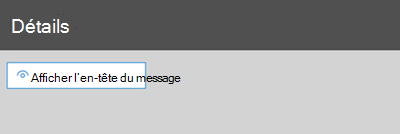
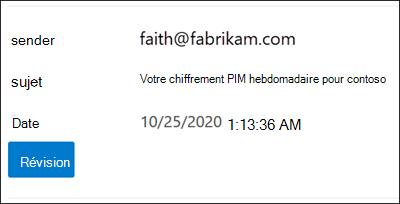

# <a name="quarantine-tags"></a>Balises de mise en quarantaine

> [!NOTE]
> Les fonctionnalités décrites dans cet article sont actuellement en prévisualisation, ne sont pas disponibles pour tout le monde et peuvent faire l’objet de changements.

Les balises de mise en quarantaine dans Exchange Online Protection (EOP) permettent aux administrateurs de contrôler ce que les utilisateurs peuvent faire pour leurs messages mis en quarantaine en fonction de la façon dont le message est arrivé en quarantaine.

EOP a traditionnellement autorisé ou empêché certains niveaux d’interactivité pour les messages en quarantaine et dans les notifications de courrier indésirable de [l’utilisateur final.](use-spam-notifications-to-release-and-report-quarantined-messages.md) [](find-and-release-quarantined-messages-as-a-user.md) Par exemple, les utilisateurs finaux peuvent afficher et libérer les messages mis en quarantaine par le filtrage anti-courrier indésirable en tant que courrier indésirable ou en bloc, mais ils ne peuvent pas afficher ou libérer les messages mis en quarantaine comme hameçonnage à haut niveau de confiance.

Pour les fonctionnalités de [protection](#step-2-assign-a-quarantine-tag-to-supported-features)prise en charge, les balises de mise en quarantaine spécifient ce que les utilisateurs sont autorisés à faire dans les messages de notification de courrier indésirable de l’utilisateur final et dans leurs messages mis en quarantaine en quarantaine (messages dont l’utilisateur est un destinataire). Les balises de mise en quarantaine par défaut sont automatiquement attribuées pour appliquer les fonctionnalités historiques pour les utilisateurs finaux sur les messages mis en quarantaine. Vous pouvez également créer et affecter des balises de mise en quarantaine personnalisées pour autoriser ou empêcher les utilisateurs finaux d’effectuer des actions spécifiques sur les messages mis en quarantaine.

Les autorisations individuelles sont combinées dans les groupes d’autorisations prédéfinës suivants :

- Pas d’accès
- Accès limité
- Accès total

Les autorisations individuelles disponibles et les autorisations incluses ou non dans les groupes d’autorisations prédéfinits sont décrites dans le tableau suivant :

<br>

****

|Autorisation|Pas d’accès|Accès limité|Accès total|
|---|:---:|:---:|:---:|
|**Autoriser l’expéditeur** (_PermissionToAllowSender_)||||
|**Bloquer l’expéditeur** (_PermissionToBlockSender_)||||
|**Delete** (_PermissionToDelete_)||||
|**Preview** (_PermissionToPreview_)||||
|**Autoriser les destinataires à libérer un message de la quarantaine** (_PermissionToRelease_)||||
|**Autoriser les destinataires à demander qu’un message soit libéré** de la quarantaine (_PermissionToRequestRelease_)||||
|

Si vous n’aimez pas les autorisations par défaut dans les groupes d’autorisations prédéfin produits, vous pouvez utiliser des autorisations personnalisées lorsque vous créez ou modifiez des balises de mise en quarantaine personnalisées. Pour plus d’informations sur l’objet de chaque autorisation, consultez la section [Détails](#quarantine-tag-permission-details) de l’autorisation de balise de mise en quarantaine plus loin dans cet article.

Vous créez et affectez des balises de mise en quarantaine dans le Centre de sécurité & conformité ou dans PowerShell (Exchange Online PowerShell pour les organisations Microsoft 365 avec boîtes aux lettres Exchange Online ; EOP PowerShell autonome dans les organisations EOP sans boîtes aux lettres Exchange Online).

## <a name="what-do-you-need-to-know-before-you-begin"></a>Ce qu'il faut savoir avant de commencer

- Vous ouvrez le Centre de conformité et sécurité sur <https://protection.office.com/>. Pour aller directement à la page des **balises de mise** en quarantaine, ouvrez <https://protection.office.com/quarantineTags> .

- Pour vous connecter à Exchange Online PowerShell, voir [Connexion à Exchange Online PowerShell](/powershell/exchange/connect-to-exchange-online-powershell). Pour vous connecter à un service Exchange Online Protection PowerShell autonome, voir [Se connecter à Exchange Online Protection PowerShell](/powershell/exchange/connect-to-exchange-online-protection-powershell).

- Pour afficher, créer, modifier ou supprimer des balises de  mise  en quarantaine, vous devez être membre des rôles Gestion de l’organisation ou Administrateur de la sécurité dans le Centre de sécurité [& conformité.](permissions-in-the-security-and-compliance-center.md)

## <a name="step-1-create-quarantine-tags-in-the-security--compliance-center"></a>Étape 1 : Créer des balises de mise en quarantaine dans le Centre de sécurité & conformité

1. Dans le Centre de sécurité &  conformité, sélectionnez Stratégie de gestion des menaces, puis sélectionnez Les balises \>  de mise **en quarantaine.**

2. Dans la page **Des balises de** mise en quarantaine, **sélectionnez Ajouter une balise personnalisée.**

3. **L’Assistant Nouvelle balise** s’ouvre. Dans la page **Nom de la** balise, entrez un nom court mais unique dans le champ Nom de **balise.** Vous devrez identifier et sélectionner la balise par son nom dans les étapes à venir. Lorsque vous avez terminé, cliquez sur **Suivant**.

4. Dans la page **d’accès aux messages du** destinataire, sélectionnez l’une des valeurs suivantes :
   - **Aucun accès**
   - **Accès limité**
   - **Accès total**

   Les autorisations individuelles incluses dans ces groupes d’autorisations sont décrites plus tôt dans cet article.

   Pour spécifier des autorisations personnalisées, sélectionnez Définir un accès **spécifique (Avancé)** et configurez les paramètres suivants :

     - **Sélectionnez la préférence d’action de** publication : sélectionnez l’une des valeurs suivantes :
       - **Aucune action de publication**: il s’agit de la valeur par défaut.
       - **Autoriser les destinataires à libérer un message de la quarantaine**
       - **Autoriser les destinataires à demander qu’un message soit libéré de la quarantaine**

     - **Sélectionnez des actions supplémentaires que les destinataires peuvent prendre** sur les messages mis en quarantaine : sélectionnez une partie, l’ensemble ou aucune des valeurs suivantes :
       - **Supprimer**
       - **Aperçu**
       - **Autoriser l’expéditeur**
       - **Bloquer l’expéditeur**

   Ces autorisations et leur effet sur les messages mis en quarantaine et dans les notifications de courrier indésirable de l’utilisateur final sont décrits dans la section détails des [autorisations](#quarantine-tag-permission-details) de balise de mise en quarantaine plus loin dans cet article.

   Lorsque vous avez terminé, cliquez sur **Suivant**.

5. Dans la page **Résumé** qui s’affiche, examinez vos paramètres. Vous pouvez cliquer **sur Modifier** sur chaque paramètre pour le modifier.

   Lorsque vous avez terminé, cliquez sur **Envoyer.**

6. Cliquez **sur Terminé** sur la page de confirmation qui s’affiche.

Vous êtes maintenant prêt à affecter la balise de mise en quarantaine à une fonctionnalité de mise en quarantaine comme décrit dans la section [Étape 2.](#step-2-assign-a-quarantine-tag-to-supported-features)

### <a name="create-quarantine-tags-in-powershell"></a>Créer des balises de mise en quarantaine dans PowerShell

Si vous préférez utiliser PowerShell pour créer des balises de mise en quarantaine, connectez-vous à Exchange Online PowerShell ou Exchange Online Protection PowerShell et utilisez la cmdlet **New-QuarantineTag.** Vous avez le choix entre deux méthodes différentes :

- Utilisez le _paramètre EndUserQuarantinePermissionsValue._
- Utilisez le _paramètre EndUserQuarantinePermissions._

Ces méthodes sont décrites dans les sections suivantes.

#### <a name="use-the-enduserquarantinepermissionsvalue-parameter"></a>Utiliser le paramètre EndUserQuarantinePermissionsValue

Pour créer une balise de mise en quarantaine à l’aide du paramètre _EndUserQuarantinePermissionsValue,_ utilisez la syntaxe suivante :

```powershell
New-QuarantineTag -Name "<UniqueName>" -EndUserQuarantinePermissionsValue <0 to 236>
```

Le _paramètre EndUserQuarantinePermissionsValue_ utilise une valeur décimale convertie à partir d’une valeur binaire. La valeur binaire correspond aux autorisations de mise en quarantaine de l’utilisateur final disponibles dans un ordre spécifique. Pour chaque autorisation, la valeur 1 est égale à True et la valeur 0 à False.

L’ordre et les valeurs requis pour chaque autorisation individuelle dans les groupes d’autorisations prédéfinits sont décrits dans le tableau suivant :

<br>

****

|Autorisation|Pas d’accès|Accès limité|Accès total|
|---|:---:|:---:|:---:|
|PermissionToAllowSender|0|0|1|
|PermissionToBlockSender|0|1|1|
|PermissionToDelete|0|1|1|
|PermissionToDownload<sup>\*</sup>|0|0|0|
|PermissionToPreview|0|1|1|
|PermissionToRelease<sup>\*\*</sup>|0|0|1|
|PermissionToRequestRelease<sup>\*\*</sup>|0|1|0|
|PermissionToViewHeader<sup>\*</sup>|0|0|0|
|Valeur binaire|00000000|01101010|11101100|
|Valeur décimale à utiliser|0|106|236|
|

<sup>\*</sup> Actuellement, cette valeur est toujours 0. Pour PermissionToViewHeader, la valeur 0 ne masque pas le bouton Afficher l’en-tête du **message** dans les détails du message mis en quarantaine (le bouton est toujours disponible).

<sup>\*\*</sup> Ne définissez pas ces deux valeurs sur 1. Définissez l’un sur 1 et l’autre sur 0, ou définissez les deux sur 0.

Cet exemple crée un nouveau nom de balise de mise en quarantaine NoAccess qui attribue les autorisations d’accès Non, comme décrit dans le tableau précédent.

```powershell
New-QuarantineTag -Name NoAccess -EndUserQuarantinePermissionsValue 0
```

Pour les autorisations d’accès limité, utilisez la valeur 106. Pour les autorisations d’accès total, utilisez la valeur 236.

Pour les autorisations personnalisées, utilisez le tableau précédent pour obtenir la valeur binaire qui correspond aux autorisations de votre choix. Convertissez la valeur binaire en valeur décimale et utilisez la valeur décimale pour le paramètre _EndUserQuarantinePermissionsValue._

Pour obtenir des informations détaillées sur la syntaxe et les paramètres, voir [New-QuarantineTag](/powershell/module/exchange/new-quarantinetag).

#### <a name="use-the-enduserquarantinepermissions-parameter"></a>Utiliser le paramètre EndUserQuarantinePermissions

Pour créer une balise de mise en quarantaine à l’aide du paramètre _EndUserQuarantinePermissionsValue,_ utilisez les étapes suivantes :

A. Stockez un objet d’autorisations de mise en quarantaine dans une variable à l’aide de la cmdlet **New-QuarantinePermissions.**

<p>

B. Utilisez la variable comme valeur _EndUserQuarantinePermissions_ dans la **commande New-QuarantineTag.**

##### <a name="step-a-store-a-quarantine-permissions-object-in-a-variable"></a>Étape A : Stocker un objet d’autorisations de mise en quarantaine dans une variable

Utilisez la syntaxe suivante :

```powershell
$<VariableName> = New-QuarantinePermissions [-PermissionToAllowSender <$true | $False>] [-PermissionToBlockSender <$true | $False>] [-PermissionToDelete <$true | $False>] [-PermissionToPreview <$true | $False>] [-PermissionToRelease <$true | $False>] [-PermissionToRequestRelease <$true | $False>]
```

La valeur par défaut pour tous les paramètres inutilisés est , vous devez donc utiliser uniquement les paramètres où vous souhaitez définir `$false` la valeur sur `$true` .

Les exemples suivants montrent comment créer des objets d’autorisation qui correspondent aux groupes d’autorisations prédéfinës :

- **Aucun accès**:

  ```powershell
  $NoAccess = New-QuarantinePermissions
  ```

- **Accès limité**:

  ```powershell
  $LimitedAccess = New-QuarantinePermissions -PermissionToBlockSender $true -PermissionToDelete $true -PermissionToPreview $true -PermissionToRequestRelease $true
  ```

- **Accès total**:

  ```powershell
  $FullAccess = New-QuarantinePermissions -PermissionToAllowSender $true -PermissionToBlockSender $true -PermissionToDelete $true -PermissionToPreview $true -PermissionToRelease $true
  ```

Pour voir les valeurs que vous avez définies, exécutez le nom de la variable en tant que commande (par exemple, exécutez la `$NoAccess` commande).

Pour les autorisations personnalisées, ne définissez pas les paramètres _PermissionToRelease_ et _PermissionToRequestRelease_ sur `$true` . Définissez `$true` l’un sur et laissez l’autre en tant `$false` que , ou laissez les deux comme `$false` .

Vous pouvez également modifier une variable objet d’autorisations existante après la création mais avant de l’utiliser à l’aide de la cmdlet **Set-QuarantinePermissions.**

Pour obtenir des informations détaillées sur la syntaxe et les [paramètres, voir New-QuarantinePermissions](/powershell/module/exchange/new-quarantinepermissions) et [Set-QuarantinePermissions](/powershell/module/exchange/set-quarantinepermissions).

##### <a name="step-b-use-the-variable-in-the-new-quarantinetag-command"></a>Étape B : Utiliser la variable dans la commande New-QuarantineTag commande

Après avoir créé et stocké l’objet Permissions dans une variable, utilisez la variable pour la valeur du paramètre _EndUserQuarantinePermission_ dans la commande **New-QuarantineTag** suivante :

```powershell
New-QuarantineTag -Name "<UniqueName>" -EndUserQuarantinePermissions $<VariableName>
```

Cet exemple crée une balise de mise en quarantaine nommée LimitedAccess à l’aide de l’objet permissions qui a été décrit et créé `$LimitedAccess` à l’étape précédente.

```powershell
New-QuarantineTag -Name LimitedAccess -EndUserQuarantinePermissions $LimitedAccess
```

Pour obtenir des informations détaillées sur la syntaxe et les paramètres, voir [New-QuarantineTag](/powershell/module/exchange/new-quarantinetag).

## <a name="step-2-assign-a-quarantine-tag-to-supported-features"></a>Étape 2 : Affecter une balise de mise en quarantaine aux fonctionnalités prise en charge

Dans _les fonctionnalités_ de protection prises en charge qui met en quarantaine les messages ou les fichiers (automatiquement ou en tant qu’action configurable), vous pouvez affecter une balise de mise en quarantaine aux actions de mise en quarantaine disponibles. Les fonctionnalités qui met en quarantaine les messages et la disponibilité des balises de mise en quarantaine sont décrites dans le tableau suivant :

<br>

****

|Fonctionnalité|Balises de mise en quarantaine pris en charge ?|Balises de mise en quarantaine par défaut utilisées|
|---|:---:|---|
|[Stratégies anti-courrier indésirable](configure-your-spam-filter-policies.md): <ul><li>**Courrier** indésirable (_SpamAction_)</li><li>**Courrier indésirable à niveau** de confiance élevé (_HighConfidenceSpamAction_)</li><li>**E-mail de hameçonnage** (_PhishSpamAction_)</li><li>**E-mail de hameçonnage à haut niveau** de confiance (_HighConfidencePhishAction_)</li><li>**Courrier électronique en** bloc (_BulkSpamAction_)</li></ul>|Oui|<ul><li>DefaultSpamTag (accès complet)</li><li>DefaultHighConfSpamTag (accès complet)</li><li>DefaultPhishTag (accès complet)</li><li>DefaultHighConfPhishTag (aucun accès)</li><li>DefaultBulkTag (accès complet)</li></ul>
|Stratégies anti-hameçonnage : <ul><li>[Protection contre l’usurpation d’identité](set-up-anti-phishing-policies.md#spoof-settings) (_AuthenticationFailAction_)</li><li>[Protection contre l’emprunt d’identité](set-up-anti-phishing-policies.md#impersonation-settings-in-anti-phishing-policies-in-microsoft-defender-for-office-365):<sup>\*</sup> <ul><li>**Si le courrier électronique est envoyé par un utilisateur dont l’identité** est usurpée (_TargetedUserProtectionAction_)</li><li>**Si le courrier électronique est envoyé par un domaine dont l’identité** est usurpée (_TargetedDomainProtectionAction_)</li><li>**Veille sur les boîtes aux lettres** \> **Si le courrier électronique est envoyé par un utilisateur dont l’identité** est usurpée (_MailboxIntelligenceProtectionAction_)</li></ul></li></ul></ul>|Non|s/o|
|[Stratégies anti-programme](configure-anti-malware-policies.md)malveillant : tous les messages détectés sont toujours mis en quarantaine.|Non|s/o|
|[Pièces jointes sécurisées pour SharePoint, OneDrive et Microsoft Teams](mdo-for-spo-odb-and-teams.md)|Non|s/o|
|[Règles de flux de messagerie](/exchange/security-and-compliance/mail-flow-rules/mail-flow-rules) (également appelées règles de transport) avec l’action : Remettre le **message** en quarantaine hébergé (mise en _quarantaine)._|Non|s/o|
|

<sup>\*</sup> Les paramètres de protection contre l’emprunt d’identité sont disponibles uniquement dans les stratégies anti-hameçonnage dans Microsoft Defender pour Office 365.

Si vous êtes satisfait des autorisations de l’utilisateur final fournies par les balises de mise en quarantaine par défaut, vous n’avez rien à faire. Si vous souhaitez personnaliser les fonctionnalités de l’utilisateur final (boutons disponibles) dans les notifications de courrier indésirable de l’utilisateur final ou dans les détails des messages mis en quarantaine, vous pouvez affecter une balise de mise en quarantaine personnalisée.

### <a name="assign-quarantine-tags-in-anti-spam-policies-in-the-security--compliance-center"></a>Attribuer des balises de mise en quarantaine dans les stratégies anti-courrier indésirable dans le Centre de sécurité & conformité

Des instructions complètes pour la création et la modification des stratégies anti-courrier indésirable sont décrites dans Configurer des stratégies [anti-courrier indésirable dans EOP.](configure-your-spam-filter-policies.md)

1. Dans le Centre de sécurité &  conformité, sélectionnez Stratégie de gestion des menaces, puis \>  \> **sélectionnez Anti-courrier indésirable.** Ou, ouvrez <https://protection.office.com/antispam> .

2. Recherchez et sélectionnez une stratégie anti-courrier indésirable existante à modifier, ou créez une stratégie anti-courrier indésirable.

3. Dans le volet des détails de la stratégie, développez la section **Courrier indésirable et actions en bloc.**

4. Si vous avez sélectionné le **message** de mise en quarantaine  pour l’action d’un verdict de filtrage du courrier indésirable disponible, la zone de balise Appliquer la stratégie de mise en quarantaine est disponible pour que vous sélectionniez la balise de mise en quarantaine pour ce verdict.

   **Remarque**: lorsque vous créez une stratégie, une valeur de balise de mise en quarantaine vide pour un verdict de filtrage du courrier indésirable indique que la balise de mise en quarantaine par défaut pour ce verdict est utilisée. Lorsque vous modifiez ultérieurement la stratégie, les valeurs vides sont remplacées par les noms de balises de mise en quarantaine par défaut réels, comme décrit dans le tableau précédent.

   

5. Lorsque vous avez terminé, cliquez sur **Enregistrer**.

#### <a name="assign-quarantine-tags-in-anti-spam-policies-in-powershell"></a>Attribuer des balises de mise en quarantaine dans les stratégies anti-courrier indésirable dans PowerShell

Si vous préférez utiliser PowerShell pour affecter des balises de mise en quarantaine dans les stratégies anti-courrier indésirable, connectez-vous à Exchange Online PowerShell ou Exchange Online Protection PowerShell et utilisez la syntaxe suivante :

```powershell
<New-HostedContentFilterPolicy -Name "<Unique name>" | Set-HostedContentFilterPolicy -Identity "<Policy name>">  [-SpamAction Quarantine] [-SpamQuarantineTag <QuarantineTagName>] [-HighConfidenceSpamAction Quarantine] [-HighConfidenceSpamQuarantineTag <QuarantineTagName>] [-PhishSpamAction Quarantine] [-PhishQuarantineTag <QuarantineTagName>] [-HighConfidencePhishQuarantineTag <QuarantineTagName>] [-BulkSpamAction Quarantine] [-BulkQuarantineTag <QuarantineTagName>] ...
```

**Remarques** :

- La valeur par défaut du paramètre _HighConfidencePhishAction_ est Mise en quarantaine. Vous n’avez donc pas besoin de définir l’action de mise en quarantaine pour les détections de hameçonnage à haut niveau de confiance dans les nouvelles stratégies anti-courrier indésirable. Pour tous les autres verdicts de filtrage du courrier indésirable dans les stratégies anti-courrier indésirable nouvelles ou existantes, la balise de mise en quarantaine n’est effective que si la valeur de l’action est Mise en quarantaine. Pour voir les valeurs d’action dans les stratégies anti-courrier indésirable existantes, exécutez la commande suivante :

  ```powershell
  Get-HostedContentFilterPolicy | Format-Table Name,*SpamAction,HighConfidencePhishAction
  ```

  Pour plus d’informations sur les valeurs d’action par défaut et les valeurs d’action recommandées pour Standard et Strict, voir paramètres de stratégie [anti-courrier indésirable EOP.](recommended-settings-for-eop-and-office365.md#eop-anti-spam-policy-settings)

- Un verdict de filtrage du courrier indésirable sans paramètre de balise de mise en quarantaine correspondant signifie que la balise de mise en quarantaine [par](#step-2-assign-a-quarantine-tag-to-supported-features) défaut pour ce verdict est utilisée.

  Vous devez uniquement remplacer une balise de mise en quarantaine par défaut par une balise de mise en quarantaine personnalisée si vous souhaitez modifier les fonctionnalités par défaut de l’utilisateur final sur les messages mis en quarantaine.

- Une nouvelle stratégie anti-courrier indésirable dans PowerShell nécessite une stratégie de filtrage du courrier indésirable (paramètres) à l’aide de la cmdlet **New-HostedContentFilterPolicy** et une nouvelle règle de filtrage du courrier indésirable (filtres de destinataires) à l’aide de la cmdlet **New-HostedContentFilterRule.** Pour obtenir des instructions, [voir Utiliser PowerShell pour créer des stratégies anti-courrier indésirable.](configure-your-spam-filter-policies.md#use-powershell-to-create-anti-spam-policies)

Cet exemple crée une stratégie de filtrage du courrier indésirable nommée Research Department avec les paramètres suivants :

- L’action pour tous les verdicts de filtrage du courrier indésirable est définie sur Quarantaine.
- La balise de mise en quarantaine  personnalisée nommée NoAccess qui attribue aucune autorisation  d’accès remplace toutes les balises de mise en quarantaine par défaut qui n’attribuent pas déjà aucune autorisation d’accès par défaut.

```powershell
New-HostedContentFilterPolicy -Name Research Department -SpamAction Quarantine -SpamQuarantineTag NoAccess -HighConfidenceSpamAction Quarantine -HighConfidenceSpamQuarantineTag NoAction -PhishSpamAction Quarantine -PhishQuarantineTag NoAction -BulkSpamAction Quarantine -BulkQuarantineTag NoAccess
```

Pour obtenir des informations détaillées sur la syntaxe et les paramètres, voir [New-HostedContentFilterPolicy](/powershell/module/exchange/new-hostedcontentfilterpolicy).

Cet exemple modifie la stratégie de filtrage de courrier indésirable existante nommée Human Resources. L’action pour le verdict de mise en quarantaine du courrier indésirable est définie sur Mise en quarantaine et la balise de mise en quarantaine personnalisée nommée NoAccess est affectée.

```powershell
Set-HostedContentFilterPolicy -Identity "Human Resources" -SpamAction Quarantine -SpamQuarantineTag NoAccess
```

Pour obtenir des informations détaillées sur la syntaxe et les paramètres, voir [Set-HostedContentFilterPolicy](/powershell/module/exchange/set-hostedcontentfilterpolicy).

## <a name="configure-global-quarantine-notification-settings-in-the-security--compliance-center"></a>Configurer les paramètres globaux de notification de mise en quarantaine dans le Centre de conformité & sécurité

Les paramètres globaux des balises de mise en quarantaine vous permettent de personnaliser les notifications de courrier indésirable de l’utilisateur final qui sont envoyées aux destinataires des messages mis en quarantaine. Pour plus d’informations sur ces notifications, voir notifications de [courrier indésirable pour l’utilisateur final.](use-spam-notifications-to-release-and-report-quarantined-messages.md)

1. Dans le Centre de sécurité &  conformité, sélectionnez Stratégie de gestion des menaces, puis sélectionnez Les balises \>  de mise **en quarantaine.**

2. Dans la page **Des balises de** mise en quarantaine, sélectionnez **Paramètres globaux.**

3. Dans le volant **des paramètres de notification de** mise en quarantaine qui s’ouvre, configurez tout ou partie des paramètres suivants :

   - **Utilisez le logo de mon** entreprise : sélectionnez cette option pour remplacer le logo Microsoft par défaut qui est utilisé en haut des notifications de courrier indésirable à l’utilisateur final. Avant de faire cela, vous devez suivre les instructions dans Personnaliser le thème [Microsoft 365](../../admin/setup/customize-your-organization-theme.md) pour que votre organisation télécharge votre logo personnalisé.

     La capture d’écran suivante montre un logo personnalisé dans une notification de courrier indésirable à l’utilisateur final :

     

   - **Choisir la langue**: les notifications de courrier indésirable de l’utilisateur final sont déjà localisées en fonction des paramètres de langue du destinataire. Vous pouvez spécifier du texte personnalisé dans différentes langues pour le nom **d’affichage** et les valeurs **de clause d’exclusion** de responsabilité.

     Sélectionnez au moins une langue dans la première langue, puis cliquez sur **Ajouter.** Vous pouvez sélectionner plusieurs langues en cliquant sur **Ajouter** après chacune d’elles. Une zone de langue de section affiche toutes les langues que vous avez sélectionnées :

     

   - **Nom d’affichage**: personnalisez le nom complet de l’expéditeur utilisé dans les notifications de courrier indésirable à l’utilisateur final.

     Pour chaque langue que vous avez ajoutée, sélectionnez la langue dans la deuxième langue (ne cliquez pas  sur le X) et entrez la valeur de texte de votre choix dans la zone Nom complet.

     La capture d’écran suivante montre le nom complet personnalisé dans une notification de courrier indésirable à l’utilisateur final :

     

   - **Clause d’exclusion de** responsabilité : ajoutez une clause d’exclusion de responsabilité personnalisée au bas des notifications de courrier indésirable à l’utilisateur final. Le texte localisé, **une clause d’exclusion** de responsabilité de votre organisation, est toujours inclus en premier, suivi du texte que vous spécifiez.

     Pour chaque langue que vous avez ajoutée, sélectionnez la langue dans la deuxième langue (ne cliquez pas sur le X) et entrez la valeur de texte de votre choix dans la zone Exclusion de **responsabilité.**

     La capture d’écran suivante montre la clause d’exclusion de responsabilité personnalisée dans une notification de courrier indésirable à l’utilisateur final :

     

## <a name="view-quarantine-tags-in-the-security--compliance-center"></a>Afficher les balises de mise en quarantaine dans le Centre de conformité & sécurité

1. Dans le Centre de sécurité &  conformité, sélectionnez Stratégie de gestion des menaces, puis sélectionnez Les balises \>  de mise **en quarantaine.**

- Pour afficher les paramètres des balises de mise en quarantaine intégrées ou personnalisées, sélectionnez la balise de mise en quarantaine dans la liste (ne cochez pas la case).

- Pour afficher les paramètres globaux, sélectionnez **Paramètres globaux**

### <a name="view-quarantine-tags-in-powershell"></a>Afficher les balises de mise en quarantaine dans PowerShell

Si vous préférez utiliser PowerShell pour afficher les balises de mise en quarantaine, faites l’une des étapes suivantes :

- Pour afficher une liste récapitulatif de toutes les balises intégrées ou personnalisées, exécutez la commande suivante :

  ```powershell
  Get-QuarantineTag | Format-Table Name
  ```

- Pour afficher les paramètres des balises de mise en quarantaine intégrées ou personnalisées, remplacez-les par le nom de la balise de mise en quarantaine \<TagName\> et exécutez la commande suivante :

  ```powershell
  Get-QuarantineTag -Identity "<TagName>"
  ```

- Pour afficher les paramètres globaux, exécutez la commande suivante :

  ```powershell
  Get-QuarantineTag -QuarantineTagType GlobalQuarantineTag
  ```

Pour obtenir des informations détaillées sur la syntaxe et les paramètres, voir [Get-HostedContentFilterPolicy](/powershell/module/exchange/get-hostedcontentfilterpolicy).

## <a name="remove-quarantine-tags-in-the-security--compliance-center"></a>Supprimer les balises de mise en quarantaine dans le Centre de conformité & sécurité

**Remarques** :

- Vous ne pouvez pas supprimer les balises de mise en quarantaine intégrées.

- Avant de supprimer une balise de mise en quarantaine personnalisée, vérifiez qu’elle n’est pas utilisée. Par exemple, exécutez la commande suivante dans PowerShell :

  ```powershell
  Get-HostedContentFilterPolicy | Format-List Name,*QuarantineTag
  ```

  Si la balise de mise en quarantaine est utilisée, [remplacez la balise de](#step-2-assign-a-quarantine-tag-to-supported-features) mise en quarantaine affectée avant de la supprimer.

1. Dans le Centre de sécurité &  conformité, sélectionnez Stratégie de gestion des menaces, puis sélectionnez Les balises \>  de mise **en quarantaine.**

2. Dans la page **Des balises de** mise en quarantaine, sélectionnez la balise de mise en quarantaine personnalisée à supprimer, puis cliquez sur **Supprimer.**

3. Cliquez **sur Supprimer la balise** dans la boîte de dialogue de confirmation qui s’affiche.

### <a name="remove-quarantine-tags-in-powershell"></a>Supprimer les balises de mise en quarantaine dans PowerShell

Si vous préférez utiliser PowerShell pour supprimer une balise de mise en quarantaine personnalisée, remplacez-la par le nom de la balise de mise en quarantaine \<TagName\> et exécutez la commande suivante :

```powershell
Remove-QuarantineTag -Identity "<TagName>"
```

Pour obtenir des informations détaillées sur la syntaxe et les paramètres, voir [Remove-QuarantineTag](/powershell/module/exchange/remove-quarantinetag).

## <a name="quarantine-tag-permission-details"></a>Détails de l’autorisation de balise de mise en quarantaine

Les sections suivantes décrivent les effets des groupes d’autorisations prédéfinés et des autorisations individuelles dans les détails des messages mis en quarantaine et dans les notifications de courrier indésirable à l’utilisateur final.

### <a name="preset-permissions-groups"></a>Groupes d’autorisations prédéfins

Les autorisations individuelles incluses dans les groupes d’autorisations prédéfinés sont répertoriées dans le tableau au début de cet article.

#### <a name="no-access"></a>Pas d’accès

Si la balise de mise en quarantaine attribue les **autorisations** Aucun accès (aucune autorisation), les utilisateurs obtiennent toujours certaines fonctionnalités de référence :

- **Détails du message mis en quarantaine**: le bouton Afficher **l’en-tête du message** est toujours disponible.

  

- **Notifications de courrier** indésirable  à l’utilisateur final : le bouton Révision qui met l’utilisateur en quarantaine est toujours disponible.

  

#### <a name="limited-access"></a>Accès limité

Si la balise de mise en quarantaine attribue les **autorisations** d’accès limité, les utilisateurs obtiennent les fonctionnalités suivantes :

- **Détails du message mis en quarantaine**: les boutons suivants sont disponibles :
  - **Publication de la demande**
  - **Afficher l’en-tête du message**
  - **Aperçu du message**
  - **Bloquer l’expéditeur**
  - **Supprimer de la quarantaine**

  

- **Notifications de courrier indésirable pour l’utilisateur final**: les boutons suivants sont disponibles :
  - **Bloquer l’expéditeur**
  - **Révision**

  

#### <a name="full-access"></a>Accès total

Si la balise de mise en quarantaine attribue les **autorisations** d’accès total (toutes les autorisations disponibles), les utilisateurs disposent des fonctionnalités suivantes :

- **Détails du message mis en quarantaine**: les boutons suivants sont disponibles :
  - **Message de libération**
  - **Afficher l’en-tête du message**
  - **Aperçu du message**
  - **Bloquer l’expéditeur**
  - **Autoriser l’expéditeur**
  - **Supprimer de la quarantaine**

  

- **Notifications de courrier indésirable pour l’utilisateur final**: les boutons suivants sont disponibles :
  - **Bloquer l’expéditeur**
  - **Débloquer**
  - **Révision**

  

### <a name="individual-permissions"></a>Autorisations individuelles

> [!NOTE]
> N’oubliez pas que les utilisateurs obtiennent toujours les boutons décrits dans la section [Aucun](#no-access) accès. Ces boutons ne sont pas inclus dans les descriptions des autorisations individuelles.

#### <a name="allow-sender-permission"></a>Autoriser l’autorisation de l’expéditeur

**L’autorisation** Autoriser l’expéditeur (_PermissionToAllowSender_) contrôle l’accès au bouton qui permet aux utilisateurs d’ajouter facilement l’expéditeur du message mis en quarantaine à leur liste des expéditeurs autorisés.

- **Détails du message mis en quarantaine**:
  - **Autoriser l’autorisation** de l’expéditeur activée : le bouton Autoriser **l’expéditeur** est disponible.
  - **Autoriser l’autorisation** de l’expéditeur désactivée : le bouton Autoriser **l’expéditeur** n’est pas disponible.

- **Notifications de courrier indésirable pour l’utilisateur final**: aucun effet.

Pour plus d’informations sur la [](https://support.microsoft.com/office/274ae301-5db2-4aad-be21-25413cede077#__toc304379666) liste des expéditeurs fiables, voir Empêcher le blocage des expéditeurs fiables et Utiliser [Exchange Online PowerShell](configure-junk-email-settings-on-exo-mailboxes.md#use-exchange-online-powershell-to-configure-the-safelist-collection-on-a-mailbox)pour configurer la collection de listes fiables sur une boîte aux lettres.

#### <a name="block-sender-permission"></a>Bloquer l’autorisation de l’expéditeur

**L’autorisation** Bloquer l’expéditeur (_PermissionToBlockSender_) contrôle l’accès au bouton qui permet aux utilisateurs d’ajouter facilement l’expéditeur du message mis en quarantaine à leur liste des expéditeurs bloqués.

- **Détails du message mis en quarantaine**:
  - **Autorisation bloquer l’expéditeur** activée : le **bouton Bloquer l’expéditeur** est disponible.
  - **Bloquer l’autorisation** de l’expéditeur désactivée : le bouton **Bloquer l’expéditeur** n’est pas disponible.

- **Notifications de courrier indésirable pour l’utilisateur final**:
  - **Bloquer l’autorisation** de l’expéditeur désactivée : le bouton **Bloquer l’expéditeur** n’est pas disponible.
  - **Autorisation bloquer l’expéditeur** activée : le **bouton Bloquer l’expéditeur** est disponible.

Pour plus d’informations sur la liste des expéditeurs bloqués, voir Bloquer les [messages](https://support.microsoft.com/office/274ae301-5db2-4aad-be21-25413cede077#__toc304379667) d’une personne et utiliser Exchange Online PowerShell pour configurer la collection de listes sécurisées sur [une boîte aux lettres.](configure-junk-email-settings-on-exo-mailboxes.md#use-exchange-online-powershell-to-configure-the-safelist-collection-on-a-mailbox)

#### <a name="delete-permission"></a>Autorisations de suppression

**L’autorisation** Supprimer (_PermissionToDelete_) contrôle la possibilité pour les utilisateurs de supprimer leurs messages (messages dont l’utilisateur est un destinataire) de la quarantaine.

- **Détails du message mis en quarantaine**:
  - **Autorisation de** suppression activée : le bouton **Supprimer de** la quarantaine est disponible.
  - **Autorisation de** suppression désactivée : le bouton **Supprimer de la quarantaine** n’est pas disponible.

- **Notifications de courrier indésirable pour l’utilisateur final**: aucun effet.

#### <a name="preview-permission"></a>Autorisation d’aperçu

**L’autorisation** Aperçu (_PermissionToPreview_) contrôle la possibilité pour les utilisateurs d’afficher un aperçu de leurs messages en quarantaine.

- **Détails du message mis en quarantaine**:
  - **Autorisation d’aperçu** activée : le bouton **Aperçu du message** est disponible.
  - **Autorisation d’aperçu** désactivée : le bouton **Aperçu du message** n’est pas disponible.

- **Notifications de courrier indésirable pour l’utilisateur final**: aucun effet.

#### <a name="allow-recipients-to-release-a-message-from-quarantine-permission"></a>Autoriser les destinataires à libérer un message de l’autorisation de mise en quarantaine

L’autorisation autoriser les destinataires à libérer un message de l’autorisation de mise en quarantaine (_PermissionToRelease_) contrôle la capacité des **utilisateurs** à libérer leurs messages mis en quarantaine directement et sans l’approbation d’un administrateur.

- **Détails du message mis en quarantaine**:
  - Autorisation activée : le bouton **Libérer le message** est disponible.
  - Autorisation désactivée : le bouton **Libérer le message** n’est pas disponible.

- **Notifications de courrier indésirable pour l’utilisateur final**:
  - Autorisation activée : le bouton **Libérer** est disponible.
  - Autorisation désactivée : **le** bouton Libérer n’est pas disponible.

#### <a name="allow-recipients-to-request-a-message-to-be-released-from-quarantine-permission"></a>Autoriser les destinataires à demander la libération d’un message de l’autorisation de mise en quarantaine

L’autorisation autoriser les destinataires à demander la libération d’un message de l’autorisation  de mise en quarantaine (_PermissionToRequestRelease_) contrôle la capacité des **utilisateurs** à demander la libération de leurs messages mis en quarantaine. Le message n’est publié qu’une fois qu’un administrateur a approuvé la demande.

- **Détails du message mis en quarantaine**:
  - Autorisation activée : le bouton **De publication** de la demande est disponible.
  - Autorisation désactivée : le **bouton De publication** de la demande n’est pas disponible.

- **Notifications de courrier indésirable pour l’utilisateur final**: **le** bouton Release n’est pas disponible.