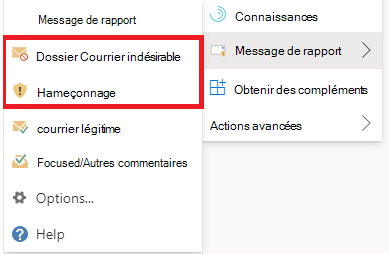
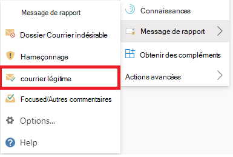

# Signaler les faux positifs et les faux négatifs dans Outlook

[!INCLUDE [Microsoft 365 Defender rebranding](../includes/microsoft-defender-for-office.md)]

**S’applique à**
- [Exchange Online Protection](exchange-online-protection-overview.md)
- [Microsoft Defender pour Office 365 : offre 1 et offre 2](defender-for-office-365.md)
- [Microsoft 365 Defender](../defender/microsoft-365-defender.md)

> [!NOTE]
> Si vous êtes un administrateur d’une organisation Microsoft 365 avec des boîtes aux lettres Exchange Online, nous vous recommandons d’utiliser la page **Soumissions** dans le portail Microsoft 365 Defender. Pour plus d’informations, voir Utiliser le portail Soumissions pour soumettre des messages suspects de courrier indésirable, d’hameçonnage, d’URL et [de fichiers à Microsoft.](admin-submission.md)

Dans Microsoft 365 organisations avec des boîtes aux lettres dans Exchange Online ou locales utilisant l’authentification moderne hybride, vous pouvez envoyer des faux positifs (messages électroniques de qualité bloqués ou envoyés à un dossier de courrier indésirable) et des faux négatifs (courrier indésirable ou hameçonnage qui a été remis à la boîte de réception) à Exchange Online Protection (EOP).

## Ce qu'il faut savoir avant de commencer

- Pour une meilleure expérience de soumission d’utilisateurs, utilisez le add-in Report Message ou report Phishing.

  > [!IMPORTANT]
  > L’expérience intégrée pour signaler le courrier indésirable ou le hameçonnage dans Outlook ne peut pas utiliser la stratégie [de soumission d’utilisateur.](./user-submission.md) Nous vous recommandons plutôt d’utiliser le add-in Report Message ou report Phishing.

- Le add-in Report Message et le add-in Report Phishing fonctionnent pour Outlook sur toutes les plateformes (Outlook sur le web, iOS, Android et Desktop).

- Si vous êtes un administrateur d’une organisation Exchange Online boîtes aux lettres, utilisez le portail Soumissions dans Microsoft 365 Defender portail. Pour plus d’informations, voir Utiliser la soumission d’administrateur pour soumettre des messages suspects de courrier indésirable, d’hameçonnage, d’URL et [de fichiers à Microsoft.](admin-submission.md)

- Vous pouvez configurer pour envoyer des messages directement à Microsoft, une boîte aux lettres que vous spécifiez, ou les deux. Pour plus d’informations, voir [Stratégies d’envoi des utilisateurs.](user-submission.md)

- Pour plus d’informations sur la façon d’obtenir et d’activer le message de rapport ou les add-ins De hameçonnage de rapport, voir Activer le [message](enable-the-report-message-add-in.md)de rapport ou les rapports de hameçonnage.

- Pour plus d’informations sur la notification des messages à Microsoft, voir [Signaler des messages et des fichiers à Microsoft.](report-junk-email-messages-to-microsoft.md)

## Utiliser la fonctionnalité Message de rapport

### Signaler les messages de courrier indésirable et de hameçonnage

Pour les messages dans la boîte de réception ou tout autre dossier de courrier électronique à l’exception du courrier indésirable, utilisez la méthode suivante pour signaler le courrier indésirable et les messages de hameçonnage :

1. Sélectionnez les ellipses Autres **actions** dans le coin supérieur droit du message sélectionné, sélectionnez Signaler **le message** dans le menu déroulant, puis sélectionnez Courrier indésirable ou **Hameçonnage.** 

   

   

2. Les messages sélectionnés sont envoyés à Microsoft pour analyse et :
   - Déplacé vers le dossier Courrier indésirable s’ils ont été signalés comme courrier indésirable.
   - Supprimé s’ils ont été signalés comme hameçonnage.

### Signaler les messages qui ne sont pas indésirables

1. Sélectionnez les ellipses Autres **actions** dans le coin supérieur droit du message sélectionné, sélectionnez Signaler **le message** dans le menu déroulant, puis sélectionnez Non indésirable **.**

   

   

2. Le message sélectionné est envoyé à Microsoft pour analyse et déplacé vers la boîte de réception ou tout autre dossier spécifié.

## Afficher et examiner les messages signalés

Pour passer en revue les messages que les utilisateurs signalent à Microsoft, vous avez les options ci-après :

- Utilisez la page **Soumissions** dans le portail Microsoft 365 Defender web. Pour plus d’informations, voir [Afficher les soumissions d’utilisateurs à Microsoft.](admin-submission.md#view-user-submissions-to-microsoft)
- Créez une règle de flux de messagerie (également appelée règle de transport) pour envoyer des copies des messages signalés. Pour obtenir des instructions, voir Utiliser des règles de flux de messagerie pour voir [quels utilisateurs font des rapports à Microsoft.](/exchange/security-and-compliance/mail-flow-rules/use-rules-to-see-what-users-are-reporting-to-microsoft)
