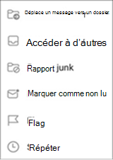
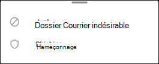
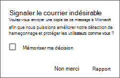
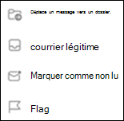

# Signaler le courrier indésirable et le hameçonnage dans Outlook pour iOS et Android dans Exchange Online

[!INCLUDE [Microsoft 365 Defender rebranding](../includes/microsoft-defender-for-office.md)]

Dans les organisations Microsoft 365 avec des boîtes aux lettres dans Exchange Online ou des boîtes aux lettres locales qui utilisent l' [authentification moderne hybride](https://docs.microsoft.com/microsoft-365/enterprise/hybrid-modern-auth-overview?view=o365-worldwide), vous pouvez utiliser les options de création de rapports intégrées dans Outlook pour iOS et Android pour soumettre des faux positifs (courrier marqué comme courrier indésirable), des faux négatifs (courrier indésirable autorisé) et des messages de hameçonnage à Exchange Online Protection (EoP)

## Ce qu’il faut savoir avant de commencer

- Si vous êtes administrateur d’une organisation avec des boîtes aux lettres Exchange Online, nous vous recommandons d’utiliser le portail d’envoi du centre de sécurité & conformité. Pour plus d’informations, consultez la rubrique [utiliser la soumission de l’administrateur pour envoyer des courriers indésirables, des hameçons, des URL et des fichiers à Microsoft](admin-submission.md).

- Vous pouvez configurer la copie ou la redirection des messages signalés vers une boîte aux lettres que vous spécifiez. Pour plus d’informations, consultez [la rubrique spécifier une boîte aux lettres pour les soumissions utilisateur de messages de courrier indésirable et de hameçonnage dans Exchange Online](user-submission.md).

- Pour plus d’informations sur la création de rapports de messages à Microsoft, consultez la rubrique [signaler des messages et des fichiers à Microsoft](report-junk-email-messages-to-microsoft.md).

  > [!NOTE]
  > Si la création de rapports de courrier indésirable est désactivée pour Outlook dans la stratégie d’envoi, les messages de courrier indésirable ou de hameçonnage sont déplacés vers le dossier courrier indésirable et ne sont pas envoyés à votre administrateur ou Microsoft.

## Signaler les messages de courrier indésirable et de hameçonnage dans Outlook pour iOS et Android

Pour les messages de la boîte de réception ou de tout autre dossier de messagerie, à l’exception du courrier indésirable, procédez comme suit pour signaler les messages de courrier indésirable et de hameçonnage pour iOS et Android :

1. Sélectionnez un ou plusieurs messages.
2. Dans le coin supérieur droit, appuyez sur les trois points verticaux. Le menu action s’ouvre.

   

3. Appuyez sur **signaler le courrier indésirable** , puis sélectionnez **courrier indésirable** ou **hameçonnage**.

   

4. Dans la boîte de dialogue qui s’affiche, vous pouvez choisir **rapport** ou **non**. En sélectionnant **non merci**, si vous avez cliqué sur **courrier indésirable** , le message est déplacé dans le dossier courrier indésirable si vous avez cliqué sur **hameçonnage** le message est déplacé vers le dossier éléments supprimés. Sélectionnez **rapport** pour envoyer une copie du message à Microsoft.

   

Si vous changez d’avis, sélectionnez **Annuler** dans la notification Toast qui s’affiche. Le message reste dans le dossier boîte de réception.

## Signaler des messages non de courrier indésirable dans le dossier courrier indésirable dans Outlook pour iOS et Android

Dans le dossier courrier indésirable, procédez comme suit pour signaler les faux positifs du courrier indésirable :

1. Sélectionnez un ou plusieurs messages.
2. Dans le coin supérieur droit, appuyez sur les trois points verticaux. Le menu action s’ouvre.

   

3. Appuyez sur **légitime**.

Une notification Toast apparaît que le message a été déplacé vers votre boîte de réception. Si vous changez d’avis, sélectionnez **Annuler** dans la notification Toast. Le courrier électronique reste dans le dossier de courrier indésirable.
