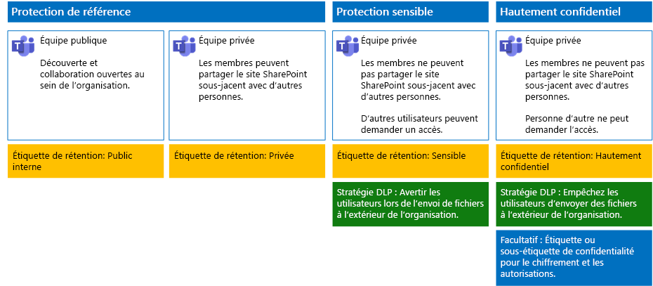

# Sécuriser des fichiers dans Microsoft Teams

Cet article fournit des recommandations pour la configuration de Microsoft Teams et de leur sites sous-jacents SharePoint pour la protection des fichiers qui équilibre la sécurité et la simplicité de la collaboration. Cet article définit quatre configurations différentes, en commençant par un site public au sein de votre organisation avec les stratégies de partage les plus ouvertes. Chaque configuration supplémentaire représente une progression significative de la protection, mais la possibilité d’accéder et de collaborer sur des fichiers stockés dans Teams est réduite à l’ensemble approprié des membres de l’équipe. Utilisez ces recommandations comme point de départ et ajustez les configurations pour répondre aux besoins de votre organisation.

Les configurations décrites dans cet article respectent les recommandations de Microsoft quant aux trois niveaux de protection des données, des identités et des appareils :

- Protection Base de référence

- Protection Sensible

- Protection Hautement confidentiel

Pour plus d’informations sur ces niveaux et les fonctionnalités recommandées pour chacun d’eux, consultez les ressources suivantes.

- [Protection des appareils et de l’identité pour Office 365](https://docs.microsoft.com/office365/enterprise/microsoft-cloud-it-architecture-resources#identity-and-device-protection-for-office-365)

- [Solutions de protection des fichiers dans Office 365](https://docs.microsoft.com/office365/enterprise/microsoft-cloud-it-architecture-resources#file-protection-solutions-in-office-365)

## Vue d’ensemble des fonctionnalités

Les recommandations pour les équipes sécurisées s’appuient sur différentes fonctionnalités de Microsoft 365. L’illustration suivante montre les configurations recommandées.

Comme illustré :

- La protection de base de référence inclut une équipe publique et une équipe privée. Les équipes publique peuvent être découvertes et sont accessibles par toute personne de l’organisation. Les équipes privées peuvent être détectées et sont accessibles seulement par les membres de l’équipe. Ces deux configurations autorisent le partage du site SharePoint sous-jacent sur lequel les fichiers sont stockés en dehors du groupe d’équipe.

- Les équipes disposant d’une protection sensible et hautement confidentielle sont des équipes privées dans lesquelles le partage et la demande d’accès au site sous-jacent sont limités.

- Les [Étiquettes de rétention](../../compliance/labels.md) offrent un moyen de classer les fichiers dans les sites SharePoint sous-jacents. Chacun des sites d’équipe SharePoint est configuré pour étiqueter automatiquement les fichiers dans des bibliothèques de documents avec une étiquette de rétention par défaut. Correspondant aux configurations des quatre sites, les étiquettes de cet exemple sont Public interne, Privé, Sensible et Hautement confidentiel. Les utilisateurs peuvent changer les étiquettes sur les fichiers individuels, mais cette configuration garantit que tous les fichiers reçoivent une étiquette par défaut.

- [Protection contre la perte de données](../../compliance/data-loss-prevention-policies.md)Les stratégies de protection contre la perte de données (DLP) sont configurées pour les étiquettes Sensibles et Hautement confidentielles afin de prévenir les utilisateurs quand ils essaient d’envoyer ces types de fichiers à l’extérieur de l’organisation, ou de les en empêcher.

- Si nécessaire pour votre scénario, vous pouvez utiliser les[étiquettes sensibilité](../../compliance/sensitivity-labels.md) à protéger les fichiers confidentiels hautement avec le chiffrement et les autorisations. Pour les clients Azure Information Protection, vous pouvez utiliser vos étiquettes Azure Information Protection dans le centre de conformité de Microsoft 365 et vos étiquettes sont synchronisées avec le portail Azure au cas où vous choisissez d’effectuer une configuration supplémentaire ou avancée. Les étiquettes Azure Information Protection et les étiquettes de niveau de confidentialité Office 365 sont totalement compatibles avec chacun d’eux. Cela signifie, par exemple, que si vous avez un contenu étiqueté par Azure Information Protection, vous n’avez pas besoin de reclasser ou de ré-étiqueter votre contenu. Tous les clients n’ont pas besoin de ce niveau de protection.

## Paramètres à l’échelle de l’organisation pour SharePoint et OneDrive

SharePoint et OneDrive incluent des paramètres au niveau de l’organisation qui affectent tous les sites et tous les utilisateurs. Certains de ces paramètres peuvent également être ajustés au niveau du site dans un sens plus restrictif (mais pas moins). Cette section décrit les paramètres au niveau du locataire qui affectent la sécurité et la collaboration.

### Partage

Pour cette solution, nous recommandons les paramètres au niveau de l’organisation suivants :

- Conservez la stratégie de partage par défaut qui autorise le partage complet avec tous les types de comptes, notamment le partage anonyme.

- Configurez les liens anonymes de sorte à ce qu’ils expirent, si vous le souhaitez.

- Modifiez le type de liaison par défaut pour le partage sur Interne. Cela contribue à la prévention des fuites accidentelles de données à l’extérieur de votre organisation.

S’il peut sembler contre-intuitif d’autoriser le partage externe, cette approche offre néanmoins plus de contrôle sur le partage de fichiers que l’envoi de fichiers par e-mail. SharePoint et Outlook fonctionnent ensemble pour fournir une collaboration sécurisée sur les fichiers.

- Par défaut, Outlook partage un lien vers un fichier au lieu d’envoyer le fichier dans un e-mail.

- SharePoint et OneDrive facilitent le partage de liens vers des fichiers avec des collaborateurs qui se trouvent à l’intérieur et à l’extérieur de votre organisation

Vous avez également des contrôles pour vous aider à gérer le partage externe. Par exemple, vous pouvez :

- désactiver un lien invité anonyme ;

- Révoquer l’accès utilisateur à un site.

- Voir qui a accès à un site ou un document spécifique.

- Spécifier que les liens de partage anonyme doivent expirer (paramètre au niveau du locataire).

- Limiter qui peut partager à l’extérieur de votre organisation (paramètre au niveau du locataire).

### Utiliser le partage externe avec la protection contre la perte de données

Si vous n’autorisez pas le partage externe, les utilisateurs ayant des besoins métier trouveront d’autres outils et d’autres méthodes. Microsoft vous recommande de combiner le partage externe avec des stratégies de protection contre la perte de données pour protéger les fichiers sensibles et hautement confidentiels.

### Paramètres d’accès d’appareil

Les paramètres d’accès aux appareils pour SharePoint et OneDrive vous permettent de déterminer si l’accès est limité au navigateur uniquement (fichiers ne pouvant pas être téléchargés) ou si l’accès est bloqué. Pour plus d’informations, voir [Contrôler l’accès à partir des appareils non gérés](https://docs.microsoft.com/sharepoint/control-access-from-unmanaged-devices).

Pour utiliser les paramètres d’accès appareil avec les stratégies d’accès conditionnel recommandée dans Azure Active Directory, voir[recommandations en matière de stratégie de sécurisation des sites SharePoint et des fichiers](https://docs.microsoft.com/microsoft-365/enterprise/sharepoint-file-access-policies).

Examinez ces paramètres pour décider si vous voulez changer les paramètres par défaut pour les sites OneDrive. Actuellement, les paramètres de partage et d’accès d’appareil sont dupliqués à partir du Centre d’administration SharePoint et s’appliquent aux deux environnements.

## Configuration d’un site d’équipe SharePoint et Team

Le tableau suivant récapitule la configuration pour chacune des équipes et leur site SharePoint sous-jacent décrites précédemment dans cet article. Utilisez ces recommandations comme point de départ et ajustez les types et les configurations de site pour répondre aux besoins de votre organisation. Toutes les organisations n’ont pas nécessairement besoin de chacun de ces types d’équipe. Seul un petit nombre d’organisations a besoin d’équipes avec une protection hautement confidentielle.

||||||
|:-----|:-----|:-----|:-----|:-----|
||**Protection Base de référence #1**|**Protection Base de référence #2**|**Protection Sensible**|**Hautement confidentiel**|
|Description|Équipe publique avec découverte et collaboration ouvertes au sein de l’organisation.|Équipe privée avec partage du site SharePoint sous-jacent autorisé à l’extérieur du groupe.|Équipe privée, mais le partage du site SharePoint sous-jacent est uniquement autorisé aux membres du site. La protection contre la perte de données avertit les utilisateurs quand ils tentent d’envoyer des fichiers à l’extérieur de l’organisation.|Équipe privée avec étiquettes de confidentialité pour le chiffrement et les autorisations qui se déplacent avec le fichier. La protection contre la perte de données empêche les utilisateurs d’envoyer des fichiers à l’extérieur de l’organisation.|
|Site d’équipe privé ou public|Public|Private|Private|Private|
|Qui a accès ?|Tous les membres de l’organisation, y compris les utilisateurs B2B.|Membres du site uniquement. Les autres personnes peuvent demander l’accès.|Membres de l’équipe uniquement. D’autres personnes peuvent demander l’accès au site sous-jacent qui est approuvé par un propriétaire d’équipe.|Membres uniquement. Les autres utilisateurs ne peuvent pas demander l’accès au site sous-jacent.|
|Contrôles de partage au niveau du site|Partage autorisé avec tout le monde. Paramètres par défaut.|Partage autorisé avec tout le monde. Paramètres par défaut.|Les membres ne peuvent pas partager l’accès au site.   Les non-membres peuvent demander l’accès au site, mais ces demandes doivent être adressées à un propriétaire du groupe pour l’équipe.|Les membres ne peuvent pas partager l’accès au site.   Les non-membres ne peuvent pas demander l’accès au site ou au contenu.|
|Contrôles d’accès d’appareil au niveau du site|Pas de contrôles supplémentaires.|Pas de contrôles supplémentaires.|Empêchent les utilisateurs de télécharger des fichiers sur des appareils non conformes ou non liés à un domaine. Cela permet un accès par navigateur uniquement à partir de tous les autres appareils.|Bloquent le téléchargement de fichiers sur des appareils non conformes ou non joints à un domaine.|
|Étiquettes de rétention|Public interne|Private|Sensible|Hautement confidentiel|
|Stratégies de protection contre la perte de données|||Avertissez les utilisateurs lors de l’envoi des fichiers qui sont étiquetés comme sensibles à l’extérieur de l’organisation.   Pour bloquer le partage externe de types de données sensibles, telles que les numéros de carte de crédit ou d’autres données personnelles, vous pouvez configurer des stratégies de protection contre la perte de données supplémentaires pour ces types de données (y compris les types de données personnalisés que vous configurez).|Empêchent les utilisateurs d’envoyer des fichiers portant l’étiquette Hautement confidentiel en dehors de l’organisation. Autorisent les utilisateurs à passer outre ce paramètre en fournissant une justification, notamment en indiquant la personne avec laquelle ils partagent le fichier.|
|Étiquettes de confidentialité||||Utilisez des étiquettes de confidentialité pour chiffrer les fichiers et accorder des autorisations sur ceux-ci. Cette protection reste associée aux fichiers dans le cas où ils sont divulgués de leur site SharePoint sous-jacent.|

Pour connaître les étapes de déploiement des quatre types différents d’équipes dans cette solution, consultez [Déployer Teams pour trois niveaux de protection de fichiers](deploy-teams-three-tiers.md).

## Étiquettes de rétention Office 365

L’utilisation des étiquettes de rétention est recommandée pour les environnements avec des données sensibles. Après avoir configuré et publié des étiquettes de rétention:

- Vous pouvez appliquer une étiquette par défaut à une bibliothèque de documents dans un site d’équipe SharePoint sous-jacent, afin que tous les documents figurant dans la section **Fichiers** de l’équipe obtiennent l’étiquette par défaut.

- Vous pouvez appliquer des étiquettes au contenu automatiquement s’il répond à des conditions spécifiques.

- Vous pouvez appliquer des stratégies de protection DLP contre la perte de données qui reposent sur les étiquettes de rétention.

- Le personnel de votre organisation peut appliquer une étiquette manuellement à du contenu dans Outlook sur le web, Outlook 2010 et versions ultérieures, OneDrive, SharePoint et des groupes Office 365. Les utilisateurs ont souvent une meilleure connaissance du type de contenu qu’ils utilisent : ils peuvent donc les classifier et y faire appliquer la stratégie appropriée de protection contre la perte de données.

Comme illustré, cette solution inclut la création des étiquettes de rétention suivantes :

- Hautement confidentiel

- Sensible

- Private

- Public interne

Ces étiquettes sont mises en correspondance avec les sites recommandés dans les illustrations et graphiques figurant plus haut dans cet article. Cette solution recommande de configurer des stratégies DLP pour empêcher la fuite de fichiers portant l’étiquette Sensible et Hautement confidentiel.

Pour connaître les étapes de configuration des étiquettes de rétention et des stratégies de protection contre la perte de données dans cette solution, consultez [Protéger des fichiers dans Teams avec des étiquettes de rétention et la protection contre la perte de données DLP](deploy-teams-retention-DLP.md).

## Étiquettes de confidentialité

Si cela se justifie pour votre scénario de sécurité, vous pouvez utiliser des étiquettes de sensibilité pour appliquer des protections fiables qui suivent les fichiers là où elles accèdent. Les étiquettes de niveau de confidentialité dans le centre de conformité de Microsoft 365 et Azure Information Protection étiquettes sont identiques. Pour cette solution, nous vous recommandons d’utiliser l’étiquette ou sous-étiquette de confidentialité pour chiffrer et accorder des autorisations aux fichiers qui doivent être protégés avec le niveau de sécurité le plus élevé.

Pour plus d’informations, voir[Vue d’ensemble d’étiquettes de confidentialité](../../compliance/sensitivity-labels.md).

Pour connaître la procédure de configuration des étiquettes de confidentialité dans cette solution, voir [Protéger les fichiers dans Teams à l’aide d’étiquettes de confidentialité](deploy-teams-sensitivity-labels.md).

## Voir aussi

[Adoption du cloud et solutions hybrides](https://docs.microsoft.com/office365/enterprise/cloud-adoption-and-hybrid-solutions)
