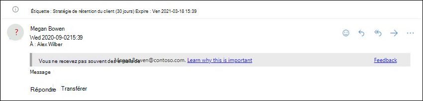
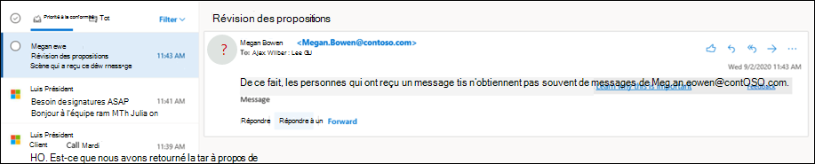

# Stratégies anti-hameçonnage dans Microsoft 365

[!INCLUDE [Microsoft 365 Defender rebranding](../includes/microsoft-defender-for-office.md)]

**S’applique à**
- [Exchange Online Protection](exchange-online-protection-overview.md)
- [Microsoft Defender pour Office 365 : offre 1 et offre 2](defender-for-office-365.md)
- [Microsoft 365 Defender](../defender/microsoft-365-defender.md)

Les stratégies de configuration des paramètres de protection anti-hameçonnage sont disponibles dans les organisations Microsoft 365 avec des boîtes aux lettres Exchange Online, des organisations Exchange Online Protection autonomes (EOP) sans boîtes aux lettres Exchange Online et Microsoft Defender pour Office 365 organisations.

Voici quelques exemples de Microsoft Defender Office 365 organisations :

- Microsoft 365 Entreprise E5, Microsoft 365 Éducation A5, etc.
- [Microsoft 365 Entreprise](https://www.microsoft.com/microsoft-365/enterprise/home)
- [Microsoft 365 Business](https://www.microsoft.com/microsoft-365/business)
- [Microsoft Defender pour Office 365 en tant qu’modules](https://products.office.com/exchange/advance-threat-protection)

Les différences de haut niveau entre les stratégies anti-hameçonnage dans EOP et les stratégies anti-hameçonnage dans Defender pour Office 365 sont décrites dans le tableau suivant :

 

****

|Fonctionnalité|Stratégies anti-hameçonnage dans EOP|Stratégies anti-hameçonnage dans Defender pour Office 365|
|---|:---:|:---:|
|Stratégie par défaut créée automatiquement|||
|Créer des stratégies d'accès externe personnalisées|||
|Paramètres de stratégie communs\*|||
|Paramètres d’usurpation d’une usurpation|||
|Premier contact conseil de sécurité|||
|Paramètres d’emprunt d’identité|||
|Seuils d’hameçonnage avancés|||
|

\* Dans la stratégie par défaut, le nom et la description de la stratégie sont en lecture seule (la description est vide) et vous ne pouvez pas spécifier à qui s’applique la stratégie (la stratégie par défaut s’applique à tous les destinataires).

Pour configurer des stratégies anti-hameçonnage, consultez les articles suivants :

- [Configurer des stratégies anti-hameçonnage dans EOP](configure-anti-phishing-policies-eop.md)
- [Configurer des stratégies anti-hameçonnage dans Microsoft Defender pour Office 365](configure-mdo-anti-phishing-policies.md)

Le reste de cet article décrit les paramètres disponibles dans les stratégies anti-hameçonnage dans EOP et Defender pour Office 365.

## Paramètres de stratégie communs

Les paramètres de stratégie suivants sont disponibles dans les stratégies anti-hameçonnage dans EOP et Defender pour Office 365 :

- **Nom**: vous ne pouvez pas renommer la stratégie anti-hameçonnage par défaut. Après avoir créé une stratégie anti-hameçonnage personnalisée, vous ne pouvez pas renommer la stratégie dans le portail Microsoft 365 Defender client.

- **Description** Vous ne pouvez pas ajouter de description à la stratégie anti-hameçonnage par défaut, mais vous pouvez ajouter et modifier la description des stratégies personnalisées que vous créez.

- **Utilisateurs, groupes et domaines**: identifie les destinataires internes à qui s’applique la stratégie anti-hameçonnage. Cette valeur est requise dans les stratégies personnalisées et n’est pas disponible dans la stratégie par défaut (la stratégie par défaut s’applique à tous les destinataires).

  Vous pouvez uniquement utiliser une condition ou une exception une seule fois, mais vous pouvez spécifier plusieurs valeurs pour la condition ou l’exception. Plusieurs valeurs de la même condition ou exception utilisent la logique OU (par exemple, _\<recipient1\>_ ou _\<recipient2\>_). Des conditions ou des exceptions différentes utilisent la logique ET (par exemple, _\<recipient1\>_ et _\<member of group 1\>_).

  - **Utilisateurs**: une ou plusieurs boîtes aux lettres, utilisateurs de messagerie ou contacts de messagerie dans votre organisation.
  - **Groupes**: un ou plusieurs groupes dans votre organisation.
  - **Domaines :** un ou plusieurs domaines [configurés acceptés](/exchange/mail-flow-best-practices/manage-accepted-domains/manage-accepted-domains) dans Microsoft 365.

  - **Exclure ces utilisateurs, groupes et domaines**: exceptions pour la stratégie. Les paramètres et le comportement sont exactement comme les conditions :
    - **Utilisateurs**
    - **Groupes**
    - **Domaines**

  > [!NOTE]
  > Au moins une sélection dans les **paramètres Utilisateurs,** groupes et domaines est requise dans les stratégies anti-hameçonnage personnalisées pour identifier les **destinataires** du message que la stratégie s’applique. <u></u> Les stratégies anti-hameçonnage dans Defender pour Office 365 ont également des [paramètres](#impersonation-settings-in-anti-phishing-policies-in-microsoft-defender-for-office-365) d’emprunt d’identité dans lequel vous pouvez spécifier des adresses de messagerie d’expéditeur ou des domaines d’expéditeur individuels qui bénéficieront d’une <u>protection</u> contre l’emprunt d’identité, comme décrit plus loin dans cet article.

## Paramètres d’usurpation d’une usurpation

L’usurpation d’adresse est lorsque l’adresse De d’un message électronique (l’adresse de l’expéditeur affichée dans les clients de messagerie) ne correspond pas au domaine de la source de courrier. Pour plus d’informations sur l’usurpation d’informations, consultez la protection contre [l’usurpation d’Microsoft 365](anti-spoofing-protection.md).

Les paramètres d’usurpation suivants sont disponibles dans les stratégies anti-hameçonnage dans EOP et Defender pour Office 365 :

- **Activer la veille contre l’usurpation** d’informations : active ou non la veille contre l’usurpation d’informations. Nous vous recommandons de laisser ce dernier allumé.

  Lorsque la veille contre l’usurpation d’adresse est activée, les informations sur l’usurpation d’informations montrent des expéditeurs usurpés qui ont été automatiquement détectés et autorisés ou bloqués par la veille contre l’usurpation d’adresses.  Vous pouvez remplacer manuellement le verdict de veille contre l’usurpation d’adresse pour autoriser ou bloquer les expéditeurs usurpés détectés dans l’insight. Mais lorsque vous le faites, l’expéditeur usurpé disparaît de l’aperçu de l’usurpation d’intelligence et n’est désormais visible que sous l’onglet Usurpation d’adresse dans la liste d’adresses client autoriser/bloquer.  Vous pouvez également créer manuellement des entrées d’autoriser ou de bloquer des expéditeurs usurpés dans la liste d’adresses client autoriser/bloquer. Pour plus d’informations, consultez les articles suivants :

  - [Informations sur l’intelligence contre l’usurpation d’adresse dans EOP](learn-about-spoof-intelligence.md)
  - [Gérer la liste d’adresses client autoriser/bloquer dans EOP](tenant-allow-block-list.md)

  > [!NOTE]
  >
  > - La protection contre l’usurpation d’emploi est activée par défaut dans la stratégie anti-hameçonnage par défaut et dans toutes les nouvelles stratégies anti-hameçonnage personnalisées que vous créez.
  > - Vous n’avez pas besoin de désactiver la protection contre l’usurpation d’Microsoft 365 ; vous activez le filtrage amélioré pour les connecteurs à la place. Pour obtenir des instructions, voir [Filtrage amélioré pour les connecteurs dans Exchange Online](/Exchange/mail-flow-best-practices/use-connectors-to-configure-mail-flow/enhanced-filtering-for-connectors).
  > - La désactivation de la protection contre  l’usurpation d’identité désactive uniquement la protection implicite contre l’usurpation d’identité contre les vérifications [d’authentification composite.](email-validation-and-authentication.md#composite-authentication) Si l’expéditeur  échoue aux vérifications [DMARC](use-dmarc-to-validate-email.md) explicites où la stratégie est définie sur mise en quarantaine ou rejet, le message est toujours mis en quarantaine ou rejeté.

- **Notifications d’expéditeur** non authentifié : ces notifications sont disponibles uniquement lorsque la veille contre l’usurpation d’adresse est allumée. Consultez les informations de la section suivante.
- **Actions**: pour les messages provenant d’expéditeurs usurpés bloqués (automatiquement bloqués par la veille contre l’usurpation d’adresse ou bloqués manuellement dans la liste d’adresses client bloquées), vous pouvez également spécifier l’action à prendre sur les messages :
  - **Déplacez les messages vers les dossiers Courrier** indésirable des destinataires : il s’agit de la valeur par défaut. Le message est remis à la boîte aux lettres et déplacé vers le dossier Courrier indésirable. Pour plus d’informations, voir [Configurer les paramètres](configure-junk-email-settings-on-exo-mailboxes.md)de courrier indésirable Exchange Online boîtes aux lettres dans Microsoft 365 .
  - **Mettre le message en** quarantaine : envoie le message en quarantaine au lieu des destinataires prévus. Pour plus d'informations à propos de la quarantaine, consultez les rubriques suivantes:
    - [Mise en quarantaine dans Microsoft 365](quarantine-email-messages.md)
    - [Gérer les fichiers et les messages mis en quarantaine en tant qu’administrateur dans Microsoft 365](manage-quarantined-messages-and-files.md)
    - [Rechercher et libérer les messages mis en quarantaine en tant qu’utilisateur dans Microsoft 365](find-and-release-quarantined-messages-as-a-user.md)

    Si vous sélectionnez **mettre le message** en quarantaine, vous pouvez également sélectionner la stratégie de mise en quarantaine qui s’applique aux messages mis en quarantaine par la protection contre l’usurpation d’intelligence. Les stratégies de mise en quarantaine définissent ce que les utilisateurs peuvent faire pour mettre en quarantaine les messages et si les utilisateurs reçoivent des notifications de mise en quarantaine. Pour plus d’informations, voir [Stratégies de mise en quarantaine](quarantine-policies.md).

### Expéditeur non authentifié

Les notifications des expéditeurs non authentifiés font partie des paramètres d’usurpation d’adresses qui sont disponibles dans les [stratégies](#spoof-settings) anti-hameçonnage dans EOP et Defender pour Office 365 comme décrit dans la section précédente. Les paramètres suivants sont disponibles uniquement lorsque la veille contre l’usurpation d’informations est allumée :

- Afficher **(?)** pour les expéditeurs non authentifiés pour l’usurpation d’identité : cette notification ajoute un point d’interrogation est  ajouté à la photo de l’expéditeur dans la zone De si le message ne passe pas les vérifications SPF ou DKIM et si le message ne passe pas d’authentification DMARC ou [composite](email-validation-and-authentication.md#composite-authentication). Lorsque ce paramètre est désactivé, le point d’interrogation n’est pas ajouté à la photo de l’expéditeur.

- Afficher la balise « **via**» : cette notification ajoute la balise via (chris@contoso.com <u>via</u> fabrikam.com) dans la zone De si le domaine dans l’adresse De (l’expéditeur du message affiché dans les clients de messagerie) est différent du domaine dans la signature DKIM ou l’adresse **MAIL FROM.** Pour plus d’informations sur ces adresses, voir [une vue d’ensemble des normes de message électronique.](how-office-365-validates-the-from-address.md#an-overview-of-email-message-standards)

Pour empêcher l’ajout du point d’interrogation ou d’une balise à des messages provenant d’expéditeurs spécifiques, vous avez les options suivantes :

- Autoriser l’expéditeur usurpé dans l’aperçu de [l’usurpation d’intelligence](learn-about-spoof-intelligence.md) ou manuellement dans la liste d’adresses client [autoriser/bloquer](tenant-allow-block-list.md). Autoriser l’expéditeur usurpé empêche l’apparition de la balise via dans les messages de l’expéditeur lorsque l’identification de l’expéditeur non authentifié est désactivée.
- [Configurez l’authentification de messagerie](email-validation-and-authentication.md#configure-email-authentication-for-domains-you-own) pour le domaine de l’expéditeur.
  - Pour le point d’interrogation dans la photo de l’expéditeur, SPF ou DKIM sont les plus importants.
  - Pour la balise via, confirmez que le domaine dans la signature DKIM ou l’adresse **MAIL FROM** correspond (ou est un sous-domaine) du domaine dans l’adresse De.

Pour plus d’informations, voir Identifier les messages suspects [dans Outlook.com et Outlook sur le web](https://support.microsoft.com/office/3d44102b-6ce3-4f7c-a359-b623bec82206)

## Premier contact conseil de sécurité

Les paramètres Afficher le premier **contact conseil de sécurité** sont disponibles dans EOP et Defender pour les organisations Office 365 et ne sont pas dépendants des paramètres de protection contre l’usurpation d’identité ou l’usurpation d’identité. Le conseil de sécurité est présenté aux destinataires dans les scénarios suivants :

- La première fois qu’ils obtiennent un message d’un expéditeur
- Ils n’obtiennent pas souvent de messages de l’expéditeur.

Cette fonctionnalité ajoute une couche supplémentaire de protection de sécurité contre les attaques d’emprunt d’identité potentielles. Nous vous recommandons donc de l’activer.

Le premier conseil de sécurité de contact remplace également la nécessité de créer des règles de flux de messagerie (également appelées règles de transport) qui ajoutent l’en-tête **nommé X-MS-Exchange-EnableFirstContactSafetyTip** par la valeur **Activer** pour les messages (bien que cette fonctionnalité soit toujours disponible).

> [!NOTE]
> Si le message a plusieurs destinataires, si le conseil est affiché et à qui est basé sur un modèle majoritaire. Si la plupart des destinataires n’ont jamais ou n’ont pas souvent reçu de messages de l’expéditeur, les destinataires concernés recevront le conseil « Certaines personnes qui ont reçu ce **message...** ». Si vous êtes préoccupé par le fait que ce comportement expose les habitudes de communication d’un destinataire à un autre, vous ne devez pas activer le premier conseil de sécurité de contact et continuer à utiliser les règles de flux de messagerie à la place.

## Paramètres exclusifs dans les stratégies anti-hameçonnage dans Microsoft Defender pour Office 365

Cette section décrit les paramètres de stratégie disponibles uniquement dans les stratégies anti-hameçonnage dans Defender pour Office 365.

> [!NOTE]
> La stratégie anti-hameçonnage par défaut dans  Defender pour Office 365 protection contre l’usurpation d’adresses et l’intelligence des boîtes aux lettres pour tous les destinataires. Toutefois, les autres fonctionnalités de [protection](#impersonation-settings-in-anti-phishing-policies-in-microsoft-defender-for-office-365) contre l’emprunt d’identité disponibles et les paramètres avancés ne sont pas [configurés](set-up-anti-phishing-policies.md#advanced-phishing-thresholds-in-anti-phishing-policies-in-microsoft-defender-for-office-365) ou activés dans la stratégie par défaut. Pour activer toutes les fonctionnalités de protection, modifiez la stratégie anti-hameçonnage par défaut ou créez des stratégies anti-hameçonnage supplémentaires.

### Paramètres d’emprunt d’identité dans les stratégies anti-hameçonnage dans Microsoft Defender pour Office 365

L’emprunt d’identité est l’endroit où l’expéditeur ou le domaine de messagerie de l’expéditeur dans un message ressemble à un expéditeur ou un domaine réel :

- Un exemple d'usurpation de l'identité du domaine contoso.com est ćóntoso.com.
- Un exemple d'usurpation de l'identité de l'utilisateur michelle@contoso.com est michele@contoso.com.

> [!NOTE]
> La protection contre l’emprunt d’identité recherche les domaines similaires. Par exemple, si votre domaine est contoso.com, nous vérifions les différents domaines de niveau supérieur (.com, .biz, etc.) en tant que tentatives d’emprunt d’identité, mais également les domaines qui sont même un peu similaires. Par exemple, les contosososo.com ou contoabcdef.com peuvent être considérées comme des tentatives d’emprunt d’contoso.com.

Un domaine usurpé pourrait autrement être considéré comme légitime (domaine enregistré, enregistrements d'authentification de courrier électronique configurés, etc.), sauf si son but est de tromper les destinataires.

Les paramètres d’emprunt d’identité suivants sont disponibles uniquement dans les stratégies anti-hameçonnage dans Defender Office 365 :

- **Permettre aux utilisateurs de protéger**: empêche les adresses de messagerie internes ou externes spécifiées d’être usurpées en tant **qu’expéditeurs de messages.** Par exemple, vous recevez un message électronique du vice-président de votre entreprise vous demandant d’envoyer des informations internes à la société. Le feriez-vous ? De nombreuses personnes envoient la réponse sans réfléchir.

  Vous pouvez utiliser des utilisateurs protégés pour ajouter des adresses de messagerie d’expéditeur internes et externes afin de vous protéger contre l’emprunt d’identité. Cette liste  d’expéditeurs protégés contre l’emprunt d’identité d’utilisateur est différente de la liste des **destinataires** à qui la stratégie s’applique (tous les destinataires de la stratégie par défaut ; des destinataires spécifiques configurés dans le paramètre **Utilisateurs,** groupes et domaines de la section Paramètres de stratégie [commune).](#common-policy-settings)

  > [!NOTE]
  >
  > - Dans chaque stratégie anti-hameçonnage, vous pouvez spécifier un maximum de 350 utilisateurs protégés (adresses e-mail de l’expéditeur). Vous ne pouvez pas spécifier le même utilisateur protégé dans plusieurs stratégies. Ainsi, quel que soit le nombre de stratégies appliquées à un destinataire, le nombre maximal d’utilisateurs protégés (adresses e-mail de l’expéditeur) pour chaque destinataire individuel est de 350. Pour plus d’informations sur la priorité de stratégie et la façon dont le traitement de stratégie s’arrête après l’application de la première stratégie, voir Ordre et priorité de la [protection de la messagerie.](how-policies-and-protections-are-combined.md)
  > - La protection contre l’emprunt d’identité d’utilisateur ne fonctionne pas si l’expéditeur et le destinataire ont précédemment communiqué par courrier électronique. Si l’expéditeur et le destinataire n’ont jamais communiqué par courrier électronique, le message est identifié comme une tentative d’emprunt d’identité.

  Par défaut, aucune adresse de messagerie de l’expéditeur n’est configurée pour la protection contre l’emprunt d’identité dans **Les utilisateurs à protéger.** Par conséquent, par défaut, aucune adresse de messagerie de l’expéditeur n’est couverte par la protection contre l’emprunt d’identité, que ce soit dans la stratégie par défaut ou dans les stratégies personnalisées.

  Lorsque vous ajoutez des adresses  de messagerie internes ou  externes à la liste Utilisateurs pour protéger, les messages de ces expéditeurs sont soumis à des vérifications de protection contre l’emprunt d’identité. L’emprunt d’identité  du message est vérifié  si le message est envoyé à un destinataire à qui la stratégie s’applique (tous les destinataires de la stratégie par défaut ; **Utilisateurs, groupes et destinataires de domaines** dans les stratégies personnalisées). Si l’emprunt d’identité est détecté dans l’adresse e-mail de l’expéditeur, les actions de protection contre l’emprunt d’identité pour les utilisateurs sont appliquées au message (que faire avec le message, afficher ou non les conseils de sécurité des utilisateurs usurpés, etc.).

- **Activer les domaines à protéger**: empêche les domaines spécifiés d’être usurpés dans le domaine de **l’expéditeur du message.** Par exemple, tous les domaines que vous possédez (domaines[acceptés)](/exchange/mail-flow-best-practices/manage-accepted-domains/manage-accepted-domains)ou des domaines personnalisés spécifiques (domaines que vous possédez ou domaines partenaires). Cette liste  de domaines d’expéditeurs protégés contre l’emprunt d’identité est différente de la liste des **destinataires** à qui la stratégie s’applique (tous les destinataires de la stratégie par défaut ; des destinataires spécifiques configurés dans le paramètre **Utilisateurs,** groupes et domaines de la section Paramètres de stratégie [commune).](#common-policy-settings)

  > [!NOTE]
  > Le nombre maximal de domaines protégés que vous pouvez définir dans toutes les stratégies anti-hameçonnage est de 50.

  Par défaut, aucun domaine d’expéditeur n’est configuré pour la protection contre l’emprunt d’identité dans **Activer les domaines à protéger.** Par conséquent, par défaut, aucun domaine d’expéditeur n’est couvert par la protection contre l’emprunt d’identité, que ce soit dans la stratégie par défaut ou dans les stratégies personnalisées.

  Lorsque vous ajoutez  des domaines à la liste Activer les domaines à protéger, les messages des expéditeurs de ces domaines sont soumis à des **vérifications** de protection contre l’emprunt d’identité. L’emprunt d’identité  du message est vérifié  si le message est envoyé à un destinataire à qui la stratégie s’applique (tous les destinataires de la stratégie par défaut ; **Utilisateurs, groupes et destinataires de domaines** dans les stratégies personnalisées). Si l’emprunt d’identité est détecté dans le domaine de l’expéditeur, les actions de protection contre l’emprunt d’identité pour les domaines sont appliquées au message (que faire avec le message, afficher ou non les conseils de sécurité des utilisateurs usurpés, etc.).

- **Actions**: choisissez l’action à prendre sur les messages entrants qui contiennent des tentatives d’emprunt d’identité contre les utilisateurs protégés et les domaines protégés dans la stratégie. Vous pouvez spécifier différentes actions pour l’emprunt d’identité des utilisateurs protégés par rapport à l’emprunt d’identité de domaines protégés :
  - **Ne pas appliquer d’action**
  - **Rediriger le message vers** d’autres adresses de messagerie : envoie le message aux destinataires spécifiés au lieu des destinataires prévus.
  - **Déplacer les messages vers les dossiers** Courrier indésirable des destinataires : le message est remis à la boîte aux lettres et déplacé vers le dossier Courrier indésirable. Pour plus d’informations, voir [Configurer les paramètres](configure-junk-email-settings-on-exo-mailboxes.md)de courrier indésirable Exchange Online boîtes aux lettres dans Microsoft 365 .
  - **Mettre le message en** quarantaine : envoie le message en quarantaine au lieu des destinataires prévus. Pour plus d'informations à propos de la quarantaine, consultez les rubriques suivantes:
    - [Mise en quarantaine dans Microsoft 365](quarantine-email-messages.md)
    - [Gérer les fichiers et les messages mis en quarantaine en tant qu’administrateur dans Microsoft 365](manage-quarantined-messages-and-files.md)
    - [Rechercher et libérer les messages mis en quarantaine en tant qu’utilisateur dans Microsoft 365](find-and-release-quarantined-messages-as-a-user.md)

    Si vous sélectionnez Mettre le **message** en quarantaine, vous pouvez également sélectionner la stratégie de mise en quarantaine qui s’applique aux messages mis en quarantaine par l’emprunt d’identité d’utilisateur ou la protection contre l’usurpation d’identité de domaine. Les stratégies de mise en quarantaine définissent ce que les utilisateurs peuvent faire pour mettre les messages en quarantaine. Pour plus d’informations, voir [Stratégies de mise en quarantaine](quarantine-policies.md).

  - **Remettre le message et** ajouter d’autres adresses à la ligne Bcc : remettre le message aux destinataires prévus et remettre silencieusement le message aux destinataires spécifiés.
  - **Supprimez le message avant qu’il ne soit** remis : supprime silencieusement l’intégralité du message, y compris toutes les pièces jointes.

- **Conseils de sécurité** pour l’emprunt d’identité : activer ou désactiver les conseils de sécurité d’emprunt d’identité suivants qui s’affichent pour les messages qui échouent aux vérifications d’emprunt d’identité :
  - **Afficher un conseil pour les utilisateurs dont** l’identité a été usurpée : l’adresse De contient **un enable users to protect** user. Disponible uniquement si **activer la protection des utilisateurs** est activé et configuré.
  - **Afficher un conseil pour les domaines dont l’identité est usurpée**: l’adresse De contient un **domaine Enable pour protéger le** domaine. Disponible uniquement si **activer les domaines à protéger** est activé et configuré.
  - Afficher la conseil pour les caractères inhabituels : l’adresse De contient des jeux de **caractères inhabituels** (par exemple, des symboles mathématiques et du texte ou un mélange de lettres majuscules et minuscules) dans un enable **users to protect** sender or an Enable domains to protect sender domain.  Disponible uniquement si **Activer les utilisateurs pour protéger ou**  Activer les **domaines à** protéger est activé et configuré.

- **Activer l’intelligence des boîtes** aux lettres : active ou désactive l’intelligence artificielle (IA) qui détermine les modèles de messagerie des utilisateurs avec leurs contacts fréquents. Ce paramètre permet à l’IA de faire la distinction entre les messages provenant d’expéditeurs légitimes et d’expéditeurs dont l’identité a été usurpée.

  Par exemple, Comme Elle (glaureano@contoso.com) est le PDG de votre entreprise, vous l’ajoutez  en tant qu’expéditeur protégé dans la stratégie Activer les utilisateurs pour protéger les paramètres de la stratégie. Toutefois, certains des destinataires que la stratégie s’applique pour communiquer régulièrement avec un fournisseur également nommé Glaureano@fabrikam.com). Étant donné que ces destinataires ont un historique des communications avec glaureano@fabrikam.com, l’intelligence des boîtes aux lettres n’identifie pas les messages provenant de glaureano@fabrikam.com comme une tentative d’emprunt d’glaureano@contoso.com pour ces destinataires.

  Pour utiliser des contacts fréquents découverts par l’intelligence des boîtes aux lettres (et leur absence) pour protéger les utilisateurs contre les attaques d’emprunt d’identité, vous pouvez activer la **protection** contre l’emprunt d’identité d’intelligence après avoir activé l’intelligence de boîte aux **lettres.**

- **Activer la protection contre l’emprunt** d’identité d’intelligence : activez ce paramètre pour spécifier l’action à prendre sur les messages pour les détections d’emprunt d’identité à partir des résultats de l’intelligence de boîte aux lettres :
  - **N’appliquez aucune action**: notez que cette  valeur a le même résultat que l’activement de l’intelligence de boîte aux lettres, mais la dés enable intelligence de protection contre **l’usurpation d’identité**.
  - **Rediriger le message vers d’autres adresses de messagerie**
  - **Déplacer le message vers les dossiers Courrier indésirable des destinataires**
  - **Mettre le message en** quarantaine : si vous sélectionnez cette action, vous pouvez également sélectionner la stratégie de mise en quarantaine qui s’applique aux messages mis en quarantaine par la protection d’intelligence des boîtes aux lettres. Les stratégies de mise en quarantaine définissent ce que les utilisateurs peuvent faire pour mettre en quarantaine les messages et si les utilisateurs reçoivent des notifications de mise en quarantaine. Pour plus d’informations, voir [Stratégies de mise en quarantaine](quarantine-policies.md).
  - **Remettre le message et ajouter d’autres adresses à la ligne Bcc**
  - **Supprimer le message avant sa livraison**

- **Ajouter des expéditeurs et des domaines de confiance**: exceptions aux paramètres de protection contre l’emprunt d’identité. Les messages provenant des domaines des expéditeurs et des expéditeurs spécifiés ne sont jamais classés comme attaques basées sur l’emprunt d’identité par la stratégie. En d’autres termes, l’action pour les expéditeurs protégés, les domaines protégés ou la protection de l’intelligence des boîtes aux lettres n’est pas appliquée à ces expéditeurs ou domaines d’expéditeurs fiables. La limite maximale pour ces listes est de 1 024 entrées.

### Seuils de hameçonnage avancés dans les stratégies anti-hameçonnage dans Microsoft Defender pour Office 365

Les seuils de hameçonnage avancés suivants sont disponibles uniquement dans les stratégies anti-hameçonnage dans Defender pour Office 365. Ces seuils contrôlent la sensibilité à l’application de modèles d’apprentissage automatique aux messages pour déterminer un verdict de hameçonnage :

- **1 - Standard**: il s’agit de la valeur par défaut. La gravité de l’action entreprise sur le message dépend du degré de confiance que le message est un hameçonnage (faible, moyen, élevé ou très élevé). Par exemple, les messages identifiés comme étant du hameçonnage avec un très haut degré de confiance ont les actions les plus graves appliquées, tandis que les messages identifiés comme étant du hameçonnage avec un faible degré de confiance ont des actions moins graves appliquées.
- **2 - Agressif**: les messages identifiés comme étant du hameçonnage avec un haut degré de confiance sont traités comme s’ils étaient identifiés avec un très haut degré de confiance.
- **3 - Plus** agressif : les messages identifiés comme du hameçonnage avec un niveau de confiance moyen ou élevé sont traités comme s’ils étaient identifiés avec un très haut degré de confiance.
- **4 -** Plus agressif : les messages identifiés comme étant du hameçonnage avec un niveau de confiance faible, moyen ou élevé sont traités comme s’ils étaient identifiés avec un très haut degré de confiance.

Le risque de faux positifs (messages positifs marqués comme faux) augmente lorsque vous augmentez ce paramètre. Pour plus d’informations sur les paramètres recommandés, consultez la stratégie [anti-hameçonnage](recommended-settings-for-eop-and-office365.md#anti-phishing-policy-settings-in-microsoft-defender-for-office-365)dans Microsoft Defender pour Office 365 paramètres.
