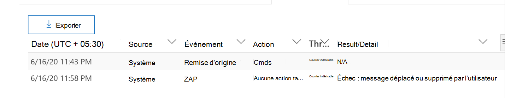
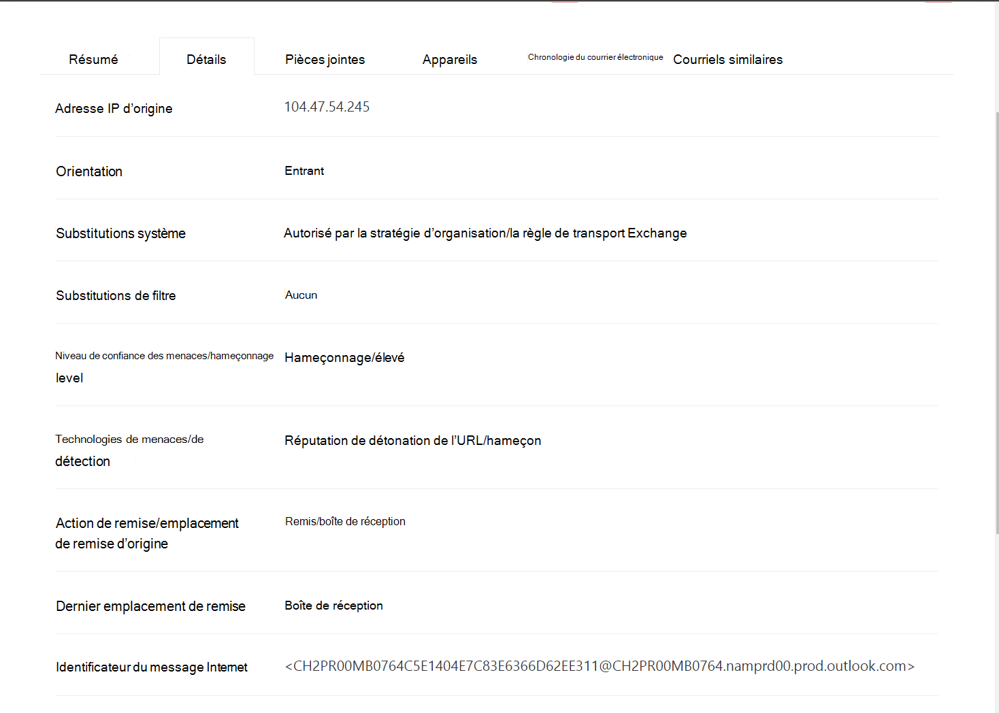
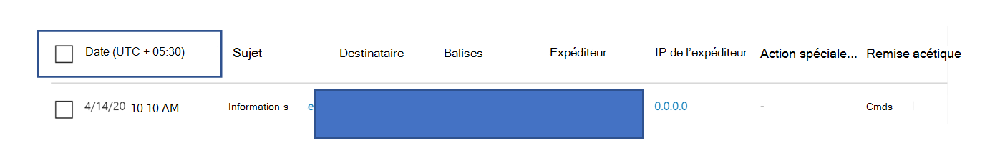

# Explorateur de menaces et détections en temps réel

[!INCLUDE [Microsoft 365 Defender rebranding](../includes/microsoft-defender-for-office.md)]

Si votre organisation dispose d' [office 365 Advanced Threat Protection](office-365-atp.md) (Office 365 ATP) et que vous disposez des [autorisations nécessaires](#required-licenses-and-permissions), vous disposez de l' **Explorateur** ou des **détections en temps réel** (auparavant des *rapports en temps réel* ). [see what's new](#new-features-in-threat-explorer-and-real-time-detections) Dans le centre de sécurité & conformité, accédez à **gestion des menaces**, puis choisissez **Explorateur** _ou_ **détections en temps réel**.

|Avec le plan ATP 2, vous pouvez voir :|Avec le plan ATP 1, vous pouvez voir :|
|---|---|
|||
|

Avec l’Explorateur (ou les détections en temps réel), vous disposez d’un puissant rapport qui permet à votre équipe des opérations de sécurité d’examiner et de répondre efficacement aux menaces. L’État ressemble à l’image suivante :

Ce rapport vous permet d’utiliser les actions suivantes :

- [Voir programmes malveillants détectés par les fonctionnalités de sécurité de Microsoft 365](#see-malware-detected-in-email-by-technology)
- [Afficher les données sur les URL d’hameçonnage et cliquez sur verdict](#view-data-about-phishing-urls-and-click-verdict)
- [Démarrer un processus d’enquête et de réponse automatisés à partir d’une vue dans l’Explorateur](#start-automated-investigation-and-response) (plan ATP 2 uniquement)
- ... [Examinez le courrier électronique malveillant, et bien plus encore](#more-ways-to-use-explorer-or-real-time-detections)!

## Améliorations apportées à l’expérience de la chasse aux menaces (à venir)

### Informations de menace mises à jour pour les E-mails

Nous avons centré les améliorations apportées à la qualité des données et de la plateforme pour augmenter la précision et la cohérence des enregistrements de messagerie. Ces mises à jour incluent la consolidation des informations de pré-remise et de post-livraison (exemple d’action exécutée sur un message électronique dans le cadre du processus ZAP) en un seul enregistrement, ainsi que le filtrage du courrier indésirable, les menaces de niveau entité (par exemple, l’URL était malveillante) et les emplacements de remise les plus récents. 

Après ces mises à jour, vous verrez une seule entrée pour chaque message, quels que soient les différents événements post-livraison qui ont eu lieu sur le message. Les actions peuvent inclure ZAP, la correction manuelle (ce qui signifie l’intervention de l’administrateur), la remise dynamique, etc. 

En plus de montrer les menaces de programmes malveillants et de hameçonnage, vous pouvez voir le verdict de courrier indésirable associé à un e-mail. Dans le courrier électronique, vous serez en mesure de voir toutes les menaces associées au courrier électronique, ainsi que les technologies de détection correspondantes. Chaque e-mail peut avoir 0, 1 ou plusieurs menaces. Vous verrez les menaces actuelles dans la section des détails de la fenêtre mobile de courrier électronique. De plus, pour plusieurs menaces (par exemple, un message électronique comportant à la fois des programmes malveillants et des hameçons), le champ TechEd Tech donnera le Threat-Detection Mapping, ce qui signifie que le Tech Detection a conduit à l’identification de la menace.

L’ensemble des technologies de détection a été mis à jour pour inclure de nouvelles méthodes de détection, ainsi que des technologies de détection du courrier indésirable, et aross les différentes vues de messagerie (programmes malveillants, hameçons, tout le courrier électronique), vous disposez d’un ensemble de technologies de détection cohérentes pour filtrer les résultats. 

**Remarque**: l’analyse de verdict ne doit pas nécessairement être liée à des entités. Par exemple, un e-mail peut être classé comme hameçonnage ou courrier indésirable, mais il n’y a pas d’URL avec un marquage du courrier indésirable/courrier indésirable. Cela est dû au fait que nos filtres évaluent également le contenu et d’autres détails pour un e-mail, avant d’affecter un verdict. 
 
#### Menaces dans les URL

Dans l’onglet Détails du menu déroulant courrier >, vous pouvez voir la menace spécifique pour une URL (la menace pour une URL peut être un programme malveillant, le hameçonnage, le courrier indésirable ou aucun).

### Affichage chronologique mis à jour (à venir)

En plus de l’identification de tous les événements de remise et post-remise, l’affichage de la chronologie fournit également des informations sur la menace identifiée à ce moment pour un sous-ensemble de ces événements. Il fournit également des informations supplémentaires sur les actions supplémentaires (par exemple ZAP, la correction manuelle) ainsi que le résultat de cette action. L’affichage chronologie contient des informations sur la remise d’origine, ainsi que tous les événements post-remise effectués sur un message électronique.

-   Source : il peut s’agir de l’administrateur/système/utilisateur en fonction de la source de l’événement.
-   Événement : cela inclut les événements de niveau supérieur tels que la remise d’origine, la correction manuelle, la préversion, les envois et la remise dynamique.
-   Action : Cela couvre l’action spécifique qui a été effectuée dans le cadre de l’action ZAP ou d’administration (par exemple, suppression récupérable).
-   Menaces : couvre les menaces (programmes malveillants, hameçons, courrier indésirable) identifiées à ce moment-là.
-   Résultat/Détails : fournit plus d’informations sur le résultat de l’action, qu’elle ait été effectuée dans le cadre de l’action ZAP/admin.

### Emplacement de remise d’origine et dernier

Aujourd’hui, nous adressons l’emplacement de remise en surface au sein du grille e-mail et de la fenêtre mobile e-mail. À l’avenir, le champ d’emplacement de remise sera renommé vers l’emplacement de remise d’origine. En outre, nous introduisons également un autre champ appelé dernier emplacement de remise. 

L’emplacement de remise d’origine fournit des informations supplémentaires sur l’endroit où un courrier électronique a été remis initialement. L’emplacement de remise le plus récent inclut un emplacement où un e-mail a pu être débarqué après des actions système telles que ZAP ou les actions d’administration, telles que le **déplacement vers des éléments supprimés**. L’emplacement de remise le plus récent est destiné à informer les administrateurs de la dernière publication de l’emplacement connu du message ou de toute action système/administrateur. De par sa conception, elle n’inclut pas les actions liées à l’utilisateur final sur le courrier électronique. Par exemple : si un utilisateur supprime un message ou déplace le message vers Archive/PST, le message « remise » n’est pas mis à jour. Toutefois, si une action système a mis à jour l’emplacement (par exemple, ZAP en cas de déplacement d’un e-mail vers la quarantaine), vous verrez l’emplacement de remise le plus récent en quarantaine. 

**Remarque**: il existe peu de cas où l’emplacement de remise et l’action de remise peuvent afficher « inconnu » comme valeur :

- Vous pouvez voir l’emplacement de remise comme étant livré, et l’emplacement de remise comme inconnu. Cela se produit lorsque le message a été remis, mais qu’une règle de boîte de réception a déplacé le message vers un dossier par défaut (brouillon, Archive, etc.) au lieu des dossiers boîte de réception ou courrier indésirable. 

- L’emplacement de remise le plus récent peut être inconnu si une action administrateur/système (par exemple, ZAP, action d’administration) est tentée, mais que le message est introuvable. En règle générale, l’action se produit après que l’utilisateur a déplacé ou supprimé le message. Dans ce cas, vérifiez la colonne résultat dans l’affichage chronologie. Recherchez le message : message déplacé ou supprimé par l’utilisateur.

### Actions supplémentaires 

Les actions supplémentaires consistent en des actions appliquées après la remise du courrier électronique, et peuvent inclure ZAP, la correction manuelle (action effectuée par un admi ; n, par exemple, suppression douce), la remise dynamique et le retraitement (un message a été rétroactivement détecté de manière rétroactive). 

> [!NOTE]
>
> - Dans le cadre de cette modification, la valeur supprimée par ZAP actuellement représentée dans le filtre d’action de remise est rejetée. Vous pouvez rechercher tous les messages électroniques à l’aide de la méthode ZAP via les actions supplémentaires.
>
> -Il y aura de nouveaux champs et valeurs pour les technologies de détection et des actions supplémentaires (en particulier pour les scénarios ZAP). Évaluez vos requêtes sauvegardées existantes et les requêtes suivies afin de vous assurer qu’elles fonctionnent avec les nouvelles valeurs. 

### Substitutions système 

Les substitutions système sont une méthode permettant de faire des exceptions à l’emplacement de remise prévu d’un message en remplaçant l’emplacement de remise fourni par le système (en fonction des menaces et autres détections identifiées par notre pile de filtrage). Les substitutions système peuvent être définies par le biais de la stratégie client ou utilisateur pour envoyer le message comme indiqué par la stratégie. Les substitutions sont utiles pour identifier toute remise non intentionnelle de messages malveillants en raison d’un manque de configurations (par exemple, une stratégie d’expéditeur très large sécurisée définie par un utilisateur). Ces valeurs de remplacement peuvent être les suivantes :

- Autorisé par la stratégie de l’utilisateur : c’est lorsqu’un utilisateur autorise des domaines ou des expéditeurs en créant des stratégies au niveau de la boîte aux lettres.
- Bloqué par la stratégie de l’utilisateur : c’est lorsqu’un utilisateur bloque les domaines ou les expéditeurs en créant des stratégies au niveau de la boîte aux lettres.
- Autorisé par la stratégie d’organisation : c’est lorsque les équipes de sécurité de l’organisation définissent des stratégies ou des règles de flux de messagerie Exchange (également appelées règles de transport) pour autoriser les expéditeurs et les domaines pour les utilisateurs de leur organisation. Il peut s’agir d’un ensemble d’utilisateurs ou de l’ensemble de l’organisation.
- Bloqué par la stratégie d’organisation : c’est lorsque les équipes de sécurité de l’organisation définissent des stratégies ou des règles de flux de messagerie pour bloquer les expéditeurs, les domaines, les langues de message ou les adresses IP source pour les utilisateurs au sein de leur organisation. Il peut également s’agir d’un ensemble d’utilisateurs ou de l’ensemble de l’organisation.
- Extension de fichier bloquée par la stratégie d’organisation : c’est lorsqu’une extension de type de fichier est bloquée par les équipes de sécurité d’une organisation par le biais des paramètres de stratégie anti-programme malveillant. Ces valeurs apparaissent maintenant dans les détails du courrier électronique pour vous aider à effectuer des recherches. Les équipes de secopss peuvent également filtrer sur les extensions de fichiers bloquées à l’aide de la fonctionnalité de filtrage enrichie.

### Améliorations concernant l’expérience de l’URL et des clics

Les améliorations apportées aux données sur les URL et les URL sont les suivantes :

-   Affichage de l’URL sur laquelle l’utilisateur a cliqué complet (y compris les paramètres de requête faisant partie de l’URL) dans la section clics de la fenêtre mobile d’URL. Nous affichons actuellement le domaine et le chemin d’accès de l’URL dans la barre de titre. Nous étendons ces informations pour afficher l’URL complète.
-   Correctifs parmi les filtres d’URL (URL et domaine d’URL/domaine d’URL et chemin d’accès) : nous avons effectué des mises à jour pour la recherche de messages contenant une URL/cliquez sur verdict. Dans ce cas, nous avons activé la prise en charge des recherches de protocoles agnostiques (ce qui signifie que vous pouvez rechercher directement une URL sans http). Par défaut, la recherche d’URL est mappée sur http, sauf indication explicite. Par exemple :

  a.    Recherchez avec et sans le `http://` préfixe dans les champs de filtre « URL », « domaine d’URL » et « domaine d’URL et chemin d’accès ». Ce comportement est cohérent et doit afficher le même résultat.
  b.    Recherchez le `https://` préfixe dans « URL ». Lorsqu’il n’est pas présent, le `http://` préfixe est utilisé.
  c.     `/` au début et à la fin des champs « chemin de l’URL », « domaine de l’URL », « domaine de l’URL et chemin d’accès » est ignoré. `/` à la fin du champ « URL » est ignoré. 

### Niveau de confiance d’hameçonnage

Le niveau de confiance d’hameçonnage aide à identifier le degré de confiance, avec lequel un courrier électronique a été catégorisé comme hameçonnage. Les deux valeurs possibles sont High et normal. Au cours des étapes initiales, ce filtre n’est disponible que dans la vue de hameçonnage de l’Explorateur de menaces.

### Le signal d’URL ZAP 

Généralement utilisé pour les scénarios d’alerte de hameçonnage dans la mesure où un message électronique a été identifié comme hameçonnage et supprimé après la remise. Cette fonction permet de connecter l’alerte avec les résultats correspondants dans l’Explorateur. Il s’agit de l’une des IOCs de l’alerte. 

## Amélioration de l’Explorateur de menaces et des détections de Real-Time

Dans le cadre de l’amélioration du processus de recherche, nous avons mis à disposition quelques mises à jour de l’Explorateur de menaces et des détections de Real-Time. Il s’agit des améliorations apportées à l’expérience, qui ont pour objectif de rendre l’expérience de la chasse plus cohérente. Ces modifications sont décrites ci-dessous :

- [Améliorations des fuseaux horaires](#timezone-improvements)
- [Mise à jour dans le processus d’actualisation](#update-in-the-refresh-process)
- [Descente de graphique à ajouter aux filtres](#chart-drilldown-to-add-to-filters)
- [Mises à jour des informations sur les produits](#in-product-information-updates)

### Améliorations des fuseaux horaires

Vous verrez le fuseau horaire pour les enregistrements de courrier électronique dans le portail, ainsi que pour les données exportées. Le fuseau horaire est visible sur plusieurs expériences, comme la grille de courrier électronique, la fenêtre de détail des détails, la chronologie par courrier électronique et des E-mails similaires, de sorte que le fuseau horaire du jeu de résultats soit clair pour l’utilisateur.

### Mise à jour dans le processus d’actualisation

Nous avons entendu des commentaires sur la confusion grâce à l’actualisation automatique (par exemple, en ce qui concerne les dates, dès que vous modifiez la date, la page est actualisée) et l’actualisation manuelle (pour les autres filtres). De même, la suppression des filtres entraîne une actualisation automatique, ce qui entraîne des situations dans lesquelles la modification des différents filtres lors de la modification de la requête peut entraîner des expériences de recherche incohérentes. Pour résoudre ce mouvement, nous passons à un mécanisme de filtrage manuel.

Du point de vue de l’expérience, l’utilisateur peut appliquer et supprimer la plage de filtres différente (à partir du jeu de filtres et de la date), puis appuyer sur le bouton Actualiser pour filtrer les résultats une fois qu’ils ont fini de définir la requête. Le bouton d’actualisation a également été mis à jour pour l’appeler clairement à l’écran. Nous avons également mis à jour les info-bulles et la documentation du produit concernant cette modification.

### Descente de graphique à ajouter aux filtres

Vous pouvez désormais cliquer sur les valeurs de légende du graphique pour ajouter cette valeur en tant que filtre. Notez que vous devrez toujours cliquer sur le bouton Actualiser pour filtrer les résultats dans le cadre de la modification décrite ci-dessus.

### Mises à jour des informations sur les produits

Vous devez également consulter des détails supplémentaires dans le produit. Par exemple, le nombre total de résultats de recherche dans la grille (voir ci-dessous), ainsi que des améliorations concernant les étiquettes, les messages d’erreur et les info-bulles, pour fournir davantage d’informations sur les filtres, l’expérience de recherche et le jeu de résultats.

## Fonctionnalités étendues dans l’Explorateur de menaces

### Principaux utilisateurs ciblés

Nous exposez aujourd’hui la liste des utilisateurs ciblés dans la vue des programmes malveillants pour les E-mails (dans la section Top familles de programmes malveillants). Nous allons développer cette vue au sein de la section hameçonnage et de toutes les vues du courrier électronique, où vous pourrez voir les cinq premiers utilisateurs ciblés, ainsi que le nombre de tentatives pour chaque utilisateur pour la vue correspondante (par exemple, pour le mode hameçonnage, vous pourrez voir le nombre de tentatives de hameçonnage).
Vous pourrez également exporter la liste des utilisateurs ciblés jusqu’à une limite de 3000, ainsi que le nombre de tentatives d’analyse hors ligne pour chaque affichage de courrier électronique. En outre, sélectionnez non. des tentatives (par exemple, 13 tentatives ci-dessous) ouvrent une vue filtrée dans l’Explorateur de menaces, afin que vous puissiez consulter plus de détails parmi les e-mails et les menaces de cet utilisateur.

### Règles de transport Exchange
Dans le cadre de l’enrichissement des données, vous devez également être en mesure d’afficher toutes les différentes règles de transport appliquées à un message. Ces informations sont présentes dans l’affichage de grille du courrier électronique (pour cela, sélectionnez les options de colonne dans la grille et ajouter une règle de transport Exchange à partir des options de colonne dans la grille), ainsi que la fenêtre mobile des détails dans le message.
Vous pouvez voir le GUID ainsi que le nom des règles de transport qui ont été appliquées au message. En outre, vous pouvez rechercher les messages à l’aide du nom de la règle de transport. Il s’agit d’une recherche « Contains », ce qui signifie que vous pourrez effectuer des recherches à l’aide de recherches partielles.

#### Remarque importante :
La disponibilité de la recherche et du nom ETR dépend du rôle spécifique qui vous a été attribué. Vous devez disposer de l’un des rôles/autorisations suivants pour afficher les noms de ETR et la recherche.  Si vous n’avez pas l’un des rôles suivants qui vous sont attribués, vous ne pourrez pas voir les noms des règles de transport et rechercher les messages à l’aide des noms ETR. Toutefois, vous pourrez voir les informations d’étiquette et de GUID ETR dans les détails du courrier électronique. Les autres expériences concernant l’affichage des enregistrements dans les grilles de courrier, les boutons volants de messagerie, les filtres et les exportations ne sont pas affectées.

- EXO uniquement-protection contre la perte de données : All
- EXO uniquement-O365SupportViewConfig : All
- AAD ou EXO-administrateur de la sécurité : tous
- AAD ou EXO-lecteur de sécurité : tous
- EXO uniquement : toutes les règles de transport
- EXO, configuration View-Only : All

Dans la grille du courrier, dans les détails et dans le fichier CSV exporté, le ETR est présenté avec un nom/GUID, comme indiqué ci-dessous.

### Connecteurs entrants

Les connecteurs sont une collection d’instructions qui personnalisent le mode d’acheminement de votre courrier vers et depuis votre organisation Microsoft 365 ou Office 365, avec la possibilité d’appliquer des restrictions de sécurité ou des contrôles. Dans l’Explorateur de menaces, vous pouvez afficher les connecteurs associés à un courrier électronique et Rechercher des courriers électroniques à l’aide des noms des connecteurs.
La recherche de connecteurs est « Contains » par nature, ce qui signifie que les recherches par Mots-clés partielles doivent également fonctionner.
Dans l’affichage de grille principal, le menu volant détails et le fichier CSV exporté, les connecteurs sont affichés dans le format de nom/GUID, comme indiqué ci-dessous :

## Nouvelles fonctionnalités de l’Explorateur de menaces et des détections en temps réel

Trois nouvelles fonctionnalités ajoutées à l’Explorateur de menaces et des détections en temps réel :

- [Aperçu de l’en-tête de message et téléchargement du corps du courrier électronique](#preview-email-header-and-download-email-body)
- [Chronologie du courrier électronique](#email-timeline)
- [Exporter l’URL cliquez sur données](#export-url-click-data)

Ces nouvelles fonctionnalités sont décrites ci-dessous.

### Aperçu de l’en-tête de message et téléchargement du corps du courrier électronique

La possibilité de prévisualiser un en-tête de message et de télécharger le corps du courrier est une nouvelle fonctionnalité disponible dans l’Explorateur de menaces. Les administrateurs pourront analyser les en-têtes/messages électroniques téléchargés contre les menaces. Étant donné que le téléchargement de messages électroniques peut compromettre l’exposition des informations, ce processus est contrôlé par le contrôle d’accès basé sur les rôles (RBAC). Un nouveau rôle, *Aperçu*, doit être ajouté à un autre groupe de rôles (tel que les opérations de sécurité ou administrateur de sécurité) pour accorder la possibilité de télécharger des messages et des en-têtes d’aperçu dans la vue tous les messages électroniques.

Toutefois, l’Explorateur (et les détections en temps réel) ajoute également de nouveaux champs conçus pour vous donner une image plus complète de l’emplacement de vos messages électroniques. Une partie de cette modification est de faciliter la chasse aux personnes qui effectuent des opérations de sécurité, mais le résultat net est de savoir en un clin d’œil l’emplacement des messages électroniques posant problème.

Comment cela est-il fait ? L’état de remise est désormais divisé en deux colonnes :

- **Action de remise** : quel est le statut de ce courrier électronique ?
- **Emplacement de remise** : où ce message électronique a-t-il été routé ?

L’action de remise est l’action entreprise sur un courrier électronique en raison de stratégies ou de détections existantes. Voici les actions possibles qu’un courrier électronique peut effectuer :

|Cmds|Courrier indésirable|Blocked|Été|
|---|---|---|---|
|Le courrier électronique a été remis à la boîte de réception ou au dossier d’un utilisateur et l’utilisateur peut y accéder directement.|Le courrier électronique a été envoyé vers le dossier de courrier indésirable de l’utilisateur ou le dossier de suppression, et l’utilisateur a accès aux courriers électroniques dans ces dossiers.|Tous les messages électroniques mis en quarantaine, qui ont échoué ou qui ont été supprimés. Cette inaccessibilité est entièrement inaccessible par l’utilisateur.|Tout courrier électronique où des pièces jointes malveillantes sont remplacées par des fichiers. txt qui indiquent que la pièce jointe était malveillante.|

|Cmds|Courrier indésirable|Blocked|Été|
|---|---|---|---|
|Le courrier électronique a été remis dans la boîte de réception de l’utilisateur ou dans un autre dossier, et l’utilisateur peut y accéder directement.|Le courrier électronique a été envoyé au dossier de courrier indésirable de l’utilisateur ou au dossier supprimé, et l’utilisateur a accès aux messages électroniques de ces dossiers.|Tous les messages électroniques mis en quarantaine, qui ont échoué ou qui ont été supprimés, et qui ne sont pas accessibles par l’utilisateur.|Tous les messages électroniques pour lesquels des pièces jointes malveillantes ont été remplacées par des fichiers. txt qui indiquent que les pièces jointes étaient malveillantes.|
|

Et voici ce que l’utilisateur peut voir, et ce qu’il ne peut pas faire :

|Accessible aux utilisateurs finaux|Inaccessible aux utilisateurs finaux|
|---|---|
|Cmds|Blocked|
|Courrier indésirable|Été|

Emplacement de remise : affiche les résultats des stratégies et des détections qui exécutent une post-remise. Elle est liée à une action de remise. Ce champ a été ajouté pour permettre de mieux comprendre l’action entreprise lors de la détection d’un message problématique. Voici les valeurs possibles de l’emplacement de remise :

- **Boîte de réception ou dossier**: le courrier électronique est dans la boîte de réception ou dans un dossier (en fonction de vos règles de messagerie électronique).
- **Local ou externe**: la boîte aux lettres n’existe pas sur le Cloud mais est en local.
- **Dossier de courrier indésirable**: le courrier électronique se trouve dans le dossier de courrier indésirable d’un utilisateur.
- **Dossier éléments supprimés**: le courrier électronique dans le dossier éléments supprimés d’un utilisateur.
- **Mise en quarantaine**: le courrier électronique en quarantaine et ne se trouve pas dans la boîte aux lettres d’un utilisateur.
- **Échec**: la messagerie n’a pas pu atteindre la boîte aux lettres.
- **Ignoré**: le courrier électronique est perdu dans le flux de messagerie.

### Chronologie du courrier électronique

La **chronologie par courrier électronique** est une autre nouvelle fonctionnalité d’explorateur destinée à améliorer l’expérience de la chasse des administrateurs. Il réduit le traitement aléatoire, car il y a moins de temps passé à vérifier différents emplacements pour essayer de comprendre l’événement. Lorsque plusieurs événements se produisent à la même heure ou proches de celle-ci dans un e-mail, ces événements apparaissent dans un affichage chronologie. En fait, certains événements qui ont lieu après la livraison à votre courrier seront capturés dans la colonne « action spéciale ». La combinaison des informations de la chronologie de ce message avec l’action spéciale entreprise lors de la livraison post-remise donnera aux administrateurs un aperçu de la façon dont leurs stratégies fonctionnent, où les messages ont été finalement routés et, dans certains cas, ce qu’étaient l’évaluation finale.

Pour plus d’informations sur la recherche de messages électroniques malveillants, consultez la rubrique [examiner et résoudre les courriers électroniques malveillants remis dans Office 365](investigate-malicious-email-that-was-delivered.md).

### Exporter l’URL cliquez sur données

En outre, vous pouvez exporter des rapports pour les clics d’URL vers Microsoft Excel afin d’afficher à la fois leur ID de message réseau et leur verdict de clic, ce qui vous permet de comprendre où votre URL est à l’origine du trafic. Voici comment cela fonctionne. À partir de la gestion des menaces sur le lancement rapide Office 365, cliquez sur cette chaîne :

**Explorateur** \> **Afficher le hameçonnage** \> **Clique sur** \> URL **principales ou en haut** \> -parleurs **Cliquez sur un enregistrement quelconque pour ouvrir le menu volant URL**

Lorsque vous cliquez sur une URL de la liste, vous verrez un nouveau bouton Exporter dans le panneau de débordement. Utilisez ce bouton pour déplacer des données vers une feuille de calcul Excel pour faciliter la création de rapports.

Vous pouvez accéder au même emplacement dans le rapport des détections en temps réel comme suit :

**Explorateur** \> Détections en temps **réel** \> **Afficher le hameçonnage** \> **URL** \> **URL principales ou clics principaux** \> **Cliquez sur un enregistrement quelconque pour ouvrir le menu volant URL** \> **Accédez à l’onglet clics.**

> [!TIP]
> L’ID de message réseau mappe le clic retour à des messages spécifiques lorsque vous recherchez dans l’Explorateur ou des outils tiers associés via l’ID de message réseau. La recherche par le biais de l’ID de message réseau donnera aux administrateurs le message électronique spécifique associé à un résultat de clic. Lors de l’exportation, l’identification de la corrélation de l’ID de message réseau permet une analyse plus rapide et plus puissante.

## Voir programmes malveillants détectés dans le courrier électronique par technologie

Supposons que vous souhaitez voir les programmes malveillants détectés par les messages électroniques, par la technologie Microsoft 365. Pour ce faire, utilisez l’affichage [courrier > programmes malveillants](threat-explorer-views.md#email--malware) de l’Explorateur (ou des détections en temps réel).

1. Dans le centre de sécurité & conformité ( [https://protection.office.com](https://protection.office.com) ), sélectionnez Explorateur de **gestion des menaces**  >  **Explorer** (ou **détections en temps réel**). (Cet exemple utilise Explorer.)

2. Dans le menu **affichage** , choisissez **Email**  >  **programmes malveillants**de messagerie.

   

3. Cliquez sur **expéditeur**, puis choisissez technologie de détection de **base**  >  **Detection technology**.

   Vos technologies de détection sont désormais disponibles en tant que filtres pour le rapport.

   

4. Sélectionnez une option, puis cliquez sur le bouton **Actualiser** pour appliquer ce filtre.

   

Le rapport est actualisé pour afficher les résultats de programmes malveillants détectés par courrier électronique, à l’aide de l’option de technologie que vous avez sélectionnée. À partir de là, vous pouvez effectuer une analyse plus poussée.

## Afficher les données sur les URL d’hameçonnage et cliquez sur verdict

Supposons que vous vouliez voir les tentatives de hameçonnage via des URL dans des e-mails, y compris une liste des URL qui ont été autorisées, bloquées et remplacées. L’identification des URL sur lesquelles l’utilisateur a cliqué requiert la configuration de [liens fiables](atp-safe-links.md) . Assurez-vous que vous avez configuré les [stratégies de liens fiables](set-up-atp-safe-links-policies.md) pour la protection du temps de clic et la journalisation des verdicts de clic par liens fiables.

Pour consulter les URL de hameçonnage dans les messages et les clics sur les URL dans les messages hameçons, utilisez la vue [courrier > hameçonnage](threat-explorer-views.md#email--phish) de l’Explorateur (ou des détections en temps réel).

1. Dans le centre de sécurité & conformité ( [https://protection.office.com](https://protection.office.com) ), sélectionnez Explorateur de **gestion des menaces**  >  **Explorer** (ou **détections en temps réel**). (Cet exemple utilise Explorer.)

2. Dans le menu **affichage** , choisissez **courrier**  >  **hameçon**.

   

3. Cliquez sur **expéditeur**, puis sur **URL**, puis  >  **cliquez sur verdict**.

4. Sélectionnez une ou plusieurs options, telles que **bloquées** et **bloquer le remplacement**, puis cliquez sur le bouton **Actualiser** qui se trouve sur la même ligne que les options pour appliquer le filtre. (Ne pas actualiser la fenêtre de votre navigateur.)

   

    Le rapport est actualisé pour afficher deux tables d’URL différentes sous l’onglet URL sous le rapport :

   - Les **URL principales** sont les URL contenues dans les messages que vous avez filtrés vers et l’action de remise de courrier électronique compte pour chaque URL. Dans l’affichage e-mail de hameçonnage, cette liste contient généralement des URL légitimes. Les agresseurs incluent un mélange d’URL correctes et incorrectes dans leurs messages pour essayer de les remettre, mais ils rendent les liens malveillants plus intéressants pour l’utilisateur. Le tableau des URL est trié par nombre total d’e-mails (mais notez que cette colonne est masquée pour simplifier l’affichage).

   - Les **clics en haut** sont les liens fiables les URL sur lesquelles l’utilisateur a cliqué, triées par nombre total de clics (cette colonne ne montre pas non plus comment simplifier l’affichage). Nombre total par colonne indique le nombre de liens approuvés cliquez sur nombre de verdicts pour chaque URL sur laquelle vous avez cliqué. Dans la vue e-mail de hameçonnage, il s’agit plus souvent d’URL suspectes ou malveillantes, mais peut inclure des URL qui ne sont pas des menaces, mais qui se trouvent dans des messages hameçons. Les clics d’URL sur les liens non justifiés ne s’afficheront pas ici.

   Les deux tableaux d’URL affichent les URL les plus fréquentes dans les messages électroniques de hameçonnage par action de remise et par emplacement, et ils affichent des clics d’URL bloqués (ou visités malgré un avertissement) afin que vous puissiez comprendre quels liens incorrects potentiels ont été reçus par les utilisateurs et interagis avec les utilisateurs. À partir de là, vous pouvez effectuer une analyse plus poussée. Par exemple, sous le graphique, vous pouvez voir les URL principales dans les messages électroniques qui ont été bloqués dans l’environnement de votre organisation.

   

   Sélectionnez une URL pour afficher des informations plus détaillées.

   > [!NOTE]
   > Dans la boîte de dialogue de menu volant d’URL, le filtrage sur les messages électroniques est supprimé pour vous montrer l’affichage complet de l’exposition de l’URL dans votre environnement. Cela vous permet de filtrer les messages électroniques dans l’Explorateur sur ceux qui vous intéressent, de rechercher des URL spécifiques qui constituent des menaces potentielles, puis de mieux comprendre l’exposition de l’URL dans votre environnement (via la boîte de dialogue détails de l’URL) sans avoir à ajouter de filtres d’URL à l’affichage Explorateur lui-même.

### Interprétation des verdicts de clic différents

Dans les lances de messagerie ou d’URL, les principaux clics et les résultats de filtrage, vous verrez des valeurs de clic différentes dans le cadre de votre expérience de chasse. Vous trouverez ci-dessous les valeurs possibles des verdicts de clic et leur interprétation :

- **None**: nous n’avons pas pu capturer le verdict de l’URL. L’utilisateur peut avoir cliqué dans l’URL.
- **Autorisé**: l’utilisateur a été autorisé à accéder à l’URL.
- **Bloqué**: l’utilisateur n’a pas pu accéder à l’URL.
- **Verdict en attente**: l’utilisateur a été présenté avec la page de détonation en attente.
- **Bloqué remplacé**: l’utilisateur n’a pas pu accéder à l’URL ; Toutefois, l’utilisateur overrode le bloc pour accéder à l’URL.
- **Verdict en attente ignoré**: l’utilisateur a été présenté avec la page de détonation ; Toutefois, l’utilisateur overrode la page pour accéder à l’URL.
- **Erreur**: l’utilisateur s’est affiché avec la page d’erreur. Cela peut également signifier qu’il y a eu une erreur lors de la capture du verdict.
- **Échec**: une exception inconnue s’est produite lors de la capture du verdict. L’utilisateur peut avoir cliqué dans l’URL.

## Examiner les messages électroniques signalés par les utilisateurs

Supposons que vous voulez afficher les messages électroniques que les utilisateurs de votre organisation ont signalés comme courriers indésirables, non légitimes ou le hameçonnage à l’aide du [complément de message de rapport pour Outlook et Outlook sur le Web](enable-the-report-message-add-in.md). Pour ce faire, utilisez l’affichage [courrier > les soumissions](threat-explorer-views.md#email--submissions) de l’Explorateur (ou des détections en temps réel).

1. Dans le centre de sécurité & conformité ( [https://protection.office.com](https://protection.office.com) ), sélectionnez Explorateur de **gestion des menaces**  >  **Explorer** (ou **détections en temps réel**). (Cet exemple utilise Explorer.)

2. Dans le menu **affichage** , choisissez **Email**  >  **envois**de courrier électronique.

   

3. Cliquez sur **expéditeur**, puis sur type de rapport de **base**  >  **Report type**.

4. Sélectionnez une option, par exemple **hameçonnage**, puis cliquez sur le bouton **Actualiser** .

   

Le rapport est actualisé pour afficher les données relatives aux messages électroniques que les personnes de votre organisation ont signalées comme tentatives de hameçonnage. Vous pouvez utiliser ces informations pour effectuer une analyse plus poussée et, si nécessaire, ajuster vos [stratégies anti-hameçonnage ATP](configure-atp-anti-phishing-policies.md).

## Démarrer une enquête et une réponse automatisées

> [!NOTE]
> Les fonctionnalités d’analyse et de réponse automatisées sont disponibles dans **office 365 ATP plan 2** et **Office 365 E5**.

(Nouveau !) L’analyse [et la réponse automatisées](automated-investigation-response-office.md) peuvent permettre à l’équipe de votre équipe de sécurité de gagner du temps et de faire des efforts pour examiner et limiter les cyberattaques. En plus de configurer des alertes pouvant déclencher un manuel de sécurité, vous pouvez démarrer un processus d’enquête et de réponse automatisés à partir d’une vue dans l’Explorateur.

Pour plus d’informations, reportez-vous à l' [exemple : un administrateur de sécurité déclenche une enquête à partir de l’Explorateur](automated-investigation-response-office.md#example-a-security-administrator-triggers-an-investigation-from-threat-explorer).

## Autres méthodes d’utilisation de l’Explorateur (ou des détections en temps réel)

Outre les scénarios décrits dans cet article, vous disposez de nombreuses autres options de création de rapports dans l’Explorateur (ou des détections en temps réel).

- [Rechercher et d’examiner l’e-mail malveillant qui a été distribué](investigate-malicious-email-that-was-delivered.md)
- [Rapport sur l’état de la protection contre les menaces](view-email-security-reports.md#threat-protection-status-report)
- [Obtenir une vue d’ensemble des affichages dans l’Explorateur de menaces (et des détections en temps réel)](threat-explorer-views.md)
- [Examen et réponses automatisés dans Protection Microsoft contre les menaces](https://docs.microsoft.com/microsoft-365/security/mtp/mtp-autoir)

## Licences et autorisations requises

Vous devez disposer de la protection avancée contre les menaces [Office 365](office-365-atp.md) pour obtenir des détections de l’Explorateur ou en temps réel.

- L’Explorateur est inclus dans Office 365 DAV plan 2.
- Le rapport de détections en temps réel est inclus dans Office 365 DAV plan 1.
- Prévoyez d’attribuer des licences pour tous les utilisateurs qui doivent être protégés par la protection avancée contre les menaces d’Office 365. (L’Explorateur ou les détections en temps réel affichent les données de détection pour les utilisateurs sous licence.)

Pour afficher et utiliser l’Explorateur ou les détections en temps réel, vous devez disposer des autorisations appropriées, telles que celles accordées à un administrateur de sécurité ou à un lecteur de sécurité.

- Pour le centre de sécurité &amp; conformité, vous devez disposer de l’un des rôles suivants :

  - Gestion de l’organisation
  - Administrateur de la sécurité (qui peut être affecté dans le centre d’administration Azure Active Directory ( [https://aad.portal.azure.com](https://aad.portal.azure.com) ))
  - Lecteur de sécurité

- Pour Exchange Online, vous devez disposer de l’un des rôles suivants, qui est affecté dans le centre d’administration Exchange ( [https://outlook.office365.com/ecp](https://outlook.office365.com/ecp) ) ou avec des applets de commande PowerShell (consultez la rubrique [Exchange Online PowerShell](https://docs.microsoft.com/powershell/exchange/exchange-online-powershell)) :

  - Gestion de l’organisation
  - Gestion de l’organisation en affichage seul
  - Rôle Destinataires en affichage uniquement
  - Gestion de la conformité

Pour en savoir plus sur les rôles et les autorisations, consultez les ressources suivantes :

- [Autorisations dans le centre de sécurité &amp; conformité](permissions-in-the-security-and-compliance-center.md)
- [Autorisations des fonctionnalités dans Exchange Online](https://docs.microsoft.com/exchange/permissions-exo/feature-permissions)

## Différences entre l’Explorateur de menaces et les détections en temps réel

- Le rapport de **détections en temps réel** est disponible dans Office 365 DAV plan 1, tandis que l' **Explorateur de menaces** est disponible dans Office 365 DAV plan 2.
- Le rapport des **détections en temps réel** vous permet d’afficher les détections en temps réel. L' **Explorateur de menaces** le fait également, mais vous permet également d’afficher des détails supplémentaires pour une attaque donnée.
- Une vue **tout le courrier** est disponible dans l’Explorateur de **menaces** (et n’est pas dans le rapport de **détections en temps réel** ).
- D’autres fonctionnalités de filtrage et les actions disponibles sont incluses dans l' **Explorateur de menaces**.

Pour plus d’informations, reportez-vous à la rubrique [Office 365 ATP Service Description : Feature Availability for Advanced Threat Protection (ATP) plans](https://docs.microsoft.com/office365/servicedescriptions/office-365-advanced-threat-protection-service-description#feature-availability-across-advanced-threat-protection-atp-plans).
