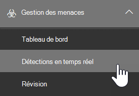

# Explorateur de menaces et détections en temps réel

[!INCLUDE [MDO Trial banner](../includes/mdo-trial-banner.md)]

**S’applique à**
- [Microsoft Defender pour Office 365 : offre 1 et offre 2](defender-for-office-365.md)
- [Microsoft 365 Defender](../defender/microsoft-365-defender.md)

Si votre organisation dispose [d’Microsoft Defender pour Office 365](defender-for-office-365.md) et que vous disposez [des autorisations nécessaires](#required-licenses-and-permissions), vous disposez de **détections** **d’Explorateur** ou en temps réel (anciennement *rapports en temps réel* , [découvrez les nouveautés](#new-features-in-threat-explorer-and-real-time-detections)!). Dans le Centre de sécurité & conformité, accédez à **Gestion des menaces**, puis choisissez **l’Explorateur** _ou_ **les détections en temps réel**.

|Avec Microsoft Defender pour Office 365 Plan 2, vous voyez :|Avec Microsoft Defender pour Office 365 plan 1, vous voyez :|
|---|---|
|||

Les détections de l’Explorateur ou en temps réel aident votre équipe chargée des opérations de sécurité à examiner et à répondre efficacement aux menaces. Le rapport ressemble à l’image suivante :

:::image type="content" source="../../media/cab32fa2-66f1-4ad5-bc1d-2bac4dbeb48c.png" alt-text="Élément de menu Explorateur dans le portail sécurité & conformité" lightbox="../../media/cab32fa2-66f1-4ad5-bc1d-2bac4dbeb48c.png":::

Avec ce rapport, vous pouvez :

- [Voir les programmes malveillants détectés par les fonctionnalités de sécurité Microsoft 365](#see-malware-detected-in-email-by-technology)
- [Afficher l’URL de hameçonnage et cliquer sur les données de verdict](#view-phishing-url-and-click-verdict-data)
- [Démarrer un processus d’investigation et de réponse automatisé à partir d’une vue dans l’Explorateur](#start-automated-investigation-and-response) (Defender pour Office 365 Plan 2 uniquement)
- [Examiner les e-mails malveillants, et bien plus encore](#more-ways-to-use-explorer-and-real-time-detections)

## Améliorations apportées à l’expérience de chasse aux menaces

### Présentation de l’ID d’alerte pour les alertes Defender pour Office 365 dans l’Explorateur/les détections en temps réel

Aujourd’hui, si vous naviguez d’une alerte à l’Explorateur de menaces, elle ouvre une vue filtrée dans l’Explorateur, avec la vue filtrée par ID de stratégie d’alerte (ID de stratégie étant un identificateur unique pour une stratégie d’alerte).
Nous rendons cette intégration plus pertinente en introduisant l’ID d’alerte (voir un exemple d’ID d’alerte ci-dessous) dans l’Explorateur de menaces et les détections en temps réel afin que vous voyiez les messages pertinents pour l’alerte spécifique, ainsi qu’un nombre d’e-mails. Vous pourrez également voir si un message faisait partie d’une alerte, ainsi que naviguer entre ce message et l’alerte spécifique.

L’ID d’alerte est disponible dans l’URL lorsque vous affichez une alerte individuelle ; un exemple étant `https://protection.office.com/viewalerts?id=372c9b5b-a6c3-5847-fa00-08d8abb04ef1`.

> [!div class="mx-imgBorder"]
> :::image type="content" source="../../media/AlertID-Filter.png" alt-text="Filtrage de l’ID d’alerte" lightbox="../../media/AlertID-Filter.png":::

> [!div class="mx-imgBorder"]
> :::image type="content" source="../../media/AlertID-DetailsFlyout.png" alt-text="L’ID d’alerte dans le menu volant détaillé" lightbox="../../media/AlertID-DetailsFlyout.png":::

### Extension de la conservation des données de l’Explorateur (et des détections en temps réel) et de la limite de recherche pour les locataires d’essai de 7 à 30 jours

Dans le cadre de cette modification, vous serez en mesure de rechercher et de filtrer les données d’e-mail sur 30 jours (une augmentation par rapport aux 7 derniers jours) dans l’Explorateur de menaces/détections en temps réel pour Defender pour Office locataires d’essai P1 et P2.
Cela n’a aucun impact sur les locataires de production pour les clients P1 et P2/E5, qui disposent déjà des fonctionnalités de rétention et de recherche des données de 30 jours.

### Limites mises à jour pour l’exportation d’enregistrements pour l’Explorateur de menaces

Dans le cadre de cette mise à jour, le nombre de lignes pour les enregistrements de messagerie pouvant être exportés à partir de l’Explorateur de menaces est passé de 9990 à 200 000 enregistrements. L’ensemble des colonnes pouvant être exportées reste le même, mais le nombre de lignes augmente par rapport à la limite actuelle.

### Balises dans l’Explorateur de menaces

> [!NOTE]
> La fonctionnalité de balises utilisateur est en *préversion*, n’est pas disponible pour tout le monde et est susceptible d’être modifiée. Pour plus d’informations sur la planification de publication, consultez la feuille de route Microsoft 365.

Les balises utilisateur identifient des groupes d’utilisateurs spécifiques dans Microsoft Defender pour Office 365. Pour plus d’informations sur les balises, notamment les licences et la configuration, consultez [Balises utilisateur](user-tags.md).

Dans l’Explorateur de menaces, vous pouvez voir des informations sur les balises utilisateur dans les expériences suivantes.

#### Affichage grille des e-mails

La colonne **Balises** de la grille d’e-mail contient toutes les balises qui ont été appliquées aux boîtes aux lettres de l’expéditeur ou du destinataire. Par défaut, les balises système telles que les comptes de priorité sont affichées en premier.

> [!div class="mx-imgBorder"]
> :::image type="content" source="../../media/tags-grid.png" alt-text="Balises de filtre dans l’affichage grille du courrier électronique" lightbox="../../media/tags-grid.png":::

#### Filtrage

Vous pouvez utiliser des balises comme filtre. Recherchez des comptes prioritaires ou des scénarios de balises utilisateur spécifiques. Vous pouvez également exclure les résultats qui ont certaines balises. Combinez cette fonctionnalité avec d’autres filtres pour affiner votre étendue d’investigation.

> [!div class="mx-imgBorder"]
> :::image type="content" source="../../media/tags-filter-not.png" alt-text="Balises qui ne sont pas filtrées" lightbox="../../media/tags-filter-not.png":::

#### Menu volant des détails de l’e-mail

Pour afficher les balises individuelles de l’expéditeur et du destinataire, sélectionnez l’objet pour ouvrir le menu volant des détails du message. Sous l’onglet **Résumé** , les balises d’expéditeur et de destinataire sont affichées séparément, si elles sont présentes pour un e-mail.
Les informations sur les balises individuelles pour l’expéditeur et le destinataire s’étendent également aux données CSV exportées, où vous pouvez voir ces détails dans deux colonnes distinctes.

> [!div class="mx-imgBorder"]
> :::image type="content" source="../../media/tags-flyout.png" alt-text="Balises Détails de l’e-mail" lightbox="../../media/tags-flyout.png":::

Les informations de balises sont également affichées dans le menu volant des clics d’URL. Pour l’afficher, accédez à l’affichage Phish ou All Email, puis à l’onglet **URL** ou **Clics d’URL** . Sélectionnez un menu volant d’URL individuel pour afficher des détails supplémentaires sur les clics de cette URL, y compris les balises associées à ce clic.

### Affichage chronologie mis à jour

> [!div class="mx-imgBorder"]
> :::image type="content" source="../../media/tags-urls.png" alt-text="Balises d’URL" lightbox="../../media/tags-urls.png":::
>
Pour en savoir plus, regardez [cette vidéo](https://www.youtube.com/watch?v=UoVzN0lYbfY&list=PL3ZTgFEc7LystRja2GnDeUFqk44k7-KXf&index=4).

## Améliorations apportées à l’expérience de repérage des menaces (à venir)

### Informations sur les menaces mises à jour pour les e-mails

Nous nous sommes concentrés sur les améliorations de la plateforme et de la qualité des données afin d’améliorer la précision et la cohérence des données pour les enregistrements de messagerie. Les améliorations incluent la consolidation des informations de pré-remise et de post-remise, telles que les actions exécutées sur un e-mail dans le cadre du processus ZAP, en un seul enregistrement. Des détails supplémentaires tels que le verdict de courrier indésirable, les menaces au niveau de l’entité (par exemple, l’URL malveillante) et les derniers emplacements de remise sont également inclus.

Après ces mises à jour, vous verrez une seule entrée pour chaque message, indépendamment des différents événements post-remise qui affectent le message. Les actions peuvent inclure ZAP, la correction manuelle (ce qui signifie une action d’administration), [la remise dynamique](safe-attachments.md#dynamic-delivery-in-safe-attachments-policies), et ainsi de suite.

En plus d’afficher les menaces de programmes malveillants et de hameçonnage, vous voyez le verdict de courrier indésirable associé à un e-mail. Dans l’e-mail, consultez toutes les menaces associées à l’e-mail, ainsi que les technologies de détection correspondantes. Un e-mail peut avoir zéro, une ou plusieurs menaces. Vous verrez les **menaces** actuelles dans la section Détails du menu volant de l’e-mail. Pour plusieurs menaces (telles que les programmes malveillants et le hameçonnage), le champ **technique Détection** affiche le mappage de détection des menaces, qui est la technologie de détection qui a identifié la menace.

L’ensemble des technologies de détection comprend désormais de nouvelles méthodes de détection, ainsi que des technologies de détection du courrier indésirable. Vous pouvez utiliser le même ensemble de technologies de détection pour filtrer les résultats entre les différentes vues de courrier (programme malveillant, hameçonnage, tous les e-mails).

> [!NOTE]
> L’analyse du verdict peut ne pas nécessairement être liée à des entités. Par exemple, un e-mail peut être classé comme hameçonnage ou courrier indésirable, mais aucune URL n’est marquée d’un verdict de hameçonnage/courrier indésirable. Cela est dû au fait que les filtres évaluent également le contenu et d’autres détails d’un e-mail avant d’attribuer un verdict.

#### Menaces dans les URL

Vous pouvez maintenant voir la menace spécifique pour une URL sous l’onglet **Détails** du menu volant de l’e-mail. La menace peut être *un programme malveillant*, *un hameçonnage*, un *courrier indésirable* ou *aucun*.)

> [!div class="mx-imgBorder"]
> :::image type="content" source="../../media/URL_Threats.png" alt-text="Menaces d’URL" lightbox="../../media/URL_Threats.png":::

### Affichage de chronologie mis à jour (à venir)

> [!div class="mx-imgBorder"]
> :::image type="content" source="../../media/Email_Timeline.png" alt-text="Vue chronologie mise à jour" lightbox="../../media/Email_Timeline.png":::

La vue Chronologie identifie tous les événements de remise et de remise. Il inclut des informations sur la menace identifiée à ce moment-là pour un sous-ensemble de ces événements. La vue Chronologie fournit également des informations sur toute action supplémentaire effectuée (par exemple, ZAP ou correction manuelle), ainsi que le résultat de cette action. Les informations d’affichage de chronologie incluent :

- **Source:** Source de l’événement. Il peut s’agir de l’administrateur/du système/de l’utilisateur.
- **Événement:** Inclut des événements de niveau supérieur tels que la remise d’origine, la correction manuelle, ZAP, les soumissions et la livraison dynamique.
- **Action:** Action spécifique qui a été effectuée dans le cadre de l’action ZAP ou de l’action de l’administrateur (par exemple, la suppression réversible).
- **Menaces:** Couvre les menaces (programmes malveillants, hameçonnage, courrier indésirable) identifiées à ce moment-là.
- **Résultat/Détails :** Plus d’informations sur le résultat de l’action, par exemple si elle a été effectuée dans le cadre de l’action ZAP/admin.

### Emplacement de livraison d’origine et le dernier emplacement de livraison

Actuellement, nous faisons apparaître l’emplacement de livraison dans la grille e-mail et le menu volant de courrier électronique. Le champ **Emplacement de remise** est renommé **_Emplacement de remise d’origine_*_. Et nous introduisons un autre champ, _*_Latest delivery location_**.

**L’emplacement de livraison d’origine** fournit plus d’informations sur l’endroit où un e-mail a été remis initialement. **L’emplacement de remise le plus récent** indique l’emplacement où un e-mail est arrivé après des actions système telles *que ZAP* ou des actions d’administration telles *que Déplacer vers des éléments supprimés*. L’emplacement de remise le plus récent est destiné à indiquer aux administrateurs le dernier emplacement connu du message après la remise ou toute action système/administrateur. Il n’inclut aucune action de l’utilisateur final sur l’e-mail. Par exemple, si un utilisateur a supprimé un message ou déplacé le message vers archive/pst, l’emplacement de « remise » du message ne sera pas mis à jour. Toutefois, si une action système met à jour l’emplacement (par exemple, ZAP entraînant le passage d’un e-mail en quarantaine), **l’emplacement de remise le plus** récent s’affiche comme étant « en quarantaine ».

> [!div class="mx-imgBorder"]
> :::image type="content" source="../../media/Updated_Delivery_Location.png" alt-text="Emplacements de remise mis à jour" lightbox="../../media/Updated_Delivery_Location.png":::

> [!NOTE]
> Il existe quelques cas où **l’emplacement de remise** et l’action **de remise** peuvent s’afficher comme « inconnus » :
>
> - Vous pouvez voir **l’emplacement de remise** comme « remis » et l’emplacement de **remise** comme « inconnu » si le message a été remis, mais une règle de boîte de réception a déplacé le message vers un dossier par défaut (tel que Brouillon ou Archive) au lieu du dossier Boîte de réception ou Courrier indésirable.
>
> - **L’emplacement de remise le plus récent** peut être inconnu si une action administrateur/système (telle que ZAP) a été tentée, mais le message est introuvable. En règle générale, l’action se produit après que l’utilisateur a déplacé ou supprimé le message. Dans ce cas, vérifiez la colonne **Résultats/Détails** en mode Chronologie. Recherchez l’instruction « Message déplacé ou supprimé par l’utilisateur ».

> [!div class="mx-imgBorder"]
> :::image type="content" source="../../media/Updated_Timeline_Delivery_Location.png" alt-text="Emplacements de remise pour la chronologie" lightbox="../../media/Updated_Timeline_Delivery_Location.png":::

### Actions supplémentaires

*Des actions supplémentaires* ont été appliquées après la remise de l’e-mail. Ils peuvent inclure *ZAP*, *correction manuelle* (action effectuée par un Administration comme la suppression réversible), *livraison dynamique* et *retraitement* (pour un e-mail qui a été rétroactivement détecté comme bon).

> [!NOTE]
> Dans le cadre des modifications en attente, la valeur « Supprimé par ZAP » actuellement exposée dans le filtre Action de remise disparaît. Vous aurez un moyen de rechercher tous les e-mails avec la tentative ZAP par le biais **d’actions supplémentaires**.

> [!div class="mx-imgBorder"]
> :::image type="content" source="../../media/Additional_Actions.png" alt-text="Actions supplémentaires dans l’Explorateur" lightbox="../../media/Additional_Actions.png":::

### Remplacements système

*Les remplacements système* vous permettent d’effectuer des exceptions à l’emplacement de remise prévu d’un message. Vous remplacez l’emplacement de remise fourni par le système, en fonction des menaces et autres détections identifiées par la pile de filtrage. Les remplacements système peuvent être définis par le biais d’une stratégie de locataire ou d’utilisateur pour remettre le message comme suggéré par la stratégie. Les remplacements peuvent identifier la remise involontaire de messages malveillants en raison d’écarts de configuration, tels qu’une stratégie d’expéditeur trop large Coffre définie par un utilisateur. Ces valeurs de remplacement peuvent être les suivantes :

- Autorisé par la stratégie utilisateur : un utilisateur crée des stratégies au niveau de la boîte aux lettres pour autoriser les domaines ou les expéditeurs.

- Bloqué par une stratégie utilisateur : un utilisateur crée des stratégies au niveau de la boîte de messagerie pour bloquer les domaines ou les expéditeurs.

- Autorisé par la stratégie d’organisation : les équipes de sécurité de l’organisation définissent des stratégies ou Exchange règles de flux de messagerie (également appelées règles de transport) pour autoriser les expéditeurs et les domaines pour les utilisateurs de leur organisation. Il peut s’agir d’un ensemble d’utilisateurs ou de l’ensemble de l’organisation.

- Bloqué par une stratégie d’organisation : les équipes de sécurité de l’organisation définissent des stratégies ou des règles de flux de messagerie pour bloquer les expéditeurs, les domaines, les langues de message ou les adresses IP sources pour les utilisateurs de leur organisation. Cela peut être appliqué à un ensemble d’utilisateurs ou à l’ensemble de l’organisation.

- Extension de fichier bloquée par la stratégie d’organisation : l’équipe de sécurité d’une organisation bloque une extension de nom de fichier via les paramètres de stratégie anti-programme malveillant. Ces valeurs sont désormais affichées dans les détails de l’e-mail pour faciliter les investigations. Les équipes Secops peuvent également utiliser la fonctionnalité de filtrage enrichi pour filtrer sur les extensions de fichier bloquées.

> [!div class="mx-imgBorder"]
> :::image type="content" source="../../media/System_Overrides_Grid.png" alt-text="Le système remplace grid dans l’Explorateur" lightbox="../../media/System_Overrides_Grid.png":::

### Améliorations apportées à l’expérience URL et clics

Les améliorations sont les suivantes :

- Affichez l’URL cliqué (y compris les paramètres de requête qui font partie de l’URL) dans la section **Clics** du menu volant de l’URL. Actuellement, le domaine et le chemin d’accès de l’URL apparaissent dans la barre de titre. Nous étendons ces informations pour afficher l’URL complète.

- Correctifs entre les filtres d’URL (*URL* ou *domaine d’URL* et *domaine d’URL et chemin d’accès*) : les mises à jour affectent la recherche de messages contenant une URL/cliquez sur le verdict. Nous avons activé la prise en charge des recherches sans protocole, afin que vous puissiez rechercher une URL sans utiliser `http`. Par défaut, la recherche d’URL est mappée à http, sauf si une autre valeur est explicitement spécifiée. Par exemple :
  - Effectuez une recherche avec et sans le `http://` préfixe dans les champs **de filtre URL**, **Domaine d’URL** et **Domaine d’URL et Chemin d’accès** . Les recherches doivent afficher les mêmes résultats.
  - Recherchez le `https://` préfixe dans **l’URL**. Lorsqu’aucune valeur n’est spécifiée, le `http://` préfixe est supposé.
  - `/` est ignoré au début et à la fin du **chemin d’URL**, **du domaine d’URL**, du **domaine d’URL et** des champs de chemin d’accès. `/` à la fin du champ **URL** est ignoré.

### Niveau de confiance du hameçonnage

Le niveau de confiance du hameçonnage permet d’identifier le degré de confiance avec lequel un e-mail a été classé comme « hameçonnage ». Les deux valeurs possibles sont *High* et *Normal*. Dans les étapes initiales, ce filtre sera disponible uniquement dans la vue Phish de l’Explorateur de menaces.

### Signal d’URL ZAP

Le signal d’URL ZAP est généralement utilisé pour les scénarios d’alerte ZAP Phish où un e-mail a été identifié comme Phish et supprimé après la remise. Ce signal connecte l’alerte aux résultats correspondants dans l’Explorateur. Il s’agit de l’un des E/S par E/S de l’alerte.

Pour améliorer le processus de chasse, nous avons mis à jour l’Explorateur de menaces et les détections en temps réel pour rendre l’expérience de chasse plus cohérente. Les modifications sont décrites ici :

- [Améliorations du fuseau horaire](#timezone-improvements)
- [Mettre à jour dans le processus d’actualisation](#update-in-the-refresh-process)
- [Exploration du graphique à ajouter aux filtres](#chart-drilldown-to-add-to-filters)
- [Dans les mises à jour des informations sur le produit](#in-product-information-updates)

### Filtrer par balises utilisateur

Vous pouvez désormais trier et filtrer sur des balises utilisateur système ou personnalisées pour saisir rapidement l’étendue des menaces. Pour plus d’informations, consultez [les balises utilisateur](user-tags.md).

> [!IMPORTANT]
> Le filtrage et le tri par balises utilisateur sont actuellement en préversion publique. Cette fonctionnalité peut être considérablement modifiée avant sa publication commerciale. Microsoft n’offre aucune garantie, expresse ou implicite, en ce qui concerne les informations fournies à son sujet.

> [!div class="mx-imgBorder"]
> :::image type="content" source="../../media/threat-explorer-tags.png" alt-text="Colonne Balises dans l’Explorateur" lightbox="../../media/threat-explorer-tags.png":::

### Améliorations du fuseau horaire

Vous verrez le fuseau horaire des enregistrements de courrier dans le portail, ainsi que pour les données exportées. Il sera visible dans les expériences telles que la grille d’e-mail, le menu volant Détails, la chronologie de l’e-mail et les e-mails similaires. Le fuseau horaire du jeu de résultats est donc clair.

> [!div class="mx-imgBorder"]
> :::image type="content" source="../../media/TimezoneImprovements.png" alt-text="Fuseau horaire d’affichage dans l’Explorateur" lightbox="../../media/TimezoneImprovements.png":::

### Mettre à jour dans le processus d’actualisation

Certains utilisateurs ont commenté la confusion liée à l’actualisation automatique (par exemple, dès que vous modifiez la date, l’actualisation de la page) et l’actualisation manuelle (pour d’autres filtres). De même, la suppression des filtres entraîne une actualisation automatique. La modification des filtres lors de la modification de la requête peut entraîner des expériences de recherche incohérentes. Pour résoudre ces problèmes, nous allons passer à un mécanisme de filtrage manuel.

Du point de vue de l’expérience, l’utilisateur peut appliquer et supprimer les différentes plages de filtres (du jeu de filtres et de la date) et sélectionner le bouton Actualiser pour filtrer les résultats après avoir défini la requête. Le bouton Actualiser est également mis en évidence à l’écran. Nous avons également mis à jour les info-bulles associées et la documentation dans le produit.

> [!div class="mx-imgBorder"]
> :::image type="content" source="../../media/ManualRefresh.png" alt-text="Bouton Actualiser pour filtrer les résultats" lightbox="../../media/ManualRefresh.png":::

### Exploration du graphique à ajouter aux filtres

Vous pouvez désormais tracer des valeurs de légende pour les ajouter en tant que filtres. Sélectionnez le bouton **Actualiser** pour filtrer les résultats.

> [!div class="mx-imgBorder"]
> :::image type="content" source="../../media/ChartDrilldown.png" alt-text="Exploration des graphiques à filtrer" lightbox="../../media/ChartDrilldown.png":::

### Mises à jour des informations sur le produit

Des détails supplémentaires sont désormais disponibles dans le produit, tels que le nombre total de résultats de recherche dans la grille (voir ci-dessous). Nous avons amélioré les étiquettes, les messages d’erreur et les info-bulles pour fournir plus d’informations sur les filtres, l’expérience de recherche et le jeu de résultats.

> [!div class="mx-imgBorder"]
> :::image type="content" source="../../media/ProductInfo.png" alt-text="Informations dans le produit à afficher" lightbox="../../media/ProductInfo.png":::

## Fonctionnalités étendues dans l’Explorateur de menaces

### Principaux utilisateurs ciblés

Aujourd’hui, nous exposons la liste des utilisateurs les plus ciblés dans la vue Programmes malveillants pour les e-mails, dans la section **Familles de programmes malveillants principales** . Nous étendrons également cette vue dans les affichages Phish et All Email. Vous pourrez voir les cinq premiers utilisateurs ciblés, ainsi que le nombre de tentatives pour chaque utilisateur pour la vue correspondante. Par exemple, pour la vue Phish, vous verrez le nombre de tentatives de hameçonnage.

Vous pourrez exporter la liste des utilisateurs ciblés, jusqu’à une limite de 3 000, ainsi que le nombre de tentatives d’analyse hors connexion pour chaque affichage de messagerie. En outre, la sélection du nombre de tentatives (par exemple, 13 tentatives dans l’image ci-dessous) ouvre une vue filtrée dans l’Explorateur de menaces, afin que vous puissiez voir plus de détails sur les e-mails et les menaces pour cet utilisateur.

> [!div class="mx-imgBorder"]
> :::image type="content" source="../../media/Top_Targeted_Users.png" alt-text="Les utilisateurs les plus ciblés" lightbox="../../media/Top_Targeted_Users.png":::

### Exchange règles de transport

Dans le cadre de l’enrichissement des données, vous pouvez voir toutes les différentes règles de transport Exchange (ETR) qui ont été appliquées à un message. Ces informations seront disponibles dans la vue Grille e-mail. Pour l’afficher, sélectionnez **Options de colonne** dans la grille, puis **ajoutez Exchange règle de transport** à partir des options de colonne. Il sera également visible dans le menu volant **Détails** dans l’e-mail.

Vous pourrez voir à la fois le GUID et le nom des règles de transport qui ont été appliquées au message. Vous pourrez rechercher les messages à l’aide du nom de la règle de transport. Il s’agit d’une recherche « Contains », ce qui signifie que vous pouvez également effectuer des recherches partielles.

> [!IMPORTANT]
> La disponibilité des noms et des recherches ETR dépend du rôle spécifique qui vous est attribué. Vous devez disposer de l’un des rôles/autorisations suivants pour afficher les noms ETR et la recherche. Si aucun de ces rôles ne vous est attribué, vous ne pouvez pas voir les noms des règles de transport ou rechercher des messages à l’aide de noms ETR. Toutefois, vous pouvez voir l’étiquette ETR et les informations GUID dans les détails de l’e-mail. Les autres expériences d’affichage des enregistrements dans les grilles d’e-mail, les menus volants d’e-mail, les filtres et l’exportation ne sont pas affectées.
>
> - EXO uniquement - Protection contre la perte de données : Tout
> - EXO Uniquement - O365SupportViewConfig: All
> - Microsoft Azure Active Directory ou EXO - Administration de sécurité : tout
> - AAD ou EXO - Lecteur sécurité : tout
> - EXO uniquement - Règles de transport : tous
> - EXO uniquement - configuration View-Only : tout
>
> Dans la grille d’e-mail, le menu volant Détails et le fichier CSV exporté, les ETR sont présentés avec un nom/GUID, comme indiqué ci-dessous.
>
> > [!div class="mx-imgBorder"]
> > :::image type="content" source="../../media/ETR_Details.png" alt-text="Les règles de transport Exchange" lightbox="../../media/ETR_Details.png":::

### Connecteurs entrants

Les connecteurs sont une collection d’instructions qui personnalisent la façon dont vos e-mails circulent vers et depuis votre Microsoft 365 ou Office 365 organisation. Ils vous permettent d’appliquer des restrictions ou des contrôles de sécurité. Dans l’Explorateur de menaces, vous pouvez désormais afficher les connecteurs liés à un e-mail et rechercher des e-mails à l’aide de noms de connecteurs.

La recherche de connecteurs est de nature « contains », ce qui signifie que les recherches de mots clés partiels doivent également fonctionner. Dans la vue Grille principale, le menu volant Détails et le fichier CSV exporté, les connecteurs sont affichés au format Nom/GUID, comme indiqué ici :

> [!div class="mx-imgBorder"]
> :::image type="content" source="../../media/Connector_Details.png" alt-text="Détails du connecteur" lightbox="../../media/Connector_Details.png":::

## Nouvelles fonctionnalités de l’Explorateur de menaces et des détections en temps réel

- [Afficher les e-mails d’hameçonnage envoyés aux utilisateurs et aux domaines usurpés d’identité](#view-phishing-emails-sent-to-impersonated-users-and-domains)
- [Afficher un aperçu de l’en-tête d’e-mail et télécharger le corps de l’e-mail](#preview-email-header-and-download-email-body)
- [Chronologie de l’e-mail](#email-timeline)
- [Exporter des données de clic d’URL](#export-url-click-data)

### Afficher les e-mails d’hameçonnage envoyés aux utilisateurs et aux domaines usurpés d’identité

Pour identifier les tentatives d’hameçonnage contre les utilisateurs et les domaines qui sont des utilisateurs usurpés d’identité, vous devez ajouter à la liste *des utilisateurs à protéger*. Pour les domaines, les administrateurs doivent activer *les domaines d’organisation* ou ajouter un nom de domaine aux *domaines à protéger*. Les domaines à protéger se trouvent dans la page de stratégie *anti-hameçonnage* de la section *Emprunt d’identité* .

Pour passer en revue les messages de hameçonnage et rechercher des utilisateurs ou domaines usurpés d’identité, utilisez la [vue e-mail > Phish](threat-explorer-views.md) de l’Explorateur.

Cet exemple utilise l’Explorateur de menaces.

1. Dans le [Centre de sécurité & conformité](https://protection.office.com) (https://protection.office.com)choisissez Threat Management > Explorer (ou détections en temps réel).

2. Dans le menu Affichage, choisissez E-mail > Hameçonnage.

   Ici, vous pouvez choisir un **domaine** ou un **utilisateur emprunt d’identité**.

3. **Sélectionnez** **le domaine emprunté**, puis tapez un domaine protégé dans la zone de texte.

   Par exemple, recherchez des noms de domaine protégés tels *que contoso*, *contoso.com* ou *contoso.com.au*.

4. Sélectionnez l’objet d’un message sous l’onglet E-mail > l’onglet Détails pour afficher des informations d’emprunt d’identité supplémentaires telles que Domaine emprunté/Emplacement détecté.

    **OR**

    Sélectionnez **l’utilisateur usurpé d’identité** et tapez l’adresse e-mail d’un utilisateur protégé dans la zone de texte.

    > [!TIP]
    > **Pour de meilleurs résultats**, utilisez *des adresses e-mail complètes* pour rechercher des utilisateurs protégés. Vous trouverez votre utilisateur protégé plus rapidement et avec plus de succès si vous recherchez *firstname.lastname@contoso.com*, par exemple, lors de l’examen de l’emprunt d’identité de l’utilisateur. Lors de la recherche d’un domaine protégé, la recherche prend le domaine racine (contoso.com, par exemple) et le nom de domaine (*contoso*). La recherche de *l’contoso.com* de domaine racine retourne à la fois les emprunts *d’identité de contoso.com* et le nom de domaine *contoso*.

5. Sélectionnez **l’objet** d’un message sous **l’onglet Email tabDetails**  >  pour afficher des informations d’emprunt d’identité supplémentaires sur l’utilisateur ou le domaine, ainsi que *l’emplacement détecté*.

    :::image type="content" source="../../media/threat-ex-views-impersonated-user-image.png" alt-text="Volet Détails de l’Explorateur de menaces pour un utilisateur protégé affichant l’emplacement de détection et la menace détectée (ici, usurpation d’identité d’un utilisateur)" lightbox="../../media/threat-ex-views-impersonated-user-image.png":::

> [!NOTE]
> À l’étape 3 ou 5, si vous choisissez **Technologie de détection** et sélectionnez **Domaine d’emprunt** d’identité ou **Utilisateur d’emprunt** d’identité respectivement, les informations de **l’onglet e-mailDetails**  >  sur l’utilisateur ou le domaine, et *l’emplacement détecté* s’affichent uniquement sur les messages liés à l’utilisateur ou au domaine répertoriés dans la page de stratégie *anti-hameçonnage*.

### Afficher un aperçu de l’en-tête d’e-mail et télécharger le corps de l’e-mail

Vous pouvez maintenant afficher un aperçu d’un en-tête d’e-mail et télécharger le corps de l’e-mail dans l’Explorateur de menaces. Les administrateurs peuvent analyser les en-têtes/messages électroniques téléchargés pour détecter les menaces. Étant donné que le téléchargement de messages électroniques peut exposer des informations, ce processus est contrôlé par le contrôle d’accès en fonction du rôle (RBAC). Un nouveau rôle, *Preview*, est nécessaire pour permettre de télécharger des courriers dans l’affichage des messages électroniques. Toutefois, l’affichage de l’en-tête d’e-mail ne nécessite aucun rôle supplémentaire (autre que ce qui est requis pour afficher les messages dans l’Explorateur de menaces). Pour créer un groupe de rôles avec le rôle Aperçu :

1. Sélectionnez un groupe de rôles intégré qui a uniquement le rôle Aperçu, tel que l’Enquêteur de données ou le Gestionnaire eDiscovery.
2. Sélectionnez **Copier le groupe de rôles**.
3. Choisissez un nom et une description pour votre nouveau groupe de rôles, puis sélectionnez **Suivant**.
4. Modifiez les rôles en ajoutant et en supprimant les rôles si nécessaire, mais en laissant le rôle Aperçu.
5. Ajoutez des membres, puis **sélectionnez Créer un groupe de rôles**.

Les détections d’explorateur et en temps réel obtiennent également de nouveaux champs qui fournissent une image plus complète de l’endroit où vos messages électroniques arrivent. Ces modifications facilitent la chasse pour les opérations de sécurité. Mais le principal résultat est que vous pouvez connaître l’emplacement des messages électroniques problématiques en un clin d’œil.

Comment cela est-il fait ? L’état de remise est maintenant divisé en deux colonnes :

- **Action de remise** : état de l’e-mail.
- **Emplacement de remise : emplacement** de routage de l’e-mail.

*L’action de remise* est l’action effectuée sur un e-mail en raison de stratégies ou de détections existantes. Voici les actions possibles pour un e-mail :

|Livré|Jetés|Blocked|Remplacé|
|---|---|---|---|
|L’e-mail a été remis à la boîte de réception ou au dossier d’un utilisateur, et l’utilisateur peut y accéder.|L’e-mail a été envoyé au dossier Courrier indésirable ou supprimé de l’utilisateur, et l’utilisateur peut y accéder.|E-mails mis en quarantaine, qui ont échoué ou qui ont été supprimés. Ces messages sont inaccessibles à l’utilisateur.|Les pièces jointes malveillantes ont été remplacées par des fichiers .txt indiquant que la pièce jointe était malveillante.|

Voici ce que l’utilisateur peut et ne peut pas voir :

|Accessible aux utilisateurs finaux|Inaccessible aux utilisateurs finaux|
|---|---|
|Livré|Blocked|
|Jetés|Remplacé|

**L’emplacement de remise** affiche les résultats des stratégies et des détections qui s’exécutent après la remise. Il est lié à **_l’action de remise_**. Voici les valeurs possibles :

- *Boîte de réception ou dossier* : l’e-mail se trouve dans la boîte de réception ou un dossier (selon vos règles de messagerie).
- *Local ou externe* : la boîte aux lettres n’existe pas sur le cloud, mais elle est locale.
- *Dossier indésirable* : l’e-mail se trouve dans le dossier Courrier indésirable d’un utilisateur.
- *Dossier Éléments supprimés* : l’e-mail dans le dossier Éléments supprimés d’un utilisateur.
- *Mise en quarantaine* : l’e-mail est en quarantaine et non dans la boîte aux lettres d’un utilisateur.
- *Échec* : l’e-mail n’a pas pu atteindre la boîte aux lettres.
- *Supprimé* : l’e-mail s’est perdu quelque part dans le flux de courrier.

### Chronologie de l’e-mail

La **chronologie de l’e-mail** est une nouvelle fonctionnalité de l’Explorateur qui améliore l’expérience de chasse pour les administrateurs. Il réduit le temps consacré à la vérification des différents emplacements pour essayer de comprendre l’événement. Lorsque plusieurs événements se produisent au moment où un e-mail arrive ou presque, ces événements sont affichés dans un affichage chronologie. Certains événements qui se produisent dans votre courrier électronique après la remise sont capturés dans la colonne **Action spéciale** . Les administrateurs peuvent combiner les informations de la chronologie avec les mesures spéciales prises après la remise du courrier pour obtenir des informations sur le fonctionnement de leurs stratégies, l’endroit où le courrier a finalement été routée et, dans certains cas, ce qu’était l’évaluation finale.

Pour plus d’informations, consultez [Examiner et corriger les e-mails malveillants qui ont été remis dans Office 365](investigate-malicious-email-that-was-delivered.md).

### Exporter des données de clic d’URL

Vous pouvez désormais exporter des rapports pour les clics d’URL pour Microsoft Excel pour afficher leur **ID de message réseau** et **cliquer sur verdict**, ce qui vous aide à expliquer l’origine du trafic de votre clic d’URL. Voici comment cela fonctionne : Dans Gestion des menaces dans la barre de lancement rapide Office 365, suivez cette chaîne :

**Explorateur** \> **Afficher le hameçonnage** \> **Clics** \> **Les URL principales** ou les **clics** \> en haut sélectionnent n’importe quel enregistrement pour ouvrir le menu volant d’URL.

Lorsque vous sélectionnez une URL dans la liste, un nouveau bouton **Exporter** s’affiche dans le panneau volant. Utilisez ce bouton pour déplacer des données vers une feuille de calcul Excel pour faciliter la création de rapports.

Suivez ce chemin pour accéder au même emplacement dans le rapport de détections en temps réel :

**Explorateur** \> **Détections** \> en temps réel **Afficher le hameçonnage** \> **Url** \> **URL principales** ou **clics** \> principaux Sélectionnez un enregistrement pour ouvrir le menu volant \> d’URL, accédez à l’onglet **Clics** .

> [!TIP]
> L’ID de message réseau mappe le clic à des messages spécifiques lorsque vous effectuez une recherche sur l’ID via l’Explorateur ou les outils tiers associés. Ces recherches identifient l’e-mail associé à un résultat de clic. Le fait d’avoir l’ID de message réseau corrélé permet une analyse plus rapide et plus puissante.

> [!div class="mx-imgBorder"]
> :::image type="content" source="../../media/tp_ExportClickResultAndNetworkID.png" alt-text="Onglet Clics dans l’Explorateur" lightbox="../../media/tp_ExportClickResultAndNetworkID.png":::

## Voir les programmes malveillants détectés dans le courrier électronique par la technologie

Supposons que vous souhaitez voir les programmes malveillants détectés dans les e-mails triés par technologie Microsoft 365. Pour ce faire, utilisez la vue [Courrier électronique > Programmes malveillants](threat-explorer-views.md#email--malware) de l’Explorateur (ou détections en temps réel).

1. Dans le Centre de sécurité & conformité (<https://protection.office.com>), choisissez **l’Explorateur** **de gestion des** \> **menaces (ou les détections en temps réel**). (Cet exemple utilise l’Explorateur.)

2. Dans le menu **Affichage**, choisissez **Programmes malveillants** **par e-mail**\>.

   > [!div class="mx-imgBorder"]
   > :::image type="content" source="../../media/ExplorerViewEmailMalwareMenu.png" alt-text="Menu Affichage de l’Explorateur" lightbox="../../media/ExplorerViewEmailMalwareMenu.png":::

3. Cliquez sur **Expéditeur**, puis choisissez **La technologie de détection** **de base**\>.

   Vos technologies de détection sont désormais disponibles en tant que filtres pour le rapport.

   > [!div class="mx-imgBorder"]
   > :::image type="content" source="../../media/ExplorerEmailMalwareDetectionTech.png" alt-text="Technologies de détection des programmes malveillants" lightbox="../../media/ExplorerEmailMalwareDetectionTech.png":::

4. Choisissez une option. Sélectionnez ensuite le bouton **Actualiser** pour appliquer ce filtre.

   > [!div class="mx-imgBorder"]
   > :::image type="content" source="../../media/ExplorerEmailMalwareDetectionTechATP.png" alt-text="La technologie de détection sélectionnée" lightbox="../../media/ExplorerEmailMalwareDetectionTechATP.png":::

Le rapport est actualisé pour afficher les résultats détectés par les programmes malveillants par e-mail, à l’aide de l’option de technologie que vous avez sélectionnée. À partir de là, vous pouvez effectuer une analyse plus approfondie.

## Afficher l’URL de hameçonnage et cliquer sur les données de verdict

Supposons que vous souhaitiez voir des tentatives de hameçonnage via des URL par e-mail, y compris une liste d’URL qui ont été autorisées, bloquées et remplacées. Pour identifier les URL qui ont été cliqués, [Coffre liens](safe-links.md) doivent être configurés. Veillez à configurer [Coffre stratégies de liens](set-up-safe-links-policies.md) pour la protection du temps de clic et la journalisation des verdicts de clic par Coffre Liens.

Pour passer en revue les URL de hameçonnage dans les messages et cliquer sur les URL dans les messages de hameçonnage, utilisez la vue [**EmailPhish** > ](threat-explorer-views.md#email--phish) de l’Explorateur ou des détections en temps réel.

1. Dans le Centre de sécurité & conformité (<https://protection.office.com>), choisissez **l’Explorateur** **de gestion des** \> **menaces (ou les détections en temps réel**). (Cet exemple utilise l’Explorateur.)

2. Dans le menu **Affichage**, choisissez **Phish e-mail**\>.

   > [!div class="mx-imgBorder"]
   > :::image type="content" source="../../media/ExplorerViewEmailPhishMenu.png" alt-text="Menu Affichage de l’Explorateur dans le contexte de hameçonnage" lightbox="../../media/ExplorerViewEmailPhishMenu.png":::

3. Cliquez sur **Expéditeur**, puis choisissez **URL** \> **Cliquez sur Verdict**.

4. Sélectionnez une ou plusieurs options, telles que **Bloquer** et Bloquer **remplacé**, puis sélectionnez le bouton **Actualiser** sur la même ligne que les options d’application de ce filtre. (N’actualisez pas la fenêtre de votre navigateur.)

   > [!div class="mx-imgBorder"]
   > :::image type="content" source="../../media/ThreatExplorerEmailPhishClickVerdictOptions.png" alt-text="Les URL et cliquez sur verdicts" lightbox="../../media/ThreatExplorerEmailPhishClickVerdictOptions.png":::

   Le rapport s’actualise pour afficher deux tables d’URL différentes sous l’onglet URL du rapport :

   - **Les URL principales** sont les URL dans les messages que vous avez filtrés et le nombre d’actions de remise de courrier pour chaque URL. Dans la vue e-mail Phish, cette liste contient généralement des URL légitimes. Les attaquants incluent une combinaison d’URL bonnes et incorrectes dans leurs messages pour essayer de les remettre, mais ils rendent les liens malveillants plus intéressants. La table des URL est triée par nombre total d’e-mails, mais cette colonne est masquée pour simplifier l’affichage.

   - **Les clics supérieurs** sont les URL Coffre encapsulées liens qui ont été cliqués, triées par nombre total de clics. Cette colonne n’est pas non plus affichée pour simplifier l’affichage. Les nombres totaux par colonne indiquent la Coffre Les liens cliquent sur le nombre de verdicts pour chaque URL cliqué. Dans la vue e-mail Phish, il s’agit généralement d’URL suspectes ou malveillantes. Toutefois, la vue peut inclure des URL qui ne sont pas des menaces, mais qui sont dans des messages de hameçonnage. Les clics d’URL sur les liens non mappés ne s’affichent pas ici.

   Les deux tables d’URL affichent les URL les plus élevées dans les e-mails d’hameçonnage par action de remise et emplacement. Les tableaux affichent les clics d’URL qui ont été bloqués ou visités en dépit d’un avertissement, afin que vous puissiez voir quels liens incorrects potentiels ont été présentés aux utilisateurs et que l’utilisateur a cliqué. À partir de là, vous pouvez effectuer une analyse plus approfondie. Par exemple, sous le graphique, vous pouvez voir les URL principales dans les messages électroniques qui ont été bloqués dans l’environnement de votre organisation.

   > [!div class="mx-imgBorder"]
   > :::image type="content" source="../../media/ExplorerPhishClickVerdictURLs.png" alt-text="URL de l’Explorateur qui ont été bloquées" lightbox="../../media/ExplorerPhishClickVerdictURLs.png":::

   Sélectionnez une URL pour afficher des informations plus détaillées.

   > [!NOTE]
   > Dans la boîte de dialogue de menu volant d’URL, le filtrage sur les messages électroniques est supprimé pour afficher l’affichage complet de l’exposition de l’URL dans votre environnement. Cela vous permet de filtrer les messages électroniques qui vous préoccupent dans l’Explorateur, de rechercher des URL spécifiques qui sont des menaces potentielles, puis de développer votre compréhension de l’exposition des URL dans votre environnement (via la boîte de dialogue Détails de l’URL) sans avoir à ajouter de filtres d’URL à l’affichage Explorateur lui-même.

### Interprétation des verdicts de clic

Dans les menus volants d’e-mail ou d’URL, les clics principaux ainsi que dans nos expériences de filtrage, vous verrez différentes valeurs de verdict de clic :

- **Aucun:** Impossible de capturer le verdict pour l’URL. L’utilisateur a peut-être cliqué sur l’URL.
- **Autorisé:** L’utilisateur a été autorisé à accéder à l’URL.
- **Bloqué:** L’utilisateur n’a pas pu accéder à l’URL.
- **Verdict en attente :** La page en attente de détonation a été présentée à l’utilisateur.
- **Remplacé bloqué :** L’utilisateur n’a pas pu accéder directement à l’URL. Mais l’utilisateur remplace le bloc pour accéder à l’URL.
- **Le verdict en attente a été contourné :** La page de détonation a été présentée à l’utilisateur. Mais l’utilisateur remplace le message pour accéder à l’URL.
- **Erreur:** La page d’erreur a été présentée à l’utilisateur ou une erreur s’est produite lors de la capture du verdict.
- **Échec:** Une exception inconnue s’est produite lors de la capture du verdict. L’utilisateur a peut-être cliqué sur l’URL.

## Passer en revue les messages électroniques signalés par les utilisateurs

Supposons que vous souhaitiez voir les messages électroniques signalés par les utilisateurs de votre organisation comme *courrier indésirable*, *non indésirable* ou *hameçonnage* via le [complément Message](enable-the-report-message-add-in.md) de rapport ou le [complément d’hameçonnage de rapport](enable-the-report-phish-add-in.md). Pour les voir, utilisez la vue [**EmailSubmissions** > ](threat-explorer-views.md#email--submissions) de l’Explorateur (ou des détections en temps réel).

1. Dans le Centre de sécurité & conformité (<https://protection.office.com>), choisissez **l’Explorateur** **de gestion des** \> **menaces (ou les détections en temps réel**). (Cet exemple utilise l’Explorateur.)

2. Dans le menu **Affichage**, choisissez **Envois par** **e-mail**\>.

   > [!div class="mx-imgBorder"]
   > :::image type="content" source="../../media/explorer-view-menu-email-user-reported.png" alt-text="Menu Affichage de l’Explorateur pour les e-mails" lightbox="../../media/explorer-view-menu-email-user-reported.png":::

3. Cliquez sur **Expéditeur**, puis choisissez **Type de rapport de** **base**\>.

4. Sélectionnez une option, telle que **Phish**, puis sélectionnez le bouton **Actualiser** .

   > [!div class="mx-imgBorder"]
   > :::image type="content" source="../../media/EmailUserReportedReportType.png" alt-text="Le hameçonnage signalé par l’utilisateur" lightbox="../../media/EmailUserReportedReportType.png":::

Le rapport est actualisé pour afficher des données sur les messages électroniques signalés par les membres de votre organisation comme tentative d’hameçonnage. Vous pouvez utiliser ces informations pour effectuer une analyse plus approfondie et, si nécessaire, ajuster vos [stratégies anti-hameçonnage dans Microsoft Defender pour Office 365](configure-mdo-anti-phishing-policies.md).

## Démarrer une investigation et une réponse automatisées

> [!NOTE]
> Les fonctionnalités d’investigation et de réponse automatisées sont disponibles dans *Microsoft Defender pour Office 365 Plan 2* et *Office 365 E5*.

[L’investigation et la réponse automatisées](automated-investigation-response-office.md) peuvent faire gagner du temps et des efforts à votre équipe chargée des opérations de sécurité pour examiner et atténuer les cyberattaques. En plus de configurer des alertes qui peuvent déclencher un playbook de sécurité, vous pouvez démarrer un processus d’investigation et de réponse automatisé à partir d’une vue dans l’Explorateur. Pour plus d’informations, consultez [Exemple : un administrateur de sécurité déclenche une enquête à partir de l’Explorateur](automated-investigation-response-office.md#example-a-security-administrator-triggers-an-investigation-from-threat-explorer).

## Autres façons d’utiliser les détections d’Explorateur et en temps réel

Outre les scénarios décrits dans cet article, vous disposez de nombreuses autres options de création de rapports disponibles avec l’Explorateur (ou les détections en temps réel). Consultez les articles suivants :

- [Rechercher et d’examiner l’e-mail malveillant qui a été distribué](investigate-malicious-email-that-was-delivered.md)
- [Afficher les fichiers malveillants détectés dans SharePoint Online, OneDrive et Microsoft Teams](./mdo-for-spo-odb-and-teams.md)
- [Obtenir une vue d’ensemble des vues dans l’Explorateur de menaces (et les détections en temps réel)](threat-explorer-views.md)
- [Rapport sur l’état de la protection contre les menaces](view-email-security-reports.md#threat-protection-status-report)
- [Enquête et réponse automatisées dans Microsoft 365 Defender](../defender/m365d-autoir.md)

## Licences et autorisations requises

Vous devez avoir [Microsoft Defender pour Office 365](defender-for-office-365.md) pour utiliser des détections d’Explorateur ou en temps réel.

- L’Explorateur est inclus dans Defender pour Office 365 Plan 2.
- Le rapport de détections en temps réel est inclus dans Defender pour Office 365 Plan 1.
- Prévoyez d’attribuer des licences à tous les utilisateurs qui doivent être protégés par Defender pour Office 365. Les détections d’explorateur et en temps réel affichent les données de détection pour les utilisateurs sous licence.

Pour afficher et utiliser des détections d’Explorateur ou en temps réel, vous devez disposer des autorisations appropriées, telles que celles accordées à un administrateur de sécurité ou à un lecteur de sécurité.

- Pour le Centre de sécurité & conformité, vous devez disposer de l’un des rôles suivants :

  - Gestion de l’organisation
  - Administrateur de sécurité (cela peut être attribué dans le centre d’administration Azure Active Directory (<https://aad.portal.azure.com>)
  - Lecteur de sécurité

- Pour Exchange Online, vous devez disposer de l’un des rôles suivants attribués dans le Centre d’administration Exchange (EAC) ou [Exchange Online PowerShell](/powershell/exchange/exchange-online-powershell) :

  - Gestion de l’organisation
  - Afficher uniquement la gestion de l’organisation
  - Afficher uniquement les destinataires
  - Gestion de la conformité

Pour en savoir plus sur les rôles et les autorisations, consultez les ressources suivantes :

- [Autorisations dans le Portail Microsoft 365 Defender](permissions-microsoft-365-security-center.md)
- [Autorisations des fonctionnalités dans Exchange Online](/exchange/permissions-exo/feature-permissions)

## Différences entre l’Explorateur de menaces et les détections en temps réel

- Le rapport *de détections en temps réel* est disponible dans Defender pour Office 365 Plan 1. *L’Explorateur de menaces* est disponible dans Defender pour Office 365 Plan 2.
- Le rapport de détections en temps réel vous permet d’afficher les détections en temps réel. L’Explorateur de menaces le fait également, mais il fournit également des détails supplémentaires pour une attaque donnée.
- Une vue *Tous les e-mails* est disponible dans l’Explorateur de menaces, mais pas dans le rapport de détections en temps réel.
- D’autres fonctionnalités de filtrage et actions disponibles sont incluses dans l’Explorateur de menaces. Pour plus d’informations, consultez [Microsoft Defender pour Office 365 Description du service : Disponibilité des fonctionnalités dans Defender pour Office 365 plans](/office365/servicedescriptions/office-365-advanced-threat-protection-service-description#feature-availability-across-advanced-threat-protection-atp-plans).

## Autres articles

[Examiner les e-mails à l’aide de la page Entité de messagerie](mdo-email-entity-page.md)
