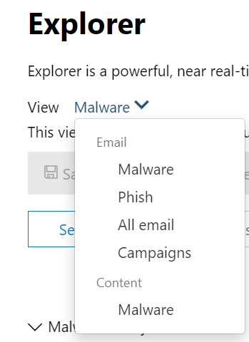

# Recherche de menaces dans l’Explorateur de menaces pour Microsoft Defender Office 365

Contenu de cet article :

- [Exploration pas à pas de l’Explorateur de menaces](#threat-explorer-walk-through)
- [Examen par courrier électronique](#email-investigation)
- [Correction de courrier électronique](#email-remediation)
- [Améliorations de l’expérience de recherche de menaces](#improvements-to-threat-hunting-experience)

> [!NOTE]
> Cela fait partie d’une série de **3** articles sur l’Explorateur de menaces **,** la sécurité du courrier électronique et les bases de détection **en** temps réel et de l’Explorateur (telles que les différences entre les outils et les autorisations nécessaires pour les exploiter). Les deux autres articles de cette série sont la sécurité de la messagerie avec [l’Explorateur](email-security-in-microsoft-defender.md) de menaces et l’Explorateur de menaces et les informations de base sur les [détections en temps réel.](real-time-detections.md)

**S’applique à**
- [Microsoft Defender pour Office 365 : offre 1 et offre 2](defender-for-office-365.md)
- [Microsoft 365 Defender](../defender/microsoft-365-defender.md)

Si votre organisation dispose de [Microsoft Defender](defender-for-office-365.md)pour Office 365 et que vous disposez des [autorisations,](#required-licenses-and-permissions)vous pouvez utiliser l’Explorateur ou les  **détections** en temps réel pour détecter et corriger les menaces. 

Dans le **portail Microsoft 365 Defender,** sélectionnez **Email & collaboration,** puis choisissez **Explorer.**

 

****

|Avec Microsoft Defender pour Office 365 Plan 2, vous pouvez voir :|Avec Microsoft Defender pour Office 365 Plan 1, vous pouvez voir :|
|---|---|
|||
|

Avec ces outils, vous pouvez :

- Consulter les programmes malveillants détectés par les fonctionnalités Microsoft 365 sécurité
- Afficher l’URL de hameçonnage et cliquer sur les données de verdict
- Démarrer un processus d’examen et de réponse automatisé à partir d’un affichage dans l’Explorateur
- Examiner les e-mails malveillants, et bien plus encore

Pour plus d’informations, [voir Sécurité du courrier électronique avec l’Explorateur de menaces.](email-security-in-microsoft-defender.md) 

## Exploration pas à pas de l’Explorateur de menaces

Dans Microsoft Defender pour Office 365, il existe deux plans d’abonnement : Plan 1 et Plan 2. Les outils de recherche de menaces gérés manuellement existent dans les deux plans, sous des noms différents et avec des fonctionnalités différentes.

Defender pour Office 365 Plan 1 utilise les détections en temps réel, qui est un *sous-ensemble* de l’outil de repérage de l’Explorateur de menaces *(également* appelé *Explorateur)* dans le Plan 2. Dans cette série d’articles, la plupart des exemples ont été créés à l’aide de l’Explorateur de menaces complet. Les administrateurs doivent tester les étapes des détections en temps réel pour voir où elles s’appliquent.

Pour ouvrir l’outil Explorer, Microsoft 365  >  **l’Explorateur** de collaboration de messagerie &  >  **portail Defender.** Par défaut, vous arrivez sur la **page** Programmes malveillants, mais utilisez la vue du bas pour vous familiariser avec vos options.  Si vous recherchez du hameçonnage ou si vous êtes en train d’entrer dans une campagne contre les menaces, choisissez ces affichages.

> [!div class="mx-imgBorder"]
> 

Une fois qu’une personne des opérations de sécurité (Sec Ops) sélectionne les données qu’elle souhaite voir, si  l’étendue est un affichage étroit comme les **soumissions** utilisateur ou une vue plus large, comme Tous les e-mails, elle peut utiliser le bouton Expéditeur pour filtrer davantage. N’oubliez pas de sélectionner Actualiser pour terminer vos actions de filtrage.

> [!div class="mx-imgBorder"]
> 

L’affinage du focus dans l’Explorateur ou la détection en temps réel peut être pensé en couches. Le premier est **View**. Le second peut être pensé comme un focus *filtré.* Par exemple, vous pouvez revenir sur les étapes que vous avez prises pour rechercher une menace en enregistrant vos décisions comme celle-ci : pour trouver le problème dans l’Explorateur, j’ai choisi l’affichage programmes malveillants avec le focus filtre **destinataire.** Cela facilite le retracage de vos étapes.

> [!TIP]
> Si Sec Ops utilise des balises pour marquer les comptes qu’ils considèrent comme cibles à valeur élevée, ils peuvent effectuer des sélections telles que l’affichage d’hameçonnage avec un focus de filtre *Tags (inclure* une plage de dates si elle est utilisée).  Cela leur montrera toutes les tentatives de hameçonnage dirigées vers leurs cibles utilisateur à valeur élevée pendant une période de temps (par exemple, les dates où certaines attaques par hameçonnage se produisent beaucoup pour leur secteur d’activité). 

Les affinements peuvent être effectués sur des plages de dates à l’aide des contrôles de plage de dates. Ici, vous pouvez voir l’Explorateur en affichage **Programmes** malveillants, avec le focus du filtre **Technologie** de détection. Mais c’est le **bouton Filtre avancé** qui permet aux équipes Sec Ops d’être approfondies. 

> [!div class="mx-imgBorder"]
> 

Le fait **de** cliquer sur le filtre avancé fait apparaître un panneau qui permet aux chercheurs sec Ops de créer eux-mêmes des requêtes, ce qui leur permet d’inclure ou d’exclure les informations dont ils ont besoin. Le graphique et le tableau de la page Explorateur reflètent leurs résultats. 

> [!div class="mx-imgBorder"]
> 

Utilisez le **bouton Options** de colonne pour obtenir le type d’informations sur le tableau qui serait le plus utile : 

> [!div class="mx-imgBorder"]
> 

> [!div class="mx-imgBorder"]
> 

Dans la même façon, veillez à tester vos options d’affichage. Différents publics réagissent bien aux différentes présentations des mêmes données. Pour certains visiteurs, **la** carte Origines du courrier électronique peut montrer qu’une menace est répandue ou discrète plus rapidement que l’option  d’affichage Campagne juste à côté. Sec Ops peut utiliser ces affichages pour mieux faire ressortir la nécessité d’une sécurité et d’une protection, ou pour une comparaison ultérieure, afin de démontrer l’efficacité de leurs actions. 

> [!div class="mx-imgBorder"]
> 

> [!div class="mx-imgBorder"]
> 

### Examen par courrier électronique

Lorsque vous voyez un e-mail suspect, cliquez sur le nom pour développer le volant sur la droite. Ici, la bannière qui permet à Sec Ops de voir la [page d’entité de](mdo-email-entity-page.md) messagerie est disponible.

La page d’entité de messagerie regroupe le contenu qui se trouve sous **Détails,** **Pièces jointes,** **Appareils,** mais inclut des données plus organisées. Cela inclut des éléments tels que les résultats DMARC, l’affichage en texte simple de l’en-tête de l’e-mail avec une option de copie, les informations de verdict sur les pièces jointes qui ont été détonées en toute sécurité et les fichiers supprimés (il peut s’agir d’adresses IP contactées et de captures d’écran de pages ou de fichiers). Les URL et leurs verdicts sont également répertoriés avec des détails similaires signalés. 

Lorsque vous atteignez cette étape, la page d’entité de messagerie sera essentielle à l’étape finale , à savoir la *correction.* 

> [!div class="mx-imgBorder"]
> 

> [!TIP]
> Pour en savoir plus sur la page d’entité de messagerie enrichie (voir ci-dessous sous l’onglet Analyse), y compris les résultats des pièces jointes détonées, les résultats pour les URL incluses et l’aperçu de courrier électronique sécurisé, cliquez [ici.](mdo-email-entity-page.md) 

> [!div class="mx-imgBorder"]
> 

### Correction de courrier électronique

Une fois qu’une personne Sec Ops détermine qu’un e-mail est une menace, l’étape suivante de détection de l’Explorateur ou en temps réel traite la menace et la remédie. Pour ce faire, vous pouvez revenir à l’Explorateur de menaces, cocher la case du message électronique à l’aide du problème et utiliser le bouton **Actions.**

> [!div class="mx-imgBorder"]
> 

Ici, l’analyste peut prendre des mesures telles que signaler le courrier comme courrier indésirable, hameçonnage ou programme malveillant, contacter des destinataires ou d’autres enquêtes qui peuvent inclure le déclenchement de manuels d’investigation et de réponse automatisées (ou AIR) (si vous avez l’offre 2). Sinon, le courrier peut également être signalé comme étant propre.

> [!div class="mx-imgBorder"]
> 

## Améliorations de l’expérience de recherche de menaces

### ID d’alerte

Lors de la navigation à partir  d’une alerte dans l’Explorateur de menaces, l’affichage est filtré par **L’ID d’alerte**. Cela s’applique également dans la détection en temps réel. Les messages pertinents pour l’alerte spécifique, ainsi qu’un total de messages électroniques (un nombre) sont affichés. Vous pourrez voir si un message faisait partie d’une alerte, ainsi que naviguer de ce message vers l’alerte associée.

Enfin, l’ID d’alerte est inclus dans l’URL, par exemple : `https://https://security.microsoft.com/viewalerts`

> [!div class="mx-imgBorder"]
> 

> [!div class="mx-imgBorder"]
> 

### Extension de la rétention et de la limite de recherche des données de l’Explorateur (et détections en temps réel) pour les clients d’essai 

Dans le cadre de cette modification, les analystes pourront rechercher et filtrer les données de courrier électronique sur une période de 30 jours (plus de sept jours) dans l’Explorateur de menaces et les détections en temps réel pour Defender pour les clients d’essai Office P1 et P2. Cela n’a aucun impact sur les clients de production pour les clients P1 et P2 E5, où la valeur par défaut de rétention est déjà de 30 jours.

### Limite d’exportation mise à jour 

Le nombre d’enregistrements d’e-mails qui peuvent être exportés à partir de l’Explorateur de menaces est désormais de 200 000 (9 990). L’ensemble des colonnes qui peuvent être exportées reste inchangé. 

### Balises dans l’Explorateur de menaces

> [!NOTE]
> La fonctionnalité de balises utilisateur est en prévisualisation et n’est peut-être pas disponible pour tout le monde. En outre, les aperçus sont sujets à modification. Pour plus d’informations sur la planification de publication, consultez la feuille de Microsoft 365 de publication.

Les balises utilisateur identifient des groupes spécifiques d’utilisateurs dans Microsoft Defender Office 365. Pour plus d’informations sur les balises, notamment la gestion des licences et la configuration, voir [Balises utilisateur.](user-tags.md)

Dans l’Explorateur de menaces, vous pouvez voir les informations sur les balises utilisateur dans les expériences suivantes.

#### Affichage Grille du courrier électronique

Lorsque les analystes voient la colonne **Balises** dans la grille de courrier, ils voient toutes les balises qui ont été appliquées aux boîtes aux lettres de l’expéditeur ou du destinataire. Par défaut, les balises système *telles que les comptes* de priorité sont affichées en premier.

> [!div class="mx-imgBorder"]
> 

#### Filtrage

Les balises peuvent être utilisées comme filtres. Recherchez parmi les comptes prioritaires uniquement ou utilisez des scénarios de balises utilisateur spécifiques de cette façon. Vous pouvez également exclure les résultats qui ont certaines balises. Combinez les balises avec d’autres filtres et plages de dates pour affiner votre portée d’examen. 

> [!div class="mx-imgBorder"]
> 

#### Flyout des détails des e-mails

Pour afficher les balises individuelles de l’expéditeur et du destinataire, sélectionnez un e-mail pour ouvrir le volant des détails du message. Sous **l’onglet Résumé,** les balises de l’expéditeur et du destinataire sont affichées séparément. Les informations relatives aux balises individuelles pour l’expéditeur et le destinataire peuvent être exportées en tant que données CSV. 

> [!div class="mx-imgBorder"]
> 

Les informations sur les balises sont également affichées dans le volant des clics d’URL. Pour le voir, consultez l’affichage Hameçonnage ou Tous les messages > **URL** ou **l’onglet Clics d’URL.** Sélectionnez un volant d’URL individuel pour afficher des détails supplémentaires sur les clics pour cette URL, y compris les balises associées à ce clic.

### Affichage de chronologie mis à jour

> [!div class="mx-imgBorder"]
> 
>
Pour en savoir plus, regardez [cette vidéo](https://www.youtube.com/watch?v=UoVzN0lYbfY&list=PL3ZTgFEc7LystRja2GnDeUFqk44k7-KXf&index=4).

## Fonctionnalités étendues

### Utilisateurs les plus ciblés

Les principales familles de programmes malveillants indiquent **les utilisateurs les plus ciblés** dans la section Programmes malveillants. Les utilisateurs les plus ciblés seront également étendus via les affichages Hameçonnage et Tous les e-mails. Les analystes pourront voir les cinq premiers utilisateurs ciblés, ainsi que le nombre de tentatives pour chaque utilisateur dans chaque affichage. 

Les opérations de sécurité peuvent exporter la liste des utilisateurs ciblés, jusqu’à une limite de 3 000, ainsi que le nombre de tentatives réalisées, pour l’analyse hors connexion pour chaque affichage de courrier électronique. En outre, la sélection du nombre de tentatives (par exemple, 13 tentatives dans l’image ci-dessous) ouvre une vue filtrée dans l’Explorateur de menaces, afin que vous pouvez voir plus de détails sur les messages électroniques et les menaces pour cet utilisateur.  

> [!div class="mx-imgBorder"]
> 

### Exchange transport

L’équipe des opérations de sécurité pourra voir toutes les règles de transport Exchange (ou règles de flux de messagerie) appliquées à un message, dans l’affichage Grille de messagerie. Sélectionnez **les options Colonne** dans la grille, puis Exchange règle de transport **à** partir des options de colonne. L Exchange des règles de transport est également visible dans le volant **Détails** de l’e-mail. 

Les noms et les GUID des règles de transport appliquées au message s’affichent. Les analystes pourront rechercher des messages à l’aide du nom de la règle de transport. Il s’agit d’une recherche CONTAINS, ce qui signifie que vous pouvez également effectuer des recherches partielles. 

> [!IMPORTANT]
> Exchange recherche de règle de transport et la disponibilité du nom dépendent du rôle spécifique qui vous est attribué. Vous devez avoir l’un des rôles ou autorisations suivants pour afficher les noms des règles de transport et la recherche. Toutefois, même sans les rôles ou autorisations ci-dessous, un analyste peut voir l’étiquette de règle de transport et les informations de GUID dans les détails de l’e-mail. Les autres expériences d’affichage d’enregistrement dans les grilles de courrier électronique, les volants de courrier électronique, les filtres et l’exportation ne sont pas affectées.
>
> - Exchange Online Uniquement - Protection contre la perte de données : tous
> - Exchange Online Uniquement - O365SupportViewConfig : Tous
> - Microsoft Azure Active Directory ou Exchange Online - Administrateur de sécurité : Tous
> - Azure Active Directory ou Exchange Online - Lecteur sécurité : Tous
> - Exchange Online Uniquement - Règles de transport : tous
> - Exchange Online Uniquement - View-Only configuration : Tous
>
> Dans la grille de courrier électronique, le volant Détails et le CSV exporté, les ETR sont présentés avec un nom/GUID, comme illustré ci-dessous.
>
> > [!div class="mx-imgBorder"]
> > 

### Connecteurs entrants

Les connecteurs sont un ensemble d’instructions qui personnalisent la façon dont vos messages électroniques circulent vers et depuis Microsoft 365 ou Office 365 organisation. Elles vous permettent d’appliquer des restrictions ou des contrôles de sécurité. Dans l’Explorateur de menaces, vous pouvez afficher les connecteurs associés à un courrier électronique et rechercher des messages électroniques à l’aide de noms de connecteur. 

La recherche de connecteurs est une requête CONTAINS, ce qui signifie que les recherches partielles par mot clé peuvent fonctionner : 

> [!div class="mx-imgBorder"]
> 

## Licences et autorisations requises

Vous devez avoir [Microsoft Defender pour que Office 365](defender-for-office-365.md) utiliser les détections d’explorateur ou en temps réel.

- L’Explorateur est inclus dans Defender pour Office 365 Plan 2.
- Le rapport détections en temps réel est inclus dans Defender pour Office 365 Plan 1.
- Prévoyez d’attribuer des licences à tous les utilisateurs qui doivent être protégés par Defender Office 365. Les détections d’explorateur et en temps réel montrent les données de détection pour les utilisateurs sous licence.

Pour afficher et utiliser les détections de l’Explorateur ou en temps réel, vous devez avoir les valeurs suivantes :

- Pour le portail Microsoft 365 Defender :

  - Gestion de l’organisation
  - Administrateur de sécurité (peut être affecté dans le centre d’administration Azure Active Directory de sécurité ( <https://aad.portal.azure.com> )
  - Lecteur de sécurité

- Pour Exchange Online :

  - Gestion de l’organisation
  - Afficher uniquement la gestion de l’organisation
  - Afficher uniquement les destinataires
  - Gestion de la conformité

Pour en savoir plus sur les rôles et les autorisations, consultez les ressources suivantes :

- [Autorisations dans le Portail Microsoft 365 Defender](permissions-in-the-security-and-compliance-center.md)
- [Autorisations des fonctionnalités dans Exchange Online](/exchange/permissions-exo/feature-permissions)
- [Exchange Online PowerShell](/powershell/exchange/exchange-online-powershell)

## Plus d’informations

- [Rechercher et d’examiner l’e-mail malveillant qui a été distribué](investigate-malicious-email-that-was-delivered.md) 
- [Afficher les fichiers malveillants détectés dans SharePoint Online, OneDrive et Microsoft Teams](mdo-for-spo-odb-and-teams.md) 
- [Obtenir une vue d’ensemble des affichages dans l’Explorateur de menaces (et détections en temps réel)](threat-explorer-views.md) 
- [Rapport sur l’état de la protection contre les menaces](view-email-security-reports.md#threat-protection-status-report) 
- [Examen et réponses automatisés dans Protection Microsoft contre les menaces](automated-investigation-response-office.md) 
- [Examiner les e-mails avec la page Entité de messagerie](mdo-email-entity-page.md)