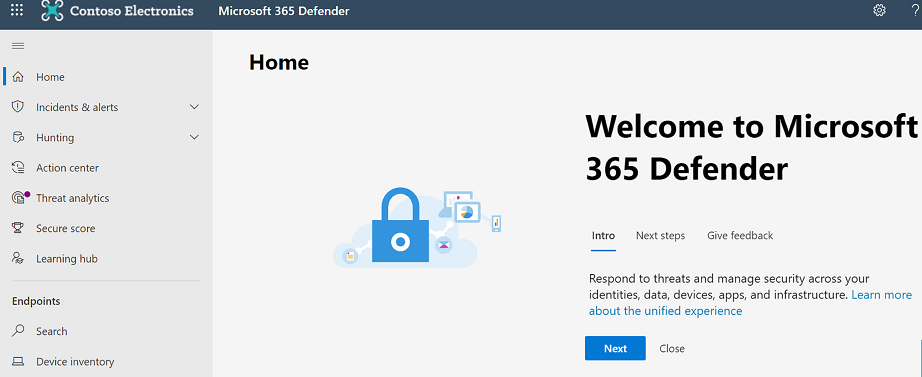

# Suivis des menaces : nouveautés et remarques

[!INCLUDE [Microsoft 365 Defender rebranding](../includes/microsoft-defender-for-office.md)]

**S’applique à**
- [Microsoft Defender pour Office 365 Plan 2](defender-for-office-365.md)
- [Microsoft 365 Defender](../defender/microsoft-365-defender.md)

[Office 365 l’examen](office-365-ti.md) des menaces et les fonctionnalités de réponse aux menaces permettent à l’équipe de sécurité de votre organisation de découvrir et de prendre des mesures contre les menaces de cybersécurité. Office 365 Les fonctionnalités d’examen et de réponse aux menaces incluent des fonctionnalités de suivi des menaces, y compris les suivis à noter. Lisez cet article pour obtenir une vue d’ensemble de ces nouvelles fonctionnalités et des étapes suivantes.

> [!IMPORTANT]
> Office 365 Threat Intelligence est désormais Microsoft Defender pour Office 365 Plan 2, ainsi que des fonctionnalités de protection contre les menaces supplémentaires. Pour en savoir plus, consultez Microsoft Defender pour [connaître Office 365 et](https://products.office.com/exchange/advance-threat-protection) les tarifs, ainsi que la description du [service Microsoft Defender Office 365 service.](/office365/servicedescriptions/office-365-advanced-threat-protection-service-description)

## Que sont les suivis des menaces ?

Les suivis des menaces sont des widgets et des vues informatifs qui vous fournissent des renseignements sur différents problèmes de cybersécurité qui peuvent avoir un impact sur votre entreprise. Par exemple, vous pouvez afficher des informations sur les tendances des campagnes anti-programme malveillant à l’aide des suivis des menaces.

La plupart des pages de suivi incluent des numéros de tendance mis à jour régulièrement, des widgets pour vous aider à comprendre les problèmes les plus importants ou les plus importants, ainsi qu’un lien rapide dans la colonne **Actions** qui vous permet d’afficher des informations plus détaillées.

Les suivis ne sont que quelques-unes des nombreuses fonctionnalités intéressantes que vous obtenez avec [Microsoft Defender pour Office 365 Plan 2.](office-365-ti.md) Les suivis des menaces incluent [des suivis notables,](#noteworthy-trackers) [des suivis](#trending-trackers)de [tendance,](#tracked-queries)des requêtes suivis et des [requêtes enregistrées.](#saved-queries)

Pour afficher et utiliser vos suivis des menaces pour votre organisation, go to the Microsoft 365 Defender portal ( <https://security.microsoft.com> ) and choose Email & **collaboration** \> **Threat Tracker**.

> [!NOTE]
> Pour utiliser les suivis des menaces, vous devez être un administrateur général, un administrateur de sécurité ou un lecteur de sécurité. Voir [Autorisations dans le portail Microsoft 365 Defender.](permissions-microsoft-365-security-center.md)

### Suivis notables

Les suivis sont là où vous trouverez des menaces et des risques de taille et de taille moindre que nous pensons que vous devriez connaître. Les suivis notables vous aident à déterminer si ces problèmes existent dans votre environnement Microsoft 365, ainsi qu’un lien vers des articles (comme celui-ci) qui vous donnent plus de détails sur ce qui se passe et comment ils auront un impact sur l’utilisation de Office 365 par votre organisation. Qu’il s’agit d’une grande nouvelle menace (par exemple, Wannacry, Petya) ou d’une menace existante qui peut créer de nouveaux défis (comme notre autre élément important - Nemucod), c’est là que vous trouverez les nouveaux éléments importants que vous et votre équipe de sécurité devez examiner et examiner régulièrement.

En règle générale, des suivis notables sont publiés pendant quelques semaines seulement lorsque nous identifions les nouvelles menaces et pensons que vous aurez peut-être besoin de la visibilité supplémentaire que fournit cette fonctionnalité. Une fois que le risque le plus élevé pour une menace est passé, nous allons supprimer cet élément à noter. De cette façon, nous pouvons maintenir la liste à jour et à jour avec d’autres nouveaux éléments pertinents.

### Suivis des tendances

Les suivis de tendance (anciennement appelés campagnes) mettent en évidence les nouvelles menaces reçues dans le courrier électronique de votre organisation au cours de la semaine précédente.

Les suivis de tendance vous donnent une idée des nouvelles menaces que vous devez examiner pour vous assurer que votre environnement d’entreprise plus large est préparé contre les attaques.

### Requêtes de suivi

Les requêtes de suivi tirent parti de vos requêtes enregistrées pour évaluer régulièrement Microsoft 365 activité au niveau de votre organisation. Cela vous donne une tendance des événements, avec d’autres informations à venir dans les mois à venir. Le suivi des requêtes s’exécute automatiquement, ce qui vous donne des informations à jour sans avoir à vous souvenir de ré-exécuter vos requêtes.

### Requêtes enregistrées

Les requêtes enregistrées se trouvent également dans la section Suivis. Vous pouvez utiliser des requêtes enregistrées pour stocker les recherches courantes dans l’Explorateur que vous souhaitez revenir plus rapidement et à plusieurs reprises, sans avoir à re-créer la recherche à chaque fois.

Vous pouvez toujours enregistrer une requête de suivi à noter  ou l’une de vos propres requêtes Explorer à l’aide du bouton Enregistrer la requête en haut de la page De l’Explorateur. Tout ce qui est enregistré s’affiche dans la liste des requêtes **enregistrées** sur la page Suivi.

## Suivis et Explorateur

Que vous examinez les activités de courrier électronique, de contenu ou de Office (bientôt disponible), l’Explorateur et les suivis fonctionnent ensemble pour vous aider à examiner et à suivre les risques et menaces de sécurité. Ensemble, les suivis vous fournissent des informations pour protéger vos utilisateurs en mettant en évidence les problèmes nouveaux, notables et fréquemment recherchés, ce qui garantit que votre entreprise est mieux protégée lors de son déplacement vers le cloud.

N’oubliez pas que vous pouvez toujours nous faire part de vos  commentaires sur cette fonctionnalité ou d’autres fonctionnalités de sécurité Microsoft 365 en cliquant sur le bouton Commentaires dans le coin inférieur droit.

## Suivis et Microsoft Defender pour Office 365

Avec notre menace importante, nous allons mettre en évidence les menaces de programmes malveillants avancées détectées [par Coffre pièces jointes](safe-attachments.md). Si vous êtes un client E5 Office 365 Entreprise et que vous n’utilisez pas [Microsoft Defender](defender-for-office-365.md)pour Office 365 , vous devez l’être : il est inclus dans votre abonnement. Defender for Office 365 est une valeur ajoutée même si vous disposez d’autres outils de sécurité qui filtrent le flux de messagerie avec vos services Office 365 de sécurité. Toutefois, les  fonctionnalités de liens de Coffre et de courrier indésirable fonctionnent mieux lorsque votre solution de sécurité de messagerie principale est Office 365.

Dans le monde actuel aux menaces, l’exécution des analyses anti-programme malveillant traditionnelles uniquement signifie que vous n’êtes pas suffisamment protégé contre les attaques. Aujourd’hui, les attaquants plus sophistiqués utilisent des outils couramment disponibles pour créer des attaques nouvelles, obscurcies ou retardées qui ne seront pas reconnues par les moteurs anti-programme malveillant basés sur les signatures traditionnels. La fonctionnalité Coffre pièces jointes prend les pièces jointes des e-mails et les détone dans un environnement virtuel pour déterminer s’ils sont sûrs ou malveillants. Ce processus de détonation ouvre chaque fichier dans un environnement d’ordinateur virtuel, puis surveille ce qui se produit après l’ouverture du fichier. Qu’il s’agit d’un fichier PDF et compressé, ou d’un document Office, du code malveillant peut être masqué dans un fichier, en l’activant uniquement une fois que la victime l’ouvre sur son ordinateur. En détonant et en analysant le fichier dans le flux de messagerie, les fonctionnalités de Defender for Office 365 trouvent ces menaces en fonction des comportements, de la réputation des fichiers et d’un certain nombre de règles heuristiques.

Le nouveau filtre contre les menaces à noter met en évidence les éléments qui ont été récemment détectés Coffre pièces jointes. Ces détections représentent des éléments qui sont de nouveaux fichiers malveillants, non trouvés précédemment par les Microsoft 365 dans votre flux de messagerie ou dans les e-mails d’autres clients. Faites attention aux éléments du suivi des menaces à prendre en compte, consultez les personnes ciblées par ces derniers et consultez les détails de détonation affichés sous l’onglet Analyse avancée (en cliquant sur l’objet de l’e-mail dans l’Explorateur). Notez que vous trouverez cet onglet uniquement sur les e-mails détectés par la fonctionnalité pièces jointes Coffre . Ce suivi important inclut ce filtre, mais vous pouvez également utiliser ce filtre pour d’autres recherches dans l’Explorateur.

## Étapes suivantes

- Si votre organisation ne Office 365 pas ces fonctionnalités d’investigation et de réponse aux menaces, voir comment obtenir Office 365 fonctionnalités d’investigation et de réponse aux [menaces ?](office-365-ti.md)

- Assurez-vous que les rôles et autorisations corrects sont attribués à votre équipe de sécurité. Vous devez être un administrateur général ou avoir le rôle Administrateur de la sécurité ou Rechercher et vider dans le portail Microsoft 365 Defender web. Voir [Autorisations dans le portail Microsoft 365 Defender.](permissions-microsoft-365-security-center.md)

- Observez les nouveaux suivis à afficher dans votre environnement Microsoft 365 de suivi. Si disponible, vous trouverez vos suivis [ici.](https://https://security.microsoft.com/) Go to **Email & collaboration** Threat \> **Tracker**.

- Si vous ne l’avez pas déjà fait, découvrez et configurez Microsoft Defender  pour [Office 365](defender-for-office-365.md) pour votre organisation, notamment les liens Coffre et les pièces [jointes Coffre.](safe-attachments.md)
