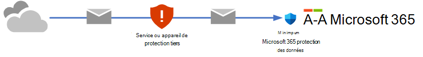
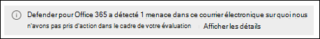

# Essayer Microsoft Defender pour Office 365

> [!NOTE]
> La fonctionnalité décrite par cet article est en préversion, n’est pas disponible dans toutes les organisations et est susceptible de changer.

Le portail **d’essais** unifiés dans le portail Microsoft 365 Defender fournit un point d’entrée unique pour les expériences d’évaluation et d’évaluation précédemment distinctes pour Microsoft Defender pour Office 365. L’objectif est de vous permettre d’essayer les fonctionnalités de Defender pour Office 365 Plan 2 pendant 90 jours avant de vous y engager pleinement. Toutefois, il existe des différences dans les expériences d’évaluation en fonction de la nature de votre organisation Microsoft 365 :

- Vous avez déjà Microsoft 365 boîtes aux lettres, mais vous utilisez actuellement un service ou un appareil tiers pour la protection par e-mail. Le courrier provenant d’Internet transite par le service de protection avant la remise dans votre organisation Microsoft 365. Microsoft 365 protection est aussi faible que possible (elle n’est jamais complètement désactivée ; par exemple, la protection contre les programmes malveillants est toujours appliquée).

  

  Dans ces environnements, vous pouvez uniquement essayer Defender pour Office 365 en mode *audit*. Vous n’avez pas besoin de modifier votre flux de courrier (enregistrements MX) pour essayer Defender pour Office 365.

- Vous avez déjà une organisation Microsoft 365. Le courrier provenant d’Internet circule directement Microsoft 365, mais votre abonnement actuel n’a que [Exchange Online Protection (EOP)](exchange-online-protection-overview.md) ou [Defender pour Office 365 Plan 1](overview.md#microsoft-defender-for-office-365-plan-1-vs-plan-2-cheat-sheet).

  

  Dans ces environnements, vous pouvez essayer Defender pour Office 365 en mode *audit* ou en *mode de blocage*.

Vous êtes invité à démarrer votre version d’évaluation dans différents emplacements de fonctionnalités Defender pour Office 365 dans le portail Microsoft 365 Defender à l’adresse <https://security.microsoft.com>. L’emplacement centralisé pour démarrer votre version d’évaluation se trouve sur la page **Essais** à l’adresse <https://security.microsoft.com/atpEvaluation>.

Le reste de cet article explique la différence entre le mode de blocage du mode audit, la configuration des évaluations et d’autres détails.

## Vue d’ensemble de Defender pour Office 365

Defender pour Office 365 aide les organisations à sécuriser leur entreprise en offrant une gamme complète de fonctionnalités. Pour plus d’informations, consultez [Microsoft Defender pour Office 365](defender-for-office-365.md).

Vous pouvez également en savoir plus sur Defender pour Office 365 dans ce [guide interactif](https://aka.ms/MS365D.InteractiveGuide).

## Stratégies en mode de blocage ou en mode audit

Lorsque vous évaluez Defender pour Office 365, les stratégies qui contrôlent les fonctionnalités de protection dans Microsoft 365 sont présentes :

- **Exchange Online Protection (EOP)** : aucune stratégie nouvelle ou spéciale n’est créée. Les stratégies EOP existantes sont en mesure d’agir sur les messages (par exemple, envoyer des messages au dossier Courrier indésirable ou mettre en quarantaine) :

  - [Stratégies anti-programme malveillant](anti-malware-protection.md)
  - [Protection anti-courrier indésirable entrante](anti-spam-protection.md)
  - [Protection contre l’usurpation d’identité dans les stratégies anti-hameçonnage](set-up-anti-phishing-policies.md#spoof-settings)

  Les stratégies par défaut pour ces fonctionnalités sont toujours activées, s’appliquent à tous les destinataires et sont toujours appliquées en dernier (après toutes les stratégies personnalisées).

- **Defender pour Office 365** : Des stratégies exclusives aux Defender pour Office 365 sont créées pour votre évaluation des Defender pour Office 365 :

  - [Protection contre l’emprunt d’identité dans les stratégies anti-hameçonnage](set-up-anti-phishing-policies.md#impersonation-settings-in-anti-phishing-policies-in-microsoft-defender-for-office-365)
  - [Coffre pièces jointes pour les e-mails](safe-attachments.md)
  - [liens Coffre pour les e-mails et les Microsoft Teams](safe-links.md)

  Toutefois, la nature de ces stratégies est différente en mode de blocage et en mode audit :

  - **Mode Audit** : des stratégies régulières sont créées, mais les stratégies sont configurées uniquement pour *détecter les* menaces. Defender pour Office 365 détecte les messages dangereux à signaler, mais les messages ne sont pas traités (par exemple, les messages détectés ne sont pas mis en quarantaine).

  - **Mode de blocage** : les stratégies sont créées à l’aide du modèle Standard pour les [stratégies de sécurité prédéfinies](preset-security-policies.md). Defender pour Office 365 détecte et *prend des mesures sur* *les* messages dangereux (par exemple, les messages détectés sont mis en quarantaine).

  La sélection par défaut et recommandée consiste à étendre ces stratégies Defender pour Office 365 à tous les utilisateurs de l’organisation. Toutefois, pendant ou après l’installation, vous pouvez modifier l’attribution de stratégie en utilisateurs, groupes ou domaines de messagerie spécifiques.

**Remarques** :

- Coffre Liens détonera les URL dans le flux de courrier. Pour empêcher le détonation d’URL spécifiques, utilisez la liste d’autorisations/de blocs du locataire. Pour plus d’informations, consultez [Gérer la liste verte/bloquée du locataire](tenant-allow-block-list.md).
- Coffre Liens n’encapsule pas les liens d’URL dans les corps des messages électroniques.
- Les paramètres de stratégie d’évaluation sont décrits dans la section [Paramètres de stratégie d’évaluation](#evaluation-policy-settings) plus loin dans cet article.

## Configurer une évaluation en mode audit

1. Cliquez sur **Démarrer l’évaluation**.

2. Dans la boîte de dialogue **Activer la protection** , sélectionnez **Non, je veux uniquement créer des rapports**, puis cliquez sur **Continuer**.

3. Dans la boîte de dialogue **Sélectionner les utilisateurs que vous souhaitez inclure** , configurez les paramètres suivants :

   - **Tous les utilisateurs** : il s’agit de l’option par défaut et recommandée.
   - **Sélectionner des utilisateurs** : si vous sélectionnez cette option, vous devez sélectionner les destinataires internes auxquels l’évaluation s’applique :
     - **Utilisateurs** : boîtes aux lettres, utilisateurs de messagerie ou contacts de messagerie spécifiés.
     - **Groupes** :
       - Membres des groupes de distribution spécifiés ou des groupes de sécurité à extension messagerie.
       - Groupes Microsoft 365 spécifiée.
       - **Domaines** : tous les destinataires des [domaines acceptés](/exchange/mail-flow-best-practices/manage-accepted-domains/manage-accepted-domains) spécifiés dans votre organisation.

     Cliquez dans la zone appropriée, commencez à taper une valeur et sélectionnez la valeur souhaitée dans les résultats. Répétez cette opération autant de fois que nécessaire. Pour supprimer une valeur existante, cliquez sur Supprimer  en regard de la valeur.

     Pour les utilisateurs ou les groupes, vous pouvez utiliser la plupart des identifiants (nom, nom d'affichage, alias, adresse e-mail, nom de compte, etc.), mais le nom d'affichage correspondant est affiché dans les résultats. Pour les utilisateurs, entrez un astérisque (\*) seul pour voir toutes les valeurs disponibles.

   > [!NOTE]
   > Vous pouvez modifier ces sélections une fois que vous avez terminé la configuration de l’évaluation.

   Lorsque vous avez terminé, cliquez sur **Continuer**.

4. Dans la boîte de **dialogue Aide-nous à comprendre votre flux de courrier** , configurez les options suivantes :

   - **Partager des données avec Microsoft** : cette option est sélectionnée par défaut, mais vous pouvez désactiver la case à cocher si vous le souhaitez.

   - L’une des options suivantes est automatiquement sélectionnée en fonction de notre détection de l’enregistrement MX pour votre domaine :

     - **J’utilise un fournisseur de services tiers et/ou local** : l’enregistrement MX pour vos points de domaine ailleurs que Microsoft 365. Cette sélection nécessite les paramètres supplémentaires suivants après avoir cliqué sur **Suivant** :

       1. Dans la boîte **de dialogue Paramètres tiers ou locaux** , configurez les paramètres suivants :

          - **Sélectionnez un fournisseur de services tiers** : sélectionnez l’une des valeurs suivantes :
            - **Barracuda**
            - **Ironport**
            - **Mimecast**
            - **Proofpoint**
            - **Sophos**
            - **Symantec**
            - **Trend Micro**
            - **Other**

          - **Connecteur auquel appliquer cette évaluation** : sélectionnez le connecteur utilisé pour le flux de messagerie dans Microsoft 365.

            [Le filtrage amélioré pour les connecteurs](/exchange/mail-flow-best-practices/use-connectors-to-configure-mail-flow/enhanced-filtering-for-connectors) (également appelé *liste d’ignorer*) est automatiquement configuré sur le connecteur que vous spécifiez.

            Lorsqu’un service ou un appareil tiers se trouve à partir de Microsoft 365, le filtrage amélioré pour connecteurs identifie correctement la source des messages Internet et améliore considérablement la précision de la pile de filtrage Microsoft (en particulier [l’usurpation d’identité](anti-spoofing-protection.md), ainsi que les fonctionnalités de post-violation dans [l’Explorateur de menaces](threat-explorer.md) et la [réponse AIR (Automated Investigation & Response).](automated-investigation-response-office.md)

          - **Répertoriez chaque adresse IP de passerelle transmise par vos messages** : ce paramètre n’est disponible que si vous avez sélectionné **Autre** pour **sélectionner un fournisseur de services tiers**. Entrez une liste séparée par des virgules des adresses IP utilisées par le service ou l’appareil de protection tiers pour envoyer des messages dans Microsoft 365.

          Lorsque vous avez terminé, cliquez sur **Suivant**.

       2. Dans la **boîte de dialogue Exchange règles de flux de courrier**, déterminez si vous avez besoin d’une règle de flux de messagerie Exchange Online (également appelée règle de transport) qui ignore le filtrage du courrier indésirable pour les messages entrants à partir du service ou de l’appareil de protection tiers.

          Il est probable que vous ayez déjà une règle de flux de messagerie SCL=-1 dans Exchange Online qui permet à tous les messages entrants du service de protection de contourner (la plupart) Microsoft 365 filtrage. De nombreux services de protection encouragent cette méthode de règle de flux de courrier de niveau de confiance du courrier indésirable (SCL) pour Microsoft 365 clients qui utilisent leurs services.

          Comme expliqué à l’étape précédente, le filtrage amélioré pour les connecteurs est automatiquement configuré sur le connecteur que vous spécifiez comme source de courrier du service de protection.

          L’activation du filtrage amélioré pour les connecteurs sans règle SCL=-1 pour les messages entrants provenant du service de protection améliore considérablement les fonctionnalités de détection des fonctionnalités de protection EOP, telles que [l’usurpation](anti-spoofing-protection.md) d’identité, et peut avoir un impact sur la remise de ces messages nouvellement détectés (par exemple, déplacer vers le dossier Courrier indésirable ou mettre en quarantaine). Cet impact est limité aux stratégies EOP ; comme expliqué précédemment, Defender pour Office 365 stratégies sont créées en mode audit.

          Pour créer une règle de flux de messagerie SCL=-1 ou pour passer en revue vos règles existantes, cliquez sur le bouton **Atteindre Exchange centre d’administration** sur la page. Pour plus d’informations, consultez [Utiliser des règles de flux de courrier pour définir le niveau de confiance du courrier indésirable dans les messages dans Exchange Online](/exchange/security-and-compliance/mail-flow-rules/use-rules-to-set-scl).

          Lorsque vous avez terminé, cliquez sur **Terminer**.

     - **J’utilise uniquement Microsoft Exchange Online** : les enregistrements MX de votre domaine pointent vers Microsoft 365. Il n’y a plus rien à configurer, alors cliquez sur **Terminer**.

5. Une boîte de dialogue de progression s’affiche lors de la configuration de votre évaluation. Une fois la configuration terminée, cliquez sur **Terminé**.

## Configurer une évaluation en mode de blocage

1. Cliquez sur **Démarrer l’évaluation**.

2. Dans la boîte de dialogue **Activer la protection** , sélectionnez **Oui, protégez mon organisation en bloquant les menaces**, puis cliquez sur **Continuer**.

3. Dans la boîte de dialogue **Sélectionner les utilisateurs que vous souhaitez inclure** , configurez les paramètres suivants :

   - **Tous les utilisateurs** : il s’agit de l’option par défaut et recommandée.
   - **Sélectionner des utilisateurs** : si vous sélectionnez cette option, vous devez sélectionner les destinataires internes auxquels l’évaluation s’applique :
     - **Utilisateurs** : boîtes aux lettres, utilisateurs de messagerie ou contacts de messagerie spécifiés.
     - **Groupes** :
       - Membres des groupes de distribution spécifiés ou des groupes de sécurité à extension messagerie.
       - Groupes Microsoft 365 spécifiée.
     - **Domaines** : tous les destinataires des [domaines acceptés](/exchange/mail-flow-best-practices/manage-accepted-domains/manage-accepted-domains) spécifiés dans votre organisation.

     Cliquez dans la zone appropriée, commencez à taper une valeur et sélectionnez la valeur souhaitée dans les résultats. Répétez cette opération autant de fois que nécessaire. Pour supprimer une valeur existante, cliquez sur Supprimer  en regard de la valeur.

     Pour les utilisateurs ou les groupes, vous pouvez utiliser la plupart des identifiants (nom, nom d'affichage, alias, adresse e-mail, nom de compte, etc.), mais le nom d'affichage correspondant est affiché dans les résultats. Pour les utilisateurs, entrez un astérisque (\*) seul pour voir toutes les valeurs disponibles.

   > [!NOTE]
   > Vous pouvez modifier ces sélections une fois que vous avez terminé la configuration de l’évaluation.

   Lorsque vous avez terminé, cliquez sur **Continuer**.

4. Une boîte de dialogue de progression s’affiche lors de la configuration de votre évaluation. Une fois l’installation terminée, cliquez sur **Terminé**.

## Création de rapports en mode audit

- Le [rapport d’état de la protection contre les menaces](view-email-security-reports.md#threat-protection-status-report) affiche les détections par Defender pour Office 365 dans les vues suivantes :
  - [Afficher les données par programme malveillant par courrier électronique \> et répartition des graphiques par technologie de détection](view-email-security-reports.md#view-data-by-email--malware-and-chart-breakdown-by-detection-technology)
  - [Afficher les données par hameçonnage par e-mail \> et répartition du graphique par technologie de détection](view-email-security-reports.md#view-data-by-email--phish-and-chart-breakdown-by-detection-technology)

- Dans [l’Explorateur de menaces](threat-explorer.md), les messages détectés par l’évaluation Defender pour Office 365 affichent la bannière suivante dans les détails de l’entrée :

  

<!--- This stuff is likely not applicable for V2 reporting --->

La **page d’évaluation Microsoft Defender pour Office 365** à <https://security.microsoft.com/atpEvaluation> consolider les rapports pour les stratégies dans l’évaluation :

- Protection contre l’emprunt d’identité dans les stratégies anti-hameçonnage
- Liens sûrs
- Pièces jointes fiables

Par défaut, les graphiques affichent les données des 30 derniers jours, mais vous pouvez filtrer la plage de dates en cliquant sur l’icône  **30 jours** et sélection parmi les valeurs supplémentaires suivantes inférieures à 30 jours :

- 24 heures
- 7 jours
- 14 jours
- Plage de dates personnalisée

Vous pouvez cliquer sur l’icône  **Téléchargez** pour télécharger les données du graphique dans un fichier .csv.

## Autorisations requises

Les autorisations requises dans **Azure AD** pour configurer une évaluation de Defender pour Microsoft 365 sont décrites dans la liste suivante :

- **Créez, modifiez ou supprimez une évaluation** : Administrateur de sécurité ou Administrateur général.
- **Afficher les stratégies d’évaluation et les rapports** : Administrateur de sécurité ou Lecteur Sécurité.

Pour plus d’informations sur les autorisations Azure AD dans le portail Microsoft 365 Defender, consultez [Azure AD rôles dans le portail Microsoft 365 Defender](permissions-microsoft-365-security-center.md#azure-ad-roles-in-the-microsoft-365-defender-portal)

## Paramètres de stratégie d’évaluation

Les paramètres du Defender pour Office 365 créés spécifiquement pour l’évaluation sont décrits dans les tableaux suivants :

**Paramètres de stratégie d’évaluation anti-hameçonnage** :

|Paramètre|Valeur|
|---|---|
|AdminDisplayName|Stratégie d’évaluation|
|AuthenticationFailAction|MoveToJmf|
|Activé|Vrai|
|EnableFirstContactSafetyTips|Faux|
|EnableMailboxIntelligence|Vrai|
|EnableMailboxIntelligenceProtection|Vrai|
|EnableOrganizationDomainsProtection|Faux|
|EnableSimilarDomainsSafetyTips|False|
|EnableSimilarUsersSafetyTips|Faux|
|EnableSpoofIntelligence|Vrai|
|EnableSuspiciousSafetyTip|False|
|EnableTargetedDomainsProtection|False|
|EnableTargetedUserProtection|False|
|EnableUnauthenticatedSender|Vrai|
|EnableUnusualCharactersSafetyTips|Faux|
|EnableViaTag|Vrai|
|Guid|Valeur GUID|
|ImpersonationProtectionState|Manual|
|IsDefault|Faux|
|MailboxIntelligenceProtectionAction|NoAction|
|MailboxIntelligenceProtectionActionRecipients|{}|
|MailboxIntelligenceQuarantineTag|DefaultFullAccessPolicy|
|Nom|Stratégie d’évaluation|
|PhishThresholdLevel|1|
|RecommendedPolicyType|Évaluation|
|SpoofQuarantineTag|DefaultFullAccessPolicy|
|TargetedDomainActionRecipients|{}|
|TargetedDomainProtectionAction|NoAction|
|TargetedDomainQuarantineTag|DefaultFullAccessPolicy|
|TargetedUserActionRecipients|{}|
|TargetedUserProtectionAction|NoAction|
|TargetedUserQuarantineTag|DefaultFullAccessPolicy|
|||
|AntiPhishPolicyLevelDataList|Blanc|
|AntiSpoofEnforcementType|Élevé|
|AuthenticationSafetyTipText|Blanc|
|AuthenticationSoftPassSafetyTipText|Blanc|
|EnableAuthenticationSafetyTip|Faux|
|EnableAuthenticationSoftPassSafetyTip|False|
|PolicyTag|Blanc|
|SimilarUsersSafetyTipsCustomText|Blanc|
|TreatSoftPassAsAuthenticated|Vrai|
|UnusualCharactersSafetyTipsCustomText|Blanc|
|||
|ExcludedDomains|{}|
|ExcludedSenders|{}|
|TargetedDomainsToProtect|{}|
|TargetedUsersToProtect|{}|

**Coffre paramètres de stratégie d’évaluation des pièces jointes** :

|Paramètre|Valeur|
|---|---|
|Action|Autoriser|
|ActionOnError|Vrai|
|AdminDisplayName|Stratégie d’évaluation|
|ConfidenceLevelThreshold|80|
|Activer|Vrai|
|EnableOrganizationBranding|Faux|
|Guid|Valeur GUID|
|IsBuiltInProtection|False|
|IsDefault|False|
|Nom|Stratégie d’évaluation|
|OperationMode|Delay|
|QuarantineTag|AdminOnlyAccessPolicy|
|RecommendedPolicyType|Évaluation|
|Rediriger|Faux|
|RedirectAddress|{}|
|ScanTimeout|30|

**Coffre les paramètres de stratégie d’évaluation des liens** :

|Paramètre|Valeur|
|---|---|
|AdminDisplayName|Stratégie d’évaluation|
|AllowClickThrough|False|
|CustomNotificationText|Blanc|
|DeliverMessageAfterScan|Vrai|
|DisableUrlRewrite|Vrai|
|DoNotRewriteUrls|{}|
|EnableForInternalSenders|Faux|
|EnableOrganizationBranding|Faux|
|EnableSafeLinksForTeams|Vrai|
|Guid|Valeur GUID|
|IsBuiltInProtection|False|
|IsDefault|False|
|IsEnabled|Vrai|
|LocalizedNotificationTextList|{}|
|Nom|« EvaluationPolicy »|
|RecommendedPolicyType|Évaluation|
|ScanUrls|Vrai|
|TrackClicks|Vrai|
|||
|DoNotAllowClickThrough|Blanc|
|DoNotTrackUserClicks|False|
|EnableSafeLinksForEmail|Vrai|
|EnableSafeLinksForOffice|Vrai|
|ExcludedUrls|{}|
|WhiteListedUrls|Blanc|
