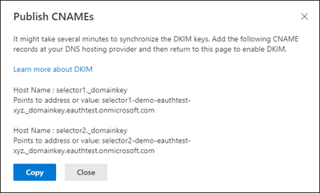
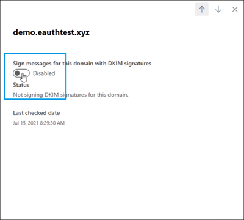

# <a name="use-dkim-to-validate-outbound-email-sent-from-your-custom-domain"></a>Utilisation de DKIM pour valider les messages sortants envoyés à partir de votre domaine personnalisé

[!INCLUDE [Microsoft 365 Defender rebranding](../includes/microsoft-defender-for-office.md)]

**S’applique à**
- [Exchange Online Protection](exchange-online-protection-overview.md)
- [Microsoft Defender pour Office 365 : offre 1 et offre 2](defender-for-office-365.md)
- [Microsoft 365 Defender](../defender/microsoft-365-defender.md)

 Cet article répertorie les étapes de l’utilisation de DomainKeys Identified Mail (DKIM) avec Microsoft 365 pour vous assurer que les systèmes d’e-mail de destination approuvent les messages sortants envoyés à partir de votre domaine personnalisé.

Contenu de cet article :

- [Pourquoi DKIM est plus efficace que SPF seul pour empêcher l’usurpation d’identité malveillante](#how-dkim-works-better-than-spf-alone-to-prevent-malicious-spoofing)
- [Étapes pour Créer, activer et désactiver DKIM à partir du portail Microsoft 365 Defender](#steps-to-create-enable-and-disable-dkim-from-microsoft-365-defender-portal)
- [Procédure de mise à niveau manuelle de vos clés 1024 bits vers les clés de chiffrement DKIM 2048 bits](#steps-to-manually-upgrade-your-1024-bit-keys-to-2048-bit-dkim-encryption-keys)
- [Étapes de la configuration manuelle de DKIM](#steps-to-manually-set-up-dkim)
- [Étapes de configuration de DKIM pour plusieurs domaines personnalisés](#to-configure-dkim-for-more-than-one-custom-domain)
- [Désactivation de la stratégie de signature DKIM pour un domaine personnalisé](#disabling-the-dkim-signing-policy-for-a-custom-domain)
- [Comportement par défaut pour DKIM et Microsoft 365](#default-behavior-for-dkim-and-microsoft-365)
- Configuration de DKIM permettant à un service tiers d’envoyer des courriers électroniques au nom de votre domaine personnalisé, ou d’usurper ce dernier
- [Étapes suivantes : après avoir configuré DKIM pour Microsoft 365](#next-steps-after-you-set-up-dkim-for-microsoft-365)

> [!NOTE]
> Microsoft 365 configure automatiquement DKIM pour les domaines initiaux 'onmicrosoft.com'. Cela signifie que vous n’avez rien à faire pour configurer DKIM pour les noms de domaine initial (par exemple, litware.onmicrosoft.com). Pour plus d'informations sur les domaines, consultez l'article [Forum aux questions sur les domaines](../../admin/setup/domains-faq.yml#why-do-i-have-an--onmicrosoft-com--domain).

DKIM fait partie du trio de méthodes d'authentification (SPF, DKIM et DMARC) qui permet d'empêcher les attaquants d'envoyer des messages qui semblent provenir de votre domaine.

DKIM vous permet d'ajouter une signature numérique aux e-mails sortants dans l'en-tête du message. Lorsque vous configurez DKIM, vous autorisez votre domaine à associer son nom à un courrier ou à l’y signer à l'aide d'une authentification de chiffrement. Les systèmes de messagerie qui reçoivent des e-mails de votre domaine peuvent utiliser cette signature numérique pour déterminer si le courrier entrant est légitime.

À la base, une clé privée chiffre l’en-tête dans le courrier sortant d’un domaine. La clé publique est publiée dans les enregistrements DNS, et les serveurs de réception peuvent utiliser cette clé pour décoder la signature. La vérification DKIM permet aux serveurs de réception de confirmer que les courriers viennent vraiment de votre domaine et non d’une personne *usurpant* votre domaine.

> [!TIP]
>Vous pouvez également choisir de n'effectuer aucun réglage DKIM pour votre domaine personnalisé. Si vous ne configurez pas DKIM pour votre domaine personnalisé, Microsoft 365 crée une paire de clés privée et publique, active la signature DKIM, et configure la stratégie par défaut de Microsoft 365 pour votre domaine personnalisé.

 La configuration DKIM intégrée de Microsoft 365 est une couverture suffisante pour la plupart des clients. Cependant, vous devez configurer manuellement DKIM pour votre domaine personnalisé dans ces circonstances :

- Vous avez plusieurs domaines personnalisés dans Microsoft 365
- Vous allez également configurer DMARC (**recommandé**)
- Vous souhaitez contrôler votre clé privée
- Vous souhaitez personnaliser vos enregistrements CNAME
- Vous souhaitez configurer des clés DKIM pour les e-mails provenant d’un domaine tiers, par exemple, si vous utilisez un programme d’envoi de courrier en nombre tiers.

## <a name="how-dkim-works-better-than-spf-alone-to-prevent-malicious-spoofing"></a>Pourquoi DKIM est plus efficace que SPF seul pour empêcher l’usurpation d’identité malveillante
<a name="HowDKIMWorks"> </a>

SPF ajoute des informations à une enveloppe de message, mais DKIM *chiffre* une signature dans l’en-tête du message. Lorsque vous transférez un message, des parties de l’enveloppe de ce message peuvent être supprimées par le serveur de transfert. Étant donné que la signature numérique reste avec le message électronique, car elle fait partie de l’en-tête de l’e-mail, DKIM fonctionne même lorsqu’un message a été transféré, comme indiqué dans l’exemple suivant.


Dans cet exemple, si vous aviez publié un seul enregistrement SPF TXT pour votre domaine, le serveur de courrier destinataire pourrait avoir marqué vos e-mails comme courriers indésirables et généré un résultat faux positif. **L’ajout de DKIM dans ce scénario réduit *le signalement de courrier indésirable* faux positif**. Étant donné que DKIM repose à la fois sur le chiffrement de la clé publique et non les adresses IP uniquement pour l’authentification, DKIM représente une forme d’authentification beaucoup plus puissante que SPF. Nous vous recommandons d’utiliser à la fois SPF et DKIM, ainsi que DMARC dans votre déploiement.

> [!TIP]
> DKIM utilise une clé privée pour insérer une signature chiffrée dans les en-têtes de message. Le domaine de signature, ou domaine sortant, est inséré comme valeur du champ **d=** dans l’en-tête. Le domaine de vérification ou le domaine du destinataire utilise ensuite le champ **d=** pour rechercher la clé publique à partir du DNS et authentifier le message. Si le message est vérifié, la vérification DKIM réussit.

## <a name="steps-to-create-enable-and-disable-dkim-from-microsoft-365-defender-portal"></a>Étapes de création, d’activation et de désactivation de DKIM à partir du Portail Microsoft 365 Defender

Tous les domaines acceptés de votre client s’affichent dans le Portail Microsoft 365 Defender sous la page DKIM. Si vous ne le voyez pas, ajoutez votre domaine accepté à partir de la [page domaines](/microsoft-365/admin/setup/add-domain#add-a-domain).
Une fois votre domaine ajouté, suivez les étapes ci-dessous pour configurer DKIM.

Étape 1 : cliquer sur le domaine sur lequel vous souhaitez configurer DKIM sur la page DKIM (https://security.microsoft.com/dkimv2 ou https://protection.office.com/dkimv2)).


Étape 2 : cliquer sur Créer des clés DKIM.


Étape 3 : copier le CNAMES affiché dans la fenêtre contextuelle



Étape 4 : publier les enregistrements CNAME copiés sur votre fournisseur de services DNS.

Sur le site web de votre fournisseur DNS, ajoutez des enregistrements CNAME pour DKIM que vous souhaitez activer. Dans le nouvel enregistrement, vérifiez que chacun des champs sont définis par les valeurs suivantes :

```text
Record Type: CNAME (Alias)
> Host: Paste the values you copy from DKIM page.
Points to address: Copy the value from DKIM page.
TTL: 3600 (or your provider default)
```

Étape 5 : revenir à la page DKIM pour activer DKIM.



Si vous voyez l'erreur L’enregistrement CNAME n'existe pas, cela peut être dû à :

1. Synchronisation avec le serveur DNS, ce qui peut prendre quelques secondes à quelques heures, si le problème persiste répétez les étapes
2. Recherchez les erreurs de copier-coller, telles que l’espace supplémentaire ou les onglets, etc.

Si vous souhaitez désactiver DKIM, basculez vers le mode Désactiver

## <a name="steps-to-manually-upgrade-your-1024-bit-keys-to-2048-bit-dkim-encryption-keys"></a>Mise à niveau manuelle de vos clés 1024 bits vers les clés de chiffrement DKIM 2048 bits
<a name="1024to2048DKIM"> </a>

> [!NOTE]
> Microsoft 365 configure automatiquement DKIM pour les domaines *onmicrosoft.com*. Aucune étape n’est nécessaire pour utiliser DKIM pour les noms de domaine initiaux (par exemple, litware.*onmicrosoft.com*). Pour plus d'informations sur les domaines, consultez l'article [Forum aux questions sur les domaines](../../admin/setup/domains-faq.yml#why-do-i-have-an--onmicrosoft-com--domain).

Étant donné que le nombre de bits 1024 et 2048 sont pris en charge pour les clés DKIM, ces instructions vous indiquent comment mettre à niveau votre clé 1024 bits vers 2048 dans [Exchange Online PowerShell](/powershell/exchange/connect-to-exchange-online-powershell). Les étapes ci-dessous concernent deux cas d’utilisation ; veuillez choisir celui qui correspond le mieux à votre configuration.

- Lorsque vous **avez déjà configuré DKIM**, vous pouvez faire pivoter le nombre de bits en exécutant la commande suivante :

  ```powershell
  Rotate-DkimSigningConfig -KeySize 2048 -Identity {Guid of the existing Signing Config}
  ```

  **ou**

- Pour une **nouvelle implémentation de la fonctionnalité DKIM**, exécutez la commande suivante :

  ```powershell
  New-DkimSigningConfig -DomainName <Domain for which config is to be created> -KeySize 2048 -Enabled $true
  ```

Restez connecté à Exchange Online PowerShell pour *vérifier* la configuration en exécutant la commande suivante :

```powershell
Get-DkimSigningConfig -Identity <Domain for which the configuration was set> | Format-List
```

> [!TIP]
> Cette nouvelle clé 2048 bits prend effet sur RotateOnDate et envoie des e-mails avec la clé 1024 bits au niveau intermédiaire. Après quatre jours, vous pouvez à nouveau effectuer un test à l’aide de la touche 2048 bits (autrement dit, une fois que la rotation prend effet sur le deuxième sélecteur).

Si vous souhaitez faire pivoter vers le deuxième sélecteur, après quatre jours et confirmer que le nombre de bits 2048 est en cours d’utilisation, faites pivoter manuellement la deuxième clé de sélecteur à l’aide de l’applet de commande appropriée répertoriée ci-dessus.

Pour obtenir des informations détaillées sur la syntaxe et les paramètres, consultez les articles suivants : [Rotate-DkimSigningConfig](/powershell/module/exchange/rotate-dkimsigningconfig), [New-DkimSigningConfig](/powershell/module/exchange/new-dkimsigningconfig)et [Get-DkimSigningConfig](/powershell/module/exchange/get-dkimsigningconfig).

## <a name="steps-to-manually-set-up-dkim"></a>Étapes de la configuration manuelle de DKIM
<a name="SetUpDKIMO365"> </a>

Pour configurer DKIM, suivez les étapes ci-dessous :

- [Publication de deux enregistrements CNAME pour votre domaine personnalisé dans le système DNS](use-dkim-to-validate-outbound-email.md#Publish2CNAME)
- [Activation de la signature DKIM pour votre domaine personnalisé](use-dkim-to-validate-outbound-email.md#EnableDKIMinO365)

### <a name="publish-two-cname-records-for-your-custom-domain-in-dns"></a>Publication de deux enregistrements CNAME pour votre domaine dans le système DNS
<a name="Publish2CNAME"> </a>

Pour chaque domaine auquel vous souhaitez ajouter une signature DKIM dans le système DNS, vous devez publier deux enregistrements CNAME.

> [!NOTE]
> Si vous n’avez pas lu l’intégralité de l’article, il est possible que vous ayez manqué les informations de connexion PowerShell qui vous ont été utiles : [Connectez-vous à Exchange Online PowerShell](/powershell/exchange/connect-to-exchange-online-powershell).

Exécutez les commandes suivantes dans Exchange Online PowerShell pour créer les enregistrements du sélecteur :

```powershell
New-DkimSigningConfig -DomainName <domain> -Enabled $false
Get-DkimSigningConfig -Identity <domain> | Format-List Selector1CNAME, Selector2CNAME
```

Si vous avez configuré des domaines personnalisés en plus du domaine initial dans Microsoft 365, vous devez publier deux enregistrements CNAME pour chaque domaine supplémentaire. Par conséquent, si vous avez deux domaines, vous devez publier deux enregistrements CNAME supplémentaires, et ainsi de suite.

Utilisez le format suivant pour les enregistrements CNAME.

> [!IMPORTANT]
> Si vous êtes l’un de nos clients GCC High, nous calculons _domainGuid_ différemment. Au lieu de rechercher l’enregistrement MX pour votre _initialDomain_ afin de calculer _domainGuid_, nous le calculons directement à partir du domaine personnalisé. Par exemple, si votre domaine personnalisé est « contoso.com », les points étant remplacés par des tirets, votre domainGuid devient « contoso-com ». Par conséquent, quel que soit l’enregistrement MX sur lequel pointe votre initialDomain, vous devez toujours utiliser la méthode ci-dessus pour calculer la domainGuid à utiliser dans vos enregistrements CNAMe.

```console
Host name:            selector1._domainkey
Points to address or value:    selector1-<domainGUID>._domainkey.<initialDomain>
TTL:                3600

Host name:            selector2._domainkey
Points to address or value:    selector2-<domainGUID>._domainkey.<initialDomain>
TTL:                3600
```

Où :

- Pour Microsoft 365, les sélecteurs seront toujours « selector1 » ou « selector2 ».
- _domainGUID_ est identique à _domainGUID_ dans l'enregistrement MX personnalisé pour votre domaine personnalisé qui se trouve avant mail.protection.outlook.com. Par exemple, dans cet enregistrement MX pour le domaine contoso.com, l'élément  _domainGUID_ est contoso-com :

  > contoso.com.  3600  IN  MX   5 contoso-com.mail.protection.outlook.com

- _initialDomain_ est le domaine que vous avez utilisé lorsque vous vous êtes inscrit à Microsoft 365. Les domaines initiaux se terminent toujours par onmicrosoft.com. Pour plus d'informations sur la façon de déterminer votre domaine initial, consultez [FAQ sur les domaines](../../admin/setup/domains-faq.yml#why-do-i-have-an--onmicrosoft-com--domain).

Par exemple, si vous avez un domaine initial cohovineyardandwinery.onmicrosoft.com, ainsi que deux domaines personnalisés cohovineyard.com et cohowinery.com, vous devez configurer deux enregistrements CNAME pour chaque domaine supplémentaire, soit un total de quatre enregistrements CNAME.

```console
Host name:            selector1._domainkey
Points to address or value:    selector1-cohovineyard-com._domainkey.cohovineyardandwinery.onmicrosoft.com
TTL:                3600

Host name:            selector2._domainkey
Points to address or value:    selector2-cohovineyard-com._domainkey.cohovineyardandwinery.onmicrosoft.com
TTL:                3600

Host name:            selector1._domainkey
Points to address or value:    selector1-cohowinery-com._domainkey.cohovineyardandwinery.onmicrosoft.com
TTL:                3600

Host name:            selector2._domainkey
Points to address or value:    selector2-cohowinery-com._domainkey.cohovineyardandwinery.onmicrosoft.com
TTL:                3600
```

> [!NOTE]
> Il est important de créer le deuxième enregistrement, mais il est possible qu’un seul sélecteur soit disponible au moment de la création. Par essence, le deuxième sélecteur peut pointer vers une adresse qui n’a pas encore été créée. Nous vous recommandons de créer le deuxième enregistrement CNAME, car la rotation de votre clé sera transparente.

### <a name="steps-to-enable-dkim-signing-for-your-custom-domain"></a>Étapes d’activation de la signature DKIM pour votre domaine personnalisé
<a name="EnableDKIMinO365"> </a>

Une fois que vous avez publié les enregistrements CNAME dans le système DNS, vous pouvez activer la signature DKIM par l'intermédiaire de Microsoft 365. Vous pouvez effectuer cette action par le biais du centre d'administration Microsoft 365 ou à l'aide de PowerShell.

#### <a name="to-enable-dkim-signing-for-your-custom-domain-in-the-microsoft-365-defender-portal"></a>Pour activer la signature DKIM pour votre domaine personnalisé dans le portail Microsoft 365 Defender

1. Ouvrez le <a href="https://go.microsoft.com/fwlink/p/?linkid=2077139" target="_blank">portail Microsoft 365 Defender </a> à l’aide de votre compte scolaire ou professionnel..

2. Accédez à **E-mail et collaboration** \> **Stratégies et règles** \> **Stratégies de menace** \> **DKIM** dans la section **Règles**. Ou, pour accéder directement à la page DKIM, utilisez <https://security.microsoft.com/dkimv2>.

3. Dans la page **DKIM**, sélectionnez le domaine en cliquant sur le nom.

4. Dans le menu volant des détails qui s’affiche, changez le paramètre **Signer les messages pour ce domaine avec des signatures DKIM** à **Activé** ()

   Lorsque vous avez terminé, cliquez sur **Rotation des clés DKIM**.

5. Répétez ces étapes pour chaque domaine personnalisé.

6. Si vous configurez DKIM pour la première fois et que vous voyez l’erreur « Aucune clé DKIM enregistrée pour ce domaine », vous devez utiliser Windows PowerShell pour activer la signature DKIM, comme expliqué à l’étape suivante.

#### <a name="to-enable-dkim-signing-for-your-custom-domain-by-using-powershell"></a>Activation de la signature DKIM pour votre domaine personnalisé à l’aide de PowerShell

> [!IMPORTANT]
> :::image type="content" source="../../media/dkim.png" alt-text="Erreur « Aucune touche DKIM enregistrée pour ce domaine ».":::
> Si vous configurez DKIM pour la première fois et que vous voyez l’erreur « Aucune clé DKIM enregistrée pour ce domaine », exécutez la commande à l’étape 2 ci-dessous (par exemple, `Set-DkimSigningConfig -Identity contoso.com -Enabled $true`) pour afficher la clé.

1. [Connectez-vous à Exchange Online PowerShell](/powershell/exchange/connect-to-exchange-online-powershell).

2. Utilisez la syntaxe suivante :

   ```powershell
   Set-DkimSigningConfig -Identity <Domain> -Enabled $true
   ```

   \<Domain\> est le nom du domaine personnalisé pour lequel vous souhaitez activer la signature DKIM.

   Cet exemple permet d’activer la signature DKIM pour le domaine contoso.com :

   ```powershell
   Set-DkimSigningConfig -Identity contoso.com -Enabled $true
   ```

#### <a name="to-confirm-dkim-signing-is-configured-properly-for-microsoft-365"></a>Confirmation du fait que la signature DKIM est correctement configurée pour Microsoft 365

Patientez quelques minutes avant de suivre ces étapes permettant de confirmer que vous avez correctement configuré DKIM. Cela donne le temps aux informations DKIM relatives au domaine de se propager dans l’ensemble du réseau.

- Envoyez un message à partir d’un compte au sein de votre domaine Microsoft 365 compatible avec DKIM à un autre compte de messagerie, tel qu’outlook.com ou Hotmail.com.
- N’utilisez pas un compte aol.com à des fins de test. Il est possible qu’AOL ignore la vérification DKIM si la vérification SPF aboutit. Cela annule votre test.
- Ouvrez le message et examinez l’en-tête. Les instructions pour afficher l’en-tête du message varient en fonction de votre client de messagerie. Pour obtenir des instructions sur l’affichage des en-têtes de messages dans Outlook, consultez l’article [Afficher des en-têtes de messages Internet dans Outlook](https://support.microsoft.com/office/cd039382-dc6e-4264-ac74-c048563d212c).

  Le message signé par DKIM contient le domaine et le nom d’hôte que vous avez définis lorsque vous avez publié les entrées CNAME. Le message se présente un peu comme cet exemple :

  ```console
    From: Example User <example@contoso.com>
    DKIM-Signature: v=1; a=rsa-sha256; q=dns/txt; c=relaxed/relaxed;
        s=selector1; d=contoso.com; t=1429912795;
        h=From:To:Message-ID:Subject:MIME-Version:Content-Type;
        bh=<body hash>;
        b=<signed field>;
  ```

- Recherchez l’en-tête des résultats de l’authentification. Bien que chaque service de réception utilise un format légèrement différent pour apposer un cachet sur le courrier entrant, le résultat doit inclure un élément qui ressemble à **DKIM=test** ou **DKIM=OK**.

## <a name="to-configure-dkim-for-more-than-one-custom-domain"></a>Configuration de DKIM pour plusieurs domaines personnalisés
<a name="DKIMMultiDomain"> </a>

Si un jour vous décidez d’ajouter un autre domaine personnalisé et que vous souhaitez activer DKIM pour ce nouveau domaine, vous devez effectuer les étapes décrites dans cet article pour chaque domaine. Plus spécifiquement, réalisez toutes les étapes indiquées dans la section [Configuration manuelle de DKIM](use-dkim-to-validate-outbound-email.md#SetUpDKIMO365).

## <a name="disabling-the-dkim-signing-policy-for-a-custom-domain"></a>Désactivation de la stratégie de signature DKIM pour un domaine personnalisé
<a name="DisableDKIMSigningPolicy"> </a>

La désactivation de la stratégie de signature ne désactive pas complètement DKIM. Au bout d’un certain temps, Microsoft 365 applique automatiquement la stratégie par défaut pour votre domaine, si la stratégie par défaut est toujours dans l’état activé. Si vous souhaitez désactiver complètement DKIM, vous devez désactiver DKIM sur les domaines personnalisés et par défaut. Pour plus d'informations, voir [Comportement par défaut pour DKIM et Microsoft 365](use-dkim-to-validate-outbound-email.md#DefaultDKIMbehavior).

### <a name="to-disable-the-dkim-signing-policy-by-using-windows-powershell"></a>Pour désactiver la stratégie de signature DKIM à l’aide de Windows PowerShell

1. [Connectez-vous à Exchange Online PowerShell](/powershell/exchange/connect-to-exchange-online-powershell).

2. Exécutez l’une des commandes suivantes pour chaque domaine pour lequel vous souhaitez désactiver la signature DKIM.

   ```powershell
   $p = Get-DkimSigningConfig -Identity <Domain>
   $p[0] | Set-DkimSigningConfig -Enabled $false
   ```

   Par exemple :

   ```powershell
   $p = Get-DkimSigningConfig -Identity contoso.com
   $p[0] | Set-DkimSigningConfig -Enabled $false
   ```

   Ou

   ```powershell
   Set-DkimSigningConfig -Identity $p[<number>].Identity -Enabled $false
   ```

   Où le _nombre_ est l'index de la stratégie. Par exemple :

   ```powershell
   Set-DkimSigningConfig -Identity $p[0].Identity -Enabled $false
   ```

## <a name="default-behavior-for-dkim-and-microsoft-365"></a>Comportement par défaut pour DKIM et Microsoft 365
<a name="DefaultDKIMbehavior"> </a>

Si vous n’activez pas DKIM, Microsoft 365 crée automatiquement une clé publique DKIM 2048 bits pour votre adresse MoERA (Microsoft Online E-mail Routing Address)/domaine initial et la clé privée associée que nous stockons en interne dans notre centre de données. Par défaut, Microsoft 365 utilise une configuration de signature par défaut pour les domaines ne disposant d’aucune stratégie définie. Cela signifie que si vous ne configurez pas DKIM vous-même, Microsoft 365 utilise sa stratégie par défaut et les clés qu’il crée pour activer DKIM sur votre domaine.

En outre, si vous désactivez la signature DKIM sur votre domaine personnalisé après l’avoir activé, au bout d’un certain temps, Microsoft 365 applique automatiquement la stratégie de domaine MOERA/initiale pour votre domaine personnalisé.

Dans l’exemple suivant, supposons que DKIM pour fabrikam.com a été activé par Microsoft 365, et pas par l’administrateur du domaine. Cela signifie que les enregistrements CNAME requis n’existent pas dans le système DNS. Les signatures DKIM pour les e-mails provenant de ce domaine se présenteront comme suit :

```console
From: Second Example <second.example@fabrikam.com>
DKIM-Signature: v=1; a=rsa-sha256; q=dns/txt; c=relaxed/relaxed;
    s=selector1-fabrikam-com; d=contoso.onmicrosoft.com; t=1429912795;
    h=From:To:Message-ID:Subject:MIME-Version:Content-Type;
    bh=<body hash>;
    b=<signed field>;
```

Dans cet exemple, le nom d’hôte et le domaine contiennent les valeurs vers lesquelles le CNAME pointe si la signature DKIM pour fabrikam.com a été activée par l’administrateur de domaine. Au final, chaque message envoyé à partir de Microsoft 365 sera signé par DKIM. Si vous activez DKIM vous-même, le domaine sera identique au domaine dans l’adresse De : , dans ce cas fabrikam.com. Si ce n’est pas le cas, il ne s’alignera pas et utilisera à la place le domaine initial de votre organisation. Pour plus d’informations sur la détermination de votre domaine initial, consultez [FAQ sur les domaines](../../admin/setup/domains-faq.yml#why-do-i-have-an--onmicrosoft-com--domain).

## <a name="set-up-dkim-so-that-a-third-party-service-can-send-or-spoof-email-on-behalf-of-your-custom-domain"></a>Configurer DKIM de sorte qu’un service tiers puisse envoyer du courrier au nom de votre domaine personnalisé
<a name="SetUp3rdPartyspoof"> </a>

Certains fournisseurs de services de messagerie en masse ou de services SaaS vous permettent de configurer des clés DKIM pour les courriers électroniques qui proviennent de leur service. Cela requiert une coordination entre vous-même et le tiers pour configurer les enregistrements DNS nécessaires. Aucune organisation ne le fait exactement de la même manière que les autres. Ainsi, le processus dépend entièrement de l’organisation.

Un exemple de message montrant un élément DKIM configuré correctement pour contoso.com et bulkemailprovider.com peut se présenter comme suit :

```console
Return-Path: <communication@bulkemailprovider.com>
 From: <sender@contoso.com>
 DKIM-Signature: s=s1024; d=contoso.com
 Subject: Here is a message from Bulk Email Provider's infrastructure, but with a DKIM signature authorized by contoso.com
```

Dans cet exemple, pour obtenir ce résultat :

1. Le fournisseur de messagerie en masse a attribué à Contoso une clé DKIM publique.

2. Contoso a publié la clé DKIM sur son enregistrement DNS.

3. Lorsque de l’envoi de courrier électronique, le fournisseur de messagerie en masse signe la clé avec la clé privée correspondante. Ainsi, le fournisseur de messagerie en masse joint la signature DKIM à l’en-tête du message.

4. Les systèmes de messagerie de réception effectuent une vérification DKIM en authentifiant la valeur DKIM-Signature d=\<domain\> sur le domaine dans l’adresse De : (5322.From) du message. Dans cet exemple, les valeurs correspondent :

   > sender@**contoso.com**

   > d=**contoso.com**

## <a name="identify-domains-that-do-not-send-email"></a>Identifier les domaines qui n’envoient pas de courrier électronique

Les organisations doivent indiquer de façon explicite si un domaine n’envoie pas de courrier électronique en spécifiant `v=DKIM1; p=` dans l’enregistrement DKIM de ces domaines. Cela indique aux serveurs de messagerie qu’il n’existe pas de clé publique valide pour le domaine, et que les courriers électroniques provenant de ce domaine doivent être rejetés. Vous devez procéder de la sorte pour chaque domaine et sous-domaine à l’aide d’un DKIM avec caractère générique.

Par exemple, l’enregistrement DKIM se présente comme suit :

```console
*._domainkey.SubDomainThatShouldntSendMail.contoso.com. TXT "v=DKIM1; p="
```

## <a name="next-steps-after-you-set-up-dkim-for-microsoft-365"></a>Étapes suivantes : après avoir configuré DKIM pour Microsoft 365
<a name="DKIMNextSteps"> </a>

**Bien que DKIM soit conçu pour éviter l’usurpation, DKIM fonctionne mieux avec SPF et DMARC.**

Une fois que vous avez configuré DKIM, si vous n'avez pas encore configuré SPF, vous devez le faire. Pour une introduction rapide à SPF et pour le configurer rapidement, voir [**Configurer SPF dans Microsoft 365 pour aider à prévenir l'usurpation d'identité**](set-up-spf-in-office-365-to-help-prevent-spoofing.md). Pour une compréhension plus approfondie de la façon dont Microsoft 365 utilise SPF, ou pour le dépannage ou les déploiements non standard tels que les déploiements hybrides, commencez par [Comment Microsoft 365 utilise Sender Policy Framework (SPF) pour empêcher l'usurpation d'identité](how-office-365-uses-spf-to-prevent-spoofing.md). 

Ensuite, consultez [**Utiliser DMARC pour valider l'e-mail**](use-dmarc-to-validate-email.md). [Les en-têtes des messages anti-courrier indésirable](anti-spam-message-headers.md) incluent la syntaxe et les champs d’en-tête utilisés par Microsoft 365 pour les contrôles DKIM.

**Ce test validera** que la configuration de signature DKIM a été correctement configurée et que les entrées DNS appropriées ont été publiées.

<div class="nextstepaction">
<p><a href="https://admin.microsoft.com/AdminPortal/?searchSolutions=DKIM#/homepage" data-linktype="external">Exécuter des tests : DKIM</a></p>
</div>

## <a name="more-information"></a>Plus d’informations

Rotation des clés via PowerShell : [Rotate-DkimSigningConfig](/powershell/module/exchange/rotate-dkimsigningconfig)

[Utiliser DMARC pour valider les messages électroniques](/microsoft-365/security/office-365-security/use-dmarc-to-validate-email?view=o365-worldwide)
