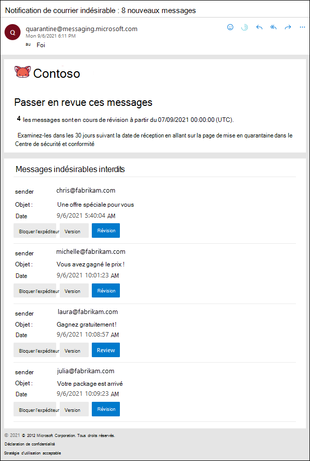

# Utiliser les notifications de courrier indésirable de l’utilisateur pour publier et signaler les messages mis en quarantaine

La mise en quarantaine bloque les messages potentiellement dangereux ou indésirables dans les organisations Microsoft 365 avec des boîtes aux lettres dans Exchange Online ou des organisations Exchange Online Protection (EOP) autonomes sans boîtes aux lettres Exchange Online. Si vous souhaitez en savoir plus, consultez l’article [La quarantaine dans Office 365](quarantine-email-messages.md).

Par défaut, les notifications de courrier indésirable de l’utilisateur final sont désactivées dans les stratégies anti-courrier indésirable. Lorsqu’un administrateur [active les notifications de courrier indésirable de l’utilisateur final](configure-your-spam-filter-policies.md#configure-end-user-spam-notifications), les destinataires reçoivent des notifications périodiques sur leurs messages mis en quarantaine en tant que courrier indésirable, en masse ou (depuis avril 2020).

> [!NOTE]
> Les messages mis en quarantaine en tant que courriers indésirables de confiance élevée, programmes malveillants ou les règles de flux de messagerie (également appelées règles de transport) ne sont accessibles qu’aux administrateurs. Si vous souhaitez en savoir plus, voir [Gérer les messages et les fichiers mis en quarantaine en tant qu'administrateur dans Office 365](manage-quarantined-messages-and-files.md).

Une notification de courrier indésirable de l’utilisateur final contient les informations suivantes pour chaque message en quarantaine :

- **Expéditeur**: le nom d’envoi et l’adresse de messagerie du message en quarantaine.

- **Objet**: texte de la ligne d’objet du message en quarantaine.

- **Date**: date et heure (UTC) auxquelles le message a été mis en quarantaine.

- **Bloquer l’expéditeur**: cliquez sur ce lien pour ajouter l’expéditeur à votre liste des expéditeurs bloqués. Pour plus d’informations, consultez [la rubrique bloquer un expéditeur de courrier dans Outlook](https://support.office.com/article/b29fd867-cac9-40d8-aed1-659e06a706e4).

- **Release**: pour les messages de courrier indésirable (pas de hameçonnage), vous pouvez diffuser le message sans mettre en quarantaine le centre de sécurité & conformité.

- **Révision**: cliquez sur ce lien pour accéder à la quarantaine dans le centre de sécurité & conformité, dans lequel vous pouvez libérer, supprimer ou signaler vos messages mis en quarantaine. Pour plus d’informations, consultez [la rubrique Rechercher et débloquer les messages mis en quarantaine en tant qu’utilisateur dans Office 365](find-and-release-quarantined-messages-as-a-user.md).

